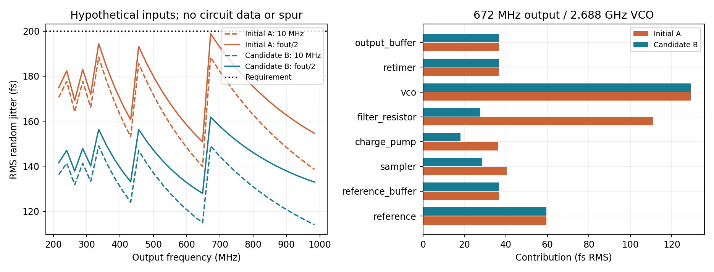

# Python 系统与行为模型 v1

2026-09-18。**所有电路增益、相噪、噪声底和时序参数均为研究假设，不是 PDK 提取或实测。** 本轮依据 [DEC-0002](../../../reports/decisions/DEC-0002.md) 优先研究随机抖动，未评估 spur。硬指标和架构基线保持原状。

## 主要结果

| 情景 | 33 点最差抖动：10 kHz–10 MHz | 33 点最差抖动：10 kHz–fout/2 |
|---|---:|---:|
| 初始 A：Kvco=80 MHz/V，Kpd=0.6 µA/rad，Cs=20 fF/侧 | 188.44 fs | 198.85 fs |
| 候选 B：Kvco=20 MHz/V，Kpd=2.4 µA/rad，Cs=40 fF/侧 | 148.98 fs | 161.83 fs |

两者参考均为 24 MHz，名义连续环路单位增益频率 1 MHz，27 °C 热噪声，R=22.222 kΩ、C1=28.648 pF、C2=1.910 pF。最差宽窗口点均为输出 672 MHz、VCO 2.688 GHz、÷4，上限为 336 MHz。相同 VCO 频率的 336 MHz 输出在固定 10 MHz 窗口并列最差；程序按顺序列第一个。目标 <200 fs 仍不能判为达标。



A 的滤波电阻贡献约 111.0 fs，超过最初 30 fs 工作预算。降低 Kvco、提高 Kpd 后，B 在保持 R、C 与名义动态不变时将其降至约 27.8 fs。B 假设跨导增大 4 倍会使 CP 等效电流噪声幅度增加 2 倍，而非不付噪声代价；Cs 加倍降低采样 kT/C 噪声。

B 的增益/延迟扰动扫描有 **18 组中的 1 组不稳定，另外 7 组虽稳定但超过 200 fs**。增加一个参考周期延迟，名义 B 的最差宽窗口结果变为 190.10 fs。说明预算依赖实际环路增益和采样时序，不能只优化名义点。

## 模型结构与单位

`model.py` 包含三层：连续时间三阶主环；准确积分矩形 CP 脉冲的采样主环；分频和重定时的边沿事件模型。相位均以 **VCO 相位 rad** 为环路坐标。参考等效相位 `r=2πfvco × t_ref=N×phi_ref`，主反馈中没有再除以 N。

无源滤波器为控制节点 C2 到地、并联 R 串 C1 到地：

```text
Z(s) = (1+s R C1) / [s(C1+C2)+s² R C1 C2]
G(s) = Kpd × Kv × Z(s) / s
Kv = 2π × Kvco_Hz_per_V
Hct = G / (1+G)
```

设计零点 250 kHz、滤波极点 4 MHz，连续相位裕度 61.93°。这不是离散系统相位裕度。采样稳定性由精确周期状态矩阵的全部特征值判断，名义最大模 0.90668。

归一化时间 `tau=t/Tref`，状态 `x=[phi, Kv*Tref*vcontrol, Kv*Tref*vC1]`；`E=exp(A)`。每周期先采样相位，延迟 0.05 Tref 后注入宽度 0.05 Tref 的矩形脉冲。Kpd 是**周期平均**增益，脉冲内增益为 Kpd/duty。精确脉冲作用向量为 b，则：

```text
x[n+1] = (E-bC)x[n] + b*r[n],  C=[1,0,0]
```

额外一周期延迟使用增广状态保存上一拍误差信号，未用简单相位裕度折算冒充精确离散稳定性。

### 周期平均噪声谱

设 `Ls(z)=C(zI-E)^(-1)b`（有额外周期延迟时相应修改），`S(z)=1/(1+Ls)`。以矩形脉冲谱 `P(f)=sinc(f*duty*Tref)*exp[-j2πfTref*(delay+duty/2+latency)]` 得到连续输出重建传递：

```text
Hhybrid(f) = G(j2πf) × P(f) × S(exp(j2πfTref))
```

离散采样输入噪声的基带 PSD 在参考频率上周期延拓，再乘 `|Hhybrid|²`。因此保留脉冲镜像，没有将噪声在 12 MHz 处直接截断。参考和参考缓冲输入是**采样后的等效时间噪声 PSD**，其中未知参考源在采样前的高频混叠尚需由输入条件补齐。

连续模拟噪声 d（VCO 或电阻）经采样反馈产生的输出周期平均谱为：

```text
Sy(f) = |1-Hhybrid(f)|² Sd(f)
        + |Hhybrid(f)|² × sum[m!=0] Sd(|f+m*fref|)
```

公式通过独立连续随机状态协方差及周期内积分验证。所有源采用单边 PSD；`Sphi=2×10^(L/10)`，时间方差为相位方差除 `(2πfvco)²`。理想输出分频不改变对应时间误差。

各源定义：

- 参考时间 PSD：`(40 as/√Hz)² × (1+10 kHz/f)`；参考缓冲白噪声 25 as/√Hz。
- 差分采样两侧各 Cs，采样误差相位方差 `2kT/(Cs*Adiff²)`，Adiff=0.4 V/rad；离散白噪声单边 PSD 为 `2*variance/fref`。
- CP 使用每周期平均电流噪声等效输入，A 为 0.25 pA/√Hz，B 为 0.50 pA/√Hz，除 Kpd 后转相位。未实现晶体管脉冲内噪声源及额外噪声相关。
- VCO：1 MHz 偏移处近端分量 −120 dBc/Hz，1/f³ 转折 100 kHz，白底 −155 dBc/Hz；在整个调谐段采用相同相位噪声输入，是需验证的假设。
- 滤波电阻：开环节点热噪声 `Sv=4kT*Re[Z]`，再经 Kv/s 转相位，按上述模拟源反馈/混叠计算；没有把它省略为理想滤波器。
- 重定时与末级缓冲各用最终输出基带等效时间噪声底 2 as/√Hz。VCO 派生时钟的共同噪声不再次作为独立噪声加一遍。

模拟源截止频率暂设 2 GHz，低频正则化 10 Hz。将截止改为 1、2、4 GHz 时，B 的宽窗口最差值为 160.58、161.83、164.26 fs。将分频前各源积分延伸到 2 GHz、输出链仍取各自输出窗口，所得尾部敏感性为最差 172.90 fs；**这不是严格的同步分频边沿混叠结果或数学上界**。同步分频对周期平稳噪声的选择和相关项仍是后续模型工作。

## 动态和输出链

主环采用 `sin(phase_error)` 的非线性鉴相特性，线性 Kvco，尚无完整 FLL、粗调控制或电压饱和模型。测试 4 个初相位与 6 个频差：±1/±4 MHz 及 0 的 20 例局部收敛；4 个 +24 MHz 情景保持错误谐波。判据为最后连续至少 100 拍满足相位 <0.01 rad、未包裹的频差 <1 kHz；这只是研究判据。局部稳定时间最大约 19.79 µs，不能作为完整 PLL 启动时间。控制电压范围仅检查参考采样时刻 ±0.4 V，脉冲内峰值及物理饱和未验证。

输出链覆盖 33 频点、VCO 占空比 40/50/60% 的 99 组名义情景。数据在 VCO 上升沿发出，采用下一下降沿重定时；假设逻辑延迟 50 ps、逻辑抖动 3 ps RMS、setup=20 ps、hold=10 ps。99 组均通过研究时序检查，最小 setup 余量约 19.71 ps。重定时后的新增原始 TIE 约 57.4–58.5 fs（时钟缓冲、clk-Q、末级缓冲独立边沿噪声），共同 VCO 时间误差增益约 1。这项**原始 TIE 实验不是前述积分抖动验证**。

将逻辑延迟改为 110 ps 会出现 setup 违规；这类情景不报告有效输出抖动，未假装消除了亚稳态。注入 4 ps 上下沿路径偏差时，984 MHz 平均占空比约 50.394%；说明理想偶数计数不替代占空比容差验证。

## 验证、复现与证据

依赖见 `requirements.txt`；本机执行版本 Python 3.11.9、NumPy 2.4.4、SciPy 1.17.0。从项目根目录运行，输出目录必须尚不存在：

```powershell
$env:PYTHONDONTWRITEBYTECODE='1'
python share/deliverables/architecture/behavioral_v1/run.py --out research/runs/behavioral_v1/new_baseline
python share/deliverables/architecture/behavioral_v1/tradeoffs.py --out research/runs/behavioral_v1/new_tradeoff
```

发布仓库可在此目录直接执行 `python run.py --out <新目录>` 与 `python tradeoffs.py --out <新目录>`。代码不依赖本机绝对路径，不连接服务器。

接受结果：本地 `research/runs/behavioral_v1/run06` 和 `tradeoff06`；交付副本为 `results/baseline` 和 `results/candidate`，未复制绘图缓存。各 `manifest.json` 的 `source_files` 相对于本模型目录，`result_files` 相对于所在结果目录。

基线 15 项检查通过：节点方程/阻抗表达式、连续极限、采样极点、单边谱归一化、四随机种子协方差、脉冲响应 FFT、模拟源的连续随机协方差、非线性小信号极限、错误谐波、重定时相关性与失效、积分网格收敛等。随机采样噪声方差与解析值偏差约 0.088%；电阻连续随机协方差与混叠谱积分偏差约 0.00021%；纯白频噪声 VCO 检查偏差约 0.027%。B 的独立 13 项检查也通过。数值正确不等于输入参数已被工艺验证。

启动、资料和本轮模型来源见 [来源补充](../../sources/behavioral_sources.md)。系统工作预算和下一步块级目标见 [系统指标拆解](../../spec/system_budget_v1.md)。
