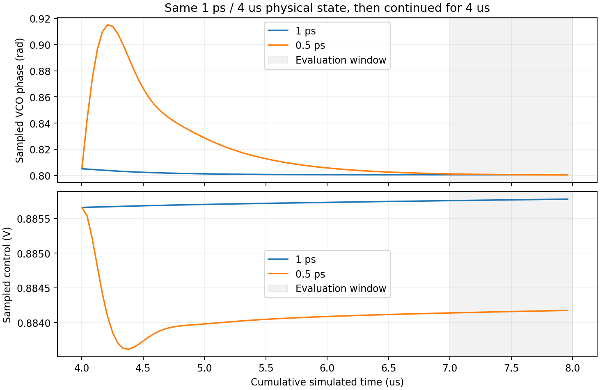
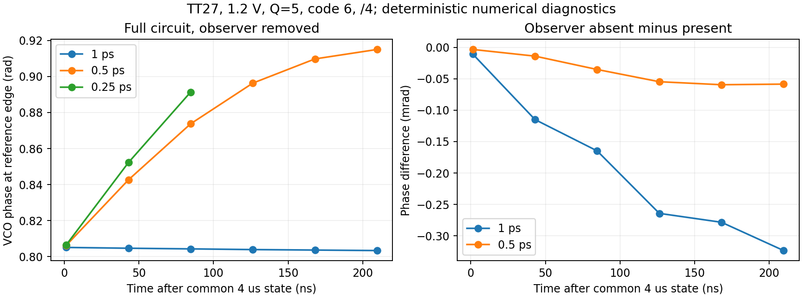

# 实际 LC 闭环的时间步长与周期求解验证

2026-10-01。保留 R2 VCO、Q=5 暂定 RLC、quiet10 采样接口和 closure_v6 完整六档钳位分频器。**1 ps 与 0.5 ps 的接续精度检查：通过。** 结论限于 TT27、1.2 V、码6、÷4 的固定码研究环路，不是完整 PLL 或噪声签核。

## 接续与原判据

两组均从前轮 1 ps、4 µs 的同一完整物理终态开始，再接续 4 µs，分别使用 maxstep=1 ps 和 0.5 ps。累计末窗为 7–8 µs。0.5 ps 组的前4 µs仍是1 ps历史，不能称作0.5 ps独立冷启动或不中断8 µs仿真。

电路为真实 VCO、采样器、CP、MOS 时序、理想 RC 和分频器；FLL、完整监督、GHz 接收、重定时输出链和实际偏置发生器尚未接入。参考源理想24 MHz，输出负载暂定10 fF。滤波 R100 kΩ/C1=7.162 pF/C2=0.4775 pF。状态文件仅删除8个观察器方程，保留物理状态，上传前后核对 SHA-256；参考相位每4 µs重复。

预先固定末1 µs要求：相位峰峰值<0.02 rad、绝对漂移<0.01 rad/µs、每参考周期 VCO/输出计数误差各<0.001、控制电压处于0.2–1 V。两组都须通过，且末端相位差<0.02 rad、末窗控制均值差<5 mV、输出均值差<5 kHz。前轮4 µs失败保留，不修改判据。见[协议](results/protocol.json)、[精度结果](results/continuation_accuracy.json)、[状态核对](results/state_roundtrip_check.json)。

| 接续步长 | 末窗输出 MHz | 相位峰峰值 rad | 漂移 rad/µs | 末窗筛选 |
|---|---:|---:|---:|---|
| continue_1ps | 984.000003039 | 0.0000936 | +0.0000757 | 通过 |
| continue_halfps | 983.999964494 | 0.0008087 | -0.0008020 | 通过 |

0.5 ps减1 ps：末端相位差-0.0002312 rad，末窗控制均值差-1.613271 mV，输出均值差-38.545 Hz。



原接续组日志确认 reltol=1e-5、traponly 和指定 maxstep；实际绝对容差为1 µV/1 pA，errpreset标签moderate、relref=sigglobal。1 ns strobe只读取慢节点和事件观察器，不用于RF摆幅、RF FFT或精确电源电流积分。

## 观察器与三档短窗步长对照

从同一物理终态，分别在1 ps/0.5 ps下进行250 ns密集瞬态，比较保留/移除只读观察器。独立分析直接对VCO差分和参考波形插值，按观察器相同的“上一VCO周期”定义计算相位。定义为“前后相邻周期”会有约0.0024 rad差异，这是波形周期内调制下的定义差异，不是测量代码误差或随机抖动。

| 步长 | 移除观察器最大相位差 rad | 最大控制电压差 µV |
|---|---:|---:|
| 1ps | 0.000323387 | 4.541400 |
| halfps | 0.000059540 | 0.890534 |

0.25 ps组为100 ns，不同长度只比较共有的前三个参考边沿。1→0.5 ps和0.5→0.25 ps的相位增量比约4，与二阶积分误差主导相符；该短窗也含实际环路响应和自适应网格，不能作Richardson外推签核。观察器对网格的影响存在，但在本fixture短窗内远小于步长减半的影响。密集数据与观察器的读数差为微弧度量级，状态首点与readic重合。详细数字见[密集波形分析](results/mesh_validation.json)。



这些继承的短窗TB没有保存分频out电压，因此不从它们推断独立输出沿数；长接续保留分频事件观察器。后续明确保存out/ref的TB另行记录，未修改已经运行的输入快照。

另按安装版帮助的说明测试不带选项名的 `-preset_override`。日志确认绝对容差由1 µV/1 pA收紧为100 nV/100 fA，maxstep=1 ps、reltol=1e-5、traponly、lteratio=3.5和sigglobal保持。共同前100 ns最大相位差约0.000259 rad，控制差约2.010 µV；仍小于本fixture步长减半的影响。这是短窗设置对照，不替代长窗或噪声精度检查。见[选项协议](results/all_options_protocol.json)。

## 周期工作点与删减诊断

删减诊断仅保留÷4分支，删去了未启用÷6…÷14的电路和对应280项状态。其500 ns初始化末个参考周期出现171个VCO周期，目标为164，证明删减造成明显负载失谐。12次周期迭代未收敛。这不是对高阻状态原因的干净隔离，不能据此排除它，也不把删减电路作为六档候选。该TB未保存out，完整输出周期检查缺失同样如实保留。见[删减协议](results/inactive_bank_ablation.json)、[初始化波形](results/warm_start_validation.json)。

完整电路的后续周期试案保留原频率规划与电路。凡读取更长终态的试案均保存状态来源、参考相位和有效参数；所有试案以仿真器成功且独立周期波形通过为准。初始化瞬态、接近目标平均频率、较小残差都不单独当作接受的PSS。

| PSS试案 | 求解成功 | 独立周期波形通过 | 达到迭代上限 |
|---|---|---|---|
| active4_diagnostic_pss | False | False | True |
| clamp8_allopts_pss | True | True | False |
| clamp8_edge_pss | True | True | False |
| clamp8_mid_pss | False | False | True |

已接受工作点的密集周期供电积分：

| 工作点 | 已连接支路 mW | 差分VCO Vpp | 控制范围 V |
|---|---:|---:|---|
| clamp8_allopts_pss | 2.502739 | 0.745589 | 0.878456–0.886800 |
| clamp8_edge_pss | 2.502772 | 0.745607 | 0.878444–0.886788 |

这是核心研究环路功耗，仍缺完整输出接收/重定时、FLL/监督及基准，不能据此宣布整机≤4 mW。

PSS与长瞬态在相同参考边沿的相位/控制电压另做[交叉核验](results/periodic_orbit_comparison.json)。周期平均频率按全部周期数除以PSS周期计算，包含跨边界的最后一个间隔；只平均周期窗内相邻上升沿会漏掉一个被调制的间隔，不能当作周期平均频率。

已接受PSS之间按同一参考边沿另列[相位/控制差](results/accepted_pss_comparison.json)。这些PSS均为1ps步长，起点/初始化时间和绝对容差可能同时改变，不当作单变量归因或PSS步长加密。

周期波形要求24 MHz周期、164个VCO/41个输出/1个参考沿、VCO/输出主谐波164/41、控制范围0.2–1 V、合理摆幅及保存节点周期端点误差<1 mV。初始化末周期功耗只说明已连接支路在该窗口的消耗，不是完整PLL功耗或稳态签核。

## 采样噪声积分口径的独立校验

本机 Spectre 21.1.0.509 的 RC 验证发现：PSS基频24 MHz、sampleratio=41时，自动导出的Jee仍对应10 kHz至最后一个不高于12 MHz的频率网格点（11.885022 MHz），不能标成10 kHz–492 MHz。直接积分原始电压噪声PSD并除以边沿斜率平方，可以明确保留目标积分带宽。

验证电路是理想984 MHz正弦驱动1 kΩ/20 fF，27°C，没有PLL器件噪声。其解析采样热噪声接近kT/C，按实际正弦过零斜率折为148.368 fs。联合加密maxacfreq和时间网格后，PSS984 MHz/ratio1与PSS24 MHz/ratio41的显式积分约147.815/147.780 fs，相差0.0234%，分别距解析值0.373%/0.397%。后者自动Jee只有约22.959 fs，并与上述窄带积分吻合。

初始“全带积分必须与自动Jee一致”的组合检查**失败保留**；后续单独预先规定PSD解析对照、跨基频一致性和窄带截断诊断，并通过了这些诊断。没有放宽原检查来制造通过。错误地使用24 MHz/ratio1再积分到492 MHz，会把本fixture结果放大约√41，也保留为无效带宽反例。

这一测试只验证相同边沿的LTI测量归一化。真实PLL各参考相位的斜率和噪声可能不同，仍需逐边沿/相位检查、混叠和边带收敛，不能把这组约148 fs当作PLL指标。已有27个含Jee的历史TB静态核查未发现扫频上限超过PSS半频；该检查也不等于历史所有结果自动有效。

详见[原协议](results/sampling_fixture_protocol.json)、[加密诊断协议](results/sampling_refinement_protocol.json)、[完整结果](results/sampling_fixture_validation.json)、[历史TB带宽核查](results/prior_jee_band_audit.json)。

## 复现、资料与边界

原始PSF、日志、输入快照和终态在本项目 `research/runs/spectre_accuracy_v7/`。输入与服务器SHA-256一致性见[原始证据清单](results/raw_manifest.json)；[源码清单](results/source_manifest.json)只包含可交付的项目自有内容，不复制PDK。

```text
python share/deliverables/integration/accuracy_v7/run_spectre.py --run-id replay_accuracy1 --cases continue_1ps --mode ax --threads 1 --preset-override maxstep,reltol,method,errpreset
python share/deliverables/integration/accuracy_v7/analyze.py
python share/deliverables/integration/accuracy_v7/check_accuracy.py
python share/deliverables/integration/accuracy_v7/check_states.py
python share/deliverables/integration/accuracy_v7/analyze_warm_start.py
python share/deliverables/integration/accuracy_v7/compare_periodic.py
python share/deliverables/integration/accuracy_v7/plot_results.py
python share/deliverables/integration/accuracy_v7/summarize.py
python share/deliverables/integration/accuracy_v7/package_evidence.py
```

运行时必须使用新的run-id；原始结果不可覆盖。`prepare_warm.py` 依赖本地回收的8 µs终态和状态核对结果；已有派生IC已包含于交付目录，重放TB无需隐含服务器状态。全部资料依据见[来源说明](../../sources/accuracy_v7_sources.md)。

本轮没有改变<200 fs、≤4 mW或<0.3 mm²的需求。Q5仍无工艺/EM保证，Q3慢角低端失振、FF K14余量、quiet10旧噪声加密、全频PVT、实际GHz输出链/FLL集成、实际无源和版图面积仍需继续验证。偏置/基准发生器依约后置。
