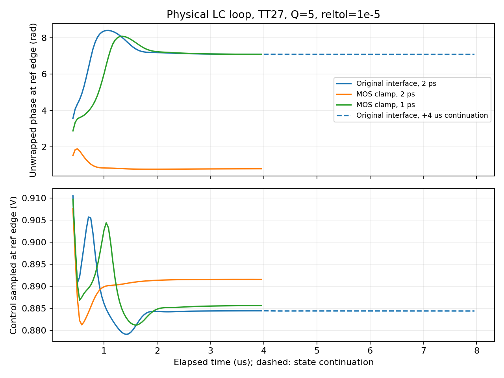

# 严格容差、关断支路偏置和真实 LC 闭环

2026-10-01。本轮保留 VCO R2 和暂定 Q=5 RLC，给分频器关断输入增加实际 MOS 共模钳位，完成 DC 敏感性、独立分频器周期解、六档规划频率和真实 LC 闭环对照。**闭环稳态筛选通过项：loop_base_continue, loop_clamp_strict；1 ps 功能精度复核：未通过。** 新电路仍是研究候选，不继承旧 99 点码表及噪声结论。

## 为什么增加钳位

原分频器的输入选择传输门关闭后，其后、500 fF 耦合电容前的节点只有 MOS 漏电提供 DC 路径。独立 DC 实验中，RF 两端固定 1.2 V、选 ÷4、TT27，把仿真器 gmin 从 1 pS 降到 0.1 pS，关断节点变化 **60.9087 mV**。增加实际传输门，将关断节点接至输入共模后，同样变化仅 **0.5832 µV**。钳位随分支启用而关闭；六分支共新增 24 个 MOS。见 [电路说明](../../blocks/closure_v6/README.md)、[DC 证据](results/dc_sensitivity.json)。

这是关断节点偏置确定性的改善，尚未证明它是所有慢漂移或 PSS 困难的唯一原因。其他内部高阻节点与 VCO 偏置网络仍存在。

## 分频验证

原版和钳位版均在独立理想 RF 驱动下，通过 24 MHz PSS 与独立波形检查：每参考周期 164 个 RF 周期、41 个输出周期，输出主谐波为 41，检查保存节点的周期端点误差 <1 mV。两者均可求解，不能把完整 LC 闭环的困难简单归因于分频器没有周期解。

钳位版按六档最高规划 VCO 频率 3.936/3.888/3.456/3.120/3.168/3.024 GHz，分别检查 ÷4/6/8/10/12/14，**6/6 通过**。TT27、1.2 V、10 fF；200–280 ns 窗口逐周期误差 <2%、平均分频误差 <0.1%。理想回放只保留前轮实测波形形状，无实际 VCO 源阻抗或回注噪声。

另保留一组固定 3.936 GHz、每 100 ns 切换模式的压力测试。三档未通过原判据。该测试的六档组合中，五档高于各自的最高规划输入频率，且观测窗含建立过程。这不等价于规划范围内的静态功能失败，也没有据静态通过宣布动态 FLL 接管或无毛刺切换通过。全部判据和原始失败见 [验证数据](results/validation.json)。

## 真实 LC 环路与精度

TT27、1.2 V、Q=5、粗调码 6、÷4、10 kΩ 采样偏置及 10 pF 去耦、R=100 kΩ/C1=7.162 pF/C2=0.4775 pF。实际 VCO、采样器、CP、MOS 时序、滤波和分频连接；理想参考、电流基准、粗调码及使能激励保留，FLL、完整监督、GHz 接收和输出重定时链未纳入。

本轮日志确认 reltol=1e-5、maxstep=2 ps（精度组为 1 ps）、method=traponly。实际绝对容差为 1 µV/1 pA，errpreset 标签仍为 moderate，不凭网表的 conservative 字样假定全部选项生效。前轮原接口 reltol=1e-3 的 4 µs 漂移约 −0.01847 rad/µs，本轮严格复核为 −0.01637，说明松容差不是全部原因。

日志还记录了部分 MOS 内部节点不连续处的瞬时 LTE 放宽警告；原始警告保留在验证 JSON 和完整日志。步长对照用于检查可观察功能量，不能替代全部内部误差或噪声收敛证明。

沿用末尾 1 µs 的功能筛选：相位峰峰值 <0.02 rad、绝对漂移 <0.01 rad/µs、每参考周期 VCO/输出计数误差各 <0.001、控制电压位于 0.2–1 V。通过仅说明该窗口与该 TT 固定码工作点，不是随机抖动、所有初相捕获、扰动稳定性或整机签核。

| 环路 | 末窗输出 MHz | 相位峰峰值 rad | 漂移 rad/µs | 原稳态筛选 |
|---|---:|---:|---:|---|
| loop_base_continue | 983.999998 | 0.000362 | +0.000147 | 通过 |
| loop_base_strict | 983.999296 | 0.016256 | -0.016372 | 未通过 |
| loop_clamp_1ps | 983.999031 | 0.022202 | -0.022251 | 未通过 |
| loop_clamp_strict | 984.000358 | 0.008496 | +0.008722 | 通过 |

`loop_base_continue` 是原接口 4 µs 终态后再接续 4 µs，末窗对应累计 7–8 µs；其余为冷预充起点至 4 µs。原接口接续后漂移降至约 +0.000147 rad/µs 并通过原判据，说明先前 4 µs 窗口不足以判定最终稳态，不能把残余漂移都归因于关断支路。状态接续不标成未中断的 8 µs 仿真。1 ns 数据保存用于慢节点及 VA 边沿观察器；不对混叠的 RF/电流稀疏记录计算精确摆幅或功耗。



图中原接口接续段仅平移整数个 2π，使展开相位与前段一致；这不改变相位漂移、峰峰值或任何验收结果。

1 ps 复核预先固定判据：两个步长均通过原稳态筛选，末端相位差 <0.02 rad、末窗控制均值差 <5 mV、输出均值差 <5 kHz。仅改变 maxstep 及唯一输出状态路径，包含文件哈希保持一致。见 [精度复核](results/precision_validation.json)。

本次 1 ps 的 4 µs 结果未通过稳态漂移筛选，末窗控制均值相对 2 ps 变化约 −5.960 mV，也超过预设 5 mV 限值。因此钳位版在 2 ps 的通过项尚未获得精度确认。后续需同时检查更长稳定时间与更细时间步长，保留本次失败且不放宽判据。

一个用于确定排查量级的解析估算：理想无损 LC 的固定步长梯形积分给出 `f_num=atan(πfh)/(πh)`。在 3.936 GHz，2/1/0.5 ps 的频率误差分别约 −802/−201/−50 kHz。闭环可能通过控制电压抵消积分导致的振荡频移，因此输出频率接近目标并不足以证明控制点准确。此估算不含非线性器件、Q=5 损耗或自适应网格，不能用作本电路的实际误差或 Kvco 结果；见 [解析估算](results/integration_frequency_estimate.json)。

## 从完整终态启动周期求解

`writefinal` 保存所有物理节点和支路状态，回收后与末个波形样点逐项核对，差异低于 1e-10。准备 PSS 时只移除观察器的 8 个方程；4 µs 恰为 96 个参考周期，参考源相位保持一致，使能和复位置为此前终态值。状态文件从本地权威副本上传并核对 SHA-256，不依赖服务器隐含状态。见 [终态核对](results/state_roundtrip_check.json)、[原版来源](results/warm_base_provenance.json)、[钳位版来源](results/warm_clamp_provenance.json)。

原接口接续通过后，又用累计 8 µs 的完整终态启动 `loop_base8_warm_pss`；8 µs 恰为 192 个参考周期，物理电路与求解参数保持原版，参见 [8 µs 状态来源](results/warm_base8_provenance.json)。这种从指定状态寻找周期解的实验仍不代表自主捕获。

另外将 `readic` 文件与 PSS 初始化瞬态的首点逐项比对，确认工具实际读入状态。初始化阶段的密集波形可用于本窗口的摆幅和已连接支路功耗核对，但 `pss.tran.pss` 不能充当通过周期求解的波形；数据单独保存于 [重启与初始化审计](results/warm_start_validation.json)。

| 初始化末个完整参考周期 | 已连接支路 mW | 其中 VCO 支路 mW | 差分振幅 Vpp |
|---|---:|---:|---:|
| loop_base8_warm_pss | 2.504036 | 1.555822 | 0.749528 |
| loop_clamp_warm_pss | 2.503363 | 1.555741 | 0.746088 |

功耗由密集电源电流积分得到，TT27/Q5/1.2V/码6，仅覆盖该 41.667 ns 初始化窗口。缺完整 FLL/监督、GHz 接收、输出重定时及实际基准，不能当作完整 PLL ≤4 mW 的验收结果；也不据两行的小差异宣称功耗改善。

仍待排查的一项数值因素：瞬态观察器虽不吸取电流，其 `cross(...,1f,1u)` 事件可能影响求解时间网格；PSS 中移除观察器保留了物理电路，却未证明积分网格等效。此为待验证推断，不能将重启后变化全部解释为电路慢状态。两个冷启动步长试案保留了相同观察器，因此其精度失败仍有效。

| 真实 LC 周期求解 | 仿真器成功 | 独立周期波形通过 | 结束原因 |
|---|---|---|---|
| loop_base_warm_pss | False | False | 达到迭代上限 |
| loop_base8_warm_pss | False | False | 达到迭代上限 |
| loop_base8_gear_pss | False | False | 主动停止 |
| loop_clamp_warm_pss | False | False | 达到迭代上限 |
| loop_clamp_linear_pss | False | False | 达到迭代上限 |

本轮没有通过独立波形检查的 LC 闭环周期解，未进行闭环周期噪声分析或周期稳态功耗签核。上表仅为初始化窗口的功耗。

另增 `itres=1e-6` 内部线性求解对照，物理电路、初值和非线性波形容差保持；`writepss` 同时请求周期状态导出，并按仿真器文档触发收敛后的有限差分细化。该组是求解/细化对照，不归因于单一选项。见 [设置与边界](results/linear_solver_study.json)。

原版 4 µs 状态的 PSS 达到 20 次上限后，最终日志提出梯形积分振铃可能造成周期射击法停滞。因此对相同的 8 µs 状态增加 `gear2only`、12 次迭代上限的对照，容差和电路不放宽。该试案仅用于诊断积分方法对求解的影响，不用于噪声结论。见 [积分器对照](results/integrator_study.json)。

Gear 对照在 Newton 试探阶段进入数十伏非物理状态并触发模型线性化/氧化层警告。已保存最新完整日志、核实未生成接受的周期波形后，对精确匹配的本项目进程发出 SIGINT，回收日志和状态。此项记为主动停止的求解试案，不等价于正常达到迭代上限，也不据此宣称实际电路发生过压或不存在周期解。

周期波形另检查 24 MHz 周期、164/41/1 个 VCO/分频/参考上升沿、输出主谐波、控制范围、振幅和端点误差。周期解存在也不单独证明捕获或稳定性；局部支路功耗不等于完整 PLL ≤4 mW。

## 分频器新增 MOS 的噪声代价

以无噪声实测形状的理想 RF 源驱动原版和钳位版，TT27、1.2 V、3.936 GHz 输入、÷4、10 fF。在 984 MHz 周期工作点测输出 0.6 V 上升沿的 sampled Pnoise/Jee，积分 **10 kHz–492 MHz**；这是原始分频输出的附加抖动，无实际 VCO 源阻抗或重定时链，不是完整 PLL 输出抖动。

| 试案 | 独立谱积分 fs | 周期/积分检查 |
|---|---:|---|
| noise_divider_base_2ps | 994.200 | True |
| noise_divider_clamp_2ps | 994.649 | True |
| noise_divider_base_1ps | 995.140 | True |
| noise_divider_clamp_1ps | 995.050 | True |

两个版本均通过预先固定的数值精度检查。加密结果：原版 995.140 fs，钳位版 995.050 fs，差值 -0.091 fs（-0.0091%）。该差异小于数值加密自身带来的变化，不能宣称降噪；本 fixture 未分辨出明显的附加噪声代价。

2 ps/31 谐波/maxsideband=31 与 1 ps/63 谐波/maxsideband=63 为联合加密；fullspectrum 模式日志将 maxsideband 用于有色噪声源。预先要求积分变化 <1%、谱最大差 <0.1 dB、独立积分与 Spectre Jee 差 <1.5%。每组另检查每周期 4 个 RF/1 个输出上升沿和保存节点端点差 <1 mV。见 [协议](results/divider_noise_protocol.json)、[器件噪声及精度](results/divider_noise_validation.json)。本实验无法判断通过实际 VCO 源阻抗回注的噪声变化。

## 复现与仍待完成的工作

原始证据在项目 `research/runs/spectre_closure_v6/`，包括失败日志、状态文件、PSF 和输入快照。DC 解析曾遇到标量和单位字段问题，已修复采集器并使用独立 run-id 重跑，原始数据保留；部分桥接分类中的 convergence failure 来自已恢复的初始 DC 尝试，最终错误数以 Spectre 日志为准。输入与原始结果见 [清单](results/raw_manifest.json)，不复制 PDK。

```text
python share/deliverables/integration/closure_v6/run_spectre.py --run-id replay_clamp --cases loop_clamp_strict --mode ax --threads 1 --preset-override maxstep,reltol,method,errpreset
python share/deliverables/integration/closure_v6/analyze.py
python share/deliverables/integration/closure_v6/check_precision.py
python share/deliverables/integration/closure_v6/analyze_noise.py
```

后续首先延长并加密实际 LC 环路仿真，取得功能精度确认，再验证扰动恢复、更多初相与角落，建立可用周期工作点并收敛周期采样噪声，逐步接入完整 GHz 输出链、FLL 和监督。偏置/基准发生器继续后置。前轮低阻候选 0.73 dB 的噪声观察尚未因本轮功能结果而获得确认，FF K14 调谐余量缺口仍在；全频 PVT、实际无源/布局、<200 fs、≤4 mW 与 <0.3 mm² 均未签核。
