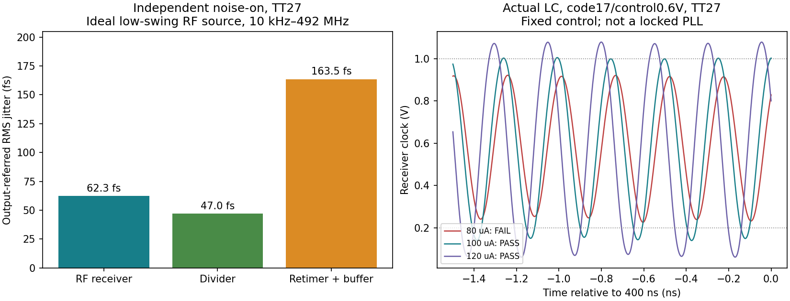

# CMOS v12：低摆幅接口、实际 LC 加载与器件噪声

按用户“用CMOS方案继续推进”的指示，新增单级自偏置反相器接收器和 9T TSPC 重定时器，继续使用有级间隔离缓冲的 CMOS ÷4。**TT 下已接通实际 LC；噪声结果仍来自无噪声电压源夹具，完整 PLL 未签核。**

## 两类证据必须分开使用

| 测量边界 | 本轮结果 | 能说明什么 |
|---|---|---|
| 理想低摆幅 RF 电压源 → 实体接收器/÷4/重定时/缓冲 | 加密 **181.186 fs、1.116801 mW** | 包括接收器本身的 MOS/电阻噪声，但没有真实 LC 源阻抗、源噪声及回注 |
| 实际 LC → 同一 CMOS 链，包含实际 24 MHz 参考缓冲、采样器、CP 时序/CP | 偏置参考 100 µA、码21，控制0.2/1.0 V 时 **3.928771/3.958835 GHz**，正确 ÷4；测试电路 **3.209152/3.212509 mW** | 两端包围目标3.936 GHz；控制电压固定，CP输出另行钳位，尚未闭环锁定，也没有完整 PLL 功耗/噪声结论 |

噪声条件：TSMC180BCDGen2、TT27、1.2 V，3.936 GHz RF/984 MHz 输出，10 fF，0.6 V 上升沿，**10 kHz–492 MHz**。源采用既有 `tank_waveform_v5.va` 的20次谐波波形，单端约1.004–1.369 V；这是理想电压回放，不能视为噪声等效的真实 VCO。

实际 LC 条件：原 R2 MOS/开关电容阵列、暂定 Q5 RLC，`ibias=100u` 只在新 TB 显式覆盖，未修改已发布的80 µA基线。上述端点保存340–400 ns，覆盖1.44个参考周期；低端另跑0.5 ps，得到3.928868 GHz、3.208625 mW，频率变化+0.00248%、功耗−0.01642%，预先记录的0.1%/1%精度判据通过。完整结果见 [summary.json](results/summary.json)。两个端点包围目标不等于已证明中间连续单调覆盖。启动使用已建立DC偏置加10 µV差分种子，不是完整电源冷启动。

## 噪声贡献与加密

单独开启一个层级的噪声，其余电路和工作点保持一致，得到输出折算值：

| 仅开启噪声的层级 | 抖动 | 占全部方差 |
|---|---:|---:|
| XRX，单级 RF 接收器 | 62.260 fs | 11.81% |
| XD，CMOS ÷4 | 46.994 fs | 6.73% |
| XR，TSPC重定时＋两级输出缓冲 | 163.516 fs | 81.46% |
| 全部开启 | 181.169 fs | 100% |

三个独立噪声谱相加与全部开启闭合，最大相对差1.36e-15；确定性波形、斜率和功耗无变化，非激活模块PSD为零。不是把不同夹具的抖动直接相加。

1 ps/63谐波/63边带到0.5 ps/127/127联合加密后为181.186 fs，变化+0.00954%，最大谱差0.00130 dB，满足预先记录的1%/0.1 dB判据。器件PSD之和以及独立积分与Spectre Jee也分别核对。

XR中FF/首缓冲/末缓冲贡献约138.08/79.85/35.99 fs。整体把FF尺寸从scale2扩大到3或4，会增加接收器时钟负载：scale3没有有效边沿噪声事件，scale4 PSS不收敛，**均不采用、不报告低抖动数值**。大尺寸试案中的异常高电压警告来自失败的shooting迭代，不是有效运行点。



## 为什么选单级接收器

接收器为1 pF AC耦合、20 kΩ输出反馈自偏置、WN/WP=32/80 µm反相器，直接驱动分频和重定时时钟。后级重定时改用输入电容较小的TSPC结构，scale2/oscale2。电路和接口见 [模块说明](../../blocks/cmos_v12/README.md)。

| 比较试案 | 功能/噪声观察 | 处理 |
|---|---|---|
| 首级AC自偏置、后续多级DC级联 | 后续级出现摆幅或占空比退化，最终时钟消失 | 保留全部失败记录 |
| 多级逐级AC自偏置 | 功能恢复，但4级小尺寸接收链加密6040 fs；放宽尺寸粗网格4271 fs | 接收器贡献超过99.9%方差，不采用 |
| 较轻TSPC负载、3级或2级AC接收 | 分别约2913/1595 fs，接收器仍主导 | 功能通过不足以接受噪声 |
| 单级32/80 µm接收器 | 理想低摆幅源下181.186 fs，主导贡献转到XR | 作为继续研究的TT候选 |

这些比较同时改变了级数、负载或尺寸，不能将差值全部归因于某一个变量；实际节点/器件噪声给出的直接证据是：长接收链主导噪声，而单级链已消除这项主导贡献。

## 实际 LC 接入与失败证据

- 单级大接收器加重LC加载。80 µA、码17时，RF已接近3.936 GHz，但差分峰值仅约0.296 V，接收时钟约0.206–0.939 V，分频仍漏边沿；不能把失败时较低的功耗当成有效设计功耗。
- 同码/控制电压下100 µA恢复时钟约0.113–1.026 V，正确÷4，测试电路3.206080 mW；120 µA约0.040–1.109 V、3.685720 mW。最后选择100 µA继续调频，保留120 µA驱动对照。
- 码20的初步端点只保存末20 ns，短于一个参考周期，仅用于引导调频；最终码21端点及其精度复核使用末60 ns。
- 旧多级接收器接实际LC也能运行：3级TSPC链约2.977614 mW；但它在理想源噪声夹具中仍约2913 fs，因此没有因功耗较低而采用。
- 理想源下快角FF0通过，**慢角SS60失败**：单级接收时钟仅约0.307–0.857 V。TT成功不迁移到PVT；真实LC的全角落测试尚未完成。

实际电路功耗是同一个VDD源的测量，已包括本TB中的VCO、接收器、分频、重定时/缓冲、参考缓冲、采样器及CP。仍缺偏置/基准发生器、FLL与完整闭环控制；因此3.21 mW不表示完整锁定PLL满足≤4 mW。也没有把旧核心功耗和新数字夹具功耗相加。

## 当前边界及后续顺序

优先修复慢角接收器/时钟负载余量，并针对XR的FF与首缓冲贡献优化，避免整体增宽造成时钟退化。随后在实际LC和完整环路的同一工作点测量数字噪声及回注，扩展六档分频、确定复位、停钟保持和时序验证。

本轮只有固定÷4。完整PLL <200 fs、全部33频点/PVT、自动FLL捕获和接管、≤4 mW、<0.3 mm²、版图/PEX及可靠性均未签核。新接收器更改加载，历史99点码表不直接继承。偏置发生器后置、宽松占空比和杂散暂缓的用户决定保持不变。

## 证据与复现

本轮59组运行全部回收并核对输入；58组仿真正常结束，30组功能筛选通过，10组噪声有效、2组噪声联合加密通过，另完成新实际LC的步长精度复核。记录的远端执行时间求和约2817秒，非墙钟时间。仿真正常结束不等于电路功能通过。

- [summary.json](results/summary.json)：计数、实际LC全部试案、端点和精度；[cases.csv](results/cases.csv)：逐案例边界与结果。
- [validation.json](results/validation.json)：独立频率、逐周期误差、摆幅、功耗检查；[noise_validation.json](results/noise_validation.json)、[gating_validation.json](results/gating_validation.json)：器件噪声、积分、加密和独立noise-on。
- [raw_manifest.json](results/raw_manifest.json)：每次运行的输入SHA256、远端核对、原始数据/日志SHA256和运行位置；[source_manifest.json](results/source_manifest.json)：交付源文件哈希。未运行的生成TB在summary中明确列出。
- 原始PSF、完整日志、输入快照均已回收到本项目 `research/runs/spectre_cmos_v12/`；远端位于 `/home/jielu/TSMC180/MP/IP-PLL-GPT6/simulation/cmos_v12/`。PDK不进入交付。
- Spectre21.1 AX、每作业单线程、最多四作业；`-preset_override`、reltol1e-5、vabstol1e-7、iabstol1e-13、traponly、实际maxstep1/0.5 ps。日志errpreset仍显示moderate，不把TB中的conservative标签当成实际精度证据。PSS保存周期波形，部分早期试案还保存tstab波形。
- bridge的初始DC“convergence failure”分类可能随成功结果返回，以最终错误计数、输入哈希和独立波形检查为准；scale4确实有最终PSS错误，已排除。

在已有项目服务器/PDK配置下运行（run-id必须新建）：

```powershell
python share/deliverables/integration/cmos_v12/run_spectre.py --run-id replay_one --cases noise_one32_coarse noise_one32_fine --mode ax --threads 1 --preset-override all
python share/deliverables/integration/cmos_v12/run_spectre.py --run-id replay_lc --cases lc_one32_c21_v0p2_tt_i100 lc_one32_c21_v0p2_tt_i100_fine lc_one32_c21_v1p0_tt_i100 --mode ax --threads 1 --preset-override all
python share/deliverables/integration/cmos_v12/analyze.py
python share/deliverables/integration/cmos_v12/analyze_noise.py
python share/deliverables/integration/cmos_v12/analyze_gating.py
python share/deliverables/integration/cmos_v12/summarize.py
python share/deliverables/integration/cmos_v12/package_evidence.py
```

分析脚本对每个case名选择的记录是目录排序最后一条；如需严格重算本轮记录，应只放本轮manifest列出的运行或在独立副本中分析。新运行的输入也会各自快照，不覆盖旧证据。
