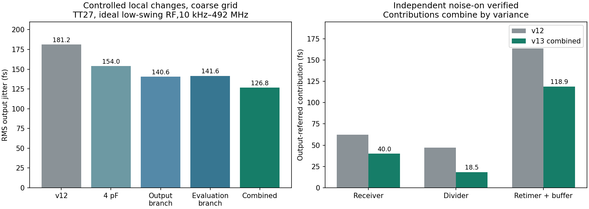

# CMOS v13：局部降噪与慢角故障定位

本轮保留 CMOS 方向，**TT 数字链加密抖动从181.186降到126.892 fs（−29.97%）**。实际 LC 接回后，TT正确÷4、测试电路约3.24 mW，实际LC步长复核通过。**慢角问题没有闭合，当前是TT噪声优化候选，完整PLL未签核。**

## 采用的改动与受控比较

继续使用单级WN32/WP80 µm RF反相器、原有有缓冲9T TSPC÷4和TSPC重定时。只修改：

1. RF输入AC耦合电容由1 pF增到4 pF，反馈偏置电阻保持20 kΩ。
2. 重定时FF中MN1/MNC1各由3.2增到4.8 µm，MP2由4增到6 µm。
3. 重定时后的第一个反相器NMOS由1.6增到3.2 µm，PMOS仍为4 µm。末缓冲和外部10 fF保持不变。

单独和组合对照使用同一外部RF波形、同一数值设置：

| 试案（粗网格） | RMS抖动 | 数字夹具VDD功耗 |
|---|---:|---:|
| v12基线：1 pF、原重定时 | 181.169 fs | 1.116798 mW |
| 只改4 pF | 153.989 fs | 1.180437 mW |
| 4 pF＋MP2/首缓冲NMOS调整 | 140.581 fs | 1.195321 mW |
| 4 pF＋MN1/MNC1调整 | 141.590 fs | 1.186401 mW |
| 4 pF＋上述两组局部调整 | 126.822 fs | 1.201651 mW |
| 组合改动加密 | **126.892 fs** | **1.201648 mW** |

条件为TSMC180BCDGen2、TT27、1.2 V、3.936 GHz无噪声理想RF电压回放（20次谐波，单端约1.004–1.369 V）、984 MHz输出、10 fF、0.6 V上升沿、**10 kHz–492 MHz**。没有改变频带、参考噪声口径或外部RF振幅来获得表中改善。数字功耗不包括理想RF电压源驱动能量。

1 ps/63谐波/63边带到0.5 ps/127/127联合加密，抖动变化+0.05516%，最大谱差0.00544 dB，满足原1%/0.1 dB标准。粗、细网格均通过独立PSS轨道、主谐波、波形摆幅和PSD/Jee积分检查。



## 独立noise-on与主要贡献

| 单独开启层级 | 输出折算抖动 | 方差比例 |
|---|---:|---:|
| XRX接收器 | 40.044 fs | 9.97% |
| XD分频器 | 18.464 fs | 2.12% |
| XR重定时及缓冲 | 118.909 fs | 87.91% |

三组独立谱相加与全部开启闭合，最大相对差1.18e-15；波形、功耗、触发斜率没有变化，未激活模块PSD为零。这里是经过相连电路传递后的输出贡献，不能视作孤立模块的本征抖动。

细网格中，XR的FF/首缓冲/末缓冲贡献分别为105.194/45.638/31.747 fs；v12对应约138.08/79.85/35.99 fs。因此改动确实降低了已定位的关键支路贡献，并非只改变最终输出摆幅。

**保留的设置错误**：最初三次`onlyXRX/onlyXD/onlyXR`将noiseon参数误写到pnoise分析行，Spectre以SFE-106警告忽略；独立闭合校验拒绝这三次结果。已保留原网表、警告和失败校验，并按已验证的全局`simulatorOptions options`语法重跑`gateXRX/gateXD/gateXR`。新解析器会拒绝被忽略的noiseon设置。主表全部开启和加密结果不受此错误影响。

## 实际 LC 接入

使用VCO R2/暂定Q5 RLC、100 µA偏置参考；新接收器及重定时、实际24 MHz参考缓冲/采样器/CP时序/CP均参与同一VDD源测量。控制电压固定，CP输出另行钳位，无完整闭环和FLL捕获。

| 码21、TT27 | 实际RF频率 | 测试电路功耗 | 功能 |
|---|---:|---:|---|
| 控制0.2 V、1 ps | 3.932900 GHz | 3.237481 mW | 正确÷4 |
| 控制0.2 V、0.5 ps | 3.933019 GHz | 3.237530 mW | 正确÷4 |
| 控制1.0 V、1 ps | 3.962921 GHz | 3.241250 mW | 正确÷4 |

保存340–400 ns，覆盖1.44个24 MHz参考周期。低端精度变化约+0.00303%频率、+0.00152%功耗，满足预先记录的0.1%/1%标准。两端包围3.936 GHz，但未证明中间连续单调覆盖或完成984 MHz锁定。启动仍为已建立DC偏置加10 µV种子，不是电源冷启动。

真实LC下的随机噪声、数字回注与完整PLL噪声尚未完成；不能把126.892 fs当作上表真实LC系统的结果。3.24 mW已含本TB的VCO和数字链等负载，但缺FLL、偏置发生器及完整控制，不能宣布完整≤4 mW达标，也不能与旧核心功耗简单相加。

## 慢角定位和排除的试案

- 将原接收器WN从32加到64/128 µm，SS60仍失败，输入栅摆幅反而下降；加宽并未解决实际加载问题。
- 将理想RF振幅增大后，SS接收时钟可跨过0.2/1.0 V，但分频仍会漏计或停止。振幅放大只是诊断，不代表VCO已能提供相同摆幅。
- 理想全摆幅10 ps时钟下，旧第一级9T TSPC的内部q0已正确输出1.968 GHz，高电平占比约27.15%，而缓冲后的q1不翻转。改隔离缓冲的翻转门限后，该理想时钟试案能正确÷4；它没有证明实际接收时钟也可工作。
- 有限斜率时钟下仍观察到q0的脉宽/高度变化和级间丢脉冲。分别试验了缓冲强度、减少缓冲级数、加快首FF评估支路、减弱输出放电支路、复位MOS和初始条件；均未形成通过实际接收时钟筛选的SS候选。不能据此宣称工艺频率极限。
- 两级短RF接收链TT功能通过，但抖动288.536 fs，其中接收器256.503 fs，未采用。更短链路并不自动意味着更低噪声。
- 差分弱交叉耦合CMOS接收器试案未通过SS；唯一TT通过者功耗约2.17 mW且没有噪声优势证据，不采用。
- 参照Razavi Fig.8实现了7T ratioed首级分频对照，本轮所选尺寸出现÷3/÷4等错误分频，没有采用。参考拓扑不等于已验证工艺性能；该类电路的静态电流也须计入。

最终候选的理想源FF0筛选通过，SS60失败（接收时钟约0.274–0.887 V）。实际LC在SS60、码21/控制0.2 V下，100 µA得到RF3.906550 GHz、时钟0.211–0.929 V；120 µA得到RF3.924137 GHz、时钟0.136–1.003 V，两者仍漏计。逐项记录在[summary.json](results/summary.json)。只以`pass_function`为通过依据，不把仿真正常结束、时钟单节点摆幅合格或失败时较低功耗当成有效电路结果。

对`divtrip + rtcomb`进一步用理想0–1.2 V时钟量化SS60输入接受点：50%门限占空比下，10/30/50 ps上升和下降时间均正确÷4；30 ps边沿时，60%通过、40%失败。这说明时钟高电平的有效评估时间也要满足，不能只盯最终边沿或尺寸。这五点不是完整接受边界，更不能替代真实接收器。下一轮优先同时检查时钟轨到轨程度、高电平有效时间和级间脉冲传递。

## 后续与复现

下一步先围绕慢角下首级分频的有效评估时间、输出脉宽与级间接收门限继续设计，再将可用方案接入实际LC。当前TT候选保留作为126.9 fs噪声参考。六档分频、复位/保持/停钟/时序、全33点/PVT、完整PLL/FLL、偏置发生器、功耗、面积、可靠性和PEX仍未签核；历史99点码表不迁移。

- [summary.json](results/summary.json)、[cases.csv](results/cases.csv)：完整运行清单、测量边界和通过/失败。
- [noise_validation.json](results/noise_validation.json)、[gating_validation.json](results/gating_validation.json)：全部噪声、器件分解、独立积分与精度；错误设置另存[gating_rejected_attempt.json](results/gating_rejected_attempt.json)。
- [node_analysis.json](results/node_analysis.json)：内部节点频率、门限以上时间和局部斜率。部分探索TB重复save同一内部节点，解析器仅在逐时刻重复值完全一致后合并，并记录重复次数；原PSF未改。
- [raw_manifest.json](results/raw_manifest.json)、[source_manifest.json](results/source_manifest.json)：输入/回收证据和交付源文件SHA256。
- 原始输入快照、完整日志、PSF和终态在项目`research/runs/spectre_cmos_v13/`；远端只使用`/home/jielu/TSMC180/MP/IP-PLL-GPT6/simulation/cmos_v13/`。PDK不发布。
- Spectre21.1 AX、每作业单线程、最多四个并发；`-preset_override`、实际maxstep1/0.5 ps、reltol1e-5、vabstol1e-7、iabstol1e-13、traponly。日志errpreset仍显示moderate，不用TB标签代替精度检查。bridge初始DC分类不代替最终错误计数和波形验收。

本轮67组运行全部回收并核对输入，67组仿真正常结束、23组功能筛选通过；12个噪声记录中9个有效，3个错误noiseon设置已明确排除并修正重跑。总远端执行时间求和约1775秒（非墙钟）。仿真结束、功能通过和噪声协议有效分别统计。

```powershell
python share/deliverables/integration/cmos_v13/run_spectre.py --run-id replay_noise --cases noise_cc4_rtcomb_coarse noise_cc4_rtcomb_fine noise_cc4_rtcomb_gateXRX_coarse noise_cc4_rtcomb_gateXD_coarse noise_cc4_rtcomb_gateXR_coarse --mode ax --threads 1 --preset-override all
python share/deliverables/integration/cmos_v13/run_spectre.py --run-id replay_lc --cases lc_cc4rt_c21_v0p2_i100_tt lc_cc4rt_c21_v0p2_i100_tt_fine lc_cc4rt_c21_v1p0_i100_tt --mode ax --threads 1 --preset-override all
python share/deliverables/integration/cmos_v13/analyze.py
python share/deliverables/integration/cmos_v13/analyze_noise.py
python share/deliverables/integration/cmos_v13/analyze_gating.py
python share/deliverables/integration/cmos_v13/analyze_nodes.py
python share/deliverables/integration/cmos_v13/summarize.py
python share/deliverables/integration/cmos_v13/package_evidence.py
```

每次run-id必须新建。完整重算还需manifest中的诊断和角落记录；同名case重跑后汇总字典取目录排序最后一条，应在独立副本或只保留指定运行索引的环境比较。旧原始证据不会被重跑覆盖。
