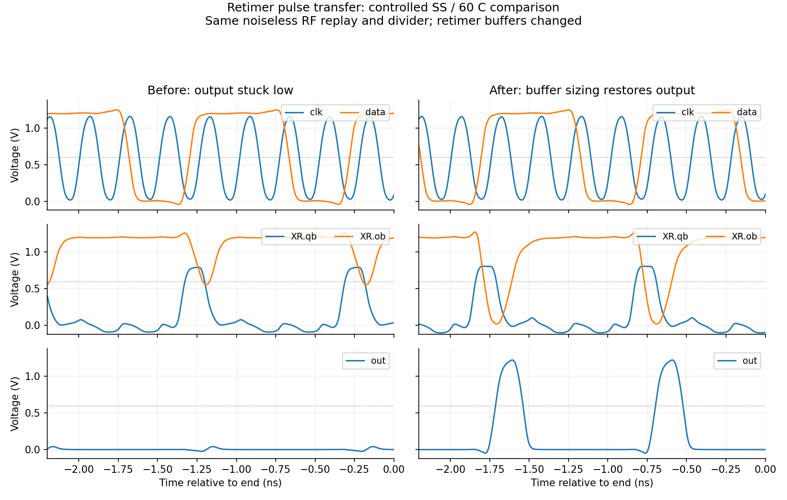
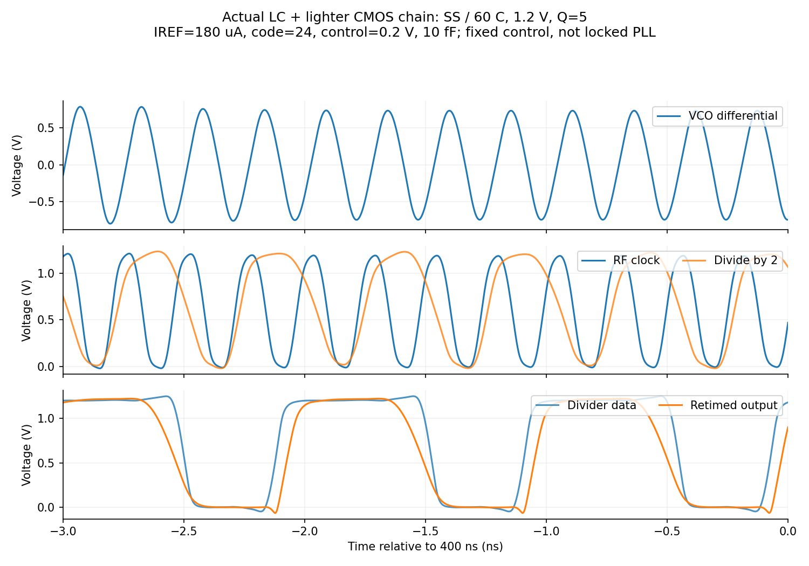
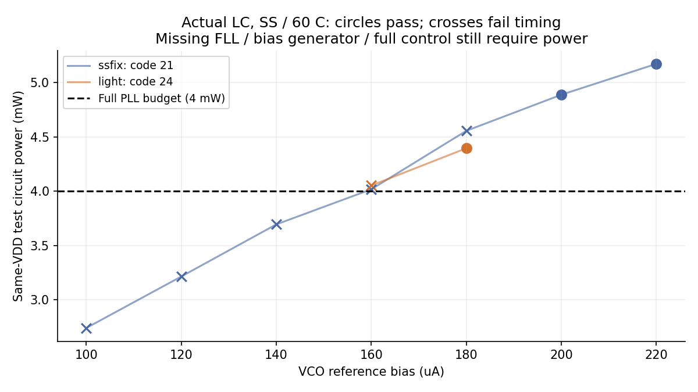

# CMOS SS 故障诊断与条件性功能修复

本轮在实际 LC 驱动下恢复了 SS、60 °C 的正确÷4。较轻候选在 1.2 V、Q=5、IREF=180 µA、码24、控制0.2 V、10 fF 下输出约983.85 MHz，同一 VDD 测得 **4.3946 mW**。0.5 ps 步长与反向微扰的1 µs运行通过；相同电路和偏置在 TT27、FF0 也能正确÷4。**功耗尚未满足完整PLL≤4 mW，修改后的噪声未验证，不能视作全频/PVT或完整PLL签核。**

## 定位到的机制与修改

1. v13 的 SS 接收时钟离电源轨较远，TSPC 首级的采样、评估和反馈发生竞争；q0 偶尔跨过0.6 V不能证明内部状态或后级计数正确。仅放大接收器、减轻后级负载、换时钟极性均未形成可用修复。
2. 首级9T FF的反馈 NMOS 门极增加50 kΩ电阻，利用原有门电容延缓该反馈支路；PMOS反馈保持直接连接。中间评估节点获得更多完成时间。配合级间第二反相器 NMOS 由1 µm改2 µm，恢复首级输出的电平和时序。20 kΩ对照在实际LC/200 µA仍失败。这里是受控试验支持的竞争机制解释，不是已提取的RC容差设计。
3. 分频数据正确后，原重定时器内部qb仍只有约0.8 V窄脉冲；首缓冲ob最低约0.55 V，末级输出不翻转。同一RF源、同一分频器下，仅调整重定时缓冲的NMOS/PMOS比例便恢复输出，直接支持“脉冲传递/门限”诊断。
4. 主修复候选在实际LC/200 µA通过，但约4.8872 mW。随后将RF接收器从WN/WP=32/80 µm减到24/60 µm，重定时FF scale从2减到1.2，首缓冲3/0.5 µm、末缓冲0.8/3 µm，得到180 µA、4.3946 mW的较轻候选。没有改用CML。



图中诊断RF是v13波形的1.8倍幅度、无噪声低阻抗回放（amplitude为比例，非1.8 V），只用于控制变量。最终功能结论来自下面的实际LC连接。

## 实际LC验证

下表均为较轻候选、码24、控制0.2 V、Q5、1.2 V、10 fF。RF按差分vp−vn的零交叉测量；通过指相对于该RF的÷4关系，**不是锁定到984 MHz**。

| 条件 | RF MHz | 输出 MHz | 同VDD功耗 mW | 结果 |
|---|---:|---:|---:|---|
| SS60，160 µA，1 ps | 3940.4785 | 983.8199 | 4.0522 | 失败：输出最大逐周期误差5.23% |
| SS60，180 µA，1 ps | 3936.0189 | 983.8489 | 4.3946 | 功能通过 |
| SS60，180 µA，0.5 ps | 3936.1571 | 983.8508 | 4.3943 | 功能、步长复核通过 |
| SS60，180 µA，1 µs反向起振微扰 | 3934.1401 | 983.5371 | 4.3913 | 后500 ns通过，492个输出上升沿 |
| TT27，180 µA，1 ps | 3927.4932 | 981.8729 | 4.6322 | 功能通过 |
| FF0，180 µA，1 ps | 3901.2655 | 975.2762 | 4.7185 | 功能通过 |

普通观察窗为340–400 ns；长试验为500–1000 ns。长试验同时改变微扰方向与观察时间，不单独证明初态无关。SS步长加密的RF变化0.003512%、功耗变化−0.007565%，低于0.1%/1%的预设精度阈值；两种步长均满足功能判据。

功能判据：clk/q1/data/out分别为RF、RF/2、RF/4、RF/4，平均频率误差<0.1%，逐周期最大误差<2%，至少10个上升沿；数字电平低于0.2 V、高于1.0 V。另对每个完整周期重新检查电平，所有通过点均合格。**2%的时序功能窗口不是200 fs随机抖动验收**，本轮没有从无噪声瞬态推导随机抖动。

SS较轻候选输出高于0.6 V的时间比例约52.95%；主修复200 µA约30.57%。遵照用户意见，未以输出占空比作为优化目标。内部时钟相位/有效时间仍影响功能。



160 µA的两个最后局部对照也被拒绝：`lc_s12skew_c24_v0p2_i160_ss`约4.0519 mW、输出逐周期误差3.90%；`lc_s15skew_c24_v0p2_i160_ss`约4.0740 mW、输出约882.37 MHz。没有降低判据保留低功耗失败点。



## 测量边界与剩余风险

- 实际MOS、VCO R2/Q5 RLC、接收器、÷4、重定时/缓冲、参考缓冲、采样器、CP及CP时序接在同一VDD。较轻SS180 µA中，VCO支路约3.3071 mW、RF接收支路0.6859 mW、重定时支路0.0958 mW；其余为分频及参考/采样/CP等。支路是总功耗的子集，不能重复相加。
- 控制电压固定，CP输出钳位0.6 V；没有接回主滤波器、完整FLL和自动捕获控制。IREF发生器仍理想，其现有负载计入VDD，但真实偏置/基准发生器功耗未计全。没有把独立数字夹具与旧核心功耗相加。
- 起振从已建立DC偏置和10 µV差分种子开始；不是电源爬升冷启动验证。Q5为获准的临时电感假设，未换成不存在的PDK电感；旧Q3/SS低端失振问题仍开放。
- 50 kΩ反馈电阻为理想电阻器件，尚无PDK电阻/PEX/容差与热噪声验收；修改后的器件噪声需重新做逐模块noise-on和收敛检查。**v13的126.892 fs只属于旧TT理想RF夹具，不属于v14。**
- 全六档、33频点、供电扫描、复位/使能/停钟保持、亚稳态/失配/可靠性、布局面积和PEX仍缺。当前动态节点有过冲/负压，不能仅凭功能波形签核可靠性。
- 当前最优已验证功能点仍超4 mW；继续提高VCO偏置不能作为预算解决办法。下一步应降低SS所需输入幅度/接收器消耗，重新验证反馈延迟的可实现性及噪声，再代回完整PLL。

## 证据、失败试案与复现

全部运行（包括失败）见 [cases.csv](results/cases.csv)、[validation.json](results/validation.json)、[summary.json](results/summary.json)；内部门限/斜率见 [node_analysis.json](results/node_analysis.json)。接收增益、反馈、动态/TG/负逻辑试案与受控比较见各 `results/protocol_*.json`，未运行的试案不能因存在网表被当成通过。

本轮121组全部回收并核对输入哈希，其中117组正常完成、15组通过功能判据；两组实际LC步长复核通过。记录的远端执行时间求和约3595 s，不代表本轮总研究耗时。已确认没有本轮在跑仿真。

4个搭建错误被明确保留：3个尺寸扫描越过模型220 nm最小宽度；1个重复include。没有修改PDK范围或用soft_bin掩盖错误。其余失败主要为正常完成但时序不通过。Spectre桥接器的“convergence failure”标签常来自恢复成功的初始DC尝试，最终日志0 errors和波形判据分别检查。

本地原始结果在项目 `research/runs/spectre_cmos_v14/<run>/<case>/`，含不可变inputs、result.json、spectre.out、PSF、waveforms.npz和适用的final.ic；[raw_manifest.json](results/raw_manifest.json)记录路径及SHA256。远端限本项目 `/home/jielu/TSMC180/MP/IP-PLL-GPT6/simulation/cmos_v14`；本地已回收，远端不是唯一证据。PDK与原始PSF不进入发布仓库。

仿真入口（需已有获授权的PDK与virtuoso-bridge环境，run-id不可重复）：

```powershell
python share/deliverables/integration/cmos_v14/run_spectre.py --run-id ssrecheck01 --mode ax --threads 1 --preset-override all --cases lc_light_c24_v0p2_i180_ss
python share/deliverables/integration/cmos_v14/analyze.py
python share/deliverables/integration/cmos_v14/analyze_nodes.py
python share/deliverables/integration/cmos_v14/summarize.py
python share/deliverables/integration/cmos_v14/plot_results.py
python share/deliverables/integration/cmos_v14/package_evidence.py
```

Spectre21.1 AX，每作业1线程、最多4并发。`-preset_override all`使日志中maxstep/reltol/method对应测试设置；errpreset实际日志为moderate，不能仅用网表的conservative字样宣称精度。加密证据以实际步长和结果变化为准。[source_manifest.json](results/source_manifest.json)索引交付源码；[来源说明](../../sources/cmos_v14_sources.md)区分文献背景与本项目结果。`analyze_noise.py`是保留的后续工具入口，本轮未产生新的noise签核。
