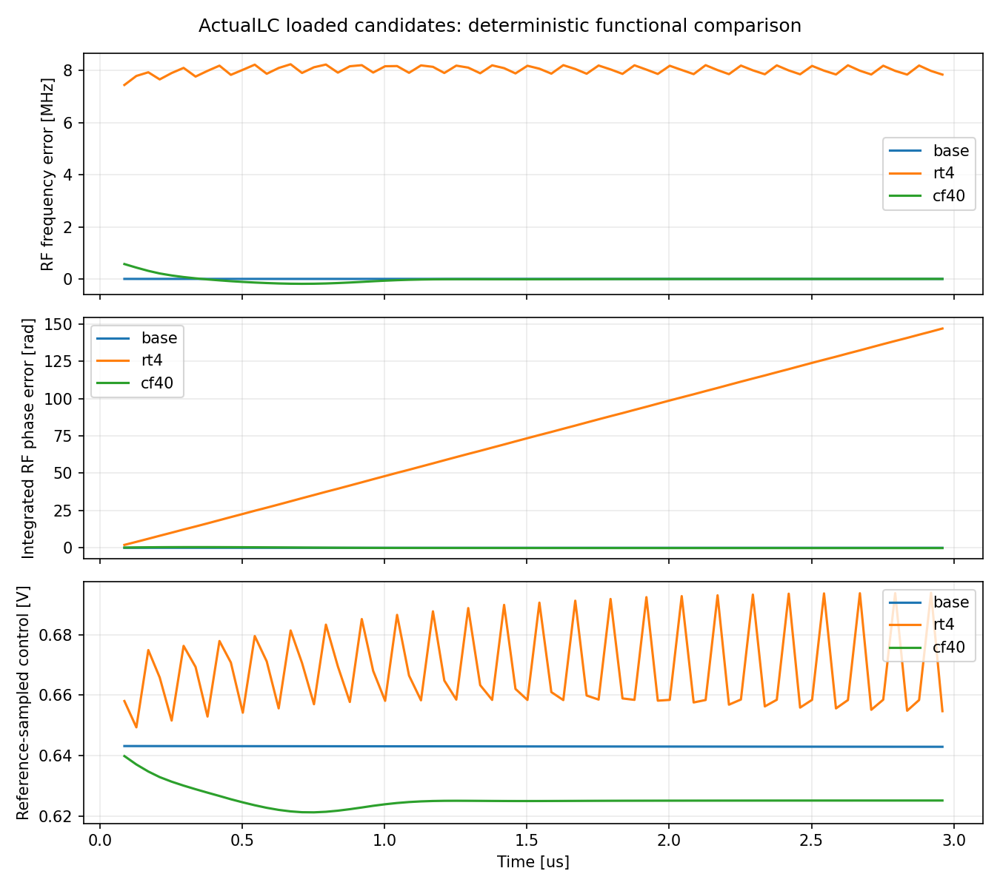

# 低噪声输出链代回真实 LC：工作点检查

最新更新：[第40次审阅](NOISE_REVIEW_40.md)。CF40实际LC使用自身3us终态追加6us、1ps/TT27/1.2V/Q5/原RT/10fF完成0error。第2至6个1us窗口均通过原稳态门限；末窗输出983.999999038MHz、相位峰峰6.160883e-05rad、漂移7.406821e-06rad/us，解决此暖启动工况的慢漂移。不是冷上电、PSS或整环噪声验收。 RT4实际MOS粗调D接口码23/24对照均完成：RF3944.573458/3933.489792MHz。同码23接口对照相对原夹具仅−9.533kHz、摆幅−0.000634%，通过250kHz/0.5%门限；粗码24可继续向上细调。0.75V单点已接替释放的短槽启动，不外推或改写动态储能。

以下保留前期四组3us和最初加载计划的历史记录；状态以本段及第40次审阅为准。

2026-10-04。**RT4在原近锁定初态下滑相，暂不能采用到主PLL。** 这不否定其局部链63.275 fs结果，也不证明重新FLL捕获后无法锁定；需要先测实际加载后的频率曲线与交接工作点。

两例仅改变输出FF和两级缓冲尺寸，实际LC Q5、采样环、粗调23、CF10、连续时钟分频候选、参考补载、1.2 V、TT27和10 fF保持相同。使用同一个有来源的初态，各自运行3 µs／1 ps／reltol1e-5；慢FLL和监督为固定边界，没有自动重新调整粗细码。

| 末约1 µs | 原尺寸 | RT4 |
|---|---:|---:|
| 平均RF | 3935.999975 MHz | 3944.017724 MHz |
| 平均输出 | 983.999994 MHz | 986.004435 MHz |
| 参考采样相位峰峰 | 0.0001063 rad | 48.2339 rad |
| 相位漂移 | −0.0000818 rad/µs | +50.3637 rad/µs |
| 近锁定筛选 | 通过 | 未通过 |

50 ns以后，RT4逐参考区间的`4×fOUT/fRF−1`最大绝对值约4.83e-6。RF自身偏高约8 MHz，输出随之偏高约2 MHz，不能把这次失败直接归因为分频器漏沿。积分RF周期误差和相位滑移互相支持；这些是无随机噪声的功能观测，不是RMS jitter。

增大输出时钟端负载会改变RF接收器的工作状态，加载反馈是第一候选机制；当前数据尚未把静态频率牵引、采样耦合和非线性捕获分离。固定初态比较说明“直接代回这个工作点”失败，不能证明不存在有效锁定解或正常FLL捕获一定失败。

已准备`rt4load01`三个真实MOS、固定VCTRL测试：**0.657999、0.557999、0.407999 V**，正常24 MHz参考，每例750 ns，末500 ns密集保存。原先较低两点为0.632999／0.607999 V，尚未运行；新完成的基线DC跟踪−10mV试验给出单边静态斜率约37.159 MHz/V，原50mV跨度按此量级仅约1.86MHz，小于所观察RT4约8MHz偏移，因此扩大试验跨度。该推算只用于选点，不作为RT4真实曲线外推；原协议和未运行输入已保留，见[初版协议](results/rt4_loading_protocol_initial.json)。

名义控制点直接对比原尺寸`samplerload_clocked_tt`；两档较低电压测RT4加载曲线。只有目标被实测曲线包围时才插值得出新的试验控制点，随后仍须实际闭环验证。**尚未运行**，待现有固定控制实验完成及槽位释放后决定，不自动修改主PLL。

同批CF40已完成0 error。末约1 µs平均输出983.999339 MHz、相位峰峰0.015177 rad、漂移−0.015315 rad/µs；频率和相位峰峰检查通过，但漂移超出0.01 rad/µs门限，稳态筛选仍失败。波形显示初始频偏衰减，不能只凭接近984 MHz就用于噪声验收，也不能把这个3 µs结果判作无法锁定。CF40的偏置时间常数较长，进一步近锁定延长观察与最终偏置／上电验证仍有必要。

四组现已全部完成。RT4+CF40组合末窗RF3944.816010MHz、输出986.203865MHz，相位峰峰53.071153rad、漂移+55.472481rad/µs，仍滑相；分频比例最大相对误差5.81e-6，不能归因为分频漏沿。组合没有自动修复旧交接点，也没有噪声结果。释放的六线程用于原尺寸基线的PSS初态对照：仅改为实测追加3µs后的612条物理状态，电路、250ns周期、步长、容差及求解选项保持。该试验已启动，尚未获得收敛结论。

证据：[四组结果](results/core_noise_candidates_validation.json)、[逐参考区间动态](results/core_candidate_dynamics.json)、[RT4加载协议](results/rt4_loading_protocol.json)。复现入口：`analyze_core_noise_candidates.py`、`analyze_core_candidate_dynamics.py`，新试验完成后用`analyze_rt4_loading.py`。
