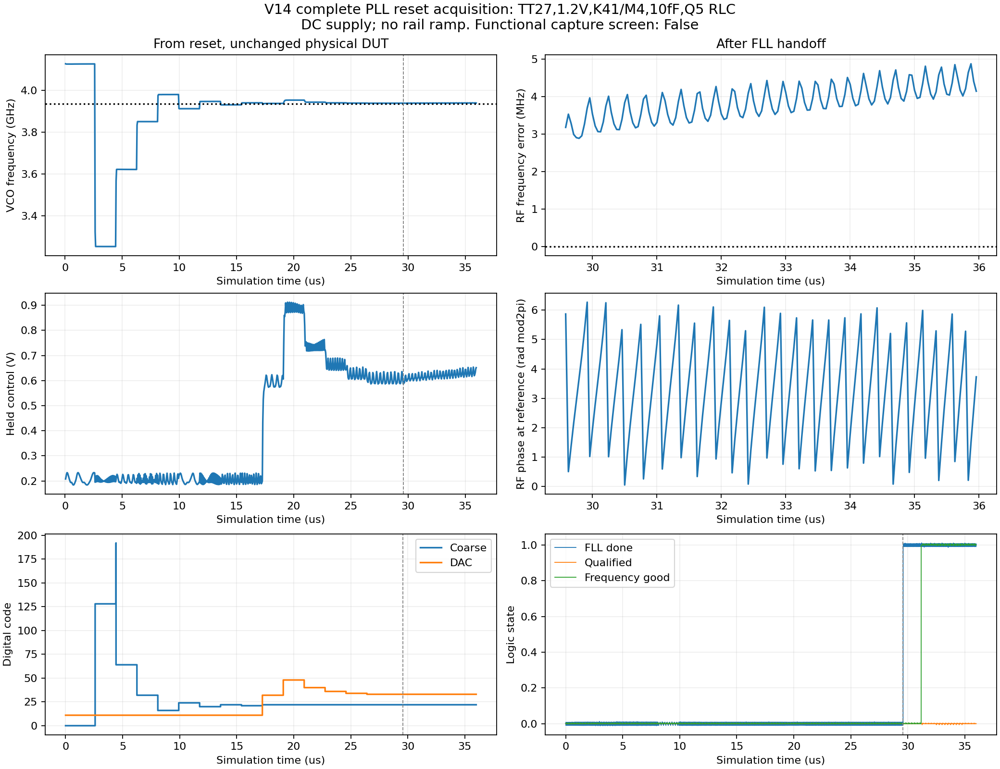

# V14 完整电路首轮结果

更新时间：2026-10-02T21:27:40+08:00；对应第21份完整状态快照。

同一全晶体管V14已补齐并完成首轮顶层验证：TT近锁定及qualified建立通过；独立复位轨迹零错误完成36µs，功能捕获筛选未通过；FLL在29.585314µs交接，末1µs平均输出985.081576MHz，qualified最终0.000V。固定DC供电，不是电源爬升。完整SS60近锁定4µs筛选通过；末1µs输出984.000293MHz，相位峰峰0.009352rad、漂移+0.004677rad/µs，qualified高电平比例100%。TT严格窗口整机5.616mW，功耗和频率覆盖存在缺口；整机抖动仍未取得。

当前权威DUT为 [pll_complete_v14.scs](../../blocks/cmos_v14_full/pll_complete_v14.scs)。项目层展开13,394 MOS、2个PDK变容器件、41 R、39 C、2 L及3个0 V电流探针；内部功能VA和理想电流基准均已移除。电感沿用获准的Q5 π型RLC，电阻/电容几何及寄生仍待版图实现。外部电源、参考与配置刺激理想，TB观察器不驱动DUT。

## 同一完整电路的系统验证

| 测试 | 初态/范围 | 结果 |
|---|---|---|
| TT严格近锁定 | 1ps/reltol1e-5，4µs；构造近锁定，继承监督历史 | 主环稳定性通过，984.000002MHz；末1µs整机5.615579mW；此测试未重新建立qualified |
| TT监督建立 | 4ps/reltol1e-4，4µs；近锁定模拟状态，新监督历史 | qualified在2.918999µs建立并保持，稳定性通过；末段984.000267MHz、5.610096mW |
| 独立复位 | DC1.2V，复位/配置，从0到36µs；5个原生连续片段 | 独立复位轨迹零错误完成36µs，功能捕获筛选未通过；FLL在29.585314µs交接，末1µs平均输出985.081576MHz，qualified最终0.000V。固定DC供电，不是电源爬升。 |
| SS60近锁定 | 1ps/reltol1e-5，4µs；SS模拟状态及新监督历史 | 完整SS60近锁定4µs筛选通过；末1µs输出984.000293MHz，相位峰峰0.009352rad、漂移+0.004677rad/µs，qualified高电平比例100%。 |
| 两种交接探针 | 构造码22/DAC34/控制0.62V；相差半RF周期，各2µs | 两者均未捕获；只是指定初态和观察时长内的负结果 |

器件、输入hash和原生恢复边界见 [完整DUT一致性](results/full_dut_consistency.json)、[系统指标](results/full_metrics.json)、[复位轨迹](results/capture_completecold05.json)。qualified标志与外部相位稳定性筛选分开判断，无噪声瞬态的周期变化不当作随机抖动。

## 模块状态

以下14个功能块均已落实为MOS/无源电路并接入同一顶层。没有任何条目据此获得全指标、完整PVT、MC和PEX签核。

| 模块 | 当前验证证据及缺口 |
|---|---|
| 参考缓冲 | 实际MOS参考缓冲接入同一完整DUT；TT严格测试边沿166.4/151.5ps，SS完整电路也已测。独立参考噪声和输入边沿范围未验收。 |
| 亚采样鉴相器 | 实际MOS采样开关/保持节点接入完整主环，TT近锁定稳定性通过；完整SS60近锁定4µs筛选通过；末1µs输出984.000293MHz，相位峰峰0.009352rad、漂移+0.004677rad/µs，qualified高电平比例100%。独立噪声、失配及完整PVT仍缺。 |
| 跨导/电荷泵 | 实际MOS CP、24k电阻馈电偏置和MOS脉冲时序已接入完整DUT；TT近锁定工作。主环noise-on分解和CP增益/失配全PVT未完成。 |
| 环路滤波器 | R100k/C1=7.162p/C2=.4775p及MOS预置开关接入完整主环；物理无源模型、容差与版图尚未实现。 |
| VCO/粗调电容组 | 电阻/MOS偏置、MOS开关电容组与Q5 RLC。新VCO局部1MHz相噪−109.327dBc/Hz，六频点精度检查通过；加载端点仍未包围规划低端。完整TT严格窗口VCO3.751463mW。 |
| 辅助FLL | 独立复位轨迹零错误完成36µs，功能捕获筛选未通过；FLL在29.585314µs交接，末1µs平均输出985.081576MHz，qualified最终0.000V。固定DC供电，不是电源爬升。实际最终DAC33计数1313>目标1312，末步fine_keep+1又选回该码；计数相等及3MHz分辨率不能保证精确交接。当前32周期FLL保持不变，128周期候选未接入DUT。 |
| 六档可编程分频 | 六档分级CMOS树；理想RF下TT27与FF0六档连重定时6/6通过，SS60的÷6/÷10/÷14失败。实际LC端点SS÷14也失败；非33点完整锁定验证。 |
| 末级重定时 | 实际MOS重定时器/输出级；严格TT窗口0.131186mW。当前局部链粗网格贡献136.553fs。当前输出链粗网格积分141.222fs（10k–492MHz），步长/边带加密仍在运行；六个边沿的三频点检查及逐组noise-on核对通过，谐波邻近有限频点检查未通过。极窄峰的积分影响另有带假设的敏感性估算；仍不是整机抖动。 |
| 输出缓冲 | 完整TT严格测试10fF输出边沿130.6/213.3ps，占空比43.97%；SS结果已回收。未覆盖实际互连、负载范围及PEX。 |
| 偏置/基准 | 内部理想电流源已全部移除；VCO/CP使用供电电阻及MOS镜像，中点用电阻产生。三配对角DC验证完成，但不是稳定带隙/PVT基准。 |
| RF接收器 | 实际MOS RF接收器；严格TT窗口0.714693mW。粗网格局部输出链中的噪声贡献18.150fs，边界不含VCO/主环反馈。 |
| CP脉冲时序 | 实际MOS延迟与锁存时序接入完整DUT，沿用已验证电路；当前CP交接及闭环联合验证进行中。 |
| 配置/测频/监督 | 实际配置、共享计数器、看门狗和监督逻辑。新监督初态TT在2.918999µs建立qualified；完整SS60近锁定4µs筛选通过；末1µs输出984.000293MHz，相位峰峰0.009352rad、漂移+0.004677rad/µs，qualified高电平比例100%。重配置与失锁恢复仍未在此完整DUT验收。 |
| 相位/振幅检测 | MOS包络/窗口比较器/下降沿FF均已接入。amp_good与相位窗口先经MOS与门产生phase_good，下降沿采样后送监督。静态三角TB通过；动态TT7过1临界、FF8过、SS4过2失败2临界，失配统计仍缺。 |

## 噪声结果边界

当前输出链粗网格积分141.222fs（10k–492MHz），步长/边带加密仍在运行；六个边沿的三频点检查及逐组noise-on核对通过，谐波邻近有限频点检查未通过。极窄峰的积分影响另有带假设的敏感性估算；仍不是整机抖动。

VCO局部噪声使用真实电阻/MOS偏置、Q5 RLC和固定÷4实际负载；1MHz偏移SSB约−109.327dBc/Hz，六频点加密最大差0.010071dB。该测试参考固定低、采样器连续跟踪，没有闭环抑制；不把自由振荡相噪直接换成PLL抖动。

输出链使用完整顶层波形生成无噪声RF回放，保留完整分频树及静默计数器输入负载。测量方法已经独立RC夹具校准；Spectre自动Jee仅匹配其截断积分，报告值使用指定全频带的显式PSD积分。数值和限制见 [输出链噪声](results/chain_noise_validation.json)、[noise-on/边沿检查](results/chain_probe_validation.json)、[谐波邻近检查](results/chain_alias_validation.json)、[VCO噪声](results/vco_noise_validation.json)。

## 与kickstart逐项对照

| 需求 | 本轮结果 | 状态/限制 |
|---|---|---|
| REQ-01 | TSMC180BCDGen2 MOS、PDK变容及RLC | 无PDK电感、版图或PEX签核。 |
| REQ-02 | 1.2 V；VCO基准SS/TT/FF约0.753/0.726/0.698 V | 旧理想偏置过压已识别并替换；器件端电压可靠性尚未签核。 |
| REQ-03 | 24MHz外部准方波驱动真实完整缓冲；TT缓冲边沿166.4/151.5ps | 参考噪声和输入边沿/占空比范围未验收。 |
| REQ-04 | TT构造近锁定稳定且自行建立qualified；独立复位捕获筛选未通过 | 独立复位轨迹零错误完成36µs，功能捕获筛选未通过；FLL在29.585314µs交接，末1µs平均输出985.081576MHz，qualified最终0.000V。固定DC供电，不是电源爬升。 |
| REQ-05 | 33点未验证；TT/SS的K14、K19、K28及FF的K14、K28未被所测端点包围 | 端点只是筛查，不证明全码单调/连续，也不证明其他频点已锁定。SS部分分频仍失败。 |
| REQ-06 | 本版输出链粗网格141.222fs；整机未知 | 当前输出链粗网格积分141.222fs（10k–492MHz），步长/边带加密仍在运行；六个边沿的三频点检查及逐组noise-on核对通过，谐波邻近有限频点检查未通过。极窄峰的积分影响另有带假设的敏感性估算；仍不是整机抖动。不含VCO、主环、参考及完整控制噪声和阻抗反馈；不能据此判定<200fs整机达标。 |
| REQ-07 | 尚无本版结果 | −60dBc指标保留。 |
| REQ-08 | 完整TT严格静默窗口5.615579mW；SS窗口5.384195mW | 窗口功耗超过4mW；未完成32µs完整状态周期的长期锁定平均。复位能量和100ns最大平均另列，不当作瞬时峰值。 |
| REQ-09 | 尚无本版结果 | 无布局/工艺无源几何，不能确认<0.3mm²。 |
| REQ-10 | 完整TT近锁定通过；SS60筛选通过 | 完整SS60近锁定4µs筛选通过；末1µs输出984.000293MHz，相位峰峰0.009352rad、漂移+0.004677rad/µs，qualified高电平比例100%。完整FF0、全温度/PVT、33点仍有缺口。 |
| REQ-11 | TT严格窗口43.97%；SS窗口63.40% | 按用户指示不刻意优化；未声明50%验收。 |
| REQ-12 | TT输出边沿131/213ps；SS约166/277ps | 完整参考/RF/输出的内部步长边沿观察已记录，负载范围与互连PEX未验收。 |

## 基于结果的下一步

- 完成已在运行的输出链0.5ps/767边带噪声复核，再封存本轮基线。
- 优先依据本轮完整电路的捕获结果处理FLL分辨率/交接与首次捕获恢复机制，再用同一DUT从复位复验。
- 处理SS分频与低端调谐覆盖后推进33频点和完整PVT；保持原频率规划及指标。
- 在功能闭环成立后，优先检查VCO/偏置和持续活动支路的功耗，再完成主环噪声分解及整机积分；局部输出链结果不代替整机。

原始数据及输入快照保存在本项目 `research/runs/spectre_cmos_v14_full/`；[清单和SHA256](results/raw_manifest.json)可供复核。服务器仅作计算环境；PDK和原生状态二进制不进入交付仓库。
