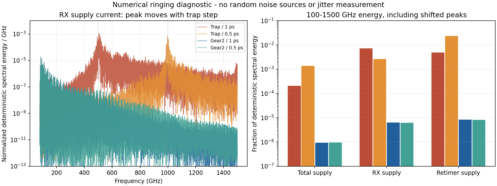

# 实际LC核心的积分方法检查

最新：[第43次审阅](NOISE_REVIEW_43.md)。实际LC/原RT/CF10/新分频器/粗码23/M4/TT27/1.2V/Q5/10fF的750ns、1ps Gear2密集检查完成；11支路计数和10ppm载频诊断通过，RF拟合3936.001873094MHz。但相邻250ns电压差最大9.458241mV（XR.ob），全部612状态中源终态至750ns终态的最大电压差3.200722mV（data），两项1mV筛选均失败；没有启动新的PSS。 密集重启相对6us源仿真还移除了事件观察器和2ns强制采样点。已用同一612项初值、同一物理电路和精度启动三组串行对照：仅恢复采样点、仅恢复观察器、两者都恢复。仅恢复采样点已完成，RF3936.001770109MHz，最大密集电压差9.737522mV，仍未通过；其余结果以协议分析文件为准。仅恢复观察器也已完成：最大电压差0.601107mV，全部状态源至终态最大电压差0.926378mV，各原工作筛选均通过。out共同位移均值约−0.003196ps、最大绝对值0.009828ps；这些仍是确定性量，不是随机噪声。

以下保留历史诊断，进行中状态以最新审阅为准。

最新：[第42次审阅](NOISE_REVIEW_42.md)。实际LC/CF10/原RT/修复分频器/粗码23/M4/TT27/1.2V/Q5/10fF的6us、1ps Gear2暖启动完成。末窗输出983.999997281MHz，相位峰峰0.0003715091rad、漂移1.964936e-05rad/us；原功能稳态筛选通过。全部601电压/11电流已观察，末两个250ns的2ns采样电压差最大0.316786mV，节点XP.XDAC.b0，1mV采样筛选通过。不能等同于有效PSS或随机噪声。 已从该真实终态保留全部612项物理状态，启动750ns Gear2密集周期检查：前250ns允许文本恢复演进，比较后两个250ns；保留高漂移节点和全部支路电流，并另比全部终态。物理电路、步长、容差不变，没有手改C1/电感/存储位，也未自动重试PSS。

以下保留前期诊断，进行中状态以最新审阅为准。

最新状态见[第41次审阅](NOISE_REVIEW_41.md)。噪声测量的有色RC一沿/六沿/246沿解析对照通过；RT4实际LC粗码24已包围目标，首个插值点仍需修正并延长滤波稳定。实际LC Gear2 PSS残差发散，已停止并完整回收，改为6us物理暖启动诊断。新输出链全带与逐模块噪声检查在运行，完整PLL随机RMS仍未知；功耗优化暂缓。 以下为可追溯的阶段记录，进行中状态以最新审阅为准。

2026-10-04。四组20 ns实际MOS瞬态对照支持**梯形积分的数值振铃**判断；它是否导致此前PSS失败，仍需方法单变量实验验证。这里没有随机噪声源，不产生RMS抖动结论。

电路、实际保存初态、TT27、1.2 V、Q5、粗调23、CF10、原输出尺寸、10 fF及1e−5／1e−7／1e−13容差完全相同，只组合改变积分方法和最大步长。使用5–20 ns轨迹、Hann窗，分别按0.25和0.125 ps重采样。短窗不足一个24 MHz参考周期，其平均RF频率不能作为锁定载波测量。

| 方法／步长 | RX电流100–1500 GHz能量占比 | RT电流同带占比 | RX高频峰 |
|---|---:|---:|---:|
| traponly／1 ps | 0.7242% | 0.4933% | 约505 GHz |
| traponly／0.5 ps | 0.2651% | 2.3397% | 约997 GHz |
| gear2only／1 ps | 0.0006422% | 0.0008335% | 约110 GHz |
| gear2only／0.5 ps | 0.0006160% | 0.0008134% | 约110 GHz |

表中占比使用0.125 ps重采样结果。频谱峰来自0.25 ps网格；两网格的宽带占比结论一致。它们是确定性轨迹的归一化频谱能量，**不是器件噪声PSD或噪声贡献百分比**。

关键检查是把上限扩展至1.5 THz：只看100–500 GHz，会因半步长把振铃移至约1 THz而误判改善。RT电流在半步长梯形法下反而具有更大的宽带振铃。峰值随近似1/(2Δt)移动，并在Gear2两步长下消失，为数值振铃提供了直接对照证据。

Spectre安装版本帮助`research/spectre_help/pss.txt`的214–223、888–903行列出两种方法，并指出梯形法可能出现逐点振铃、Gear可能引入人工阻尼。因此不以波形平滑或一次PSS收敛作为精度合格的充分条件。原帮助的SHA保存在[后续试验协议](results/core_gear_trial_protocol.json)，未上传工具文档全文。

后续只把安静边界试验的`tstabmethod`和`method`由traponly改为gear2only；1 ps、容差、250 ns周期、1.134023 µs稳定时间、实际初态和物理电路保持。使用fresh PSS和六个偏移点，取得有效周期解后仍需检查支路／沿／端点、器件PSD和更细步长。六点不能积分为完整RMS。单次任务在RT4边界点释放长槽位后运行，不自动扩展重试。

安静边界对照的完整五轮残差为7.68M、262k、335k、1.17M、4.87M，已于09:05对精确进程发送SIGINT，随后出现SPECTRE-18。2,186,995,038字节稳定段已回收，SHA为`9a9d0bbcc55576c163a0b0925fbdd10bf805390c4c266e3697cf5a5b34c08d35`；没有PNoise或有效周期状态。主动停止不证明周期解不存在。

复现与证据：[短时协议](results/core_method_probe_protocol.json)、[实际数据及源SHA](results/core_method_probe_validation.json)、[分析](analyze_core_method_probe.py)、[作图](plot_core_method_probe.py)、[边界试验完整审计](results/core_quiet_trial_audit.json)。

## 第40次实际轨迹更新

Gear2实际LC初始化快照已校验2,529,026,048字节及SHA。末两250ns输出各246沿，但共同提前0.867613ps，C1同相位终值增加0.739400mV，显示残余确定性漂移；不是随机抖动。当前完整残差历史：Conv norm = 7.77e+06, max dI(XP.XV.XL.XP.LW:1) = 15.5452 mA, took 2.93894 ks.；Conv norm = 611e+03, max dV(XP.XR.ob) = -182.96 mV, took 1.84923 ks.尚无有效周期解。 识别到运行中PSF末记录被缓存截断：稳定文件哈希不代表记录完整。保留原始文件，舍弃唯一不完整记录，截止最后完整点4.384022182742564us，仍比较整两个250ns。用既有完整原始文件回归，全部原测量行和时间窗完全一致。见[最新审阅](NOISE_REVIEW_40.md)。
