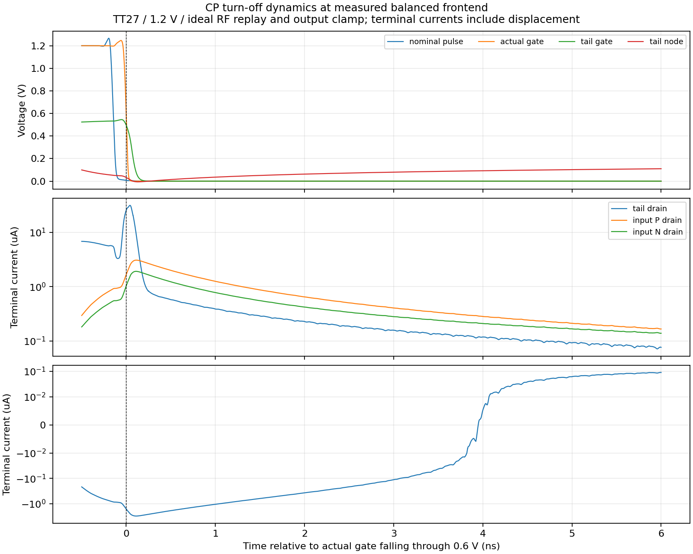

# 前端 CP 关断动态：已测量的量与尚未闭合的解释

2026-10-04。以下为实际参考、采样、CP、脉冲、偏置及检测电路的独立平台：TT27、1.2 V、24 MHz 参考、无噪声零阻抗 3.936 GHz RF 重放、0.6684289256 V 输出钳位、1.9 pF 参考负载近似。相位 196.74700281° 是实测平衡点。主 PLL 电路未修改。

已接受 PSS 的输出电流 KCL 相对误差约 11.37 ppm，净平均钳位电流为 +6.644 pA。实际 gate 的下降沿比名义 pulse 晚 144.67 ps。gate-low 窗口净输出电荷为 +0.2761 fC，而 gate 下降 1 ns 之后的部分为 +2.2223 fC：早晚电流相抵，不能将整个关断窗口当成固定漏电。

随后保持电路和激励不变，重新求解 PSS，保存安装版本 Spectre 21.1 BSIM4 定义的电阻性电流 `id`、`ids`、`gm`、端电压、阈值及电荷。各支路整周期平均端电流与电阻性电流一致性检查通过。下面是 gate 下降 5 ns 之后、下一次开启之前的条件均值：

| 器件 | 电阻性漏端电流 | 漏端总电流 | gm |
|---|---:|---:|---:|
| 尾管 MT | +10.85 pA | +44.28 nA | 0.000331 µS |
| 输入管 MIP | +51.14 nA | +50.42 nA | 1.404 µS |
| 输入管 MIN | +84.13 nA | +93.75 nA | 2.225 µS |
| 输出镜像 MPO | −137.49 nA | −139.71 nA | 3.171 µS |
| 二极管镜像 MPD | −135.69 nA | −131.65 nA | 3.134 µS |

**观察**：尾管的关断端电流主要不属于模型报告的电阻性电流；输入对和镜像支路在此窗口仍有电阻性电流及 gm。输入对在保存的整个周期内均满足 `abs(vgs)<abs(vth)`。后者支持输入对处于弱反型的判断，但不说明哪一管主导最终随机抖动；该结论仍需实际噪声贡献验证。

**保留的异常与未闭合项**：

- 所有器件保存的 `region` 都是 0，连有约 25 µA 电阻性电流、VGS 高于 VTH 的偏置 MB 也是如此。因此不使用这些代码判定工作区；原始值保留，报告原因未确认。
- 已直接比较 `terminal_d-id` 与 `d(qd)/dt`、`d(qd+qjd)/dt`、`d(qd-qjd)/dt`，不拟合比例系数。MPD 的后一形式相对 RMS 误差约 0.123%，但其余器件简单形式仍有约 32%–74% 的最小误差。尚未建立全部寄生与端口电荷的逐时闭合关系，不能把一个简单 qd 导数当作完整位移电流。
- 该平台使用理想 RF 与输出钳位，未包含真实 LC 交互；内部器件量不是噪声谱，也不是整机抖动结果。

数据入口：`results/frontend_pss_snapshot_validation.json`、`results/frontend_off_windows_validation.json`、`results/frontend_operating_probe_validation.json`。原始 246,114,506 字节工作点波形与完整仿真输入保留在本项目 `research/runs/spectre_cmos_v14_full/frontendop01/frontend_operating_r2_tt/`；已接受 PSS 的提前回收快照保存在 `research/diagnostics/frontend_noise2all_pss_snapshot01/`，有传输前后 hash 核对。相关安装工具帮助保留于 `research/spectre_bsim4_help.txt` 与 `research/spectre_save_help.txt`，未发布工艺模型或完整工具文档。

