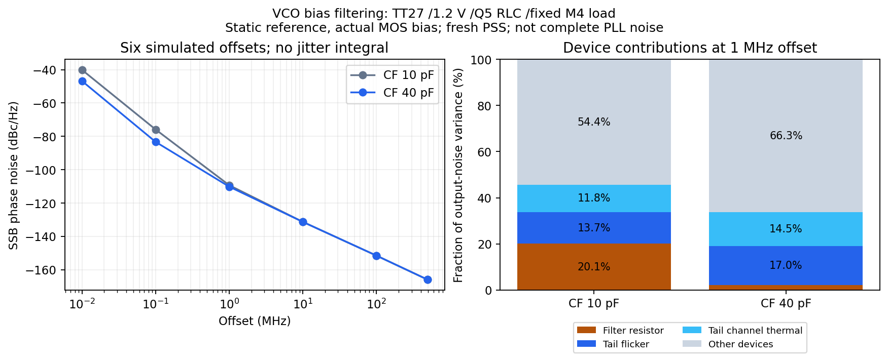

# V14 噪声与抖动验证

更新：2026-10-04。验收保持 **RMS <200fs，10kHz–输出频率一半，排除离散杂散**。K41/M4 的上限为492MHz。当前没有完整PLL的RMS验收结果。工作优先级见 [DEC-0008](../../../reports/decisions/DEC-0008.md)，功耗记录但暂不作为优化门槛。

## 当前局部输出链结果

夹具保留实际MOS RF接收器、完整六档分频树、CMOS重定时／输出及静默计数器输入负载；以外部无噪声、零阻抗实测TT波形重放驱动3.936GHz。条件为TT27、1.2V、984MHz输出、10fF。它不含VCO自身噪声、闭环传递、参考源噪声或供电噪声。

| 配置 | 10kHz–492MHz 暂定RMS | 输出上升沿斜率 | 状态 |
|---|---:|---:|---|
| 原局部链 | 141.281fs | 11.952GV/s | 有独立noise-on、部分边沿和精度对照；谐波邻近积分仍有缺口 |
| FF及两级输出整体2倍 | 90.867fs | 20.410GV/s | 新求解PSS及全频带PNoise完成0error；新求解总噪声和FF-only三点复核通过；仍待后续验证 |
| 整体4倍 | 63.275fs | 30.934GV/s | 全频带0error完成；仍待自身精度／边沿／noise-on／PVT |

2倍候选的暂定RSS贡献：FF70.029fs、输出末级43.727fs、前级29.074fs、RX18.773fs、输出到静默计数器的传输门15.384fs、分频树1.723fs。这些贡献按方差相加，不能线性相加。夹具总功耗约1.815mW，不是全部PLL功耗。2倍候选周期轨迹有6个正确输出上升沿，各公开节点谐波和端点检查通过。

积分由sampled edge-crossing电压PSD除以实际边沿斜率平方，再对指定频带积分；自动Jee可能停在PSS基频一半，不能代替此积分。局部PSS共同基频164MHz、sampleratio=6。2倍使用1ps／383谐波及边带／20点每十倍频；原141.281fs来自更细0.5ps／767边带验证，数值条件差异保留。候选没有自动采用到完整PLL。

证据：[尺寸结果](results/rt_noise_scaling_validation.json)，复现 `analyze_rt_noise_scaling.py`；原始完整输入／PSF／状态及日志位于 `research/runs/spectre_cmos_v14_full/chainrtscale01/`。

## PSS状态复用的冲突证据

2倍源结果完整回收后，以相同物理输入SHA和有效周期状态，使用`readpss`／`checkpss=yes`逐个开启FF、缓冲、RX、分频树和辅助负载噪声。五例全部0error，但与原新求解下的贡献不一致；原失败结果保留在 [五组复核](results/rt_noise_gate2_validation.json)。

独立的全噪声复用对照也产生差异：1／10／100MHz处的PSD是源结果的 **2.592／4.564／5.049倍**。同一复用流程内，五组单独noise-on与全噪声中的对应贡献均一致。PSS输出波形与斜率几乎不变，差异却出现在MOS器件噪声项，因此不能把它解释为尺寸方案性能突然恶化。尚未确定是复用流程、当前工具配置还是更底层实现的问题；频点设置的影响也用新求解对照排查。

此前线性RC夹具的fresh／reuse噪声PSD相对差约8.9e-14，只能证明该线性校准成立，不能推及周期变化的MOS噪声。**在此冲突解决前，复用PSS所得MOS噪声不用于性能验收。** 新两例`rtfresh01`重新求解PSS，分别计算全噪声和FF-only，保留源结果的writepss及有限差分行为，仅改三个频点和明确的噪声开关。

审计入口：`analyze_rt_noise_controls.py`；结果 [fresh／reuse对照](results/rt_noise_controls.json)。新求解全噪声和FF-only三点均已完成，分别与原全频带源结果及FF贡献的最大相对差为3.17e-13／1.19e-13，排除频点设置和噪声开关本身的影响。当前差异定位到复用流程，底层原因尚未确定。三个频点只用于方法和贡献对照，不积分为RMS。4倍尺寸全频带同样为新求解PSS，不使用上述复用捷径。

## 闭环噪声核心：边界与未收敛结果

`pll_noise_register_core_v14`保留真实VCO及偏置、Q5 πRLC、MOS粗调开关及八个真实粗调DFF、PDK变容、亚采样器、CP及脉冲时序、环路R/C及预置开关、RF接收、完整分频／输出、有效性检测、关闭的真实DAC和静默计数输入负载。粗调23／DAC38，1.9pF诊断补载使参考边沿接近完整DUT。

慢FLL、配置、监督和看门狗在诊断边界用固定控制电平替代。这不是新的全晶体管PLL版本：慢逻辑噪声／周期活动、控制输出阻抗、部分参考加载和完整电源耦合仍需补验。完整DUT共同周期至少32µs；本核心仍翻转的÷8／÷12支路使共同周期为250ns，即4MHz PSS、每周期246个输出沿。不能强制按24MHz求解以获得虚假收敛。

- `coressettle01`的5µs／1ps严格瞬态通过末1µs稳态筛选：输出984.000043MHz，参考采样相位峰峰0.001001rad、漂移0.001024rad/µs，粗调23保持。它使用前次文本初态，不是原生连续7µs；也不证明PSS重启后已稳态。
- `coreregisterprobe01`的250ns稳定段后PSS失败，2个error，PNoise跳过。文本重启相位峰峰0.173352rad；最后250ns公开输出／÷2／÷8／÷12沿数246／492／123／82正确。Newton从内部锁存开始产生非物理越轨，未证明基频错误。
- `coregear01`将稳定段延至2µs并使用Gear2，仍发散；10次残差报告后精确SIGINT停止并保留3.24GB稳定段。最后两周期的÷12内部fb端点相差约5.8µV，但首个迭代报告约1.197V差异，提示需继续核查初始向量与求解流程；不据此直接认定模拟器bug。
- `corerestart01`的skipdc／tstart对照仍发散，已SIGINT停止。残差先从338k到333k，随后升到721k／2.44M；保存的最后250ns沿数246／492／123／82仍正确，但RF和输出端点尚有明显差异。停止后另记录SPECTRE-18，不描述为此前自行崩溃。没有PNoise；详见[失败审计](results/core_restart_failure.json)。动态节点只是待检假设，尚未证明唯一原因。
- `coretripsettle01`将独立诊断核心分频器替换为连续时钟`bank_pulsetrip_v14`，其余VCO CF10pF、基线RT和主环不变；剔除旧分频／输出的文本初态后，在真实LC／采样反馈下重跑3µs/1ps。新连续时钟分频器接入真实LC／采样环的独立核心后，3µs严格瞬态通过：末窗输出984.000049MHz、相位峰峰0.001121rad、漂移0.001112rad/µs，粗调23保持。新fresh PSS／六点噪声探针coretripnoise01已启动，尚无结果。证据：[真实LC瞬态](results/core_pulsetrip_settle_validation.json)、[新PSS协议](results/core_pulsetrip_noise_protocol.json)。

失败证据：[首轮PSS审计](results/register_pss_failure.json)、[Gear2审计](results/gear_pss_failure.json)，新测试 [协议](results/core_restart_protocol.json)。失败生成的周期状态明确无效，不得复用。此前两条有限自动流程均已停止，没有自动启动完整频带。

## 下一步的有效性门槛

1. 先完成新求解PSS的局部noise-on核查，确认尺寸改善；再检验不同输出沿、maxacfreq／步长／边带和谐波邻近的有限偏移积分。
2. 闭环核心先通过周期、各支路边沿、端点和稳定性，再测10kHz–492MHz全频带与逐模块noise-on；现阶段采用fresh PSS。
3. 将经验证候选代入实际LC和完整PLL，检查工作点、时钟负载、功能与PVT，再补慢控制影响。局部90.867fs不能写成整机<200fs通过。
4. 杂散单独验证，不混入随机抖动；现有2ns稀疏保持波形不适合直接测984MHz载波附近频谱。

方法与来源：[NOISE_METHOD_NOTES](NOISE_METHOD_NOTES.md)。现有输入、原始输出、失败证据及有限接续状态均保存在项目目录，可据`research/v14_capture_repair_active.json`恢复工作；服务器不是唯一状态源。

## VCO偏置滤波与当前接续验证（2026-10-04）

`vcocf40_01`完成0error；冻结输入比较确认只将CF10pF→40pF，R1MΩ、MOS尺寸和夹具不变。TT27／1.2V／Q5、粗调23／控制0.679V、真实固定M4／10fF负载、参考保持DC0，仅开启VCO噪声；新求解自主PSS、0.5ps／255边带。六偏移点10k／100k／1M／10M／100M／492MHz的相噪改变量为−6.679／−7.442／−0.865／−0.016／−0.007／−0.006dB。

RF频率变化+0.00433%、载波幅度+0.193%，相近工作点成立。1MHz滤波电阻输出PSD比原来低约11.4倍；其余噪声占比随之提高，尾管闪烁项占17.0%、沟道热噪声14.5%。器件内各噪声项相加和所有器件之和均与输出PSD相符。尾管W300µm/L1µm→W600µm/L2µm的独立候选已准备，保持名义W/L但不假定电流不变，需实测确认。

尾管W300µm/L1µm→600µm/2µm试验已完成：1MHz相噪降低0.662dB，但10kHz恶化1.610dB，RF频率−0.956%、载波幅度+9.81%，未通过相近工作点判据，不采用，也不把变化全归因于同工作点尺寸降噪。详见[尾管对照](results/vco_tail_noise_validation.json)。低频变差和工作点变化均保留，后续须先匹配频率/幅度或在真实闭环内比较，不能仅凭1MHz单点挑选方案。

**六频点不积分为RMS；不把自由振荡VCO噪声写成PLL抖动。** 10kHz点接近工具估计的自由振荡线宽，保留线性化边界。CF的名义偏置RC由10µs到40µs。抽取MOS偏置子电路已测得CF10/40pF栅电压达到终态99%约需55.73／193.67µs；尾端为实测均值的静态钳位，仍不等于真实VCO／PLL上电启动。当前DC供电后的复位捕获不能替代供电爬升验证。证据：[VCO候选](results/vco_bias_noise_validation.json)、[尾管计划](results/vco_tail_noise_protocol.json)、[偏置充电诊断](results/vco_bias_startup_validation.json)。

局部输出链：4倍尺寸候选已完成，局部积分暂算63.275fs；仍待自身数值、边沿、noise-on和PVT核查。2倍的匹配六频点精度对照`rt2precision01`在跑；通过0.2dB差异门槛后，有限接续任务才运行六输出沿与五组独立noise-on，均重新求解PSS。精度、边沿和归因检查都不能代替全频带/PVT或整机验收。

运行条件见[精度协议](results/rt2_precision_protocol.json)、[边沿和noise-on协议](results/rt2_fine_audit_protocol.json)、[真实LC诊断核心协议](results/core_pulsetrip_protocol.json)。线程请求总数不超过18；每个有限接续任务仅使用其前序任务释放的线程。

4倍尺寸的[匹配精度对照](results/rt4_precision_protocol.json)接续在尾管试验释放的1线程内运行，之后仍需它自身的边沿、noise-on及实际LC/PVT验证。
