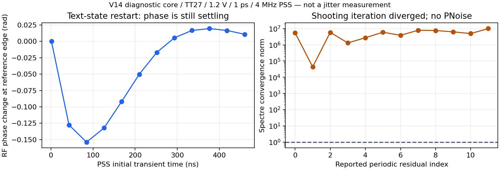

# V14 闭环抖动验证进展

验收口径保持 **RMS <200fs，10kHz–输出频率一半，排除离散杂散**。K41/M4时上限492MHz。本页没有新增整机RMS通过结论。

## 当前优先级与结果

2026-10-04：用户要求优先解决噪声/抖动，暂缓功耗优化；见[DEC-0007](../../../reports/decisions/DEC-0007.md)。上一轮`coreregisterprobe01`已失败，PNoise被跳过，无闭环RMS。失败周期状态不可复用。现有`coregear01`在相同物理电路上采用2µs稳定段和Gear2，8线程；局部`chainrtscale01`比较重定时/输出整体2倍、4倍尺寸，1线程顺序执行。两者尚未代回主PLL。

## 器件噪声测试边界

`pll_noise_core_v14`从当前`pll_capture_v14`生成，采用TT27、1.2V、理想24MHz参考、粗调23/DAC38、984MHz/10fF、Q5 πRLC。保留真实VCO及偏置、亚采样反馈、CP及MOS脉冲电路、环路RC和预置开关、RF接收、完整可编程分频树、重定时/输出、有效性检测，以及关闭状态的实际DAC和静默计数器输入负载。

为先测量噪声关键闭环，FLL、配置、监督和看门狗被诊断边界上的固定控制电平替代。这不是新的全晶体管PLL交付版本，也不是全PLL签核：未覆盖慢速逻辑噪声/活动、它们对参考缓冲的加载、实际控制码输出阻抗/噪声、外部参考/电源噪声及PEX。后续必须比较核心与完整DUT的工作点/边沿，并验证这些缺项，不能仅将局部链141fs或本核心结果写为整机指标。

正常完整DUT的共同周期至少32µs；固定慢控制后，仍翻转的÷8/÷12支路与24MHz参考共同周期为250ns。因此本核心使用4MHz PSS，不强行按24MHz周期求解。PSF应检查246个输出上升沿、正确谐波和周期端点；每个上升沿的噪声未必相同。

## 流程与当前边界

1. `corenoiseprobe01/core_noise_probe_tt`的1.251µs稳定段已回收，1ps/reltol1e-5。参考采样相位展开跨度18.345rad，平均漂移15.289rad/µs；末200ns RF3937.755MHz、输出984.432MHz，仍连续滑相。首轮PSS迭代不收敛，已主动SIGINT停止并保留原始输入/PSF及取消原因。**尚未进入可用PNoise测量，没有RMS结果。**
2. 对照`corepreflight4ps01`改为4ps/reltol1e-4，绝对容差仍保持1e-7V/1e-13A；1µs瞬态完成0error，但相位跨度3.014rad、漂移1.648rad/µs，亦未达到稳态。这不是完整DUT的4ps捕获失败，也不是随机抖动。
3. 裁剪核心的参考边沿约59.6/52.8ps，完整DUT保持轨迹约200/182ps，参考负载显著不同。`coreload01`额外2/5/10pF的三组300ns诊断对照均已完成0error，分别得到196/174、414/360、784/678ps；2pF接近完整DUT，但三组均未达到稳定相位。理想等效电容不能代替最终逻辑噪声/周期活动验证。
4. `analyze_core_preflight.py`先检查实际工作点与相位稳定性；`analyze_closedloop_noise.py`再检查PSS最终0error、周期谐波/端点、输出边沿、噪声贡献求和和单位。原一次性继续脚本已记录`probe_failed_no_band_launched`，没有启动完整频带任务。
5. 待工作点、周期轨迹验证通过后，先做六频点归因探测，再做10kHz–492MHz、20点/dec全频带PSD/slew²积分。六点本身不积分；自动Jee可能截断到PSS基频一半，不能作为项目全频带RMS。完整积分后仍需边沿位置、谐波邻近有限频率、步长/边带收敛及各模块单独noise-on对照。

当前另一个工作点差异是粗调码的驱动边界：完整DUT通过八个`tx_dff_r0`输出驱动MOS电容开关，固定理想电压会移除输出阻抗及RF回灌。新`pll_noise_register_core_v14`保留相同八个MOS DFF、实际refb时钟和D=q保持反馈，以实际64µs终态初始化每级9个内部节点。用1.9pF诊断补载补偿其余参考负载，`coreregister01`已零错误完成2µs/1ps严格瞬态；参考边沿恢复到198.7/176.3ps，粗调码23保持，但末1µs相位峰峰3.108rad、漂移2.559rad/µs，尚未稳态。它仍省略其它慢控制和部分负载，不是完整PLL；先验稳态和实际DUT一致性，再进入PSS。

周期解复用流程已准备：读取旧PSS状态使用`checkpss=yes`，本地/远程SHA匹配；不跳过周期解有效性检查。已完成两次相同RC校准（新求解与复用状态），PSD最大相对差约8.9e-14，见`results/pss_reuse_validation.json`。这是测量流程校验，不是PLL性能。

## 复现入口

- 构建：`build_closedloop_noise.py`；边界：`results/closedloop_noise_protocol.json`。
- 分析：`analyze_closedloop_noise.py corenoiseprobe01 corenoiseband01`，只读取已完成结果。
- 运行器新增`--pss-state <项目research内已回收状态文件>`；状态跨电路变更禁止复用，继续脚本会检查全部依赖。
- 原始输入/PSF/状态/日志位于项目`research/runs/spectre_cmos_v14_full/corenoiseprobe01/`；后续完整频带使用独立`corenoiseband01`目录。
- `results/chain_noise_validation.json`、`chain_alias_validation.json`与`vco_noise_validation.json`保留此前各自边界的局部噪声证据。

诊断证据：`results/core_preflight_validation.json`；原始稳定段953,481,254字节，SHA256 `c9436fa4e0eccc1a41a8395785a6babd0c41c54ec98c54088c03a49d541a3852`，本地与远程一致。4ps对照原始波形SHA256 `fdb5e67388361dc99c16e97f9a882b27c60898b57d7703c0a8d08cbf2e61eb2f`亦已核对。

下一稳定性测试`coressettle01/core_register_settle_tt`沿用同一物理寄存器核心和1.9pF补载，从上述2µs文本终态启动5µs/1ps瞬态。零电流VA观察器只在TB读取内部求解步长上的相位与周期计数，2ns稀疏电压数据不用于GHz边沿或功耗。该测试已零错误完成并通过稳态筛选，不拼接为原生连续7µs，也不作为PNoise或整机RMS结果。分析入口`analyze_core_settle.py`会检查末1µs稳态和粗调码保持，再决定是否进入PSS。

后续实验已串接为一次性有条件流程：`research/continue_register_pipeline.py`等待当前5µs结果和完整hash回收，先执行稳态检查；只有通过才构建`core_register_noise_probe_tt`并运行八线程PSS/PNoise六频点。只有周期、谐波/端点、246个输出沿及噪声贡献一致性通过，才调用`continue_register_noise.py`复用核验的PSS状态做10kHz–492MHz全频带。失败即停止后续，不反复重启。该流程不是周期任务，状态记录在`research/register_noise_pipeline.json`；八线程仅在当前核心瞬态结束后使用，严格复位8＋噪声8＋短实验1不超过18线程。

5µs严格稳定段末1µs测得：输出984.000043MHz，相位峰峰0.001001rad、漂移0.001024rad/µs，RF／输出每参考周期最大偏差分别1.63e-5／6.85e-6；控制采样0.642339–0.642459V，八个物理粗调DFF全窗保持码23。见`results/core_settle_validation.json`。这一工作点与4ps完整DUT仍有控制电压和裁剪边界差异，不能直接宣称完整DUT等价。

流程已于18:23从核验终态启动`coreregisterprobe01/core_register_noise_probe_tt`：4MHz共同周期、4095谐波/边带、1ps/reltol1e-5，250ns稳定段、六个偏移频点、8请求线程。输入终态SHA为`a2010e5636522eea0b545500817f201cc7ae1be3492e28799c07dc7923b09ab0`，只保留物理XP节点和out，剔除TB观察器状态。`results/register_noise_protocol.json`记录来源和边界。该任务随后于19:22由Spectre以2个error结束，六点PNoise未执行；后续完整频带与逐模块noise-on仍有相应验证门槛。

## 失败诊断与恢复实验（2026-10-04）

`coreregisterprobe01`的初态来源和物理依赖SHA一致。重启稳定段到501ns，参考采样相位峰峰0.173352rad；末200ns输出983.928515MHz，仍有衰减中的相位扰动。最后250ns的输出／÷2／÷8／÷12边沿数分别246／492／123／82，与共同周期相容；这不是错误基频的证据。首次周期残差最大节点为÷12内部锁存，随后Newton迭代在未使用支路复位锁存`XRL`产生非物理电压并发散。尚不能把它确定为唯一电路根因。

[失败审计](results/register_pss_failure.json)由`analyze_register_failure.py`复现。读取PSF时按时间记录合并tstab边界重复信号块，避免独立追加列导致一行错位。原始失败PSF、日志和2.9GB未收敛状态均保留在项目research，未收敛状态明确禁止复用。

`build_noise_recovery.py`仅延长稳定段、改用Gear2并增加内部节点观察，不放松残差或更改电路。`continue_gear_noise.py`是本次实验的有限接续程序：等待既有probe完成，周期轨迹、谐波、246个边沿、器件PSD求和及状态SHA均通过才启动一次全频带，失败则停止。进度在`research/gear_noise_pipeline.json`。即使完成，全频带仍需逐模块noise-on、不同边沿、maxacfreq/步长/边带、谐波邻近积分及完整DUT边界核查。

局部尺寸对照保留RF接收器、完整分频树、重定时和实际静默计数负载，以外部无噪声实测RF重放驱动。基线局部141.281fs中，FF约99.376fs、输出末级82.143fs、前一级45.047fs（各自RSS贡献，不能线性相加）。`build_rt_noise_scaling.py`整体放大FF和两级缓冲，连同扩散寄生、时钟及数据负载一起计算。其结果入口是`analyze_rt_noise_scaling.py`；功耗只记录，不作为本轮改善门槛。仍需noise-on核查和闭环代回。

参考方法与当前测量限制见[方法核查](NOISE_METHOD_NOTES.md)。

当前2倍候选的PSS已在8轮Newton后经有限差分修正收敛，PNoise全频带扫描进行中；4倍候选顺序排队。`research/continue_rt2_gates.py`等待2倍完整结果，通过周期和噪声数据检查后以同一有效PSS状态逐个只开启FF、缓冲、RF接收、分频和辅助负载噪声，在1/10/100MHz对照全噪声下的器件贡献。三频点不积分为RMS；状态记于`research/rt2_noise_pipeline.json`。
