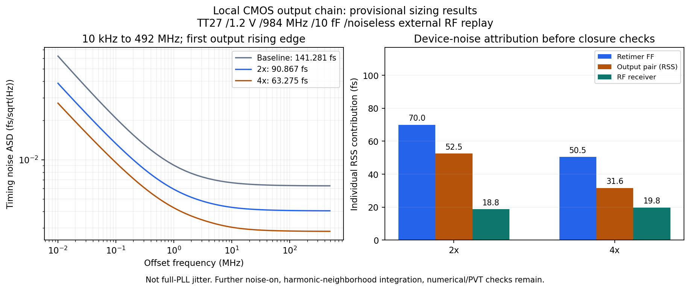

# V14 噪声与抖动验证

最新完整审阅：[第81次审阅](NOISE_REVIEW_81.md)。RT4候选0.25ps第二种子完成并独立复核，高偏移诊断103.195977fs；seed11/29相差7.65%，未证明统计或数值收敛。已派发RT4 0.5ps seed29对照，原版0.5ps seed29继续。

更新：2026-10-05。验收保持 **RMS <200 fs，10 kHz–输出频率一半，排除离散杂散**。K41/M4积分上限492 MHz。**完整PLL RMS仍未知**；优先推进噪声／抖动，功耗与后端优化后置，原目标保持。见[DEC-0008](../../../reports/decisions/DEC-0008.md)。主`pll_capture_v14`没有采用下述独立候选。

## 局部输出链：尺寸优化与独立检查

条件：TT27、1.2 V、984 MHz／10 fF。外部无噪声、零阻抗实测RF波形重放驱动3.936 GHz；实际MOS接收器、原六档分频树、重定时／输出、静默计数器输入负载。此夹具没有VCO噪声、闭环传递、参考源噪声与供电噪声。

| 输出链配置 | 10 kHz–492 MHz暂定RMS | 输出斜率 | 匹配六点精度最大PSD差 | 六沿、三个偏移点最大PSD差 |
|---|---:|---:|---:|---:|
| 原尺寸 | 141.281 fs | 11.950 GV/s | 既有验证见原结果 | 0.00514 dB，旧测试 |
| FF及两级输出整体2倍 | 90.867 fs | 20.410 GV/s | 0.01275 dB | 0.00958 dB，通过 |
| 整体4倍 | 63.275 fs | 30.934 GV/s | 0.01455 dB | 0.03047 dB，通过 |

候选完整频带采用fresh PSS、1 ps／383边带／20点每十倍频；自身精度检查为0.5 ps／767边带／maxacfreq 504 GHz。六点精度和六沿三点不等于全频带、谐波附近积分或PVT关闭。旧分频器局部链RT2五组fresh noise-on全部完成并通过，独立PSD相加对全噪声最大相对差4.44e-16；六沿三点最大差0.009579dB。RT4五组也全部通过，独立PSD相加误差1.11e-15。范围为1MHz/100MHz/491.99MHz，不是全带或完整PLL。

已准备两档RT尺寸的0.5ps/767边带/maxacfreq504GHz全频带精度TB及分析，保留10kHz–492MHz原对数网格和端点，增加164/328/492MHz附近1/10/100/1k/10kHz距离共25点。旧分频器的这项加密暂缓，优先实测与实际LC一致的新分频器负载；不静默删掉连续闪烁噪声的谐波邻域。见[完整频带协议](results/rt_fullband_precision_protocol.json)。

4倍的暂定RSS贡献：FF50.491 fs、末级输出24.911 fs、前级19.505 fs、RX19.802 fs、分频1.747 fs、辅助负载7.586 fs。分量以方差相加。等效边沿电压RMS由原1.688 mV升到4倍1.957 mV，因此当前时间噪声改善来自更大斜率；此代数分解不能证明尺寸以外的唯一因果机制。见[尺寸数据](results/rt_noise_scaling_validation.json)、[斜率诊断](NOISE_SLEW_DIAGNOSIS.md)、[2倍审计](results/rt2_fine_audit_validation.json)、[4倍审计](results/rt4_fine_audit_validation.json)。

sampled edge-crossing电压PSD除以对应沿斜率平方后积分；自动Jee可能止于PSS基频的一半，不能替代指定492 MHz积分。局部共同基频164 MHz、sampleratio=6。精确谐波偏移曾有无限闪烁项警告；基线距492 MHz仅1 Hz处的0.590 dB差异保留为未关闭项，条件性积分估算不冒充实际低频截止验证。见[谐波邻近结果](results/chain_alias_validation.json)。

## 禁用存在冲突的MOS PSS复用结果

`readpss/checkpss`复用状态时，在1／10／100 MHz的全噪声PSD是fresh源结果的2.592／4.564／5.049倍。五组noise-on在复用流程内部一致，但与fresh不同；波形与斜率几乎不变。新求解的三点总噪声和FF-only分别与原全频带贡献相符至3.17e-13／1.19e-13，排除了频点和noise-on开关本身。线性RC夹具复用通过不能外推MOS。

**当前只使用fresh PSS产生MOS噪声性能证据。** 底层复用差异尚未定因，负结果保留。见[fresh/reuse控制](results/rt_noise_controls.json)。

## 真实LC的参考调制：前期诊断记录

在已回收的`coretripsupply01`无噪声初始化轨迹中，两个相邻250 ns窗口的输出−24 MHz线为−28.80013／−28.79996 dBc，+24 MHz约−28.926 dBc；独立时域积分与FFT一致，插值加密的强线差小于0.002 dB。该数据尚非收敛PSS或完整PLL稳态，**作为明确风险，不作为最终验收值**。

24 MHz调制已出现在LC差分端，折合确定性时间峰值11.159 ps；输出11.654 ps，两者时间波形相关系数0.99534。参考保持／跟踪半周期的RF频差约10.229 MHz。采样负载切换是待证假设，控制纹波、电荷注入和其他直接参考耦合仍未分开。**这些ps量级周期扰动不是随机RMS，不计入排除spur的200 fs指标。** 详细证据、来源和图见[参考负载诊断](REFERENCE_LOADING_DIAGNOSIS.md)。

`samplerload01`五个实际MOS实验将控制端钳到实测均值0.657999 V，分别采用正常参考、DC跟踪、DC保持及跟踪状态控制±10 mV。每例750 ns／1 ps，末500 ns密集保存；检验参考负载频差和KVCO。有限接续只接替分频短批次的1线程，进度以[结果](results/sampler_loading_validation.json)为准。互补MOS dummy采样40／80／120 fF已在固定控制五例通过后接替启动，40/80fF已分别降低24MHz PM幅度14.327/13.484dB，但改变RF均值；120fF继续；不采用CML或新增DLL。见[候选协议](results/sampler_dummy_protocol.json)。

## VCO偏置噪声优化

仅CF10→40 pF，R1 MΩ和MOS不变：TT27／1.2 V／Q5、粗调23、控制0.679 V、实际固定M4输出负载、参考DC0、只开启VCO噪声；fresh自主PSS、0.5 ps／255边带。10 k／100 k／1 M／10 M／100 M／492 MHz相噪变化为−6.679／−7.442／−0.865／−0.016／−0.007／−0.006 dB。RF频率+0.00433%、载波幅度+0.193%，相近工作点成立。

尾管W300/L1→W600/L2 µm候选在1 MHz改善0.662 dB，但10 kHz恶化1.610 dB，RF−0.956%、幅度+9.81%；工作点匹配失败，未采用。抽取偏置子电路CF10／40达到终态99%需55.73／193.67 µs，尾端静态钳位在实测均值；不等于VCO或完整PLL供电启动。六频点不积分为PLL RMS，10 kHz靠近自由振荡线宽也须保留线性化限制。见[CF结果](results/vco_bias_noise_validation.json)、[尾管负结果](results/vco_tail_noise_validation.json)、[偏置启动](results/vco_bias_startup_validation.json)。

## 闭环周期状态与实际LC候选

诊断核心保留真实LC及偏置、粗调DFF、PDK变容、采样器／CP／R-C、RF接收、全分频与输出、检测器及静默计数器输入，慢FLL／监督被静态边界替代。1.9 pF诊断补载使参考沿接近完整DUT，但慢逻辑噪声、活动、驱动阻抗和电源耦合尚未覆盖。翻转的÷8／÷12使核心共同周期250 ns；完整PLL看门狗等使共同周期至少32 µs，不能强制用24 MHz PSS。

三个供电探针节点遗漏初值所致209 A数值尖峰已通过仅补三个1.2 V的A/B去除。修正供电核心仍在四次shooting范数3.7M→75.3k→340k→2.1M后停止；仅收紧itres到1e-6也为3.7M→75.3k→340k→1.23M，未恢复收缩，05:29主动停止。两者没有有效PSS/PNoise，未用满10次，不能宣称数学上不存在周期解。此前Gear、skipdc、旧寄存器核心负结果均保留。见[初始化](CORE_INITIALIZATION.md)、[itres审计](results/core_linear_trial_audit.json)、[原失败审计](results/core_restart_failure.json)。

修正供电轨迹相邻周期保存电压最大差0.829 mV、主要时钟共同提前约0.021 ps；分频沿数相同，未覆盖隐藏状态，也不是随机jitter。晚初态轨迹也选出+134.023ns，单变量tstab边界实验已启动，仍是假设检验。见[周期漂移](results/core_period_drift.json)、[边界](results/core_boundary_diagnosis.json)。

真实LC四组3 µs／1 ps近锁定比较均已完成。原尺寸基线通过：983.999994 MHz、相位漂移−8.18e-5 rad/µs。**RT4完成但失败**：输出986.004435 MHz、RF3944.017724 MHz、相位漂移+50.3637 rad/µs，分频比仍正确。共同初态与固定慢控制不能证明重新FLL捕获一定失败；先测加载频率曲线，再验证交接，RT4未采用。CF40实际LC使用自身3us终态追加6us、1ps/TT27/1.2V/Q5/原RT/10fF完成0error。第2至6个1us窗口均通过原稳态门限；末窗输出983.999999038MHz、相位峰峰6.160883e-05rad、漂移7.406821e-06rad/us，解决此暖启动工况的慢漂移。不是冷上电、PSS或整环噪声验收。先前3us漂移失败仍保留；RT4+CF40也已完成，RF3944.816010MHz／输出986.203865MHz／漂移+55.472481rad/µs，仍滑相。见[实际LC候选审阅](ACTUAL_LC_CANDIDATE_REVIEW.md)。

晚初态PSS完整日志五次残差3.71M/127k/335k/3.19M/2.34M，仍未收敛。08:12主动SIGINT，随后SPECTRE18，1.975GB稳定段回收校验。此前日志尾部漏掉首次，127k首轮及29倍改善的说法已撤回；监视工具改为保存完整残差历史。晚初态轨迹相邻周期保存电压最大差0.851mV，不等于有效周期状态。仅tstab1us→1.134023us的边界对照已启动，实际波形选择降低边界逻辑最大斜率25.937→9.844GV/s；周期/电路/容差不变，收敛尚未证明。新内部状态审计发现，同相位3 µs前后35个节点变化>1 mV；外部稳定不证明内部周期稳定。612个状态条目准确为601个电压和11个电流，包含两个电感电流。两个端点不能区分初始化跳变与后续慢变，未证明shooting根因，没有人为修正或移植内部节点，见[完整状态诊断](CORE_STATE_DIAGNOSIS.md)。

固定控制端第一例已完成：相同边沿拟合下，LC／输出24 MHz PM幅度仍保留99.863%／99.332%。直接参考耦合路径得到证据，但载波均值也改变约1.299 MHz，不能把该比例解释为某个器件的贡献。固定控制五例均已通过，频差9.531425 MHz、静态中心差分KVCO37.915054 MHz/V；dummy已启动，详见[参考负载诊断](REFERENCE_LOADING_DIAGNOSIS.md)。这些确定性调制不计入随机RMS。

核对出既有141.281/90.867/63.275fs局部尺寸结果使用旧cmos_even_bank_acq_v14，而实际LC候选使用修复后的bank_pulsetrip_v14，时钟活动和加载不同。新RT2/RT4六点测试只替换分频include/实例，其余物理依赖、TT27/1.2V/984MHz/10fF和0.5ps/767边带条件保持，已接替RT2审计单线程启动。旧分频器全带加密暂缓；旧归因证据不直接转移给新电路。见[电路对应关系](NOISE_CIRCUIT_MAPPING.md)。

## 前期接续记录（最新状态见第40次审阅）

1. 旧分频器RT2／RT4五组fresh-PSS noise-on已完成；先完成新分频器RT4对照，再检查对应电路的全带精度、谐波有限偏移、逐组噪声与PVT。
2. 真实LC四组加载比较已完成；完成RT4控制曲线并修复工作点、验证有效周期状态，再运行真实器件全频带与逐模块噪声；不能把局部链和自由VCO直接合成为PLL验收。
3. 用固定控制隔离采样负载与控制调制，审阅后选择dummy或其他CMOS补偿；改电路后重验锁定、噪声和PVT。
4. 严格64 µs完整PLL复位继续，随后补33频点、输入／负载、供电启动和角落。功耗只记录，后端暂缓。

所有输入、原始结果和失败数据保存在本项目；接续入口为`research/v14_capture_repair_active.json`。杂散频带提案仍待确认，电路诊断继续，不与随机抖动口径混用。
