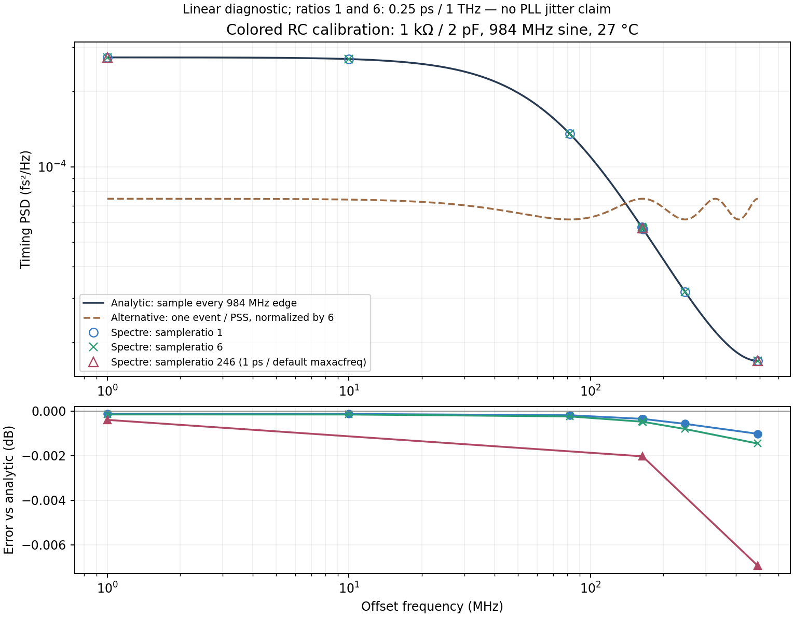

# 第41次噪声与抖动审阅

2026-10-04T11:11:27+08:00。噪声测量的有色RC一沿/六沿/246沿解析对照通过；RT4实际LC粗码24已包围目标，首个插值点仍需修正并延长滤波稳定。实际LC Gear2 PSS残差发散，已停止并完整回收，改为6us物理暖启动诊断。新输出链全带与逐模块噪声检查在运行，完整PLL随机RMS仍未知；功耗优化暂缓。

## 可复查的噪声测量控制

独立1kohm/2pF有色RC、27C、984MHz无噪声源，250fs/1THz/383边带的fresh PSS一沿与六沿八点对照完成。两者PSD最大差0.00043702dB，相对解析协方差谱最大误差0.00145431dB；周期、沿数、端点、斜率及器件PSD求和均通过。未发现该线性模型中的简单sampleratio归一化/混叠错误。不能推广到非等价MOS边沿，未从稀疏有色噪声点积分RMS。

解析式来自RC热噪声协方差R(τ)=kT/C·exp(−|τ|/RC)，按984MHz采样后求精确一边PSD，再除以输出正弦过零斜率平方。一沿与六沿保持同一物理R/C/源，独立求PSS。若sampleratio只缩放一次/周期采样的谱而未保留相关性，本对照会出现数dB差异；实际未观察到。详见[结果](results/noise_correlation_control_validation.json)、[协议](results/noise_correlation_control_protocol.json)。

已取消尚未启动的两例白RC六点等待器，没有重复派发。4MHz/ratio246/1ps/4095/default maxacfreq的有色RC三点对照也已完成并通过；相对解析PSD最大误差0.00693453dB，相对一沿最大差0.00591723dB，输出246沿及器件PSD求和通过。未从三点积分RMS，也未将线性结果推广到真实MOS。0.718079768V/3us RT4细调已接替短槽启动，不自动撤钳位。 [250ns对照协议](results/noise_correlation_long_protocol.json)、[已完成结果](results/noise_correlation_long_validation.json)。

新RT4全带10kHz–492MHz加25个谐波邻近点仍在PNoise；对应六输出沿及五组独立noise-on采用各自fresh PSS，尚未全部完成。旧63.275fs仅是旧分频器/外部零阻抗无噪声RF/TT27/984MHz/10fF的暂定局部值，不属于完整PLL。 真实MOS噪声验收仍要求工作点正确、各沿与各分支核对，以及谐波邻域连续噪声的积分处理；不能将连续1/f噪声当离散spur删除。

## RT4实际LC工作点

RT4/coarse24/TT27/1.2V/Q5/CF10/修复分频器/10fF：0.657998867V与0.75V实测3933.489792与3937.670016MHz，已包围目标。0.713245192V插值点实测RF3935.747062717MHz，偏差-252.937kHz；C1残余1.465507mV。分频/粗码/钳位/窗口检查有效，但100kHz及100uV交接工作筛选均未通过，未撤钳位。

C1名义时间常数0.716197us，预测残余1.462449mV，与实测相符；指数模型拟合残差RMS0.306uV。下一点0.718079768V来自更小实测区间，延长至3us，名义残余预测-51.09uV仅作计划依据。全部612个物理状态来自实际终态，仅改变外部强制控制电压；未改写C1、电感或存储位。 100kHz与100uV是交接前工作筛选，不是新增项目指标；预测51uV并非已测结果。见[匹配点](results/rt4_matched_point_validation.json)、[滤波物理松弛](results/rt4_filter_memory_validation.json)、[下一点协议](results/rt4_refined_point_protocol.json)。名义指数拟合的常数项约2.61uV，可能包含泄漏、模型和数值效应，未归因于随机噪声。

## 实际LC周期解：保留负结果

方法单变量Gear2实际LC PSS四次完整残差7.77M/611k/1.97M/4.81M，后两次连续增大，末次Newton最大电压修正1.6245V；已对所属进程SIGINT，未取得PSS或PNoise。迭代试探中的SOA告警不能视为实际稳态端口应力。该结果不证明周期解不存在。

停止后的完整初始化原始文件2,529,027,188字节已回收并与远端SHA一致；早前快照恰为其前缀，追加1140字节补齐末记录及END。最终两周期3.884023–4.134023–4.384023us的输出确定性平均提前0.867613ps、C1同相位增加0.739398mV；不是随机抖动。 文件SHA256：`d88a13b4f361c39b995fa2f617e86b8b658572f51f53954cdf73450b28a4e614`。本地完整原始路径见[回收审计](results/core_gear_complete_raw_audit.json)，[方法试验](results/core_gear_trial_audit.json)与[最终周期对比](results/core_gear_completed_period_drift.json)均可复核。

已释放原PSS槽并启动同电路、同真实初态、1ps/Gear2的6us暖启动，观察601个电压和11个电流状态。当前2.312/6us，结果未完成；先检查内部状态漂移，未自动启动下一次PSS。 修正尚未用于验收的全状态分析单位分类：64个带冒号的MOS内部节点是电压，不能据冒号当成电流。改用IC显式单位并与原始TRACE交叉校验；物理网表、初始状态及正在运行的仿真均未改动。 [暖启动协议](results/core_gear_settle_protocol.json)。2ns保存的周期差只能检查已采样状态漂移，不能证明全时间轨迹或未导出的MOS内部电荷周期性。

## 完整PLL与接续

严格1ps/reltol1e-5的64us完整复位PLL在2026-10-04T11:05:11.413176+08:00到59.788us，coarse23/DAC36/state5，qualified仍高。为中途观测，尚未完成严格精度的整段验收。

主`pll_capture_v14.scs`及设计身份未变。CF40此前暖启动通过，RT4/修复分频器/4.8fF/dummy仍处于候选验证。**完整PLL的10kHz–fOUT/2随机RMS<200fs尚未验证**；优先完成上述噪声和工作点检查，功耗只记录、暂不优化。所有REQ-*状态见[完整汇报](../../../reports/2026-10-04T1111.yaml)。

复现：`analyze_noise_correlation_control.py`、`analyze_rt4_matched_point.py`、`analyze_rt4_filter_memory.py`、`analyze_core_gear_trial.py`。运行中结果完成后用`analyze_noise_correlation_long_control.py`、`analyze_core_gear_settle.py`、`analyze_rt4_matched_point.py --protocol rt4_refined_point_protocol.json --output rt4_refined_point_validation.json`；新输出链使用`analyze_rt_pulsetrip_noise.py`和`analyze_rt2_fine_audit.py --factor 4 --bank pulsetrip`。
