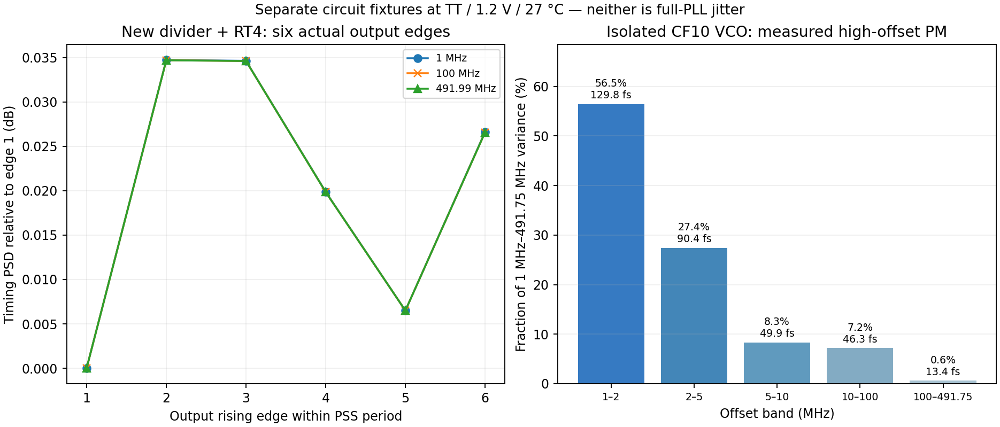

# 第42次噪声与抖动审阅

2026-10-04T11:55:20+08:00。新RT4六沿噪声三点一致性通过，独立fresh PSS复现；隔离VCO高偏移噪声主要集中于1–10MHz，闭环抑制应成为下一项重点测量。Gear2实际暖启动已完成并核对内部状态，继续周期解诊断。完整PLL随机RMS仍未知，功耗优化后置。

## 新电路的逐沿噪声结果

新分频器+RT4六沿fresh PSS/PNoise完成；TT27/1.2V/984MHz/10fF/无噪声零阻抗RF重放，0.5ps/767边带/maxac504GHz，1M/100M/491.99MHz三点沿间PSD最大差0.034727dB，通过0.2dB门限。八支路谐波及端点通过；第一沿与此前独立fresh PSS六点试验的对应点最大差7.75e-11dB。仍不是全带或完整PLL结果。

三点沿间电压噪声PSD最大差仅0.000507dB，而斜率换算带来0.034441dB差异；斜率约30.984–31.107GV/s。因此本例约0.035dB的沿间时序PSD差主要来自小幅斜率差，不是某一沿噪声异常放大；不外推至未测频率/PVT。 [六沿与noise-on审计](results/rt4_pulsetrip_audit_validation.json)、[斜率分解](results/rt4_edge_spread_validation.json)。原始封装结果保留了“convergence failure”标签，但Spectre返回0、日志明确PSS达成且0errors，六沿有限PSD及器件求和通过；没有删除原标签或修改源清单。DC中的pivoting notice与最终PSS是否收敛分别审阅。

## VCO噪声的实际频段与器件分布

重新处理已有独立CF10 VCO的95点器件PM谱：TT27/1.2V/Q5、粗码23/控制0.679V、原固定M4负载/10fF、参考DC0使采样器持续跟踪，仅XV噪声。按实际RF3933.961951MHz，1MHz–实际输出半频491.745244MHz分段等效时间噪声172.691fs；2M以上113.959fs、5M以上69.350fs、10M以上48.175fs。1–10MHz占该高偏移带方差92.218%。不是闭环PLL预测或不可避免的噪声下限，未积分10kHz附近自由振荡器谱。

该独立VCO高偏移带的方差中，交叉耦合核36.249%、尾管/偏置34.370%、暂定电感RLC24.430%、开关电容4.951%；器件求和闭合。线性PSD积分与幂律分段积分的RMS差约0.34–0.42%，仅为积分方法敏感性检查，不能替代全网格Spectre精度收敛。下一步需测实际闭环在1–10MHz的抑制/峰化，而不只继续压数字链噪声。

使用原始PM噪声文件和独立载波幅度核对，按S_t=2L_SSB/(2πf_RF)²换算。本结果只给出1MHz以上的隔离VCO等效时间噪声，最低偏移约为工具估计自由振荡线宽的37.8倍；没有把靠近载波的失效线性谱积分为总jitter。也没有将CF40的六个稀疏点积分。真实PLL的采样、实际RT4/分频负载、CP/参考/控制噪声及相关耦合均不在此隔离测量中。[分段积分与源SHA](results/vco_high_offset_validation.json)。

## Gear2物理稳态与后续周期解

实际LC/CF10/原RT/修复分频器/粗码23/M4/TT27/1.2V/Q5/10fF的6us、1ps Gear2暖启动完成。末窗输出983.999997281MHz，相位峰峰0.0003715091rad、漂移1.964936e-05rad/us；原功能稳态筛选通过。全部601电压/11电流已观察，末两个250ns的2ns采样电压差最大0.316786mV，节点XP.XDAC.b0，1mV采样筛选通过。不能等同于有效PSS或随机噪声。

已从该真实终态保留全部612项物理状态，启动750ns Gear2密集周期检查：前250ns允许文本恢复演进，比较后两个250ns；保留高漂移节点和全部支路电流，并另比全部终态。物理电路、步长、容差不变，没有手改C1/电感/存储位，也未自动重试PSS。

见[完整暖启动结果](results/core_gear_settle_validation.json)。前三个窗口未通过原稳态筛选，第4–6窗口通过；第一窗口还包含观察器初始计数为零的额外伪迹，该计数伪迹不能解释为真实RF掉频。保留所有失败项，未放宽末窗门限。1mV等是周期解诊断的工作筛选，不是用户的新指标；已有失败PSS及原始数据继续保留。

## 进行中的整机工作

新RT4五组独立noise-on目前已完成并纳入审计1/5组，全带10kHz–492MHz及25个谐波邻域点仍在运行。旧局部63.275fs不替代新电路或完整PLL。RT4粗码24的0.718079768V/3us细调仍在运行，未撤钳位。

严格64us完整PLL在2026-10-04T11:54:11.585337+08:00已至62.058us，coarse23/DAC36/state5，qualified高；未完成整段验收。

**完整PLL在10kHz–fOUT/2的随机RMS<200fs仍未验收。** 功耗只记录、不优化；主电路保持未采用候选。全部REQ-*见[完整汇报](../../../reports/2026-10-04T1155.yaml)。

复现：`analyze_rt2_fine_audit.py --factor 4 --bank pulsetrip`、`analyze_rt4_edge_spread.py`、`analyze_vco_high_offset.py`、`analyze_core_gear_settle.py`。后续密集检查入口`build_core_gear_dense_check.py`会先核对真实已完成暖启动并要求原工作筛选通过，`analyze_core_gear_dense_check.py`只分析已完成结果；二者都不自动启动PSS。
