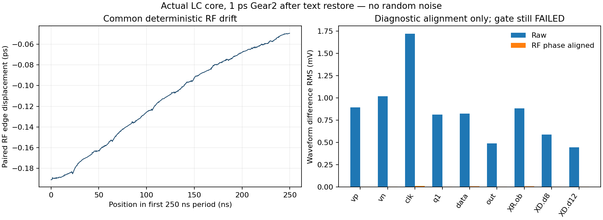

# 第43次噪声与抖动审阅

2026-10-04T12:45:00+08:00。密集周期检查未通过：高速节点差异主要随RF共同相位漂移，恢复采样时点本身不能消除。RT4滤波状态已对齐，保留调频筛选失败记录后启动实际撤钳位捕获。输出缓冲独立noise-on也通过，整机随机RMS仍未验收。 严格64us完整PLL捕获已回收并作独立精度比较。

## 完成的密集周期检查

实际LC/原RT/CF10/新分频器/粗码23/M4/TT27/1.2V/Q5/10fF的750ns、1ps Gear2密集检查完成；11支路计数和10ppm载频诊断通过，RF拟合3936.001873094MHz。但相邻250ns电压差最大9.458241mV（XR.ob），全部612状态中源终态至750ns终态的最大电压差3.200722mV（data），两项1mV筛选均失败；没有启动新的PSS。

RF相邻周期共同边沿位移均值−0.113967ps、最大绝对值0.191057ps，前后四分之一窗口均值从−0.174357ps变为−0.061138ps。按实际RF边沿作诊断性时间对齐后，out波形差异RMS从0.490599mV降到0.003262mV（降低99.335%），XR.ob从0.883710mV降到0.009923mV。说明快速节点差异主要跟随共同RF漂移；没有将对齐后波形用于通过周期门限，也没有把它当随机抖动。

实际RF拟合频差仅约+1.873kHz，同时存在约−9.53kHz/us的残余频率漂移。频率很接近目标不代表可直接用于周期噪声分析。全部原始失败项继续保留：[密集检查](results/core_gear_dense_validation.json)、[相位对齐诊断](results/core_drift_alignment_validation.json)。相位对齐只用于解释波形差异，不用于修改实际电路状态、噪声谱或验收结果。

## 观察器与积分步点对照

密集重启相对6us源仿真还移除了事件观察器和2ns强制采样点。已用同一612项初值、同一物理电路和精度启动三组串行对照：仅恢复采样点、仅恢复观察器、两者都恢复。仅恢复采样点已完成，RF3936.001770109MHz，最大密集电压差9.737522mV，仍未通过；其余结果以协议分析文件为准。仅恢复观察器也已完成：最大电压差0.601107mV，全部状态源至终态最大电压差0.926378mV，各原工作筛选均通过。out共同位移均值约−0.003196ps、最大绝对值0.009828ps；这些仍是确定性量，不是随机噪声。

本机对应版本Spectre官方`tran`帮助明确说明，strobe点会强制求解步点；`lc_loop_observer.va`的RF/输出过零事件还使用1fs事件时间容差。观察器电气输入无负载，但这不等于对有限步长数值积分没有影响。当前仅是候选解释，尚未证明哪个因素主导。三组对照均保留同一612项真实初值、物理电路、750ns时长、1ps Gear2和原容差；对照也不能独自证明文本恢复误差。[协议](results/core_mesh_protocol.json)、[结果](results/core_mesh_validation.json)。

已复用严格64us释放的槽位，启动3us不带观察器、不强制采样时点的实际核心稳定仿真，全部612初值来自已完成的不带观察器终态。skipcount仅减少保存点，不强制积分时点；请求原生检查点供后续500ns连续密集检查。尚未启动PSS。 先前失败PSS记录保持不变。不能把带事件观察器的通过结果直接用于不带观察器的PSS；下一步必须核对后者自己的状态。

## RT4实际撤钳位试验

原生续跑入口已支持将 `skipcount` 改为 0 以保留全部计算点，并为每个 run 使用独立的 `savefile`，避免覆盖前一检查点。已完成 Python 语法检查；这条新续跑路径仍须待实际检查点产生后验证，未作为已完成结果。

RT4粗码24、控制0.718079768V的3us/1ps/trap细调完成。RF3935.878872249MHz，误差-121.128kHz，100kHz诊断筛选仍失败；C1−ctrl=-67.140uV，通过100uV对齐筛选。

明确保留上述频率失败记录后，启动3us的RT4实际撤钳位捕获试验：全部612物理状态直接取自真实终态，仅去除外部控制电压钳位，不修正C1、电感或存储位；保持1ps/trap及原精度，保存末1us密集波形并请求最终原生检查点。该试验用于判断闭环能否从约31ppm频差捕获，不作为已通过调频交接，不放宽项目指标，也未采用进主DUT。

这是对研究次序的显式调整：继续以开环频率拟合追逐某一瞬时点，不能替代采样相位和环路捕获的实际验证。原100kHz筛选的失败结果和100uV对齐结果分别保留，不将31ppm称为项目频率验收，也不预先认定PLL会捕获。[细调实测](results/rt4_refined_point_validation.json)、[释放协议](results/rt4_release_protocol.json)。最终原生状态是否成功保存、内容及hash仍需待本次仿真结束后核验。

## 随机噪声与完整PLL进度

新分频器RT4逐模块noise-on已完成3/5组；触发器和输出缓冲在1M/100M/491.99MHz三点与全开启噪声中的对应贡献分别吻合至7.77e−16和5.55e−16相对差，排除组贡献均为0。RX组也已完成；分频器/辅助组及全带积分仍待完成。六沿三点一致性证据保留。 实际已完成组：ff, buffers, rx；是否通过逐项见审计文件。

原完整PLL的64us/1ps严格独立复位捕获已完成并回收，Spectre0errors；TT27/1.2V/K41/M4/10fF/24MHz/Q5、无人工近锁初值，功能筛选通过。移交53.585650us，首次qualified=56.502408us，末窗输出984.000104180MHz，最终coarse23/DAC36。与独立4ps试验物理和激励完全相同，仅求解精度不同；4ps最终DAC为38，控制采样中值差-34.579732mV，尚不能因此接受工作点/噪声数值收敛，也不覆盖33点/PVT或电源爬升。

完整PLL的随机RMS仍未知。此前63.275fs是旧分频器独立数字链的临时积分；172.691fs是隔离VCO在1MHz以上的部分频带结果，不能相加宣称整机性能。功耗只记录、不优化；全部REQ-*及模块状态见[第43次完整汇报](../../../reports/2026-10-04T1245.yaml)。

复现：`analyze_core_gear_dense_check.py`、`analyze_core_drift_alignment.py`、`analyze_core_mesh_controls.py`、`analyze_rt4_matched_point.py --protocol rt4_refined_point_protocol.json --output rt4_refined_point_validation.json`、`analyze_rt2_fine_audit.py --factor 4 --bank pulsetrip`。释放仿真完成后再运行`analyze_rt4_release_probe.py`。
