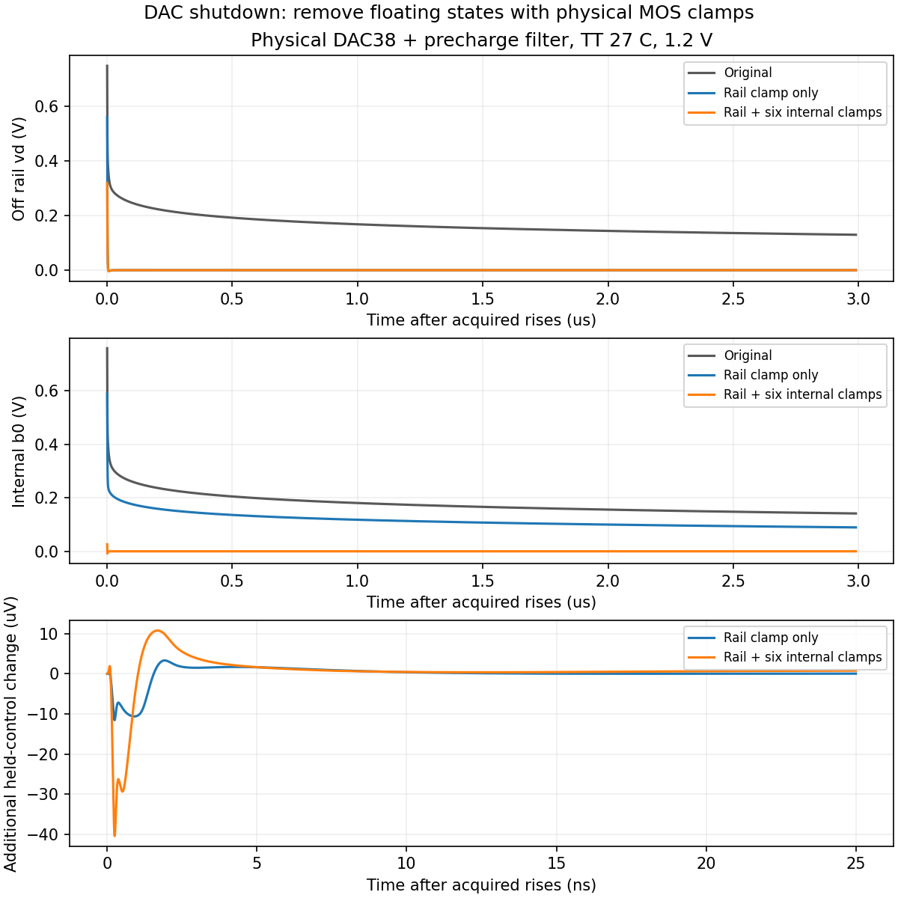

# 第46次噪声与抖动审阅

2026-10-04T14:35:15+08:00。定位并改善FLL DAC关断后的悬浮状态：七只实际MOS放电管在三配对角单位测试通过，已回代实际闭环核心重新求解PSS。上一核心PSS明确失败、噪声被跳过；完整PLL随机RMS仍未验收。

DAC38、1.2V、TT27/SS60/FF0，实际7.162pF+.477pF环路滤波器与20u/40u预置传输门；acquired于1us上升、4us下降，100ps边沿，5us/10ps/Gear2。只加电源放电管时，低输入反相器的b节点仍保持约0.17V量级；再加六只内部放电管后，关断100ns以后电源节点最大0.583129uV，六内部节点最大0.067685uV。活动DAC输出在本次精度下无有意义变化，对保持控制电压的新增最大扰动41.348123uV<原1mV工作门限，三配对角全部通过。 原基线关断切换本身仍有约35.6–41.2mV瞬态变化，约40uV是新增差值，不是总尖峰；未证明所有64码、真实FLL交接、噪声或全PVT。

| 配对角 | 关断电源最大(uV) | 六内部节点最大(uV) | 新增保持扰动(uV) |
|---|---:|---:|---:|
| TT/27C | 0.311076 | 0.020569 | 40.379781 |
| SS/60C | 0.583129 | 0.029607 | 41.348123 |
| FF/0C | 0.206515 | 0.067685 | 40.319604 |

corenativenoise01已终止并完整回收，Spectre报告2errors；六轮残差为3.73e+06, 499000, 2.22e+06, 5.5e+06, 7.26e+06, 7.62e+06。没有有效周期解，PN因PSS失败被跳过。Newton试探中的数伏及安培量级异常不是已接受的电路工作波形，也不作功耗或器件应力结论。全部失败输入、初始化数据和日志保留。

已启动coredacnoise01/core_dac_discharge_noise_tt，替换为上述七管关断放电DAC，保留实际LC、原RT、CF10、新分频器、coarse23/DAC38/M4、TT27/1.2V/Q5/10fF/refload1.9pF和静态慢控制。精确612初态仍来自原生3.5us终点，不手改电压/电流；PSS自己的稳定段延长250ns→2us，maxperiods6→10，同一1ps Gear2及容差，末500ns密集保存并请求PSS阶段原生检查点。该试验同时改变电路和稳定时间，成功也不能单独归因于某一项。原主DUT和运行中的完整RT4候选均未采用此DAC。

RT4主对数频率扫描已独立完成、回收并核验，暂定网格积分63.257767fs；25点谐波邻域和连续1/f积分资格仍未关闭，不能作最终局部链或整机RMS验收。完整RT4候选复位、CF40更细PN和新的闭环核心PSS继续。

新增已完成子分析回收工具：须有该PN完成日志、PSF END标记及传输前后输入/原始文件hash一致，才保存快照；在已完成三点实测文件上验证通过，未伪造整任务完成。原生检查点回收增加显式时间选择，并用已完成3us真实检查点复核SHA一致，避免64us完整候选的五个检查点被误选。

[七管候选结果](results/dac_discharge_all_validation.json)、[单管结果](results/dac_discharge_validation.json)、[失败PSS证据](results/core_native_noise_validation.json)、[新核心协议](results/core_dac_discharge_noise_protocol.json)。原始数据与hash均保存在项目。全部12项需求和14模块见[完整汇报](../../../reports/2026-10-04T1435.yaml)。

本轮未修改根目录与kickstart初始约定，未修改原主DUT或正在运行的完整RT4候选；功耗仅记录。新增检查点选择已在真实3us文件上验证，已完成噪声子分析回收已在真实三点文件上验证；实时主频带完成前不会创建其完成快照。
