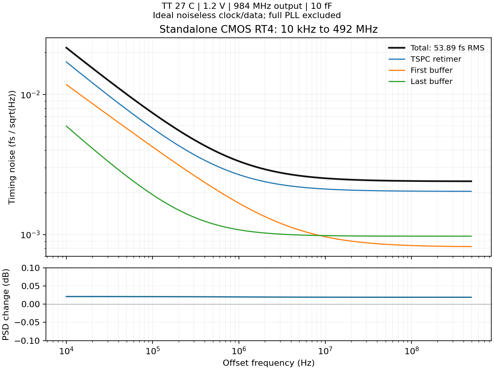

# 第48次噪声与抖动审阅

2026-10-04T16:08:17+08:00。独立CMOS重定时/输出模块在TT/SS/FF配对角得到53.9/87.4/38.8fs；TT精度对照通过。重点转向VCO和实际闭环噪声，整个PLL的<200fs尚未验证。

实际RT4 TSPC重定时器和两级输出缓冲的独立95点PSS/PNoise完成，10kHz–492MHz：TT27为53.892880fs、SS60为87.406257fs、FF0为38.838222fs。均1.2V、984MHz输出、10fF，使用理想无噪声3.936GHz时钟和984MHz数据、10ps边沿。三个配对角的波形/沿数/器件贡献和通过，不含接收器、分频器、LC或闭环交互。

| 条件 | RMS，10kHz–492MHz |
|---|---:|
| TT，27°C | 53.89 fs |
| SS，60°C | 87.41 fs |
| FF，0°C | 38.84 fs |

TT步长.5ps→.25ps，谐波/有色边带128→256，maxacfreq504→1008GHz；最大PSD差0.020869dB、积分变化0.217793%，通过原.1dB/1%门限。SS/FF尚未独立做第二档精度，也不等于九个工艺温度组合或电压/负载/频率全覆盖。

TT方差贡献：TSPC重定时器71.559%、一级缓冲12.226%、末级缓冲16.214%；相应独立贡献RMS为45.589/18.844/21.701fs，按方差相加。该模块已有低于100fs的器件仿真证据，当前优先继续VCO和整体闭环噪声。

同一MOS缓冲器及同一实际RT4分别按单周期与六周期重新求解，十个偏移点包含164/328MHz两侧1Hz和492MHz下方1Hz。最大PSD差分别0.000145/0.000125dB，波形和斜率通过。重复相同边沿的sample-ratio处理得到MOS校准；不解决不同边沿周期、readpss复用或实际分频链谐波窄峰问题。首次普通Spectre模式因fullspectrum要求APS而失败，已保留并用AX模式重跑。

加DAC放电的AX核心在五轮范数3.69M/495k/2.53M/6.62M/6.55M后主动SIGINT并回收。没有有效PSS/PN；wrapper的crashed分类来自停止后的结果，不能宣称自发软件崩溃。已启动相同冻结电路、612项文本初值和网表精度参数的APS六线程对照；唯一命令差为+aps替代+preset=ax及其override选项，实际日志的1ps/Gear2/容差一致。尚未产生闭环噪声证据。

完整数字链25点有限谐波邻域完成并校验同一fresh PSS。所测五侧1Hz–10kHz邻域的合计RMS为0.630653fs；不能直接加到63.257767fs主网格值中，因为区间重叠。中心±1Hz仍未测，未当作零或离散杂散删除；仍不宣称合格的完整积分。 将已测网格按不重叠区间合并后约63.257804fs。仅对未测中心采用显式B+A/δ^α拟合外推，积分下限假设由1Hz扫至1nHz时，总RMS最大变化2.52e-06fs；该条件敏感性不支持把中心作为主要优化对象，但不是物理低频截止的验证或新的实测值。

VCO MT560候选已完成自身PSS、全95点频谱继续；已测同频率六点的1MHz收益约0.78dB保留。完整RT4+新分频器64us独立复位仍运行，已写8us检查点，未完成捕获。

证据：[全频带与精度](results/retimer_standalone_band_validation.json)、[配对角](results/retimer_standalone_pvt_validation.json)、[MOS校准](results/mos_period_noise_validation.json)、[重定时器校准](results/retimer_period_noise_validation.json)、[核心APS协议](results/core_dac_aps_noise_protocol.json)。全部12项需求和14个模块见[完整汇报](../../../reports/2026-10-04T1608.yaml)。功耗和后端优化继续后置，原指标不变。
