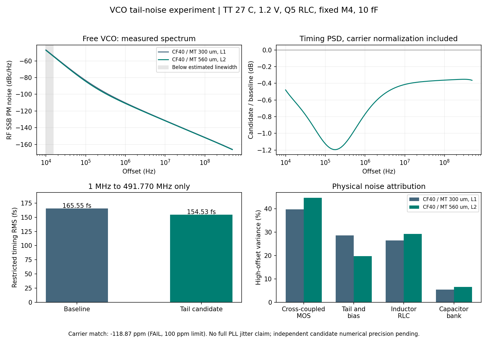

# 第49次噪声与抖动审阅

2026-10-04T16:50:24+08:00。VCO尾管候选的高偏移RMS由165.6fs降至154.5fs，但载频/精度限制仍需处理；当前采样前端已找到待细化的负反馈工作区。整机<200fs仍未知。

MT560/CF40 VCO的95点fresh PSS/PNoise已完成，TT27/1.2V/Q5 RLC/固定M4/10fF、静态参考且仅VCO噪声。按共同1MHz–491.770339MHz积分，CF40基线为165.550792fs，MT560候选为154.529644fs，变化-6.657%。这不是10kHz起的闭环PLL抖动。

同一高偏移频带内，尾管总噪声分项RMS由85.726fs降至65.360fs，其中模型fn闪烁项由52.590fs降至26.243fs。候选方差中交叉耦合管约44.69%、电感RLC约29.15%、尾管/偏置约19.68%。器件贡献以方差相加；未将模块结果拼成整机达标值。

两者均.25ps/511边带；载频差-118.875ppm，100ppm匹配检查未通过。供电电流变化0.791%，RF载波振幅变化3.467%。改善包含工作点变化，不能归结为纯尺寸效应。另行启动两者.125ps/1023边带的六点精度检查；尚未据此接受完整频带精度。

当前实际MOS参考缓冲、采样器、CP电阻偏置、脉冲发生器、中点偏置及有效性检测器完成四个RF相位点，周期/164个RF沿/参考和脉冲检查全部通过。3.936GHz RF使用已测波形的无噪声零阻抗重放，控制端钳在0.668428926V，参考端另有1.9pF控制负载近似。发现唯一负斜率电流过零区间，线性预测相位219.119561°，随后做局部实测；四点不构成局部鉴相增益或噪声积分。

| RF相位 | 平均控制钳位电流 |
|---|---:|
| 0° | -91.899 nA |
| 90° | +268.816 nA |
| 180° | +137.612 nA |
| 270° | -178.984 nA |

已准备带实测工作点门限的局部增益和三频偏噪声分析入口：平均电流平衡、负反馈斜率、两侧增益一致性和有效性输出须先通过，再进入fresh PSS/PNoise。可分别开启参考缓冲、采样器、CP、脉冲器、偏置及有效性检测噪声，核对独立PSD与全噪声贡献。尚未运行的分支不计为验证完成。

实际闭环APS对照已完成初始2us稳定段并开始250ns周期求解；尚未获得可验收的闭环噪声。完整RT4+新分频器PLL独立复位已写16us检查点，64us尚未完成。新日志确认虽然两者tstab设置相同，APS进入PSS后为steadyratio=.01/conservative/alllocal，AX为.001/moderate/sigglobal。因此首个归一化范数369k与3.69M不能直接比较；对应供电支路物理残差仍都约5.681mA。该试验是求解器及实际默认值的联合对照。

全部12项需求和14个模块见[完整汇报](../../../reports/2026-10-04T1650.yaml)。原主DUT未替换，功耗和后端优化继续后置。
