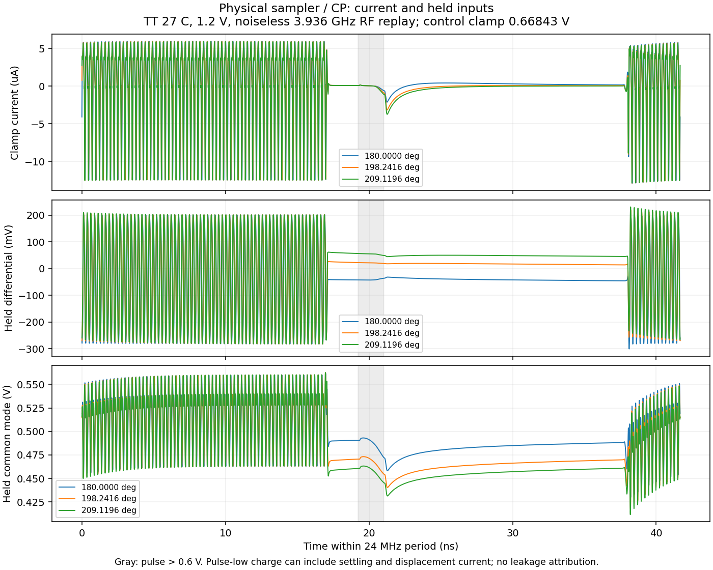

# 第50次噪声与抖动审阅

2026-10-04T17:19:30+08:00。VCO基线六点精度检查通过，独立noise-on已开始验证器件归因；前端重新定位实测平衡点并发现需检查的脉冲外电荷。整机<200fs仍未验证。

前端实测否定了先前219.12°附近的局部区间：209.11956°的平均钳位电流已为−82.06173nA，故停止219°后续测试并保留取消记录；229°未启动。随后逐点重建过零区间。最新实测邻点为196.840750804°、-0.722019nA，实测正负电流夹区为180.000000000°–196.840750804°。预测点只用于下一次fresh PSS，未作为实测零点。

此平台包含实际参考缓冲、采样器、CP、脉冲器、偏置和有效性检测；TT27/1.2V，外部无噪声3.936GHz RF重放、24MHz参考、0.6684289256V控制钳位和1.9pF参考负载近似。尚未获得局部平衡鉴相增益或前端器件噪声结果。

电荷分段发现：180°时整周期净电荷+5.7338fC，而名义脉冲内为−0.04137fC；脉冲外+5.7752fC。后者包含镜像建立和寄生位移电流，不能直接称为漏电。已准备内部节点及MOS漏端电流观测和KCL核对，尚未用未运行分支宣称诊断完成。

VCO候选按尾管/偏置、交叉耦合管、电感RLC、电容阵列分四组独立noise-on；保持同一电路工作点，每组重新求PSS。 已完成tail_bias：1/10/100MHz频偏与全噪声中该组贡献最大差1.65911e-05dB、载频差-0.0242958ppm，检查通过。 尚未完成四组时不作独立求和闭合结论，三个点不积分RMS。

CF40基线.25ps/511边带→.125ps/1023边带的六点精度检查：载频变化43.721ppm，最大噪声变化0.037703dB，通过100ppm/.1dB门限。此前.5ps→.25ps载频102.030ppm失败仍保留；本次只通过六点，不等于完整积分精度通过。尾管候选同精度复核以已回收结果为准。

实际闭环APS仍未得到有效PSS/PNoise；四次归一化残差369k、76.7k、407k、996k，最近最大节点残差1.77145V。求解期间的异常试探电压不当作物理工作波形。完整RT4+新分频器64us独立复位仍在运行，已写16us检查点；未宣称捕获或噪声完成。

全部12项需求和14个模块见[完整汇报](../../../reports/2026-10-04T1719.yaml)。原主DUT不变；本轮未作电路替换，功耗和后端优化后置。
