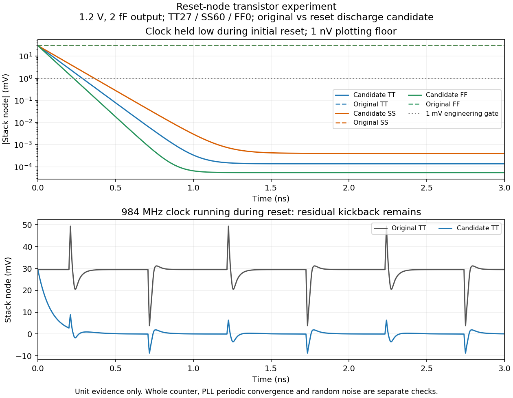

# 第51次噪声与抖动审阅

2026-10-04T18:08:30+08:00。VCO四组独立噪声归因全部通过，前端实测平衡点与局部鉴相增益通过；正在取得前端噪声和VCO同载频对照。整机<200fs仍未验证，功耗优化后置。

前端实际平衡相位196.747002810°，平均控制钳位电流+6.644318pA。两侧±0.5°的三次fresh PSS得到Kphi=0.445693866µA/rad，两半斜率相差0.956789%，平衡和局部增益检查通过。以实测中心启动全噪声三点PNoise；截至快照PSS已通过，噪声尚未回收，不能由局部增益推断抖动。

前端条件为TT27/1.2V、24MHz参考、无噪声零阻抗3.936GHz RF重放、控制钳位0.6684289256V、参考负载近似1.9pF。包含实际参考缓冲、采样器、CP、脉冲器、偏置及有效性检测，不含真实LC阻抗/噪声与完整控制；静态Kphi只适用于低频等效估计。

VCO尾管/偏置、交叉耦合管、电感RLC、电容阵列四组独立noise-on全部完成；每组重新求解PSS。在1/10/100MHz频偏，与全开器件归因的总和相对误差最大1.013988ppm，四组贡献核查通过。条件为TT27/1.2V、Q5 RLC、CF40、MT560µm/2µm、码21、控制0.7411690578V、静态参考、固定M4/10fF。三点不积分RMS。

.25ps/511边带到.125ps/1023边带的六点检查均通过：基线载频变化43.721ppm，最大PSD差0.037703dB；MT560候选为8.605ppm、0.005464dB。候选与基线在这档精度的载频差仍为−153.984ppm，未通过100ppm门限。新控制电压0.7530325672V的同精度实测匹配正在运行；未改变旧失败结果或接受全网格精度。

另一次仅将交叉耦合对W120→80µm的实际器件试验完成。载频变化+6.921992%，载波幅度变化+3.413739%，电源电流变化-0.104507%。1/10/100MHz的总定时PSD分别变化+0.074050/+0.065802/+0.055431dB，未显示噪声收益；因载频不匹配，也不能作为严格同载频优劣结论。目前不采用。

新的复位DFF调换NAND NMOS串联门顺序，并对中间节点增加0.4µm/1µm复位放电管。TT27/SS60/FF0、1.2V、984MHz、2fF下，三个配对角的逻辑检查通过。静止时钟复位期间，原约29.5mV残留降至最坏2.968679µV。运行时钟试验仍有7.53–9.46mV耦合尖峰，未通过1mV内部节点峰值门限；该失败保留，不以静止条件覆盖。完整14位原/候选计数器正在做每个进位边界、回卷和复位共30个检查，三配对角尚未完成。独立核心生成器要求这批功能结果全部通过后才生成电路，当前未生成或启动新核心。

APS闭环核心也未得到有效PSS/PN，五次已观察到的未收敛迭代后主动SIGINT；回收日志共六轮，范数为369000、76700、407000、996000、1.02e+06、1.05e+06。首次流式回收失败已保留，恢复的1,580,855,832字节初始化波形与日志已独立核对远端SHA-256。恢复文件不等于仿真成功。复位节点与PSS失败的因果关系仍待独立核心验证。

完整RT4+新分频器64µs独立复位继续运行；截至快照已有16µs检查点，最终捕获结果尚未得到。原主DUT及其已确认TT结果保留；本轮没有将实验候选替入主设计。

全部12项需求、14个模块及六个层次见[完整汇报](../../../reports/2026-10-04T1808.yaml)。
