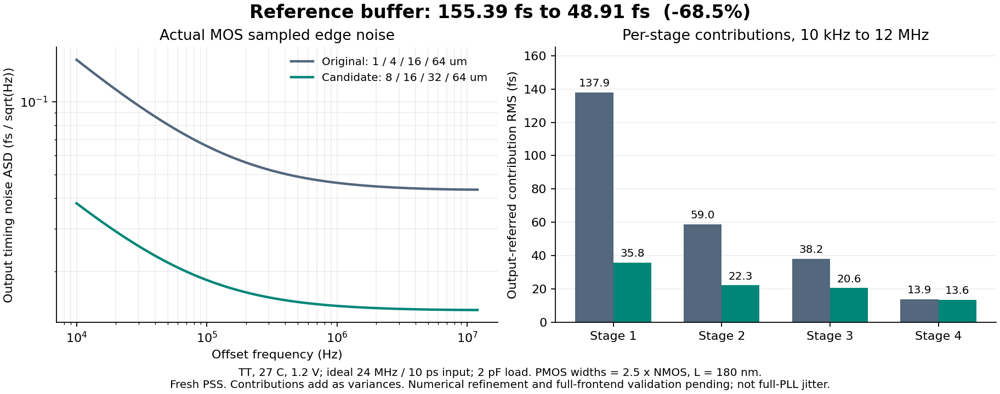

# 第55次噪声与抖动审阅

2026-10-04T20:11:36+08:00。VCO匹配候选的初步高频段积分由165.55fs降至154.58fs，载频匹配通过，精度复核继续。参考输入负载与核心复位节点诊断已完成；完整PLL抖动仍未验收。

参考缓冲实际PSS输入源电流积分：等效充电电容Q/ΔV由6.14654fF增至49.06297fF。这是1.2V全摆幅、2pF输出负载下包含Miller效应的动态电荷负载，不是小信号Cgg。500ps到1ns积分窗口扩展的最大电荷变化约0.0153%，计算窗口已作核对。

澄清仿真条件：历史“10ps参考”指Spectre pulse的rise/fall参数；从输入波形量得10%–90%上升/下降时间均为8ps。尚未规定真实参考输入边沿或源阻抗，已异步询问；未将示例扫描范围改为规格。

实际LC核心初始化片段已回收，覆盖3.50–5.067103µs；3.601370µs后1081个采样点中，28个复位内部栈节点最大绝对值为3.599363µV。此时尚未开始shooting迭代。原始未完成文件逐字节保存，完整记录前缀两次hash一致；另存加END的解析视图。采样间隔最大1.600ns，所以不能作为高速峰值、周期误差、RF频谱或功耗证据；结果支持复位清除在核心中起效，尚不证明PSS收敛。

低噪声参考缓冲已代入独立前端测试台，其余采样器、CP、脉冲、偏置及检测电路均保持原样。根据独立实测延迟缩短125.169ps，先以14.106647°为未验证中心、±15°生成三个相位点；输入及依赖逐项核对通过，实际前端PSS尚未启动。

有界接续流程80515已运行：等待现有参考精度结果全部通过，再测前端平衡与增益；最多三轮相位扫描，只有实际平衡点通过门限才启动一组全开器件噪声。当前仍在等精度结果；失败停查，无主DUT自动替换。

VCO匹配候选的0.25ps密集谱已回收：同精度载频相差34.338746ppm，100ppm门限通过；1MHz–491.828805MHz积分由165.55081fs变为154.57801fs。条件为TT27/1.2V/Q5 RLC/CF40、静态参考、固定M4/10fF、只开启VCO噪声；尾管、粗调和控制电压不同。两方案0.125ps全谱精度尚未完成，不能视为已收敛结果或10kHz整机抖动。

完整PLL仍无有效闭环PSS及10kHz–fOUT/2随机RMS验收。原主DUT未替换，33频点、全PVT、杂散和恢复等缺口仍在；功耗和后端面积优化后置，规格不变。

完整12项需求、14个模块与六个层次见[状态快照](../../../reports/2026-10-04T2011.yaml)。
