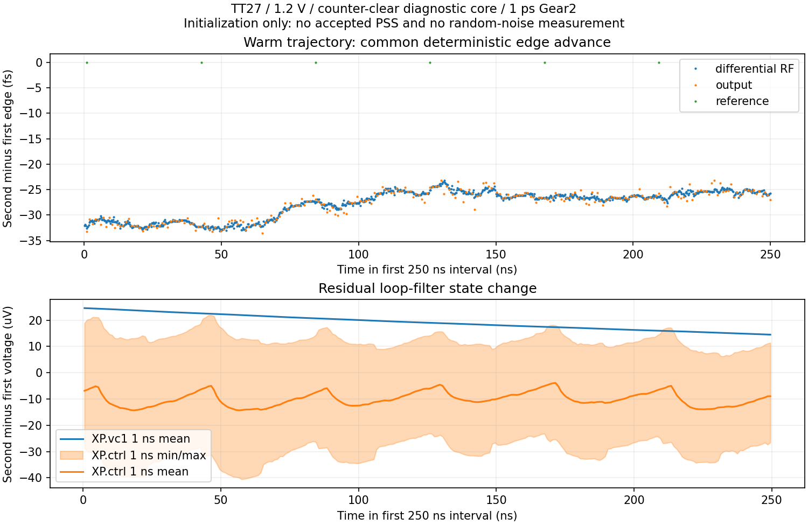

# 第56次噪声与抖动审阅

2026-10-04T20:30:28+08:00。参考路径独立noise-on与全开器件归因一致，CP验证已接续。密集核心波形确认复位节点清除有效，但共同边沿和滤波器漂移仍在；完整PLL抖动仍未验收。

参考路径单独noise-on完成并通过核对：10kHz/1MHz/10MHz电流ASD为1.644093/0.510781/0.400717pA/√Hz，与全开噪声中参考器件贡献的最大PSD差异小于1.5e-15dB，其余模块实际噪声为零。fresh PSS独立求解，参考/RF/脉冲边沿数量为1/164/1，端点差为零，平衡钳位平均电流6.644pA。条件仍为TT27/1.2V/24MHz参考、实际8ps的10–90%边沿、3.936GHz无噪声RF重放及控制钳位；不是整机抖动。

回收并校验2,277,933,056字节的核心初始化原始波形，末尾不完整记录已排除。密集区间5.25–5.7499992024µs，实际最大保存步长约1ps。候选全部28个计数器复位栈节点的原始样本最大绝对值为3.641548µV；共同观察的6个节点从前序候选的29.793416mV降到3.641211µV。已核对同一文本初值、相同其余物理依赖、1ps Gear2和2µs初始化；此比较只改变XCOUNT的复位清除电路。

相邻约250ns区间的差分RF/恢复时钟/输出上升沿数量分别为984/984/246，参考为6；两个区间数量一致。平均边沿提前分别为27.813/27.794/27.833fs，参考边沿保持相同相位。滤波器vc1平均值继续上升19.221µV，ctrl平均值下降10.014µV；VDD支路电流的逐点周期差异RMS为2.112µA，峰值25.856µA。这支持共同轨迹漂移仍存在，不能解读为数字模块附加随机抖动。

核心shooting首次仍出现3.68e6归一化修正范数及−5.68032mA的VDD支路修正，下一次迭代运行中。初始化轨迹差异与Newton修正不是同一测量；保存波形不能覆盖隐藏的器件电荷状态。复位节点清除已实测起效，但尚不能据此证明PSS问题修复或判定后续失败；当前没有可用于整机噪声的已接受周期解。

原六组noise-on流程在参考完成后，被旧脚本将参考精度复核误分类为长任务而保守停止。原记录保留，未重跑已完成参考组；修正分类的接续流程54689已启动CP，后续依次采样器、偏置、检测和脉冲。每组重新求PSS并检查0.1dB归因一致性，全部通过后检查求和误差1e-3；资源仍限18线程、4长+1短。

VCO基线0.125ps精度PSS已在32次迭代后接受，开始密集pnoise；候选同精度尚待后续。参考缓冲0.5ps精度复核和完整RT4/新分频器冷启动继续运行。参考精度通过后，已有有界流程才会推进实际前端平衡与噪声回代。

完整PLL的10kHz–fOUT/2、排除离散杂散的<200fs验收仍未知。主DUT未替换；33频点、完整PVT、杂散及异常恢复等缺口保留。功耗和后端面积优化后置，指标不变。

完整12项需求、14个模块与六个层次见[状态快照](../../../reports/2026-10-04T2030.yaml)。
