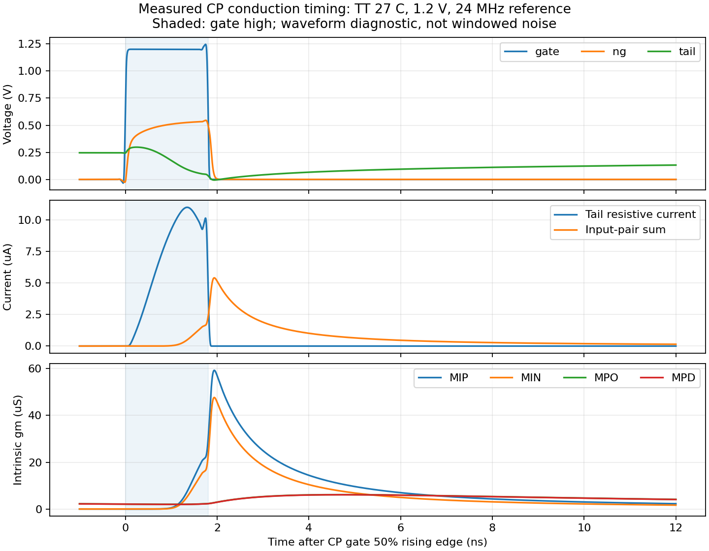

# 第58次噪声与抖动审阅

2026-10-04T21:24:01+08:00。参考缓冲有限驱动功能/数值检查通过；CP实测导通明显晚于使能窗，栅极端口核对失败，先用独立支路探针诊断。整环抖动仍未知。

参考缓冲边带数控制完成：保持0.5ps、相同物理电路与fresh PSS，31边带为152.164501fs，相对2047边带155.054279fs低估1.863720%，最大PSD差0.174679dB，不通过；127边带154.431463fs，低估0.401676%、最大PSD差0.037332dB，通过既定1%/0.1dB门限。五个保存节点波形完全相同，沟道噪声数值相同，差额来自折叠闪烁噪声截断。适用范围仅TT27/1.2V/24MHz/实际8ps输入边沿/2pF参考原尺寸夹具，10kHz–12MHz；不能自动外推加宽候选、前端、VCO或整机。

有限输入驱动的18支路瞬态全部通过：原尺寸/加宽缓冲×源10–90%边沿10/100/1000ps×源阻抗0/50/500Ω，TT27/1.2V/24MHz/2pF负载，测量最后三个周期。2ps→1ps加密的最大延迟变化0.017850ps、边沿变化0.075693%，均通过原门限。加宽候选在10ps/500Ω源下输入边沿约57.8ps，体现其更大的输入负载；仍保持输出上升边沿175.269–175.314ps，原尺寸对应185.297–185.354ps。这些源条件为筛查假设，并非已确认输入规格；瞬态通过不证明有限驱动下的抖动通过。分析器最初误用原始文件名，已按runner实际文件名修复，使用经过hash核验的完整波形缓存，两档实际结果重新分析通过。

CP动态导通窗口错位已量化：使能高电平1.806459ns，尾管99.3312%的电阻性导电电荷位于窗内，输入对管94.9731%的导电电荷却位于窗外。实际尾节点在开启后先抬高、随后缓慢放电，对管与镜像跨导在使能结束后仍持续。这是已接受PSS上的确定性电流与跨导诊断，不能将95%直接解释为窗外噪声占比，也不能凭此唯一归因到某个寄生电容。

端口探针PSS通过且工作点不变，tail和mirror的归一化平均绝对KCL残差分别6.2843e-5和8.6531e-6，通过1e-3门限；tail-gate残差0.03742649未通过，峰值约30.26µA。该残差是保存端口量的核对失败，不表示物理电流守恒失效。已保留失败结果并启动三个零伏支路探针对照，逐项比较传输门、关断管和尾管栅极的端口电流；未修改符号或放宽门限。

准备了只改变尾管MT的独立候选：W/L由10µm/1µm缩为1.8µm/0.18µm，名义W/L相同，减小驱动与结电容负担。短沟道电流匹配、输出电阻、噪声及PVT均不能假定相同。保留原相位先检查建立过程；噪声比较前仍需实际重新平衡和测量增益。此快照仅准备该试验；因栅极端口核对失败，未启动，尚无改善结论。

复位栈清除核心试验已于20:57主动停止：两次完成的Newton范数3.68e6、495e3，第二次耗时2640s，超过7200s总保护时间的剩余约900s，因此结束这次有界试验并释放资源。已核验对应PID消失，回收终止日志、结果、取消记录及5.25µs原生初始化检查点；前一轮2.278GB初始化轨迹仍保留。没有已接受PSS或PN；不把主动停止称为数学上不存在周期解。

完整PLL的10kHz–fOUT/2、排除离散杂散的<200fs仍未验收；主DUT保持原文件。参考候选全谱精度、VCO加密谱、独立CP及后续模块noise-on、完整RT4/新分频器冷启动继续。33频点、全PVT、杂散、负载、供电爬升及异常恢复仍有缺口；功耗和面积等后端优化后置，规格不变。

完整12项需求、14个模块与六个层次见[状态快照](../../../reports/2026-10-04T2124.yaml)。
