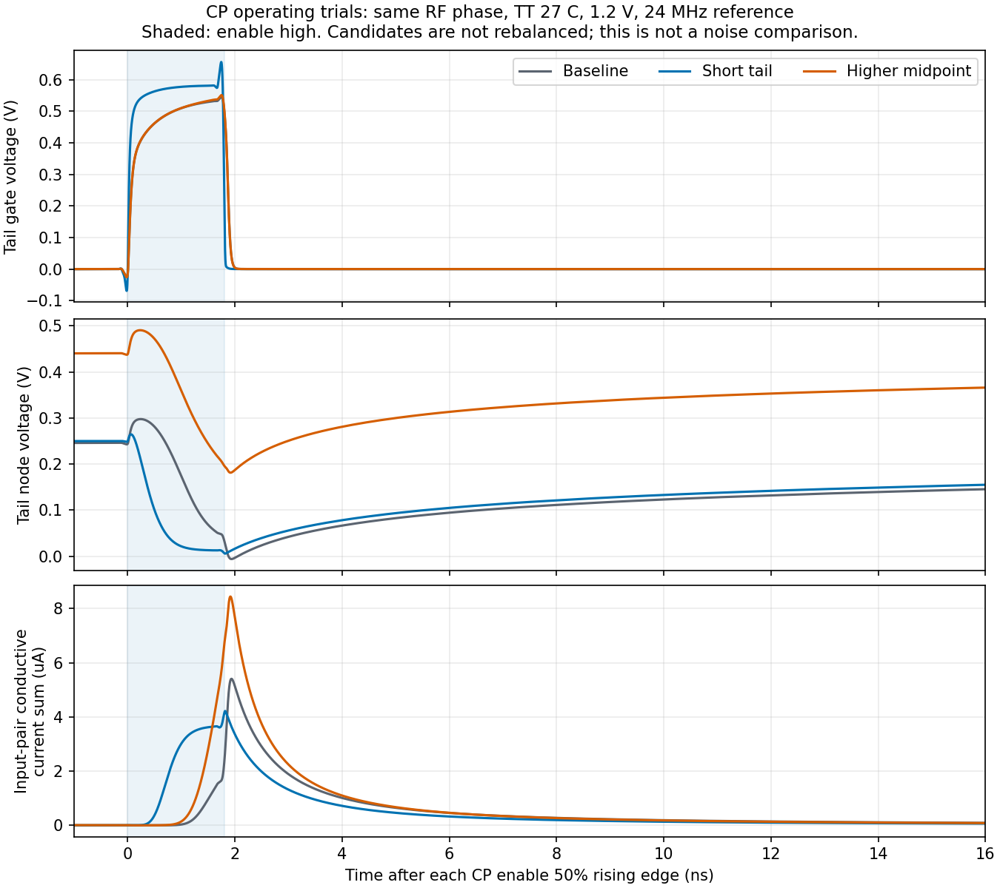

# 第59次噪声与抖动审阅

2026-10-04T22:04:06+08:00。参考缓冲48.906fs完成独立精度复核，CP单独noise-on确认归因；短尾管建立改善但噪声收益待测，0.7V中点方案出现偏流及有效性问题。整环抖动仍未知。

参考缓冲的独立精度复核完成：TT27/1.2V/24MHz、实际8ps的10–90%理想输入边沿、2pF负载，10kHz–12MHz内原尺寸155.054279fs，taper2候选48.905511fs，RMS下降68.4591%。加密到0.5ps/2047边带后，候选相对原网格RMS变化-0.010214%，最大PSD差0.009325dB；两种电路均通过1%/0.1dB门限。尚未验证有限源阻抗下的噪声、完整PVT或接回PLL后的抖动，主电路未采用候选。

原前端的CP-only fresh PSS/PNoise完成，平衡点和周期检查通过。10k/1M/10MHz输出电流噪声分别0.544471/0.482849/0.436098pA/√Hz，与全噪声结果中CP器件贡献的三个PSD完全一致（记录精度下0dB差），排除模块噪声为零。1MHz处输入对管和PMOS电流镜四管合计约99.48%的CP噪声。参考、CP两个独立noise-on组通过，采样器正在运行，偏置、检测器和脉冲发生器接续；全组求和复核尚未完成。三点不积分为RMS。

三个零伏支路探针使CP栅极KCL获得独立验证，归一化残差9.49e-17，探针电压均为零；19个保存电压与原电路最大差1.576e-12V。传输门和关断管的保存MOS端口电流仍分别与支路电流相差2.232%和4.717%，尾管栅流一致。此结果隔离了保存端口量的测量问题；不抹除之前3.74265%的端口KCL失败，不翻转符号、不缩放既有噪声，具体模型内部原因仍未确定。

实际短尾管试验完成：MT由10µm/1µm改为1.8µm/0.18µm，保留相同三个支路探针；周期和三节点KCL均通过。尾栅充电电荷由17.868891fC降至0.554278fC，输入对管在使能窗口外的导电电荷比例由94.9731%降至68.7544%。原相位下输出偏流-16.089631nA，尚未平衡。这些数据验证建立过程提前，不能作为降噪证据；正进行三点相位扫描，然后按实测零点细化、测量PAC，再准备噪声试验。

提高中点电压的独立对照已完成：分压电阻100k/100k改为85.7142857k/120k，维持50kΩ戴维南电阻与10pF滤波，尾管保留原尺寸。实测VMID均值0.698393V，周期/KCL通过，但原相位下输出偏流+247.012866nA，phase_good高电平比例仅86.6038%；输入对管平均保持电压和尾节点电压同时上移。没有得到可直接采用的平衡工作点，暂缓此支路，未测噪声、未合并到短尾管候选。

参考候选加载前端已完成第1轮三个真实PSS相位点，周期全部通过；得到负反馈零点区间，插值建议15.518562°仍待实测平衡。原有接续流程继续负责细化和满足门限后的一次全噪声仿真，未重复提交。

噪声/PAC生成与分析入口增加独立CP候选选择，保留实际物理依赖、源结果hash、工作点和周期门限。旧基线PAC与CP-only分析均在禁止写回旧结果的条件下重算，与冻结结果逐字段一致；生成器拒绝尚未平衡的参考候选。新的CP候选正向PAC/噪声路径尚待实际结果验证。短尾管有界接续观察已运行的首轮，不重复启动；最多再做两轮相位扫描和一次PAC，通过后只准备噪声TB，保留工程复核。

完整PLL的10kHz–fOUT/2、排除离散杂散的RMS<200fs仍未验收。主DUT保持原hash；完整RT4/新分频器64µs冷启动已到48µs检查点，VCO匹配频率的0.125ps密集噪声谱继续。核心PSS仍未取得有效解，不能把自由VCO或局部链的RMS相加冒充整环结果。33频点、全PVT、杂散、负载、供电爬升和异常恢复仍有缺口；功耗和后端优化后置，原规格保持。

完整12项需求、14个模块和六个层次见[状态快照](../../../reports/2026-10-04T2204.yaml)。
