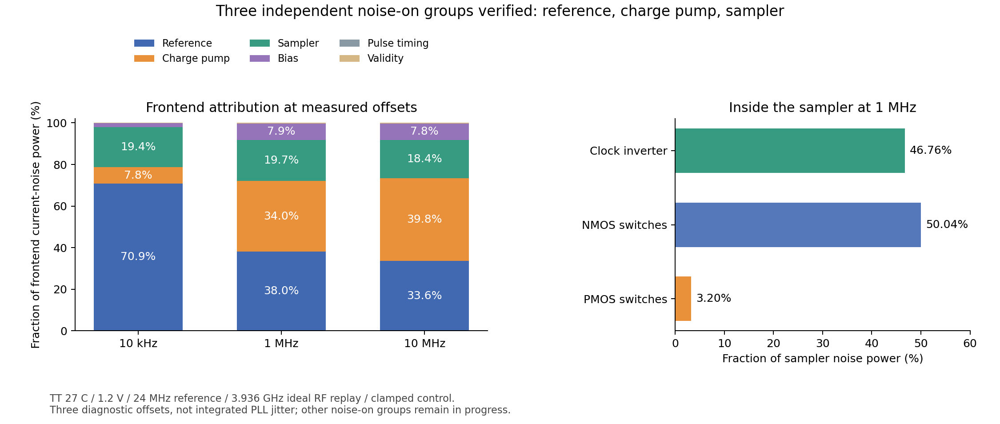

# 第61次噪声与抖动审阅

2026-10-04T23:26:55+08:00。前端三组独立noise-on通过，采样器器件归因完成；RC精度控制通过3%门限，实际CMOS瞬态抖动交叉验证通过无噪声底噪检查。整环抖动仍未验收。

采样器独立noise-on在10kHz/1MHz/10MHz全部通过，与全噪声中对应贡献在记录精度下一致，排除模块的噪声贡献为零。电流噪声幅度分别0.859452/0.367888/0.296933pA/√Hz。至此参考、CP、采样器三组独立核对完成；偏置、有效性检测和脉冲时序三组及总和核对仍待完成。条件为TT27/1.2V/24MHz参考/3.936GHz理想RF重放，实际晶体管前端、控制钳位及1.9pF近似负载；不是完整LC闭环。

采样器内部1MHz噪声方差中，时钟反相器占46.7554%，NMOS开关占50.0403%，PMOS开关占3.2043%。10kHz时NMOS开关噪声中闪烁分量占86.6313%；1MHz反相器噪声中沟道热噪声占83.4871%。固定原工作点并数学上去掉反相器噪声，整个前端电流噪声幅度只下降约3.60%/4.73%/4.50%。这不是器件放大的收益预测，也不是积分抖动；先完成参考缓冲和CP候选的实际收益比较，没有新开采样器尺寸分支。

48µs RC五例全部完成，通过预设3%方差门限。1kΩ/1pF/300.15K/1.2V理想DC，100ps采样，10GHz下10ps→1ps使方差变化−0.000786%；固定1ps时40→80GHz使方差变化−0.016610%。80GHz两种子相对矩形带限解析方差仍低2.8202%和2.7097%，标准误差分别0.5294%和0.5440%。剩余偏差保留，未宣称1%精度或MOS/PLL噪声验证；未用幅度缩放校正。此前客户端超时及原远端完成的补收证据保留。

实际CMOS RT4瞬态交叉验证已启动，并通过无噪声数值底噪检查。与既有TT sampled-PNoise保持相同物理电路、理想3.936GHz时钟/984MHz数据、10fF负载。100ns原生状态恢复至2.3µs，取200ns后2048个上升沿；0.5ps/0.25ps的无噪声边沿周期残差RMS为2.54436e-07/2.61409e-07fs，两步长差的带内RMS为2.9589e-07fs，均低于预设5fs。下一步为80/160GHz源带宽、0.5/0.25ps步长及两个噪声种子的实际MOS对照。PNoise在相同5.044921875–492MHz格点单元频带的比较值为53.324289fs。这不是10kHz全频带或整环验收；算法的已知正弦/Nyquist和白噪声归一化已独立通过。

完整PLL的10kHz–fOUT/2、排除离散spur的RMS<200fs仍未知。参考候选全噪声、VCO匹配频率0.125ps密集谱、原前端剩余noise-on及RT4/新分频器完整64µs冷启动继续；短尾管CP候选已通过平衡/PAC并等待长任务名额。独立RT4约53.9fs、单参考缓冲约48.9fs以及VCO高频段约154.6fs属于各自不同条件，不能直接作为完整PLL结果。33频点、整环PVT、杂散、负载、供电爬升和异常恢复仍有缺口。功耗及后端优化后置，原指标不变。

完整12项需求、14模块和六层状态见[完整汇报](../../../reports/2026-10-04T2326.yaml)。
