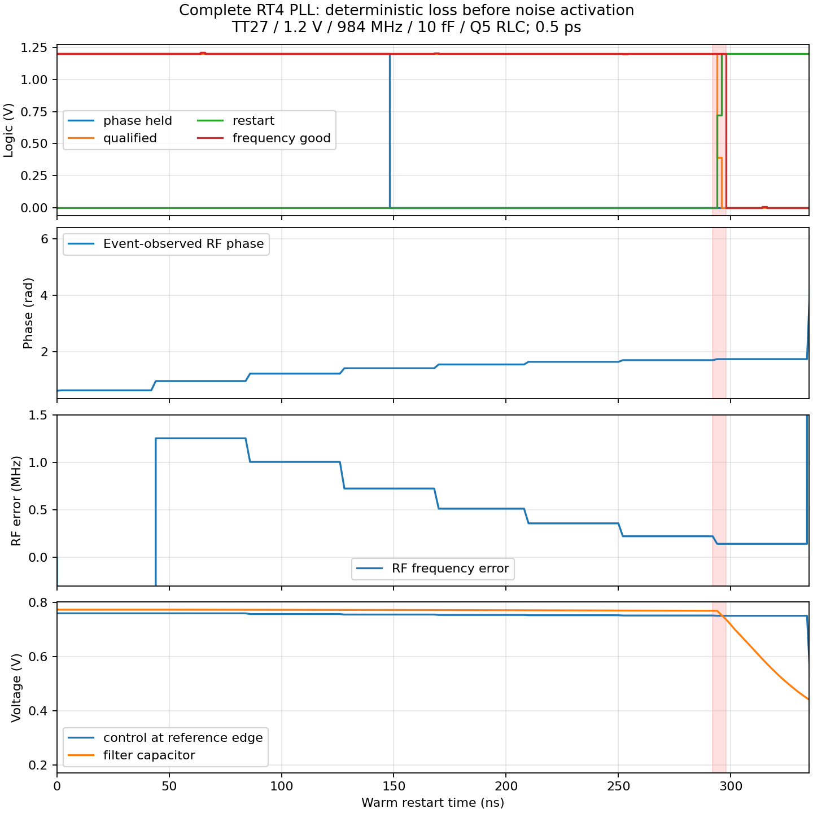

# 第64次噪声与抖动审阅

2026-10-05T12:08:04+08:00。定位整环在噪声开启前被相位监督重启；已启动原版严格初态噪声基线和RT4渐进精度初始化，完整PLL抖动仍未知。

上轮完整RT4/newbank配对在噪声开启前已停止并回收：quiet336.324ns、on配置219.161ns，原定1µs才开噪声。没有Newton恢复/跳过断点/LTE放宽；共同前段8个节点差为零。2ns原始记录将事件定位为phase_held146–148ns下降，qualified/restart292–294ns变化，随后enable和acquired/frequency_good下降。旧“约0.4µs触发重捕获”修正为实际事件区间，旧汇报保留。

同0.5ps的原生接续和文本初始化，前250ns控制电压RMS差0.641µV、滤波电压差0.0454µV、相位差3.03e−5rad。RF误差一度约+1.253MHz后逐步下降，但相位已从0.641移到1.650rad，慢滤波电压仅变化约2.4mV。证据支持精度突变先改变有效频率、模拟状态未平衡便被四次相位失败规则重启；尚未证明最终细精度锁定点能保持。没有修改相位窗或屏蔽重启。

实际MOS反相器的动态参数API检查完成：4/2/0.5ps接受步长、有效reltol/vabstol及6ns噪声开启均核对，零数值恢复。据此启动完整RT4电路20µs渐进精度初始化，16–20µs固定0.5ps/reltol1e−6/vabstol1nV/iabstol1pA；不修改任何晶体管或内部控制。过程只用于建立工作点，不能测抖动，也不替代独立冷复位。

重新核对原主DUT的独立1ps冷启动已有完成结果：TT27/1.2V/K41/M4/10fF/Q5，末窗984.000104MHz、相位pp0.004129rad/漂移−4.47e−5rad/µs、qualified保持；此前已完成，不是本轮新仿真。本轮使用该电路自身终态建立完整原版0.5ps无噪声基线，只有日志、初始化、状态和稳态全部通过才自动派发匹配噪声。原版输出链与RT4候选分开标识。

另已启动200ns完整原版PLL噪声开启诊断，50ns开启实际器件噪声；截至2026-10-05T12:07:54.398206+08:00缓冲记录到57.583ns，Newton恢复0、跳断点0。尚未完成，不报告积分抖动。

10kHz–fOUT/2、排除离散spur的完整随机RMS<200fs仍未知。短记录、高偏移结果及局部RT4约52fs方法检查均不替代整环验收；功耗与后端优化后置，全部原规格不变。



当前运行快照（缓冲输出，不是完成结果）：

```json
{
  "time": "2026-10-05T12:07:55.619596+08:00",
  "jobs": [
    {
      "run": "pllmainstrictoff01",
      "state": "running_or_collecting",
      "buffered_time_s": 3.81999999999999e-07,
      "qualified_v": 1.20000003992833,
      "acquired_v": 1.199516988820805,
      "newton": 0,
      "skipped": 0
    },
    {
      "run": "pllmainstricton01",
      "state": "not_dispatched",
      "buffered_time_s": null,
      "qualified_v": null,
      "acquired_v": null,
      "newton": null,
      "skipped": null
    },
    {
      "run": "pllprecisionramp01",
      "state": "running_or_collecting",
      "buffered_time_s": 2.268000000000007e-06,
      "qualified_v": 1.200000543639247,
      "acquired_v": 1.193457676709506,
      "newton": 0,
      "skipped": 0
    }
  ]
}
```

12项需求、14模块与六层完整状态见[汇报](../../../reports/2026-10-05T1208.yaml)；[诊断数据](results/full_pll_reacquisition_diagnosis.json)。
