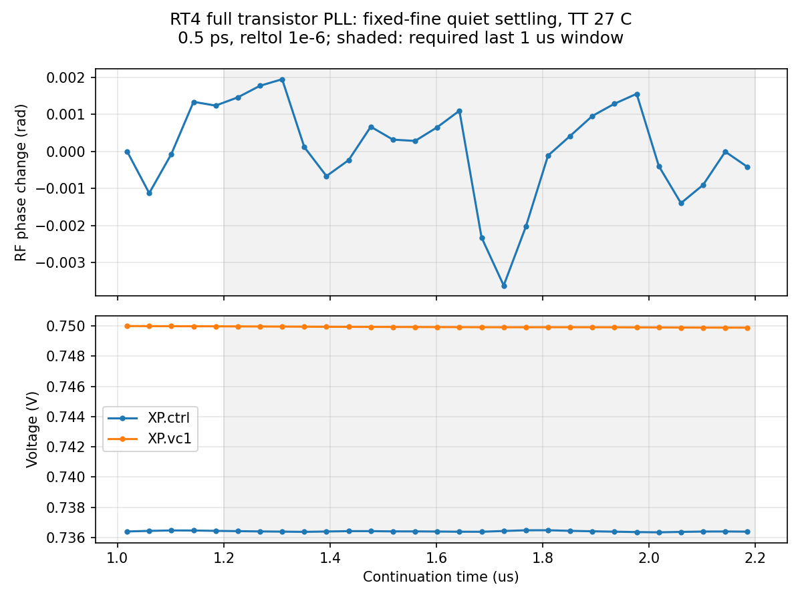

# 第73次噪声与抖动审阅

2026-10-06T00:57:53+08:00。RT4完整晶体管PLL的恒定细精度quiet基线通过原稳态门限，配对noise-on已自动在SSD启动；原版噪声仿真继续，全带抖动仍未知。

pllrt4fineoffssd02实际完成2.2µs，Spectre终止摘要0errors/1warning/22notices，6252851个接受步，墙钟2h58m54s。完整RT4/newbank晶体管PLL，TT27/1.2V/24MHz/K41/M4/10fF/Q5RLC/CF10，外部参考与供电理想。恒定0.5ps/reltol1e-6/vabstol1nV/iabstol1pA/traponly，始终noise-off。Newton恢复、跳断点、LTE放宽和最小步长警告均为0；唯一warning为AHDL环境变量提示。

末1µs包含24个参考采样，输出983.999920077MHz，RF相位峰峰0.005567117rad，相位漂移-0.001399226rad/µs，最大RF/输出周期计数误差0.000544419/0.000144834。全部通过既有门限：至少23个参考采样、相位峰峰<0.02rad、|drift|<0.01rad/µs、周期计数误差均<0.001。19个可比较电压初态差为0，测量段锁定及状态检查通过；未钳位控制状态或放宽门限。

| 末1µs检查 | 实测 | 原门限 |
|---|---:|---:|
| RF相位峰峰 | 0.005567rad | <0.02rad |
| 相位漂移 | -0.001399rad/µs | 绝对值<0.01rad/µs |
| RF周期计数误差 | 0.0005444 | <0.001 |
| 输出周期计数误差 | 0.0001448 | <0.001 |

2696565931字节原始波形、15421字节日志及280388字节完整终态已回收，远端/本地SHA256一致；26个输入逐项匹配。独立流式解析对3410785个时间点及10个节点逐点比较，最大差为0、重复记录为0。完整终态含7863项，保留输入终态的全部状态键，保存节点与波形末值差小于1nV。

日志在内部数字节点XP.XC.XS.X143.XN.x报告梯形积分振铃，并提示后续同类通知被抑制。现有quiet门限通过不能替代数值收敛；后续须比较步长、容差和积分方法对噪声结果的影响。此前16µs动态收紧容差触发LTE的失败记录保留；本次从完整中间态以恒定细精度运行成功，证明存在可行初始化路径，但尚未单独隔离旧失败的具体原因。

既有流水线于2026-10-06T00:53:41.679728+08:00在全部quiet门限通过后自动派发pllrt4fineonssd02，远端c5e15b30、PID458129、7线程。沿用相同完整初态和参考相位，0–1µs无噪声、1µs后开启全部PLL器件与RLC电阻噪声；seed11、noisefmax160GHz、noisefmin1MHz、stop2.2µs。启动审计时尚未越过噪声开启时刻。原版pllmainsettledonssd02已越过1µs、继续运行，无数值恢复。

实际服务器只有原版与RT4两项Spectre，共14请求线程；两者cwd、TMPDIR、输入与项目写入描述符均已核验位于/server_local_ssd/jielu/IP-PLL-GPT6，文件系统XFS。两条配对流水线和保护器存活，单次派发与原子claim保护不变。无home下活动仿真。

本次是暖启动单一TT工作点的稳态通过，未修改14个模块的器件，不等同于独立冷启动、33频点或全PVT验收。配对记录仅供1024边沿、约5.285–492MHz高偏移诊断，仍需数值/带宽/种子/记录长度收敛和低偏移覆盖。完整PLL的10kHz–fOUT/2、排除离散杂散、RMS<200fs仍未知；功耗超标与后端缺口保留，优化后置且指标不变。

[原始文件与解析审计](results/full_pll_rt4_fine_recovery_audit.json)；[SSD派发审计](results/rt4_fine_noise_launch_validation.json)。

复现：先对完整回收结果运行analyze_full_pll_direct_noise_pair.py --protocol full_pll_rt4_fine_ssd_cwd_pair_protocol.json，再运行audit_rt4_fine_recovery.py。原始结果位于research/runs/spectre_cmos_v14_full/pllrt4fineoffssd02；独立远端哈希在research/rt4_fine_ssd_remote_audit73.json，均已记录。

全部12项需求、14模块及六层状态见[完整汇报](../../../reports/2026-10-06T0057.yaml)。
