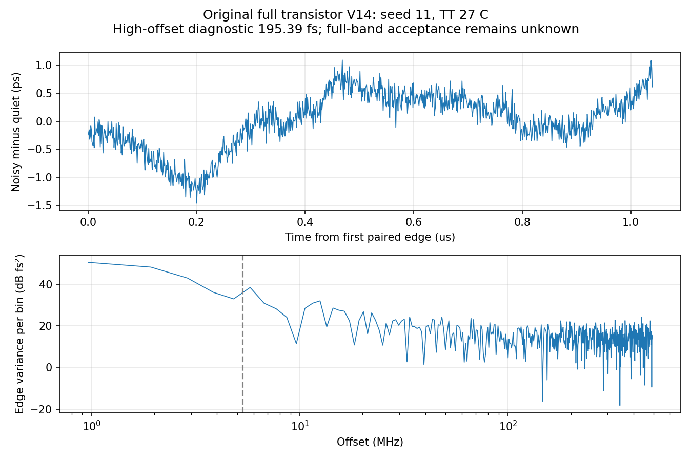

# 第74次噪声与抖动审阅

2026-10-06T16:27:44+08:00。原版完整晶体管PLL配对噪声得到195.390fs高偏移诊断值；全带仍未知，已派发0.25ps步长收敛对照，RT4噪声继续。

原版17644个MOS完整V14，TT27/1.2V/24MHz/K41/M4/10fF/Q5RLC/CF10，外部参考及供电理想。固定maxstep0.5ps、reltol1e-6、vabstol1nV、iabstol1pA、traponly；seed11，噪声带宽1MHz–160GHz。完整初态及参考相位保持，0–1µs无噪声、1–2.2µs开启全部PLL器件和RLC电阻噪声，无控制钳位。

pllmainsettledonssd02实际完成2.2µs；服务器正常退出码0，Spectre为0errors/1warning/15notices，10313230个接受步，墙钟18h8m25s。未发现Newton恢复、跳断点、LTE放宽、最小步长警告或梯形积分振铃。26个输入与服务器逐项匹配。

在1.1µs起的1024个输出上升沿，将配对无噪声边沿相减后仅去均值，5.28515625–492MHz积分RMS为195.390405222fs。19个可比较初态电压差为0，公共quiet前缀的ctrl/out/qualified差均为0，测量段状态保持，quiet末1µs原稳态门限通过。不使用源噪声缩放、趋势拟合或任意频谱陷波。16个分块给出的方差标准误为6.14310441e-27s²，只描述本记录的统计波动，不是跨种子置信区间。

6104303018字节原始波形、14437字节日志、280635字节完整终态均已回收且远端/本地SHA256一致。独立解析逐点比较7721497个时间点和全部23路信号，最大差为0，重复记录为0。完整终态保留7859个源状态键，保存节点末值差小于1nV；完整复数FFT与原单边积分结果一致，Parseval闭合。

旧本地解析器在32GB主机分配约52.1GB私有虚拟内存，严重换页且未产生缓存。确认服务器已正常终止、原始文件哈希一致后，只停止本项目的本地回收器及其等待流水线，未重跑或停止服务器仿真。改用紧凑数值缓冲的流式解析完成回收；中途实测约1.22GB驻留内存，完整数据已由独立解析器复核。后续新启动的项目runner对大型纯瞬态采用该解析器，其他分析保留原桥接解析；全局bridge安装与单次派发保护未改。当前RT4的旧worker已经载入旧解析器，结束后若出现同样内存问题，按此已验证流程处理。

已在SSD派发pllmainquarteroffssd01：只把最大步长0.5ps改为0.25ps，其余器件、初态、参考相位、精度、seed及测量口径保持一致。既有门控流水线仅在此独立quiet通过完成/数值/初态/状态/稳态全部门限后派发pllmainquarteronssd01。单独保护器采用原有数值恢复与锁定丢失规则；已有RT4噪声pllrt4fineonssd02继续运行。

195.4fs只覆盖高偏移短记录，已接近200fs目标，但数值与统计尚未收敛，不能认定全带通过或失败。10kHz–5.285MHz尚未覆盖；完整PLL的10kHz–fOUT/2、排除离散杂散、RMS<200fs仍未知。配对quiet相减不能替代完整离散线分类，后续仍须容差/方法/带宽/种子/记录长度收敛。原版与RT4候选、局部结果与整环验证保持独立；33频点、完整PVT/MC、供电爬升、真实输入/负载及PEX缺口保留。功耗仍超4mW、面积未验证；优化和后端继续后置，所有指标不变。

[完整数据与独立FFT审计](results/full_pll_main_noise_recovery_audit.json)；[0.25ps协议](results/full_pll_main_quarter_pair_protocol.json)；[SSD派发审计](results/main_quarter_launch_validation.json)。

原始输入/波形/日志/终态位于research/runs/spectre_cmos_v14_full/pllmainsettledonssd02/full_pll_main_settled_on_tt，哈希见审计。服务器原始目录70a37f74位于/server_local_ssd/jielu/IP-PLL-GPT6/simulation/cmos_v14_full。配对旧quiet只读取历史结果，不在home重新运行。

复现：analyze_full_pll_direct_noise_pair.py --protocol full_pll_main_settled_ssd_cwd_pair_protocol.json；audit_main_noise_recovery.py。本地恢复过程保存在research/recover_main_noise_stream74.py及main_collector_memory_repair74.json，远端哈希保存在main_noise_ssd_remote_audit74.json。

全部12项需求、14模块和六层状态见[完整汇报](../../../reports/2026-10-06T1627.yaml)。

有限记录补充检查：1024点首尾残差相差0.854350ps；矩形窗195.390405fs，sum(w²)能量归一化的对称Hann窗174.913747fs。该差异同时包含记录加权及频谱泄漏敏感性，不能单独归因，也不选择较低值替换原协议结果；需更长记录和多种子约束。

[窗口敏感性证据](results/full_pll_main_noise_window_sensitivity.json)，复现：analyze_main_noise_window_sensitivity.py。
