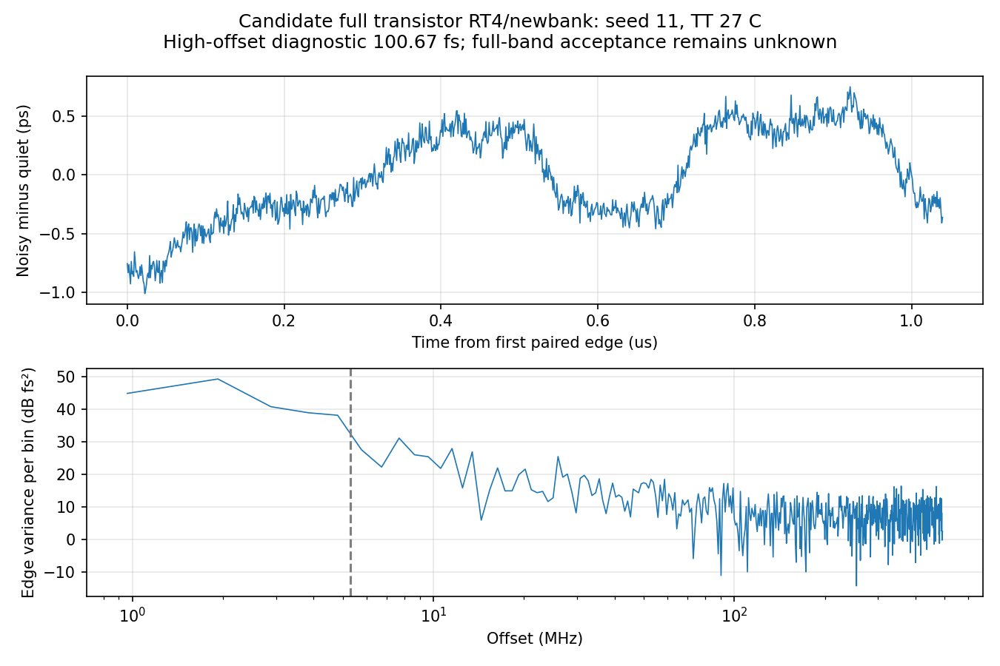

# 第75次噪声与抖动审阅

2026-10-06T18:57:13+08:00。RT4候选完整晶体管PLL配对噪声得到100.669fs高偏移诊断值；全带仍未知，原版与RT4各自继续0.25ps步长收敛验证。

RT4/newbank候选17617个MOS完整PLL，TT27/1.2V/24MHz/K41/M4/10fF/Q5RLC/CF10，外部参考及供电理想。固定maxstep0.5ps、reltol1e-6、vabstol1nV、iabstol1pA、traponly；seed11，noisefmin1MHz、noisefmax160GHz。初态来自已审计15.9µs中间轨迹，保持完整状态及参考相位。0–1µs无噪声，1–2.2µs开启全部PLL器件和RLC电阻噪声，无控制钳位。

pllrt4fineonssd02已完成2.2µs，实际PID消失、SSD单次派发终态退出码0，Spectre为0errors/1warning/22notices，10489339个接受步，墙钟17h48m41s。Newton恢复、跳断点、LTE放宽和最小步长警告均为0。保留与quiet基线相同的内部节点XP.XC.XS.X143.XN.x梯形振铃提示，不将无致命错误解释为数值收敛。

1.1µs起1024个输出上升沿，配对quiet相减后仅去均值，原矩形窗5.28515625–492MHz RMS为100.669315654fs。19个可比较初态电压差为0，公共quiet前缀ctrl/out/qualified差均为0，测量段状态保持，quiet末1µs原稳态门限通过。16块方差标准误1.36761076e-27s²，仅描述本记录波动，不是跨种子置信区间。原版同协议口径的195.390405fs保留为独立结果；两种DUT的初态和噪声轨迹不同，单种子差值不作因果归因或方案采用依据。

6046666496字节原始波形、14668字节日志、281320字节完整终态已回收，远端与本地SHA256一致；26项输入逐项匹配。独立解析核对7647273个时间点及全部23信号，最大差为0、重复记录0。完整终态保留7863个状态键，已保存节点末值差小于1nV；独立复数FFT及Parseval复核通过。

有限记录检查：首尾残差差0.392615ps，原矩形窗100.669316fs，sum(w²)能量归一化的对称Hann窗100.410176fs。该差异同时包含记录加权及泄漏敏感性，不能独立分离其成因，也不采用较低值替换原协议结果。同一记录仅去均值、未经高通的配对边沿残差RMS为387.716035fs，说明短记录低频桶包含显著方差。该残差统计也不是10kHz全带值，不能只用100.67fs高偏移数值判断是否达标。

旧RT4驻留回收器仍使用上一轮已证实会耗尽内存的全文件解析器，本轮已升至24.546GB私有内存。服务器完成、原始文件和日志哈希匹配后，仅停止该本地回收器及等待流水线，采用已验证的流式解析重建缓存和结果。没有停止或重跑服务器仿真，单次派发保护、原始输入和全局bridge均未改。

已派发RT4独立0.25ps quiet：pllrt4quarteroffssd01。只改变maxstep，保留器件、初态、参考相位、容差、seed和测量口径。现有流水线仅在完成/数值/初始化/状态/稳态全部门限通过后派发pllrt4quarteronssd01，专属保护器检查恢复及锁定丢失。原版pllmainquarteroffssd01及其门控noise-on继续独立推进；两套候选不会交叉使用quiet模板。

10kHz–5.285MHz尚未覆盖，数值、方法、带宽、种子和时长收敛均未闭合；完整PLL的10kHz–fOUT/2、排除离散杂散、RMS<200fs仍未知。配对quiet相减不能代替完整离散线分类；高偏移短记录及局部器件结果均不是全带验收。原版V14保持原样，RT4/newbank仍是未采用候选。33频点、完整PVT/MC、供电爬升、实际输入/负载和PEX缺口保留。功耗仍超4mW、面积未验证，功耗优化与后端后置，所有指标不变。

[独立回收与FFT审计](results/full_pll_rt4_noise_recovery_audit.json)；[窗口敏感性](results/full_pll_rt4_noise_window_sensitivity.json)；[0.25ps协议](results/full_pll_rt4_quarter_pair_protocol.json)。

原始输入/波形/日志/终态在research/runs/spectre_cmos_v14_full/pllrt4fineonssd02/full_pll_rt4_fine_on_tt；原始服务器目录为SSD计算根下c5e15b30。远端哈希保存在research/rt4_noise_ssd_remote_audit75.json，回收流程及本地进程证据见recover_rt4_noise_stream75.py和rt4_collector_memory_repair75.json。

复现：analyze_full_pll_direct_noise_pair.py --protocol full_pll_rt4_fine_ssd_cwd_pair_protocol.json；audit_rt4_noise_recovery.py；analyze_rt4_noise_window_sensitivity.py。

全部12项需求、14模块及六层状态见[完整汇报](../../../reports/2026-10-06T1857.yaml)。

交付检查发现新RT4保护器在quiet启动可见前误读历史流水线完成状态而退出；已将两套0.25ps保护器分别绑定所属流水线，恢复本地保护。六种启动/回收间隙及终态回归、两套wrapper映射检查通过，实际保护器均恢复monitoring；未停止、重复派发或改变服务器仿真。

[保护器生命周期修复验证](results/quarter_guard_lifecycle_validation.json)。
