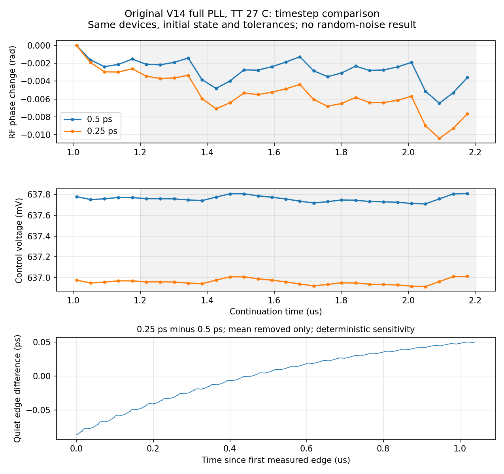

# 第76次噪声与抖动审阅

2026-10-06T20:02:17+08:00。原版V14的0.25ps完整quiet已通过回收、初始化和末1µs稳态核验，既有流水线自动启动配对噪声；数值收敛及全带抖动仍未验收。

原版V14完整17644个MOS，TT27/1.2V/24MHz/K41/M4/10fF/Q5RLC/CF10，外部参考与供电理想；固定maxstep0.25ps、reltol1e-6、vabstol1nV、iabstol1pA、traponly。与0.5ps基线保持相同DUT、完整初态、参考相位、容差和2.2µs记录，仅maxstep改变。

pllmainquarteroffssd01完成2.2µs；远端PID341794已消失，单次派发终态退出码0，Spectre为0errors/1warning/18notices、9353459个接受步，墙钟3h18m54s。Newton恢复、跳断点、LTE放宽与最小步长警告均为0。新流式回收器直接完成，无本地内存修复或服务器重跑。

19个可比较初态电压差为0，测量段状态保持。末1µs共24个参考沿，输出983.999907335MHz，RF相位pp 0.007060304rad、漂移-0.004664553rad/µs；RF/输出每参考周期计数最大误差分别0.000524105和0.000223330，原门限全部通过。局部1.0–1.5µs漂移−0.012025rad/µs保留为诊断，未替换完整末1µs判据。

4033400313字节原始波形、15224字节日志、279872字节完整终态的远端/本地SHA256匹配，26项输入逐一匹配。独立解析5102505个时间点及10个关键节点，缓存最大差0、重复记录0；完整终态保留7859个状态键，已保存节点末值差小于1nV。

日志在1.42753µs的XP.XC.XC.X1.XS.XN.x及1.92753µs的XP.XC.XF.X57.XS.XN.x报告梯形振铃。0.5ps到0.25ps后，末窗相位漂移从−0.001909413变为−0.004664553rad/µs，两者均通过稳态门限，仍不能证明数值收敛。1.1µs起1024个同序输出沿的确定性差值，仅去均值RMS为38.381463fs，pp为0.136703551ps；按既有矩形窗频桶口径，高偏移差值RMS为13.015901fs。后者选中频桶中心5.765625–492MHz、频桶覆盖边界5.28515625–492MHz。这些是quiet与quiet的数值/确定性轨迹差，既不是随机抖动，也不是noise-on噪声底或全带数值误差上界；不据此宣布200fs达标。

原版既有流水线19:51:03通过全部quiet门限后自动派发pllmainquarteronssd01，远端a6817745/PID68394/7请求线程。它保留seed11、160GHz/1MHz噪声参数，0–1µs quiet、1–2.2µs开启全部器件与RLC电阻噪声，尚无完成或新噪声RMS结论。RT4独立pllrt4quarteroffssd01继续运行，631d406b/PID19151/7请求线程；其noise-on仍由所属流水线等待全部门限，未派发。2026-10-06T19:53:18.320653+08:00实际审计为2项Spectre、14请求线程，cwd、输入、raw、日志、终态目标和TMPDIR均在/server_local_ssd/jielu/IP-PLL-GPT6下。两套本地保护器和流水线均存活，脚本哈希与第75次交接一致，没有重复派发。

历史0.5ps整环高偏移诊断值仍分别为原版195.390405fs、RT4候选100.669316fs；不跨DUT混用quiet或比较单种子因果收益。10kHz至输出频率一半、排除离散杂散、RMS<200fs的完整PLL验收仍未知。数值方法/容差、噪声带宽、种子及时长收敛和低偏移覆盖未闭合，短记录及局部器件结果不能替代。原版V14与未采用RT4候选界限不变；33频点、完整PVT/MC、供电爬升、实际输入/负载及PEX缺口保留。功耗仍超4mW、面积未验证，功耗优化与后端仍后置，全部指标不变。

[回收审计](results/full_pll_main_quarter_recovery_audit.json)；[步长对照](results/full_pll_main_quiet_timestep_comparison.json)；[自动门控启动证据](results/main_quarter_gate_activation76.json)。

原始输入/波形/日志/完整终态：research/runs/spectre_cmos_v14_full/pllmainquarteroffssd01/full_pll_main_quarter_off_tt。远端目录为SSD计算根下f4da7c17，独立远端哈希证据research/main_quarter_remote_audit76.json，活动进程/SSD证据research/progress76_live.json。

复现：audit_main_quarter_recovery.py；compare_main_quiet_timesteps.py。两项均只读原始仿真数据，生成审计与图表。

全部12项需求、14模块及六层状态见[完整汇报](../../../reports/2026-10-06T2002.yaml)。
