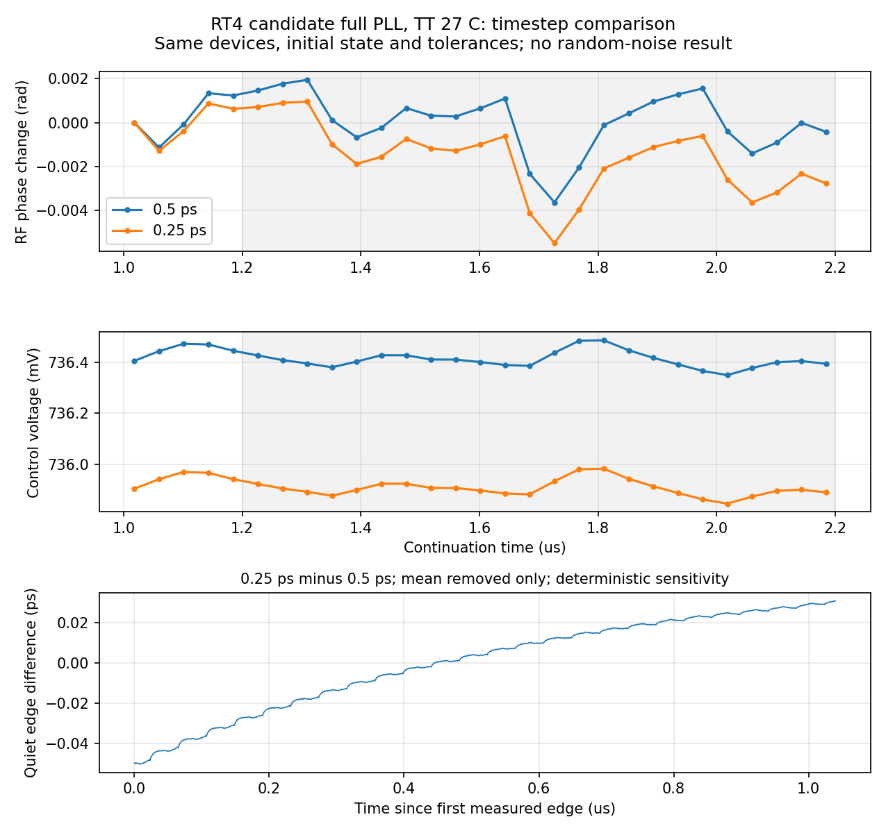

# 第77次噪声与抖动审阅

2026-10-06T23:33:51+08:00。RT4候选0.25ps完整quiet通过原稳态门限，日志未报告梯形振铃；配对噪声已由既有流水线自动启动，原版与RT4两项0.25ps噪声继续运行。

RT4/newbank候选完整17617个MOS，TT27/1.2V/24MHz/K41/M4/10fF/Q5 RLC/CF10，外部参考与供电理想；maxstep0.25ps、reltol1e-6、vabstol1nV、iabstol1pA、traponly。相对RT4自身0.5ps记录，仅maxstep改变，DUT、完整初态、参考相位、容差和2.2µs时长均保持一致。

pllrt4quarteroffssd01完成2.2µs，服务器PID19151已退出，单次派发exit_code=0；Spectre报告0errors/1warning/15notices、9565082个接受步，墙钟4h15m22s，结束时间为服务器Oct6 23:09:34。Newton恢复、跳断点、LTE放宽、最小步长警告均为0，日志未报告梯形振铃。流式回收直接完成，无本地内存修复或服务器重跑。

19个可比较初态电压差为0，测量段状态保持。末1µs有24个参考沿，输出983.999853710MHz，相位pp 0.006430518rad、漂移-0.003011769rad/µs；RF/输出周期计数最大误差分别0.000556050和0.000147644，原门限全部通过。较短窗口仅作稳定过程诊断，不替换原末1µs判据。

4124847516字节原始波形、14643字节日志、280325字节完整终态的远端/本地SHA256匹配，26项输入逐一匹配。独立解析5217482个时间点和10个关键节点，与缓存最大差0、重复记录0；完整终态保留7863个状态键，已保存节点末值与终态差小于1nV。

RT4的0.5ps记录曾报告内部节点XP.XC.XS.X143.XN.x梯形振铃，0.25ps日志未报告该提示；这不足以证明数值收敛，也不能用于解释原版V14的内部振铃。1.1µs起1024个同序输出沿，0.25ps减0.5ps的确定性差值仅去均值RMS为22.776603fs，pp为0.080892296ps，高偏移差值RMS为7.797340fs。选中频桶中心5.765625–492MHz，对应频桶覆盖边界5.28515625–492MHz；不去趋势、不挖陷波。上述数值是quiet与quiet的确定性/数值敏感性，不是随机抖动、噪声底或全带数值误差上界。

本地23:15:36，RT4所属流水线通过全部quiet门限后自动派发pllrt4quarteronssd01，远端408d45c9/PID245201/7请求线程。原版pllmainquarteronssd01在a6817745/PID68394继续运行，亦为7请求线程。两项均保留seed11、160GHz/1MHz噪声参数：0–1µs关闭噪声，1–2.2µs同时开启实际PLL器件与RLC电阻噪声。2026-10-06T23:29:26.389271+08:00服务器实查2项Spectre、14请求线程，输入、cwd、raw、日志、终态目标和TMPDIR均在/server_local_ssd/jielu/IP-PLL-GPT6。两套流水线、保护器和噪声回收器均存活，脚本哈希与既有实现一致；未重复派发。

历史0.5ps完整PLL高偏移诊断值原版195.390405fs、RT4候选100.669316fs保持原适用范围；0.25ps配对噪声尚未完成，不能跨DUT混用quiet或据单种子判断器件修改收益。最终10kHz至输出频率一半、排除离散杂散、RMS<200fs仍未知。积分方法/容差、噪声带宽、种子和记录长度收敛及低偏移覆盖待完成；短记录和局部器件结果不能替代全带验收。RT4候选未采用；33频点、全PVT/MC、供电爬升、实际输入/负载及PEX缺口保留。功耗仍超4mW、面积未验证；功耗优化和后端工作后置，指标不变。

[回收审计](results/full_pll_rt4_quarter_recovery_audit.json)；[步长对照](results/full_pll_rt4_quiet_timestep_comparison.json)；[自动门控启动证据](results/rt4_quarter_gate_activation77.json)。

原始输入/波形/日志/完整终态：research/runs/spectre_cmos_v14_full/pllrt4quarteroffssd01/full_pll_rt4_quarter_off_tt。远端SSD目录631d406b；远端哈希证据research/rt4_quarter_remote_audit77.json，活动进程/SSD证据research/progress77_live.json。

复现：audit_rt4_quarter_recovery.py；compare_rt4_quiet_timesteps.py。均只读原始仿真结果，生成审计和图表。

全部12项需求、14模块和六层状态见[完整汇报](../../../reports/2026-10-06T2333.yaml)。
