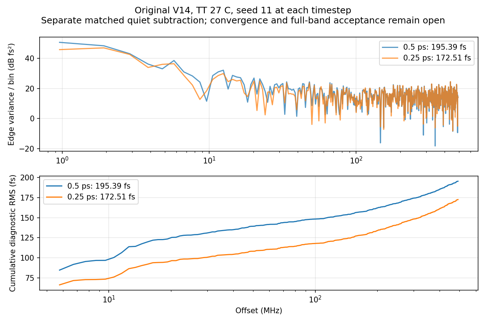

# 第78次噪声与抖动审阅

2026-10-07T18:54:55+08:00。原版V14的0.25ps完整晶体管配对噪声完成，高偏移诊断172.507488fs；与0.5ps相差11.71%，数值收敛仍未证明。已启动seed29，RT4的seed11继续运行。

原版V14完整17644个MOS，TT27/1.2V/24MHz/K41/M4/10fF/Q5 RLC/CF10，外部参考与供电理想；maxstep0.25ps、reltol1e-6、vabstol1nV、iabstol1pA、traponly，seed11、noisefmax160GHz/noisefmin1MHz。仿真2.2µs，0–1µs关闭噪声，1–2.2µs同时开启实际PLL器件与RLC电阻噪声。

pllmainquarteronssd01在SSD a6817745完成，原PID68394已退出，单次派发exit_code=0。服务器Spectre于Oct7 17:52:43结束，墙钟22h3m23s，11987866个接受步，0errors/1warning/15notices。Newton恢复、跳断点、LTE放宽、最小步长警告均为0；噪声记录未报告梯形振铃，配对quiet曾报告两次内部振铃，故数值风险保留。现有紧凑流式回收与门控流水线正常结束，无内存修复、重复派发或服务器重跑。

原始波形6116500032字节、日志14639字节、完整终态280593字节均已回收，远端与本地SHA256一致，26项输入匹配。独立解析7736912个时间点及23个信号，与缓存最大差0、重复记录0。完整终态7859个键全部保留，已保存关键电压末值与终态差不超过2e-15V。

两条记录的19个初态电压差均为0，噪声开启前公共quiet前缀差为0，測量段真实状态保持，原末1µs quiet稳态门限通过。1.1µs起1024个同序输出上升沿配对，仅减去quiet和残差均值；5.28515625–492MHz频桶覆盖内RMS为172.507488424fs。独立全复数FFT复算一致，Parseval相对差0；未限带残差RMS为376.667851fs，仅是短记录诊断，不能视为10kHz全带抖动。Rectangular预注册值保持；Hann按噪声能量归一化为175.259754fs，端点差0.350392368ps，不以较低窗口结果验收。

0.5ps与0.25ps仅maxstep改变，DUT、初态、参考相位、容差、噪声带宽、seed11和时长逐项相同，各自减去自身quiet。高偏移RMS由195.390405fs变为172.507488fs，下降11.711382%。5–20/20–100/100–492MHz按频桶中心选择的子带RMS分别从123.371/82.142/127.317fs变为94.753/69.900/126.074fs。方差差除以两条记录分块标准误的平方和开根约−1.31；这仅是描述量，非独立样本显著性检验或置信区间。同种子不保证自适应仿真噪声实现相同，未将两条随机轨迹的差定义为数值噪声底；单记录不能证明收敛。

已预先固定seed29，复用相同0.25ps quiet，重新通过全部quiet门限后由现有流水线派发pllmainquarterseed29onssd01。新TB仅noiseseed11→29，quiet保持isnoisy=0，无须重复计算。新任务SSD a9c1cfaf/PID335342，RT4原任务SSD408d45c9/PID245201。2026-10-07T18:52:21.918940+08:00实查2项Spectre、14请求线程，26项输入逐项匹配，cwd/raw/日志/终态/TMPDIR均在项目SSD目录；两套保护器/流水线/回收器健康。下一步比较独立种子分散，再决定匹配的0.5ps seed29或积分方法/容差对照；不得将两种子当作充分统计验收。

本轮只完成原版V14的短记录高偏移诊断；RT4候选0.25ps噪声尚未完成，历史0.5ps诊断100.669316fs保持原边界，候选未采用。最终10kHz至fOUT/2、排除离散杂散、RMS<200fs仍未知；5.285MHz以下缺口、数值/方法/容差、带宽、种子和长记录收敛未闭合。离散杂散需单独识别和验收，quiet相减不等于已经完成所有杂散分类。原版/RT4/局部器件结果不能混用。33频点、完整PVT/MC、供电爬升、实际输入/负载及PEX覆盖仍缺；功耗超4mW、面积未验证，优化与后端继续后置，指标不变。

[回收审计](results/full_pll_main_quarter_noise_recovery_audit.json)；[步长对照](results/full_pll_main_noise_timestep_comparison.json)；[下一种子协议](results/full_pll_main_quarter_seed29_pair_protocol.json)。

原始输入输出：research/runs/spectre_cmos_v14_full/pllmainquarteronssd01/full_pll_main_quarter_on_tt；远端哈希证据：research/main_quarter_noise_remote_audit78.json。复现：audit_main_quarter_noise_recovery.py、compare_main_noise_timesteps.py、analyze_main_quarter_noise_window_sensitivity.py。

全部12项需求、14模块及六层状态见[完整汇报](../../../reports/2026-10-07T1854.yaml)。
