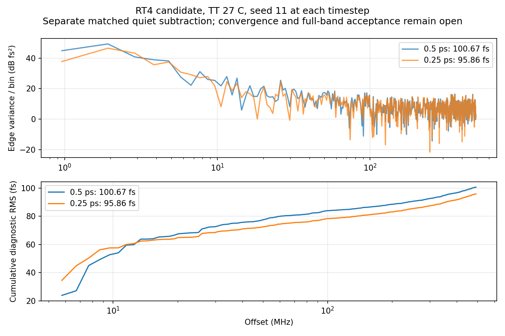

# 第79次噪声与抖动审阅

2026-10-07T21:55:34+08:00。RT4候选0.25ps完整晶体管配对噪声完成，高偏移诊断95.862399fs；较0.5ps相差4.77%，仍未证明数值或全带收敛。已启动RT4 seed29，原版seed29继续运行。

RT4/newbank候选完整17617个MOS，TT27/1.2V/24MHz/K41/M4/10fF/Q5 RLC/CF10，外部参考与供电理想；maxstep0.25ps、reltol1e-6、vabstol1nV、iabstol1pA、traponly，seed11、noisefmax160GHz/noisefmin1MHz。2.2µs暖启动续算，0–1µs关闭噪声，1–2.2µs同时开启PLL实际器件与RLC电阻噪声。

pllrt4quarteronssd01在SSD408d45c9完成，原PID245201已退出、单次派发exit_code=0。服务器Spectre终止时间Oct7 21:06:47，墙钟21h52m54s，12012465个接受步，0errors/1warning/15notices；Newton恢复、跳断点、LTE放宽、最小步长警告均为0。该0.25ps quiet与noise未报告梯形振铃，历史0.5ps公共前缀的振铃风险仍保留。流水线21:16:28完成回收与分析，保护器21:16:53正常结束；没有停止或重跑此任务。

原始波形6060559474字节、日志14641字节、完整终态281245字节全部回收并与远端SHA256匹配，26项输入一致。独立解析7664865个时间点及23个信号，与缓存最大差0、重复记录0；完整终态7863个键全部保留，已保存关键电压末值与终态最大差5.11e-15V。

19个初态电压差均为0，噪声开启前公共quiet前缀差0，测量段真实状态保持，其自身quiet末1µs原稳态门限通过。1.1µs起1024个同序输出上升沿，仅减去匹配quiet与残差均值；5.28515625–492MHz频桶覆盖的RMS为95.862398905fs。独立全复数FFT重算一致，Parseval相对差2.22e-16。未限带短记录残差RMS为299.042176fs，不是10kHz全带值。矩形窗预注册值保持；Hann按噪声能量归一化为100.399943fs，端点差-0.059365009ps。

RT4两条协议逐项确认DUT、初态、参考相位、容差、带宽、seed11、时长相同，TB仅maxstep0.5→0.25ps，各自减去自身quiet。RMS100.669316→95.862399fs，变化-4.774957%。5–20/20–100/100–492MHz按频桶中心选择的子带RMS为66.508/51.323/55.471→63.996/45.266/55.183fs。方差差除以分块标准误平方和开根为-0.576，仅为描述量，非显著性检验或置信区间。同种子不能保证不同自适应步长的噪声实现相同，单记录仍不能证明数值收敛，不将随机轨迹差当作数值噪声底。

RT4第二种子在观察其结果前固定为29，复用自身完全相同的已验证quiet，仅改noiseseed11→29；现有流水线重新通过全部quiet门限后派发，未重复quiet仿真。2026-10-07T21:55:05.483729+08:00实查pllrt4quarterseed29onssd01：SSD6ba05ae6/PID44307；pllmainquarterseed29onssd01：SSDa9c1cfaf/PID335342；2项Spectre、14请求线程，输入各26项匹配，cwd/raw/日志/终态/TMPDIR均在项目SSD。两套流水线、保护器和回收器健康；两种子仅用于初步分散检查，不能视为充分统计验收。

原版与RT4的各自0.5/0.25ps高偏移诊断均已完成；原版结果195.390405/172.507488fs保持独立边界，RT4候选尚未采用。最终10kHz至fOUT/2、排除离散杂散、RMS<200fs仍未知。5.285MHz以下缺口、数值/容差/方法、带宽、种子与长记录收敛仍未闭合；quiet相减不代表完成所有离散杂散分类，局部器件结果不能替代完整PLL验收。33频点、完整PVT/MC、供电爬升、真实输入/负载和PEX覆盖缺失；功耗仍超4mW、面积未验证，优化与后端后置，指标不变。

[回收审计](results/full_pll_rt4_quarter_noise_recovery_audit.json)；[步长对照](results/full_pll_rt4_noise_timestep_comparison.json)；[第二种子协议](results/full_pll_rt4_quarter_seed29_pair_protocol.json)。

原始输入输出：research/runs/spectre_cmos_v14_full/pllrt4quarteronssd01/full_pll_rt4_quarter_on_tt；远端哈希证据：research/rt4_quarter_noise_remote_audit79.json。复现：audit_rt4_quarter_noise_recovery.py、compare_rt4_noise_timesteps.py、analyze_rt4_quarter_noise_window_sensitivity.py。

全部12项需求、14模块及六层状态见[完整汇报](../../../reports/2026-10-07T2155.yaml)。
