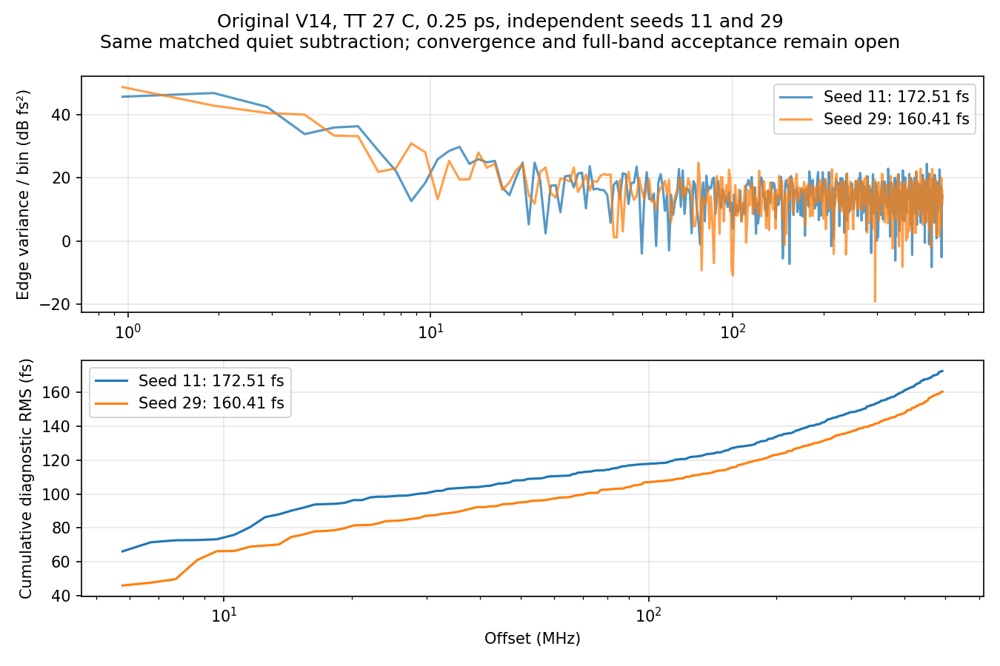

# 第80次噪声与抖动审阅

2026-10-08T14:05:59+08:00。原版V14 0.25ps第二种子完成并独立复核，高偏移诊断160.410117fs；seed11/29相差7.01%，未证明统计或数值收敛。已派发原版0.5ps seed29对照，RT4 0.25ps seed29继续。

原版完整17644个MOS，TT27/1.2V/24MHz/K41/M4/10fF/Q5 RLC/CF10，外部参考与供电理想；maxstep0.25ps、reltol1e-6、vabstol1nV、iabstol1pA、traponly，seed29、noisefmax160GHz/noisefmin1MHz。2.2µs暖启动续算，0–1µs关闭噪声，1–2.2µs同时开启PLL实际器件与RLC电阻噪声。

pllmainquarterseed29onssd01在SSDa9c1cfaf完成，原PID335342已退出、单次派发exit_code=0。服务器Spectre终止时间Oct8 13:22:30，墙钟18h32m12s，11987648个接受步，0errors/1warning/15notices；Newton恢复、跳断点、LTE放宽、最小步长警告均为0。此噪声记录未报告梯形振铃，复用quiet的两次内部振铃风险保留。本地13:30:40回收完成、13:32:24流水线完成分析、13:32:53保护器正常结束；历史read_error未阻止后续回收。没有取消或重跑该任务。

原始波形6116390608字节、日志14727字节、完整终态280615字节全部回收并与远端SHA256匹配，26项输入一致。独立解析7736694个时间点和23个信号，与缓存最大差0、重复记录0；完整终态7859个键全部保留，关键电压末值与终态最大差4.88e-15V。

19个初态电压差均为0，噪声开启前公共quiet前缀差0，测量段真实状态保持，复用quiet末1µs原稳态门限通过。1.1µs起1024个同序输出上升沿，仅减去匹配quiet和残差均值；5.28515625–492MHz频桶RMS为160.410116799fs。独立全复数FFT复算一致，Parseval相对差2.22e-16。未限带短记录残差RMS为382.346751fs，不是10kHz全带值。矩形窗预注册值保留；噪声能量归一化Hann为156.460620fs，端点差0.152933983ps。

两份0.25ps协议确认DUT、初态、参考相位、容差、带宽与时长相同，噪声TB仅noiseseed11→29，复用完全相同quiet。RMS172.507488→160.410117fs，变化-7.012665%；这表示两条独立实现的分散，不是设计改进。5–20/20–100/100–492MHz子带RMS为94.753/69.900/126.074→79.766/71.187/119.588fs。方差差除以分块标准误平方和开根为-1.703，仅为描述量，非显著性检验或置信区间。两种子不能建立充分统计置信度；不能以较低种子、不同窗或随机轨迹之差作为验收或数值噪声底。

为补齐原版2步长×2种子的对照，新增0.5ps seed29：相对原版0.5ps seed11仅改种子；相对原版0.25ps seed29仅改maxstep。复用已完成且匹配的0.5ps quiet，现有流水线重新通过数值、初态、逻辑和稳态门限后派发，无重复quiet任务。2026-10-08T14:05:38.411137+08:00实查pllrt4quarterseed29onssd01：SSD6ba05ae6/PID44307；pllmainhalfseed29onssd01：SSD2d3a5661/PID47483；2项Spectre、14请求线程，各26项输入匹配，cwd/raw/日志/终态/TMPDIR均在项目SSD。RT4与原版分别验证；同一种子在不同自适应步长下仍不保证逐样点相同的随机实现。

原版seed11的0.5ps/0.25ps结果195.390405/172.507488fs保留；新增原版0.25ps seed29为160.410117fs。RT4候选seed11的0.5ps/0.25ps为100.669316/95.862399fs，RT4 seed29尚在运行，候选尚未采用。最终10kHz至fOUT/2、排除离散杂散、RMS<200fs仍未知。5.285MHz以下缺口、数值/容差/方法、带宽、种子与长记录收敛未闭合；quiet相减不等于完成离散杂散分类，局部器件结果不能替代完整PLL验收。33频点、完整PVT/MC、供电爬升、真实输入/负载和PEX覆盖缺失；功耗仍超4mW、面积未验证，优化与后端后置，指标不变。

[回收审计](results/full_pll_main_quarter_seed29_noise_recovery_audit.json)；[种子对照](results/full_pll_main_quarter_seed_comparison.json)；[0.5ps第二种子协议](results/full_pll_main_half_seed29_pair_protocol.json)。

原始输入输出：research/runs/spectre_cmos_v14_full/pllmainquarterseed29onssd01/full_pll_main_quarter_seed29_on_tt；远端哈希证据：research/main_quarter_seed29_noise_remote_audit80.json。复现：audit_main_quarter_seed29_noise_recovery.py、compare_main_quarter_noise_seeds.py、analyze_main_quarter_seed29_noise_window_sensitivity.py。

全部12项需求、14模块及六层状态见[完整汇报](../../../reports/2026-10-08T1405.yaml)。
