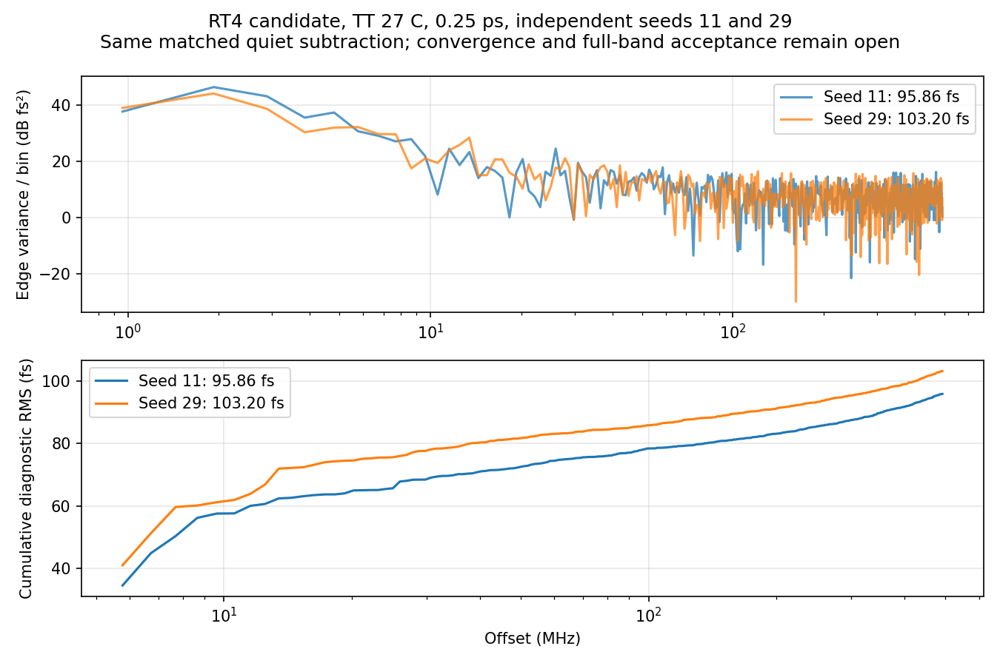

# 第81次噪声与抖动审阅

2026-10-08T17:08:06+08:00。RT4候选0.25ps第二种子完成并独立复核，高偏移诊断103.195977fs；seed11/29相差7.65%，未证明统计或数值收敛。已派发RT4 0.5ps seed29对照，原版0.5ps seed29继续。

RT4/newbank候选完整17617个MOS，TT27/1.2V/24MHz/K41/M4/10fF/Q5 RLC/CF10，外部参考与供电理想；maxstep0.25ps、reltol1e-6、vabstol1nV、iabstol1pA、traponly，seed29、noisefmax160GHz/noisefmin1MHz。2.2µs暖启动续算，0–1µs关闭噪声，1–2.2µs同时开启PLL实际器件与RLC电阻噪声。

pllrt4quarterseed29onssd01在SSD6ba05ae6完成，原PID44307已退出、单次派发exit_code=0。服务器Spectre终止时间Oct8 16:48:33，墙钟18h55m28s，12012613个接受步，0errors/1warning/15notices；Newton恢复、跳断点、LTE放宽、最小步长警告均为0。此0.25ps quiet及两种子noise均未报告梯形振铃；没有告警不等于数值收敛。16:56:35本地回收完成、16:58:06流水线完成分析、16:58:39保护器正常结束，没有取消或重跑。

原始波形6060705822字节、日志14716字节、完整终态281361字节全部回收并与远端SHA256匹配，26项输入一致。独立解析7665013个时间点和23个信号，与缓存最大差0、重复记录0；完整终态7863个键全部保留，关键电压末值与终态最大差4.88e-15V。

19个初态电压差均为0，噪声开启前公共quiet前缀差0，测量段真实状态保持，复用quiet末1µs原稳态门限通过。1.1µs起1024个同序输出上升沿，仅减去匹配quiet和残差均值；5.28515625–492MHz频桶RMS为103.195976726fs。独立全复数FFT复算一致，Parseval相对差0。未限带短记录残差RMS为234.532761fs，不是10kHz全带值。矩形窗预注册值保留；噪声能量归一化Hann为112.286080fs，端点差-0.126724551ps。

两份0.25ps协议确认DUT、初态、参考相位、容差、带宽与时长相同，噪声TB仅noiseseed11→29，复用完全相同quiet。RMS95.862399→103.195977fs，变化+7.650109%；这表示两条独立实现的分散，不是设计变化。5–20/20–100/100–492MHz子带RMS为63.996/45.266/55.183→74.468/42.640/57.322fs。方差差除以分块标准误平方和开根为0.776，仅为描述量，非显著性检验或置信区间。两种子不足以建立充分统计置信度；7.65%种子分散也使此前seed11单次步长减半的4.77%变化不能直接视为数值误差界。不能挑选较低种子或窗口作为验收，不能将随机轨迹相减当作数值噪声底。

为补齐RT4的2步长×2种子对照，新增0.5ps seed29：相对RT4 0.5ps seed11仅改种子；相对RT4 0.25ps seed29仅改maxstep，已逐字核验。复用已完成且匹配的RT4 0.5ps quiet，现有流水线重新通过数值、初态、逻辑和稳态门限后派发，无重复quiet任务。2026-10-08T17:07:29.940476+08:00实查pllmainhalfseed29onssd01：SSD2d3a5661/PID47483；pllrt4halfseed29onssd01：SSD58110ce2/PID221473；2项Spectre、14请求线程，各26项输入匹配，cwd/raw/日志/终态/TMPDIR均在项目SSD。原版与RT4保持独立证据；同一种子在不同自适应步长下仍不保证逐样点相同的随机实现。

原版seed11的0.5ps/0.25ps高偏移结果195.390405/172.507488fs，原版0.25ps seed29为160.410117fs；原版0.5ps seed29尚在运行。RT4候选seed11的0.5ps/0.25ps为100.669316/95.862399fs，新增0.25ps seed29为103.195977fs；RT4 0.5ps seed29尚在运行，候选尚未采用。最终10kHz至fOUT/2、排除离散杂散、RMS<200fs仍未知。5.285MHz以下缺口、数值/容差/方法、带宽、种子与长记录收敛未闭合；quiet相减不等于完成离散杂散分类，局部器件结果不能替代完整PLL验收。33频点、完整PVT/MC、供电爬升、真实输入/负载和PEX覆盖缺失；功耗仍超4mW、面积未验证，优化与后端后置，指标不变。

[回收审计](results/full_pll_rt4_quarter_seed29_noise_recovery_audit.json)；[种子对照](results/full_pll_rt4_quarter_seed_comparison.json)；[0.5ps第二种子协议](results/full_pll_rt4_half_seed29_pair_protocol.json)。

原始输入输出：research/runs/spectre_cmos_v14_full/pllrt4quarterseed29onssd01/full_pll_rt4_quarter_seed29_on_tt；远端哈希证据：research/rt4_quarter_seed29_noise_remote_audit81.json。复现：audit_rt4_quarter_seed29_noise_recovery.py、compare_rt4_quarter_noise_seeds.py、analyze_rt4_quarter_seed29_noise_window_sensitivity.py。

全部12项需求、14模块及六层状态见[完整汇报](../../../reports/2026-10-08T1708.yaml)。
