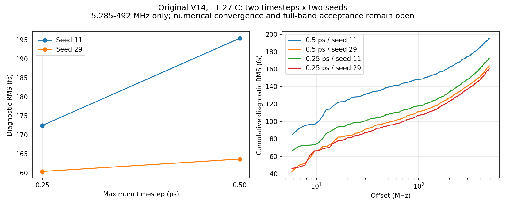

# 第83次噪声与抖动审阅

2026-10-09T08:28:44+08:00。原版V14的0.5ps seed29完成并独立复核，高偏移诊断163.650060fs；两步长×两种子矩阵齐全，尚未证明数值或统计收敛。已启动仅收紧电流容差至100fA的独立quiet验证，RT4 0.5ps seed29继续。

原版完整17644个MOS，TT27/1.2V/24MHz/K41/M4/10fF/Q5 RLC/CF10、原输出链，外部参考与供电理想；maxstep0.5ps、reltol1e-6、vabstol1nV、iabstol1pA、traponly，seed29、noisefmax160GHz/noisefmin1MHz。2.2µs暖启动续算，0–1µs关闭噪声，1–2.2µs开启全部实际PLL器件及RLC电阻噪声，未钳位功能控制。

pllmainhalfseed29onssd01在SSD2d3a5661正常完成，原PID47483已退出、单次派发exit_code=0。Spectre从Oct8 14:03:12运行至Oct9 08:09:57，墙钟18h6m45s、10311511个接受步，0errors/1warning/15notices；Newton恢复、跳断点、LTE放宽和最小步长警告均为0，未报告梯形振铃。08:19:25本地回收完成、08:19:42配对流水线完成、08:19:57保护器正常退出。唯一警告仍为过时AHDL环境变量，非噪声模型失败。

原始波形6103010744字节、日志14688字节、完整终态280599字节已回收并逐项匹配远端SHA256，26项输入一致。独立解析7719778个时间点和23信号，与缓存最大差0，重复记录0；完整终态7859个键全部保留，已保存电压末值与终态最大差5.11e-15V。

19个初态电压差均为0，噪声开启前公共quiet前缀差0，测量段真实锁定状态保持，匹配quiet末1µs稳态通过。1.1µs起1024个同序上升沿，仅减匹配quiet和残差均值；预注册矩形窗5.28515625–492MHz频桶RMS为163.650059816fs。独立全复数FFT一致，Parseval相对差2.22e-16。能量归一化Hann为156.562637fs，端点差0.657462841ps；未限带短记录残差RMS 523.234468fs仍不是10kHz全带值。不得以较低窗口值替代预注册值。

| 原版步长 | seed 11 | seed 29 |
|---|---:|---:|
| 0.5ps | 195.390405fs | 163.650060fs |
| 0.25ps | 172.507488fs | 160.410117fs |

原版四份协议逐项核对DUT、完整初态、参考相位、容差、带宽和时长相同，TB仅maxstep及noiseseed变化。0.5ps的seed11/29为195.390405/163.650060fs，0.25ps为172.507488/160.410117fs。固定0.5ps换种子变化-16.244577%；步长减半在seed11/29分别变化-11.711382%/-1.979799%。两种子等权平均方差开根为180.220355→166.568663fs（-7.575000%），仅描述这四条记录，不替代原始单记录或构成验收。每步长仅两种子，不能给出可靠总体置信区间，也不能把步长差直接归于离散化误差；同种子在不同自适应网格上不保证相同随机实现。四值全部保留，不相减随机轨迹来定义数值噪声底。0.25ps quiet的两条内部梯形振铃记录仍保留。

下一项采用0.25ps/seed11原版基线，仅iabstol从1pA收紧至100fA，DUT、初态、参考相位、积分方法、带宽和时长保持逐字一致。此前100fA仅为另一RT4初态的5ns短筛查，不能代替本次全轨迹验证；新quiet必须独立完成原数值/初态/状态/稳态门限，才由流水线派发pllmainiab100onssd01。为容纳收紧容差后的未知耗时，专用流水线quiet等待上限24h，噪声客户端48h；这些均是等待上限，不作为完成证据。2026-10-09T08:28:30.273291+08:00实查pllmainiab100offssd01：SSDb47d7834/PID208575；pllrt4halfseed29onssd01：SSD58110ce2/PID221473，共2项Spectre/14请求线程，各26项输入一致，cwd/raw/日志/终态/TMPDIR在项目SSD。RT4仍为原PID221473，推进至1975.172ns/2200ns、raw 4913811456字节，无终止摘要或exit_code；保护器及只回收现有任务的流水线正常。

原版四条高偏移记录已齐全，RT4候选0.5ps seed11为100.669316fs、0.25ps seed11/29为95.862399/103.195977fs；RT4 0.5ps seed29仍在运行，候选未采用。最终10kHz至fOUT/2、排除离散杂散、RMS<200fs仍未知。5.285MHz以下缺口、容差/方法/带宽、种子与长记录收敛未闭合；quiet相减不等于完成离散杂散分类，局部器件结果不能替代完整PLL验收。33频点、完整PVT/MC、供电爬升、真实输入/负载和PEX覆盖缺失；功耗仍超4mW、面积未验证，功耗优化与后端后置，指标不变。

[原始数据审计](results/full_pll_main_half_seed29_noise_recovery_audit.json)；[矩阵对照](results/full_pll_main_step_seed_matrix.json)；[100fA协议](results/full_pll_main_iab100_pair_protocol.json)。

原始输入输出：research/runs/spectre_cmos_v14_full/pllmainhalfseed29onssd01/full_pll_main_half_seed29_on_tt；远端哈希证据：research/main_half_seed29_noise_remote_audit83.json。复现入口：audit_main_half_seed29_noise_recovery.py、compare_main_step_seed_matrix.py、analyze_main_half_seed29_noise_window_sensitivity.py。

全部12项需求、14模块及六层状态见[完整汇报](../../../reports/2026-10-09T0828.yaml)。
