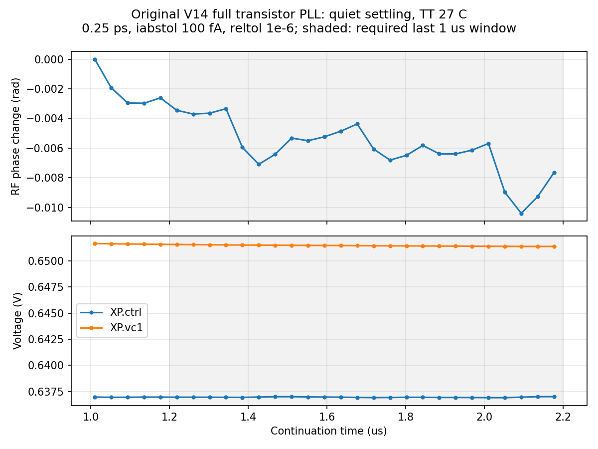

# 第84次噪声与抖动审阅

2026-10-09T12:27:48+08:00。原版100fA无噪声全轨迹通过独立复核，配对噪声已由既有流水线启动；RT4 0.5ps seed29旧任务退出141且波形截断，失败数据已回收，修复SSH标准输出依赖后按相同条件重跑。

原版完整V14，TT27/1.2V/24MHz/K41/M4/10fF/Q5 RLC/CF10；外部参考与供电理想，全部功能控制为实际晶体管。maxstep0.25ps、reltol1e-6、vabstol1nV、iabstol100fA、traponly；2.2µs暖启动，无噪声记录全程关闭噪声。

pllmainiab100offssd01在SSDb47d7834正常结束，PID208575已退出、exit_code=0；Oct9 08:24:26–11:44:52，墙钟3h20m26s。Spectre 0errors/1warning/15notices，Newton/LTE/跳断点/最小步长恢复计数均0，无梯形振铃报告。原始波形4031443320字节，26输入、raw/log/完整终态远端本地SHA一致；独立解析5099998时间点、23信号与缓存最大差0、重复记录0。完整7859状态键保留，已保存电压末值差最大5.11e-15V；19初态电压差0，真实锁定状态保持。末1µs含24参考采样，输出983.999907342MHz、相位峰峰0.007059909rad、漂移-0.004663936rad/µs，原门限全部通过。

与0.25ps/1pA quiet逐项核对，仅iabstol从1e-12变为1e-13；1024匹配边沿最大绝对变化0.075431884fs、去均值RMS 0.022805442fs，所选高偏移频桶内确定性差值RMS 0.008517065fs。这些仅为无噪声数值敏感性，不是随机抖动、噪声底或收敛证明；100fA noisy必须与自己的quiet配对。

RT4旧pllrt4halfseed29onssd01/SSD58110ce2/PID221473已退出；远端exit_code=141，缺少Spectre完成摘要。日志报告10488501接受步，完整终态文件存在，但raw在2.199999400442536µs的一条cfg_ready记录处截断，最后完整记录为2.199999177893693µs。约6.046GB raw、日志及终态已完整回收并核验前后SHA稳定，26输入与引用初态匹配；不生成有效result、不计算或纳入步长/种子矩阵RMS。此前SSH已断开；141与SIGPIPE一致，故障注入复现同一机制，但没有内核信号轨迹，根因仍表述为有证据支持的判断。

启动策略将Spectre子进程stdin指向/dev/null、stdout/stderr指向该SSD目录console.log，并使用nohup；不再让solver标准输出依赖SSH读取端。无EDA仿真的故障注入：关闭读取端后旧方式退出141、新方式退出0且stdout/stderr及完成标志完整；重复派发返回73，永久原子claim保留。仅退休已无效的旧本地保护器6184；未停止任何远端仿真。pllrt4halfseed29onssd02使用原case/TB、DUT、初态、参考相位、容差、带宽、时长和seed29，quiet五项门限重新检查通过。

2026-10-09T12:26:03.813069+08:00实查原版100fA noisy：SSDa0a68349/PID414952；RT4同条件重跑：SSDf659bace/PID447196。共2长任务/14请求线程，6本地runner/pipeline/guard均核验命令行；输入与引用初态SHA一致，cwd/raw/log/TMPDIR在SSD。已核实RT4新进程fd1/fd2都指向SSD console.log。原版已运行任务保留原启动策略，未重启；其SSH连接及进度继续监视。两个新噪声结果均未完成，RT4矩阵仍缺0.5ps seed29有效值。

已接受高偏移诊断仍为原版0.5ps seed11/29：195.390405/163.650060fs，0.25ps：172.507488/160.410117fs；RT4候选0.5ps seed11：100.669316fs，0.25ps seed11/29：95.862399/103.195977fs。这些是1024边沿、约5.285–492MHz的短记录诊断，RT4候选未采用。最终10kHz至fOUT/2、排除离散杂散、RMS<200fs仍未知；数值容差、方法、带宽、种子、长记录及杂散分类尚未闭合。33频点及完整PVT/MC、真实输入/负载、供电爬升和PEX仍缺失，功耗超4mW、面积未验证；功耗优化与后端后置，指标不变。

[quiet独立审计](results/full_pll_main_iab100_recovery_audit.json)；[电流容差对照](results/full_pll_main_quiet_current_tolerance_comparison.json)；[失败诊断](results/rt4_half_seed29_failure_diagnosis84.json)；[传输测试](results/console_isolation_validation84.json)。

原始数据均保存在 research/runs/spectre_cmos_v14_full/ 下对应run/case；失败原始记录约6.05GB，quiet约4.03GB，仅摘要与哈希进入交付面。复现：audit_main_iab100_recovery.py、compare_main_quiet_current_tolerances.py；传输回归 research/verify_console_isolation84.py；失败回收 research/collect_failed_rt4_half_seed29_84.py。

全部12需求、14模块及六层状态见[完整报告](../../../reports/2026-10-09T1227.yaml)。
