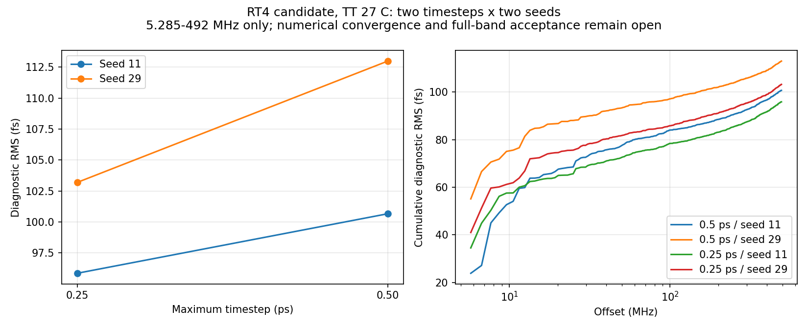

# 第86次完整PLL噪声审阅

2026-10-10T08:59:23+08:00。RT4候选0.5ps seed29重跑正常完成并经独立复算，高偏移诊断为112.993992fs，RT4两步长×两种子矩阵补齐。原版100fA旧传输任务退出141、raw截断，已保留失败证据并派发输入完全相同的SSD隔离传输重跑。全带抖动仍未验收。

服务器实际核查：RT4旧PID447196和原版旧PID414952均已消失。RT4退出0、Spectre 0错误/1警告/22通知、记录到2.2µs且有END；服务器日志从Oct9 12:21:37至Oct10 07:32:54，约19h11m18s。原版退出141、无Spectre终止摘要、raw末条截断且无END，不能以接近2.2µs或已有final.ic认定成功。两组原有本地4个监控/回收进程均已消失，状态停留02:09；本轮未停止任何仿真。

两组全部输入、引用初态和原始输出均回收并在传输前后核验SHA稳定，保留原有claim及部分下载。RT4独立文本解析核对7646435个时刻、23信号，缓存差异全部0、重复记录0；完整终态7863项且初态键集保持。独立复数FFT与现有分析一致，Parseval相对误差1.11e-16。初始化、噪声开启前quiet一致性、实际状态及quiet平稳性五类门限通过；Newton/LTE/跳断点均0。5条quiet前缀内部振铃仍保留。

RT4独立矩阵：0.5ps seed11=100.669316fs；0.5ps seed29=112.993992fs；0.25ps seed11=95.862399fs；0.25ps seed29=103.195977fs。seed 11 to 29 at 0.5 ps：+12.243%；seed 11 to 29 at 0.25 ps：+7.650%；0.5 to 0.25 ps at seed 11：-4.775%；0.5 to 0.25 ps at seed 29：-8.671%。两种子等权方差汇总的RMS步长变化为-6.927%，仅作描述，不替代单次预注册结果。两种子不足以建立统计/数值收敛；同一种子在不同自适应网格上不表示同一随机波形，不将轨迹差直接视为数值误差。RT4仍为未采用候选。

原版100fA失败与旧SSH stdout读端断开后的SIGPIPE机制一致，尚无内核事件证明唯一根因；第84次独立故障注入及本次RT4正常结束支持传输修复。新run为pllmainiab100onssd02，仍为原版V14、0.25ps/100fA/seed11，testbench、DUT、完整初态、参考相位、噪声带宽和停止时间与失败前序完全相同。只更新run ID和已验证的nohup+SSD console.log传输；自己的100fA quiet五门限重核通过后才派发。原版重跑占用7请求线程，cwd/raw/log/tmp均SSD，stdout/stderr均console.log，26输入SHA匹配。

已另派发RT4候选0.25ps/seed11/1pA的Gear2方法对照，电路、完整初态、参考相位、2.2µs停止时间及噪声频带保持，只将traponly改为gear2only。先跑专属quiet并通过原有五门限，再由单一流水线派发noisy；实际日志的方法字段另行强制核对。Gear的人工阻尼可能改变幅度/频率或噪声，不能因波形平滑或RMS较低而认定正确。当前quiet正在运行，尚无该方法结果；与原版重跑共2长任务/14请求线程，均SSD且stdout/stderr指向console.log。

已接受高偏移诊断：原版0.5ps seed11/29为195.390405/163.650060fs，0.25ps为172.507488/160.410117fs；RT4候选0.5ps为100.669316/112.993992fs，0.25ps为95.862399/103.195977fs。均为TT27/1.2V/984MHz/10fF/Q5RLC/理想参考与电源，1024边沿、约5.28515625–492MHz、各自quiet相减及去均值。最终10kHz至fOUT/2、排除离散杂散、RMS<200fs仍未知；方法、容差、带宽、长记录和杂散分类未闭合。33频点/完整PVT/MC/真实输入负载/供电爬升/PEX仍缺失；功耗超4mW、面积未验证，功耗优化及后端继续后置。

[独立审计](results/full_pll_rt4_half_seed29_noise_recovery_audit.json)；[矩阵](results/full_pll_rt4_step_seed_matrix.json)；[原版失败证据](results/main_iab100_failed_collection86.json)；[重跑协议](results/full_pll_main_iab100_retry_pair_protocol.json)。

完整12需求、14模块及六层状态见[汇报](../../../reports/2026-10-10T0859.yaml)。
