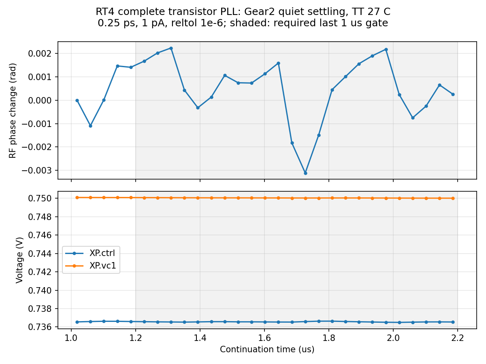
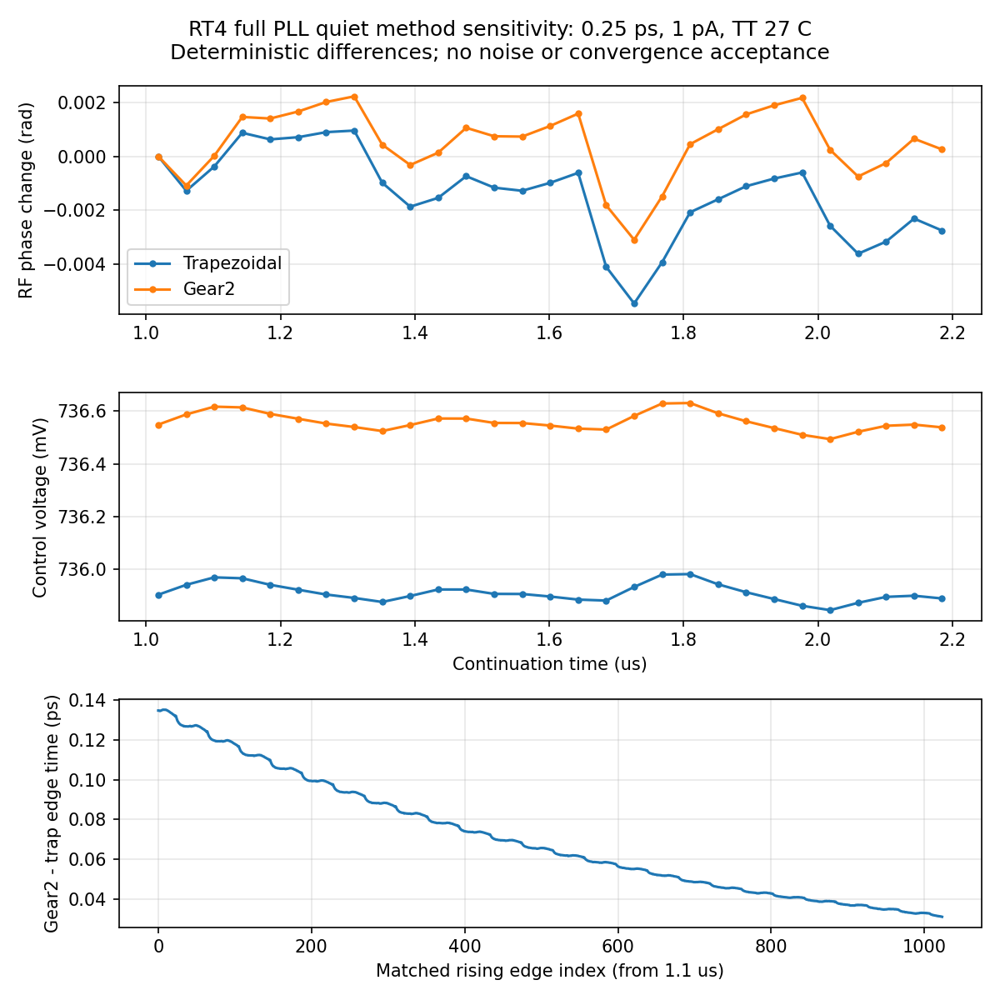

# 第87次完整PLL噪声审阅

2026-10-10T13:55:19+08:00。RT4候选Gear2无噪声记录正常完成，原始数据独立复核及五项门限通过；现有流水线已启动匹配的Gear2噪声仿真。无噪声方法对照显示确定性差异，尚不能证明含噪声收敛；最终全带抖动仍未验收。

Gear quiet任务pllrt4gearquarteroffssd01已于服务器Oct10 13:20:44正常结束，退出码0；08:52:39启动，耗时4h28m4s。原PID175273已消失，Spectre 0错误/1警告/15通知，2.2µs原始记录含END。实际gear2only、maxstep0.25ps、reltol1e-6、1nV/1pA；Newton、LTE放松、跳断点及最小步长告警均0，无梯形振铃通知。

正常回收后再次核对SSD输入与输出：26输入及raw/log/完整终态等7输出前后远端SHA稳定，本地一致；原始波形4398212984字节。独立文本解析5563186个时刻、23信号，和NPZ差异全部0，无重复/截断/非有限值。19初始电压与来源初态差0；终态7863项与初态键集相同，保存电压与波形终点最大差5.11e-15V。

初始化、数值干净度、实际状态、完整记录和平稳性五门限均通过；最后1µs有24个参考采样，平均输出983.999939498MHz，RF相位峰峰0.005334828rad、漂移-0.000927844rad/µs，最大RF/输出每参考周期误差0.000542587/0.000144228周期。另列三个短窗口用于诊断，没有代替最后完整1µs门限。

方法对照逐项锁定同一RT4电路、完整初态、参考相位、步长、容差、种子及停止时间，testbench唯一变化为traponly→gear2only。1024个匹配输出边沿，Gear减trap的平均时间差70.392327fs、峰峰104.157556fs；仅去均值后的差异RMS为29.458766fs，高偏移频带内差异RMS为10.047888fs。最后1µs平均输出频差85.788271Hz；参考采样控制电压均差0.647408mV。这些是无噪声确定性方法敏感性，不是随机抖动、绝对数值误差底或收敛证明；没有拟合去漂移或挖除杂散。Gear人工阻尼的影响仍需含噪声对照。

既有Gear流水线PID124276在13:28:05记录五门限通过并自动派发pllrt4gearquarteronssd01（SSD c2e01177，实际PID439942），专属quiet不与trap结果混用。原版pllmainiab100onssd02（SSD 727a90ca，PID172136）继续100fA容差噪声验证。本轮没有另行派发或停止仿真；实际共2长任务/14请求线程，4个流水线/保护器和2个回收子进程均存活。实际进程cwd、raw/log/tmp、stdout/stderr均SSD，输入与协议匹配。

已接受的短记录高偏移噪声诊断仍为：原版0.5ps seed11/29为195.390405/163.650060fs，0.25ps为172.507488/160.410117fs；RT4候选0.5ps为100.669316/112.993992fs，0.25ps为95.862399/103.195977fs。本轮未增加有效随机抖动数值。上述均限TT27/1.2V/984MHz/10fF/Q5RLC、理想参考与电源，1024边沿及约5.28515625–492MHz。最终10kHz至fOUT/2、排除离散杂散、RMS<200fs仍未知；方法、容差、带宽、种子和长记录收敛未闭合，RT4未采用。33频点/完整PVT/MC/真实输入及负载/供电爬升/PEX仍缺失；功耗超4mW、面积未验证，功耗优化及后端继续后置。

[独立原始数据审计](results/full_pll_rt4_gear_quiet_recovery_audit.json)；[方法对照](results/full_pll_rt4_quiet_method_comparison.json)；[门限快照](results/full_pll_rt4_gear_quiet_validation87.json)；[当前协议](results/full_pll_rt4_gear_quarter_pair_protocol.json)。

完整12需求、14模块与六层状态见[汇报](../../../reports/2026-10-10T1355.yaml)。
