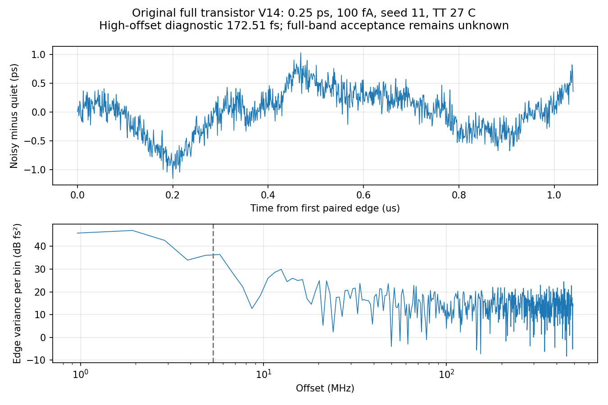
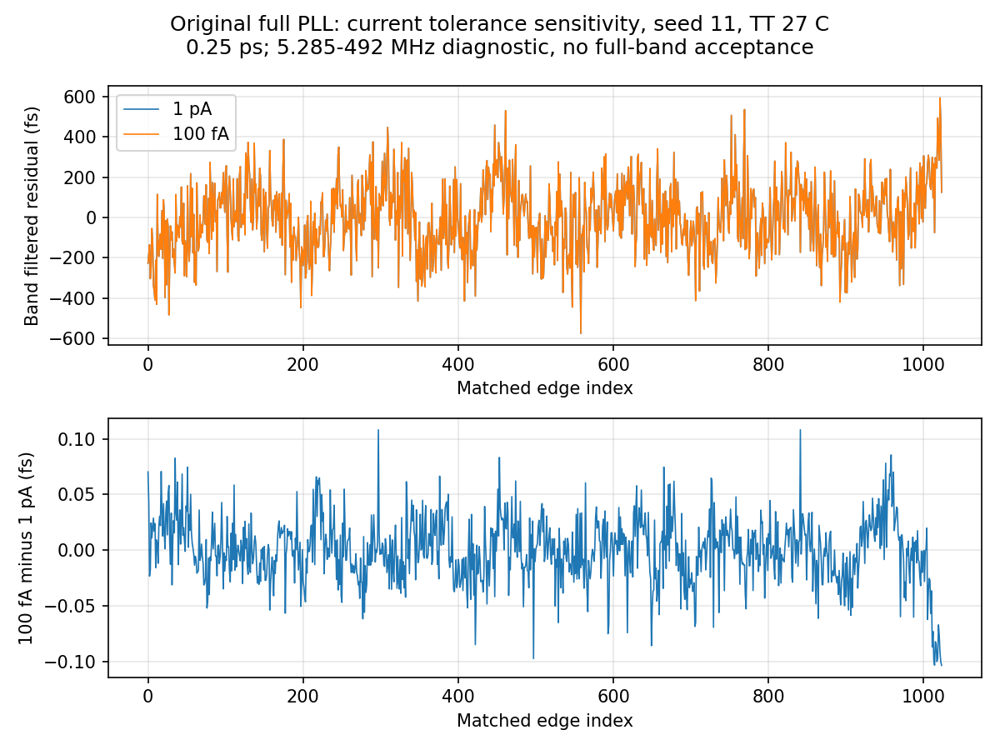

# 第88次完整PLL噪声审阅

2026-10-11T05:17:25+08:00。原版V14 100fA完整噪声记录正常完成并通过独立原始数据与FFT复核，高偏移诊断172.505385fs；与1pA结果非常接近，但单种子短记录不构成全带或数值收敛验收。已启动320GHz噪声源带宽的匹配quiet验证，RT4 Gear噪声继续运行。

任务pllmainiab100onssd02的原服务器PID172136已退出，SSD终态码0；Spectre 0错误/1警告/15通知，日志记录Oct10 08:49:58至Oct11 04:22:05，耗时19h32m7s。日志时钟与本地派发时间分开保留。11968590个接受步；2.2µs原始记录完整含END。实际traponly、0.25ps、reltol1e-6、1nV/100fA、noisefmax=160GHz及noisefmin=1MHz（其下源噪声谱密度展平）；Newton/LTE放松/跳断点/最小步长及梯形振铃均未报告。

已回收并独立复核26输入与raw/log/完整终态等7输出，远端前后SHA稳定且本地一致；原始波形6102620761字节。独立文本解析7719337个时刻、23信号，与缓存差异全部0，无重复、非有限值或截断；19初始保存电压差0，终态7859项键集完整。数值、初始化、共同quiet前缀、实际状态和quiet最后1µs平稳性五门限均通过。历史exit141截断前序继续排除。

同一原版全晶体管PLL在TT27/1.2V/24MHz参考/K41/M4/984MHz/10fF/Q5RLC/CF10、理想外部参考与供电下，以自有100fA quiet模板配对1024个输出边沿，仅去均值，独立复FFT得到172.505385416fs，覆盖5.28515625–492MHz；Parseval相对误差2.22e-16。没有拟合去漂移、幅度缩放或任意挖除谱线。 同一1024边沿残差在仅去均值、未作高偏移筛选时的RMS为376.645779fs，表明被高偏移筛选排除的低频分量仍显著；该有限记录含未分类频谱成分，也不是10kHz起算并排除离散杂散后的验收值。

逐项确认DUT、初态、参考相位、步长、种子11、噪声带宽及记录长度相同，TB仅iabstol从1pA变100fA。各自quiet配对后，RMS为172.507488424/172.505385416fs，相差-0.002103008fs（-0.001219%）；带内两条残差之差RMS为0.029031fs。这支持本条件下电流容差敏感性很小，不代表绝对数值误差界、统计收敛或10kHz验收。

新增pllmainbw320offssd01先运行无噪声基线；原版保持100fA、0.25ps、seed11，仅noisefmax由160GHz改为320GHz。必须通过原五门限后，现有run_main_iab100_noise_pipeline83.py才派发pllmainbw320onssd01。方法、物理电路、初态和积分频带不变。源带宽加倍用于检测高频噪声截断，不扩展低偏移记录覆盖。RT4 Gear noisy仍由原流水线运行。当前2项长仿真、14请求线程，均已核对SSD cwd、临时目录、输出描述符和输入哈希。

最终10kHz至fOUT/2、排除离散杂散、RMS<200fs仍未知。原版和RT4仍分开；RT4未采用。原版既有0.5ps seed11/29为195.390405/163.650060fs，0.25ps 1pA为172.507488/160.410117fs；RT4 0.5ps为100.669316/112.993992fs，0.25ps为95.862399/103.195977fs，均是相同TT理想外部条件下的高偏移短记录。方法/带宽/更多种子/记录长度及完整离散杂散分类未闭合。33频点/完整PVT/MC/真实输入与负载/供电爬升/PEX仍缺；功耗超4mW、面积未验证，功耗优化及后端后置。

[原始数据审计](results/full_pll_main_iab100_noise_recovery_audit.json)；[容差对照](results/full_pll_main_noise_current_tolerance_comparison.json)；[320GHz协议](results/full_pll_main_bw320_pair_protocol.json)。完整12需求、14模块与六层状态见[汇报](../../../reports/2026-10-11T0517.yaml)。
