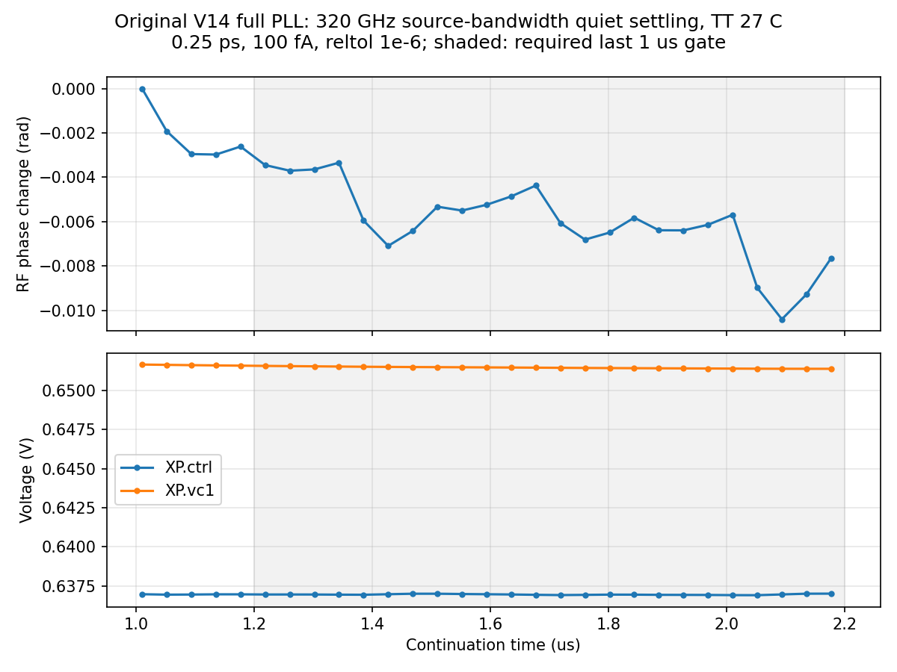
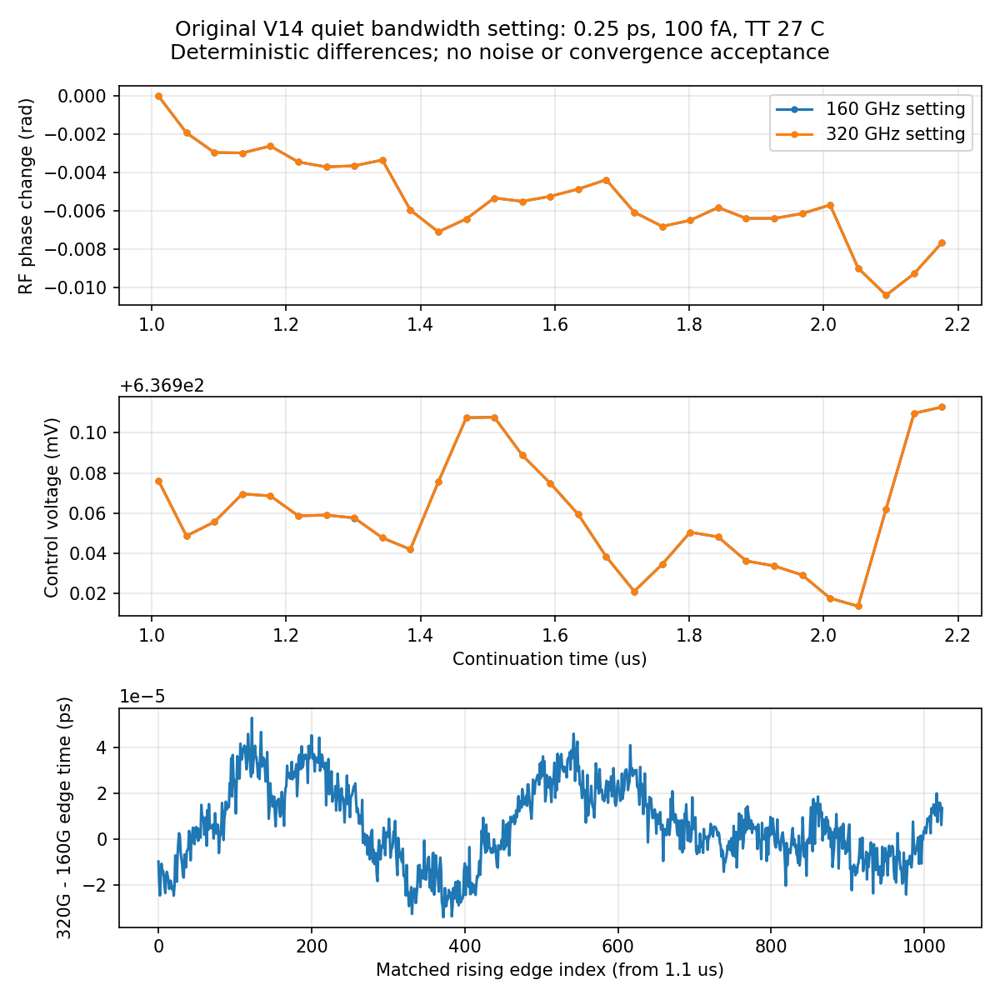

# 第89次完整PLL噪声审阅

2026-10-11T09:20:58+08:00。原版320GHz无噪声记录已完整回收并通过原五门限，现有流水线自动启动匹配噪声；独立审阅发现内部梯形积分振铃，已单独列为数值风险。RT4 Gear噪声继续运行，最终全带抖动仍未知。

pllmainbw320offssd01的原服务器PID423125已退出，SSD终态码0；Spectre 0错误/1警告/17通知，日志时钟Oct11 05:15:19至08:38:31，墙钟3h23m12s、tran耗时3h23m10s、9349668个接受步。日志时钟与本地派发时间分开保留。实际traponly、0.25ps、reltol1e-6、1nV/100fA、noisefmax=320GHz、noisefmin=1MHz；整段2.2µs噪声关闭。

26输入及raw/log/终态等7输出已按远端前后SHA稳定和本地一致性回收；原始波形4031745472字节，含完整END。独立解析5100415时刻、23信号，与缓存差异全部0，无重复、非有限值或截断；19初始保存电压差0，终态7859项键集完整。另核对本次quiet及两项在跑任务的实际readic绝对目标和协议SHA一致，均位于SSD。

原版完整晶体管PLL在TT27/1.2V/24MHz/K41/M4/984MHz/10fF/Q5RLC/CF10、理想外部参考和供电条件下，完整最后1µs有24个参考采样；相位峰峰0.007058873rad、漂移-0.004663628rad/µs、输出983.999907365MHz，RF/输出每参考周期计数最大误差0.000524220/0.000223327。完成、既定数值恢复检查、初始化、实际状态、最后1µs平稳性五门限不变且均通过。1.0–1.5µs子窗漂移约−0.0120rad/µs，保留为诊断，不能宣称所有子窗完全平稳。

新增风险：1.92753µs处内部节点XP.XC.XF.X57.XS.XN.x报告梯形积分振铃，而160GHz 100fA quiet未报告。Newton/LTE放松/跳断点/最小步长告警为0；原numerically_clean字段只涵盖这些检查，不等于无振铃或数值收敛。该内部节点未保存，振幅未知。既定门限通过与此风险并存，不能以已保存输出接近来排除内部误差。本次不改门限、不据此宣称失效或停止尚在正常运行的噪声试验。

逐项核对物理电路、初态、参考相位、步长、容差、记录时长相同，quiet TB仅noisefmax从160改320GHz。匹配1024个输出上升沿后，320G减160G的平均边沿差0.006051399fs、去均值差值RMS 0.017160845fs、最大绝对差0.053154706fs；在5.28515625–492MHz诊断带内的确定性差值RMS 0.008371679fs，Parseval误差4.44e-16。最后1µs平均输出频率差0.023627535Hz。这些是无噪声轨迹差，既不是随机抖动，也不是绝对数值误差界或噪声带宽收敛。

现有流水线在08:45:43本地时间自动派发pllmainbw320onssd01，服务器PID164688、SSD目录6eeceb59，本地runner158320确属pipeline170072。它保持原版0.25ps/100fA/traponly/seed11，0–1µs关闭噪声，1–2.2µs开启320GHz上限的器件噪声，必须使用自有320GHz quiet模板。RT4 Gear noisy的PID439942、SSD目录c2e01177继续运行，方法为gear2only、0.25ps/1pA/160GHz。09:19实时核查共2项长仿真、14请求线程；两套流水线、保护脚本、runner共6个本地进程归属准确，SSD cwd/tmp/输出文件描述符、26输入及有效求解参数一致，无重复派发。

最近已确认的原版100fA/160GHz seed11噪声高偏移诊断为172.505385fs，与1pA的172.507488fs接近；原版及RT4其余步长/种子结果仍按第88次边界保留。本轮没有新增320GHz噪声RMS，也没有RT4 Gear噪声完成值。

最终10kHz至fOUT/2、排除离散杂散、RMS<200fs仍未知。原版和RT4仍分开；RT4未采用。原版既有0.5ps seed11/29为195.390405/163.650060fs，0.25ps 1pA为172.507488/160.410117fs；RT4 0.5ps为100.669316/112.993992fs，0.25ps为95.862399/103.195977fs，均是相同TT理想外部条件下的高偏移短记录。方法/带宽/更多种子/记录长度及完整离散杂散分类未闭合。33频点/完整PVT/MC/真实输入与负载/供电爬升/PEX仍缺；功耗超4mW、面积未验证，功耗优化及后端后置。

[原始数据审计](results/full_pll_main_bw320_quiet_recovery_audit.json)；[无噪声对照](results/full_pll_main_quiet_bandwidth_comparison.json)；[振铃风险](results/main_bw320_ringing_assessment89.json)；[320GHz协议](results/full_pll_main_bw320_pair_protocol.json)。完整12需求、14模块与六层状态见[汇报](../../../reports/2026-10-11T0920.yaml)。
