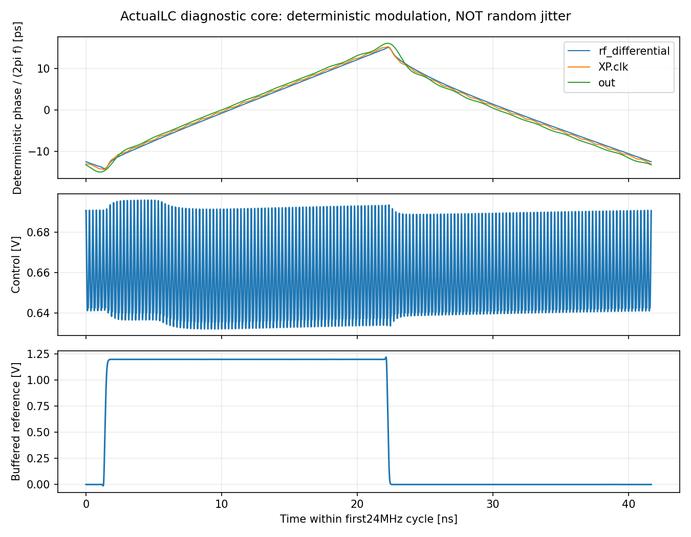

# 参考采样引起的周期扰动：新发现与隔离验证

2026-10-04。**真实 LC 诊断核心的参考相关杂散约 −28.8 dBc，是当前需要解决的明确风险。它是确定性调制，不计入已约定的随机抖动积分。** 数据来自已回收的无噪声瞬态，不是收敛 PSS，也不是完整 PLL 验收。

## 已完成的测量

条件：TT27、1.2 V、Q5 πRLC、粗调23、CF10、原尺寸重定时器、连续时钟分频候选、984 MHz／10 fF；真实采样环，慢控制保持静态。原始 `coretripsupply01` 初始瞬态采用1 ps／reltol1e-5／traponly。使用3.75–4.00 µs和4.00–4.25 µs两个独立窗口。

两个窗口的 −24 MHz 杂散分别为 −28.80013、−28.79996 dBc，+24 MHz约 −28.926 dBc。完整周期时域积分与FFT一致，已检查强谱线的插值加密差低于0.002 dB。按已观察平均漂移构造的失谐纯正弦控制，最大泄漏约 −93.68 dBc；这仅是漂移机制的控制实验，不能作为任意波形全部误差的严格上界。它与双窗一致性共同支持：−28.8 dBc量级的强线并非该微小漂移造成。

证据：[逐谱线和窗口校验](results/core_transient_spur_diagnosis.json)。复现入口 `analyze_core_transient_spurs.py`，原始文件和SHA见结果。仍欠独立电路步长、最终稳态及完整慢控制边界验证，因此不作最终验收数值。

## 扰动已在 LC 端出现

提取各波形基波频带的解析相位，24 MHz相位分量得到：

| 节点 | PM峰值 | 折合确定性时间峰值 |
|---|---:|---:|
| LC差分输出，3.936 GHz | 0.27597 rad | 11.159 ps |
| RF接收器输出，3.936 GHz | 0.27914 rad | 11.287 ps |
| 最终输出，984 MHz | 0.07205 rad | 11.654 ps |

LC与输出折合时间波形的相关系数为0.99534。LC端还存在约5.04%的24 MHz幅度调制；输出的相位调制占主要作用。以上是确定性相位波形，不能写成随机抖动RMS，也不能把某个峰值直接与200 fs RMS指标比较。

避开参考翻转前后2 ns后，参考高电平／采样保持时的平均RF约3.941182 GHz，参考低电平／跟踪时约3.930953 GHz，相差10.229 MHz。用对称方波频率扰动近似，输出÷4后的单边参考杂散约为 `20log10(|Δf|/(π·24MHz·4)) = −29.39 dBc`，与实际轨迹的−28.8 dBc量级接近。

控制节点总峰峰纹波约63.81 mV，但24 MHz单频分量峰值只有1.466 mV；不能把全部高频纹波当作24 MHz控制调制。尚未测得同条件KVCO，因此没有据此排除控制路径。

按上述单一方波调频机制估算，要使这一条参考杂散低于−60 dBc，保持／跟踪RF频差需小于约0.302 MHz，即相对当前观察缩小约34倍。此数只是补偿设计的数量级目标，不含电荷注入、幅度调制、其他谱线和PVT裕量，不能替代电路验证。

证据：[节点相位与半周期频率](results/core_reference_modulation.json)，复现 `analyze_core_reference_modulation.py`。

## 当前假设与已准备的实际电路测试

第一候选机制是采样开关周期改变VCO所见负载，引起两种振荡频率之间的切换；电荷注入、共享及其他直接参考耦合仍未分离。这一机制及互补dummy采样的补偿方法见Gao等的[原始论文，JSSC 2010，第III节](https://ris.utwente.nl/ws/files/6782511/Gao_IEEE_JSSC_sept_2010.pdf)。文献只提供机制依据，不能证明本项目的归因或改善。

`samplerload01`的五份实际MOS测试已准备：正常24 MHz参考、参考低、参考高，以及参考低时控制电压±10 mV。外部理想源将VCO控制电压固定在已测均值0.657999 V，先去除环路滤波器调频路径；电路核心保持一致。每例750 ns，前250 ns不用于测量，末500 ns密集保存。分析检查差分RF、输出比率、两窗频率稳定、粗调保持及控制钳位，再对连续边沿作参考谐波拟合。边沿拟合已用解析调相信号校准，相对误差约1.1e-12。

这批测试已于06:17接替完成的分频接口批次，使用其释放的1线程。**正常时钟、固定VCTRL例已完成并通过诊断有效性检查**：控制端误差为0，粗调23保持，两段250 ns平均RF差1.79 ppm，分频比例正确。

以相同的连续边沿／7个参考谐波／二次漂移拟合方法比较两个500 ns窗口，钳位后LC端24 MHz PM幅度为原来的99.863%，输出为99.332%；按相同参考激励时间原点比较复相位分量，变化幅度分别为原分量的1.279%／2.265%。LC与输出的确定性时间峰值为11.141／11.377 ps。解析PM控制同时校验了幅度及绝对时间相位，误差约1.1e-12。

因此，诊断核心中有显著的直接参考耦合路径：去掉控制纹波后仍存在几乎相同的周期调制。钳位也使平均RF上升约1.299 MHz；两条轨迹工作点并非完全相同，因此不把“剩余99.3%幅度”写成某个器件的99.3%噪声贡献，也不将差值直接等同于原闭环控制路径贡献。

参考DC低、连续跟踪例也已完成并通过诊断筛选：平均RF3932.665587 MHz，两个250 ns窗口差0.896 ppm。相同拟合的LC／输出24 MHz PM幅度降至约1.37e-5／3.40e-6 rad，远低于正常时钟例；这支持参考翻转与扰动相关，但低值受确定性拟合及数值残差限制，不推算为已验收杂散或随机jitter。DC保持及控制±10 mV仍运行，尚未得到完整KVCO和静态负载频差。

协议见[固定控制隔离试验](results/sampler_loading_protocol.json)，实测和拟合比较见[结果](results/sampler_loading_validation.json)，复现`analyze_sampler_loading.py`。参考高低变化仍包含全部直接参考负载，不是采样开关唯一归因证明；无噪声拟合残差RMS也不能当作随机抖动。

同时已实现独立的互补MOS dummy采样候选：原采样路径不变，增加两只互补时钟传输门与dummy电容，准备40／80／120 fF三档。电容只是显式试验值，不冒充CP／检测器输入的提取寄生；参考负载、失配、电荷注入、附加噪声和锁定范围均待验证。**尚未运行、未代入主PLL，也没有采用CML或新增DLL。** 固定控制结果审阅后再决定是否运行，见[dummy候选协议](results/sampler_dummy_protocol.json)。

噪声主线继续：RT2／RT4独立noise-on与真实LC四组对照保持运行。解决该确定性扰动后仍须取得有效周期状态和实际器件随机噪声，不能用低杂散替代低随机抖动。
