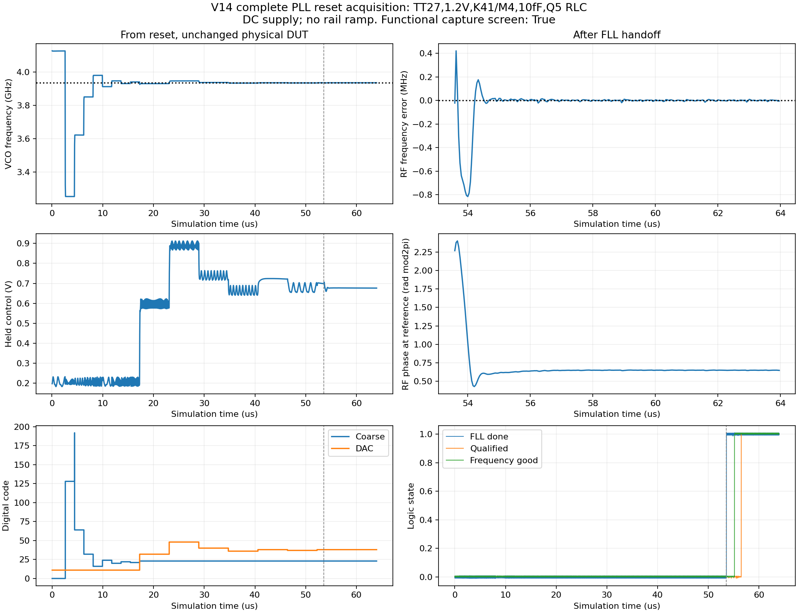
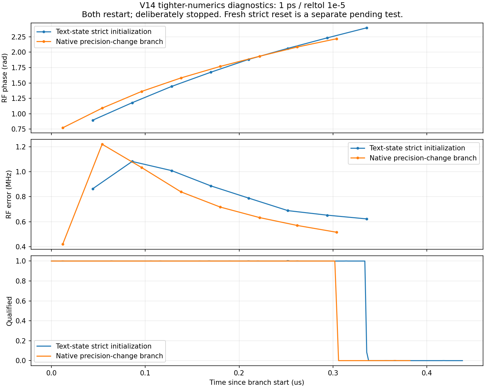
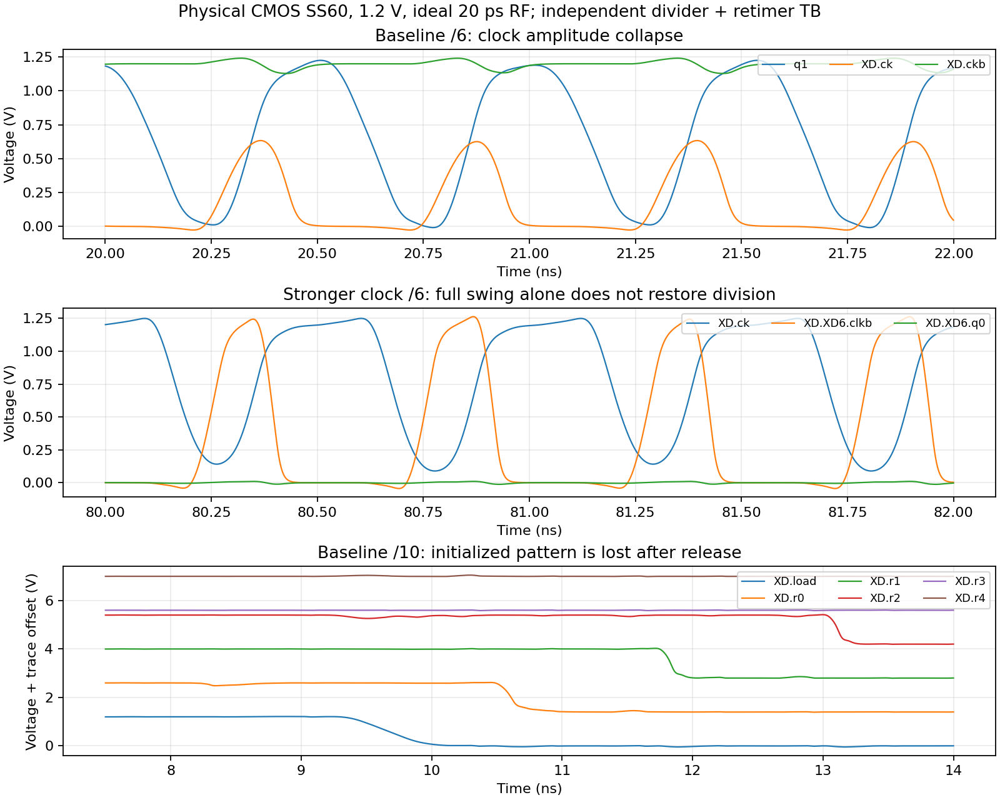
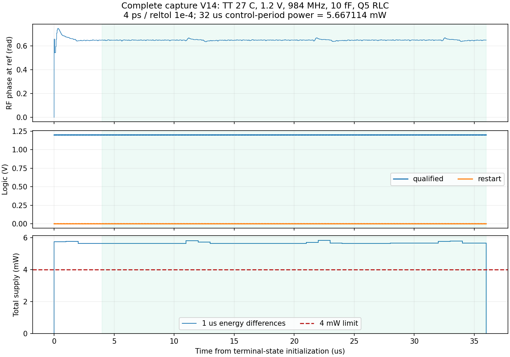

# V14 捕获修复验证

本轮按已确认顺序推进：先处理 FLL 交接与首次捕获，再处理 SS 分频和低端调谐覆盖，之后评估功耗及整机噪声。历史完整系统结果保留在 [首轮基线](BASELINE.md)，不作为修复版的新结果。

修复版 [pll_capture_v14.scs](../../blocks/cmos_v14_full/pll_capture_v14.scs) 已接入以下实际 MOS 控制电路：

- FLL 粗调仍计 32 个参考周期，粗调结束采用 floor+2 留出细调余量。细调改为 128 周期，对应 0.75 MHz RF 计数量化；记录实际测过的最小绝对计数误差及对应 DAC 码，误差相同取较低码，取消末步无条件加一码。
- 首次交接后连续 512 个参考周期仍未 qualified，则产生 8 周期重启脉冲。512 周期约为 21.33 µs，是当前设计参数，并非新增的用户验收指标。原 32 次连续有效采样建立 qualified、4 次连续失效重启的规则保留。

结构审计展开 **17,644 MOS、2 个 PDK 变容、41 R、39 C、2 L 和 3 个零伏电流探针**。相比旧版增加 4,250 MOS，尚未优化这部分面积和功耗。内部无功能 VA 或理想电流基准；电感仍为获准的暂定 Q5 π 型 RLC。见 [结构](results/boundary_pll_capture_v14.json) 和 [验证协议](results/capture_repair_protocol.json)。

## 已完成的验证

| 层次 | 条件 | 结果与边界 |
|---|---|---|
| 门级图与线性 VCO | 33 个 K、每个 8 个连续 RF 初相位；另有 24 个端点／越界例 | 264+24 例通过；有效 RF 残差 −1.100…+0.175 MHz。模型采用线性调谐，不证明真实 VCO 捕获。 |
| FLL 晶体管 TB | TT27、SS60、FF0；1.2 V、24 MHz、50 ps 理想参考边沿、20 fF 输出负载 | 三角均通过；每角完整核对 1,268 个参考边沿后的所有输出位。单元TB测频总线由理想刺激提供；真实计数器、DAC和VCO联合交接另见下方单点4ps完整复位，严格精度待完成。 |
| 监督晶体管 TB | 同上三个角；含初始超时、资格建立、短暂失效、失锁、故障与重新配置 | 三角均通过；每角核对 838 个参考边沿。期限同周期资格建立优先于超时，另有门图定向验证。 |

晶体管单位测试使用 maxstep=500 ps、reltol=1e−4、1 ns 输出采样；每个参考边沿后 10 ns 检查，高电平须 >1.0 V，低电平须 <0.2 V。FLL 因原单次时限而采用原生断点接续，电路、刺激和精度保持一致；检查包含断点之前和之后的完整轨迹。原始停止片段保留为停止记录，未当作电路失败或独立通过结果。

证据：[门图检查](results/capture_repair_logic.json)、[6 组 MOS 检查](results/capture_repair_units.json)、[单位 TB 与完整 DUT 一致性及原始数据 hash](results/capture_repair_consistency.json)。

## 完整 PLL 复位仿真

`repaircold01/repair_capture_tt` 已于 2026-10-03 08:15 零错误完成 64 µs，并回收完整轨迹、终态及输入／原始输出 SHA256。原本地回收进程已退出，本轮从原远端目录恢复数据，没有重新仿真。该测试为 TT27、1.2 V、24 MHz、K41/M4、10 fF、Q5 RLC；maxstep=4 ps、reltol=1e−4。供电从开始即为 DC 1.2 V；实际执行复位和配置，仅用初始 10 µV 差分扰动启动确定性振荡。没有读取旧电路的原生状态，也没有构造近锁定初态。这不是供电爬升验收。

**在上述精度与单一条件下，既定功能捕获筛选通过。** FLL 在 53.585638 µs 交接，粗调 23／DAC 38；交接前 RF 平均 3935.978936 MHz，余差 −21.064 kHz。细调实际测得 DAC38 的计数为 5248，与目标相等；末次试探 DAC37 为 5246，因此最终正确返回此前测过的 DAC38。qualified 在 56.502408 µs 建立，之后保持至结束，未出现 restart。

末 1 µs 输出平均 **984.000069593 MHz**，相位峰峰 **0.003284 rad**，漂移 **−0.000184 rad/µs**；RF／输出每参考周期误差分别不超过 0.000388／0.000106，控制采样值 0.676228…0.676393 V。它们是确定性锁定检查，不是 RMS 抖动。

末 1 µs 全部 PLL 供电积分得到 **5.622531 mW**，高于 4 mW。0–64 µs 总能量 **379.562894 nJ**，100 ns 分窗最大平均 **6.454578 mW**，不等于瞬时峰值，也不包含电源爬升。末 1 µs 尚不是完整 32 µs 控制周期平均。



证据：[捕获结果](results/capture_repaircold01.json)、[实际 DUT 一致性](results/capture_repair_consistency.json)。原始文件位于 `research/runs/spectre_cmos_v14_full/repaircold01/repair_capture_tt/`。

### 数值复核与保持测试

原 64 µs 仿真正常结束时没有留下原生 `.srf`。因此先使用**实际终态**的电压／电流建立独立同 DUT 检查：不修改任何 DUT 初值，但这仍是文本初态初始化，不能把它接成连续 100 µs 的冷启动轨迹。`repairstrict01` 在直接初始化并改用 1 ps／reltol=1e−5 后出现相位扰动与监督重启，已主动停止并保留负面证据；不能单据这一轨迹区分初始化效应和数值精度影响。

`repairretain01` 在原 4 ps／reltol=1e−4 下建立保持轨迹，约 1.45 µs 保存并回收原生状态。从同一个原生状态分出 `repairretain02`（到 36 µs）与 `repairstrict02`（1 ps／reltol=1e−5）。**原生严格分支也出现相位偏移和重启**：观测到交接后 RF 误差最高约 +1.221 MHz，1.752305 µs 出现 restart；1.83164 µs 主动停止。同状态的原精度分支现已完成36µs保持，未出现重启，结果见下节。故不能把严格分支的问题仅归因于文本初始化，4 ps 捕获尚无数值收敛证明。见 [负面精度诊断](results/precision_diagnostics.json)。这些是已观测到的重启事件，不是完成的 6 µs 保持测试。

已新启动 `repaircoldstrict01/repair_capture_strict_tt`，同一 DUT、相同外部复位／配置和 10 µV 启振扰动，**从头以 1 ps／reltol=1e−5 完整运行 64 µs**，同时收紧 vabstol/iabstol；没有读取文本或原生初态。该测试将判断严格精度下 FLL 是否能重新选择适合的交接码并自主捕获，目前待完成。改变数值参数的瞬态扰动不能直接判定严格精度下的完整复位必然失败。



供电积分器的文本初态中保留了 `XE:idt0` 偏移，所有功耗采用能量端点差，偏移抵消；不把绝对初始积分值当成消耗能量。保持测试已完成，使用 4–36 µs 的完整 32 µs 周期平均，另列末 1 µs 窗口和内部步长上的边沿测量。见 [状态来源与协议](results/repair_retention_protocol.json)、[保持分析入口](analyze_repair_retention.py)。

```powershell
python share/deliverables/integration/cmos_v14_full/analyze_capture.py repaircold01 --case repair_capture_tt --fine-window 128
python share/deliverables/integration/cmos_v14_full/monitor_jobs.py repaircoldstrict01 repairretain02
# 等最终结果及 hash 回收完成后运行：
python share/deliverables/integration/cmos_v14_full/analyze_repair_retention.py
python share/deliverables/integration/cmos_v14_full/analyze_capture.py repaircoldstrict01 --case repair_capture_strict_tt --fine-window 128 --precision strict
```

本版已有短窗功耗、复位能量及完整32µs周期功耗结果；整机抖动及严格捕获仍待验证。旧版局部链 141.281 fs 保留原条件，不移植为修复版指标。用户确认的全部 PLL 功耗边界、10 kHz–输出频率一半的抖动频带、33 个频点及全部 REQ 均保持。

## SS 分频定位

独立诊断使用旧版相同分频树和重定时器，1.2 V、SS60、20 ps 理想 RF、10 fF。已回收的波形显示：

- ÷6（RF 3.888 GHz）：内部 ck 最大只有约 0.634 V，互补时钟 ckb 维持高电平。
- ÷10/÷14（RF 3.120/3.024 GHz）：复位期间循环寄存器状态正确，释放后状态丢失，最终全零。
- 两组仅改变时钟缓冲尺寸的对照均未恢复三个失败档位；恢复摆幅不足以证明时序问题已解决。
- 单相 CMOS 存储对照使 ÷14 的独立测试达到约 216 MHz，但 ÷10 输出约 156 MHz（目标 312 MHz），÷6 周期仍不正确。不能将该候选接入正式顶层或宣称 SS 已修复。
- 进一步反转采样相位、延长预充电区间的三个对照均未通过；保留为负结果。这也不能证明预充电是唯一根因。



本轮进一步移除五个实际内部时钟驱动器，以理想 20 ps、50% 占空比互补 RF÷2 时钟做**混合诊断**：静态 ÷6 恢复为 648 MHz；静态 ÷10／÷14 仍失败。主锁存节点在时钟关闭时尚未稳定，数据推迟或丢失。一次针对传输门／节点负载的尺寸对照仍失败，保留负结果。

改用单相 CMOS 环形存储后，在同样理想内部时钟下，÷10／÷14 分别得到 **312.000010 MHz／216.000000 MHz**，均通过周期与完整摆幅筛选。这些理想内部时钟不能进入正式 PLL，也不计为功耗／噪声达标。下一实际器件候选保留静态模三计数器、改用单相环形存储，并缩短 CMOS 时钟链；首先验证 SS 三个失败档位，再扩展到其余档位与角。

物理时钟的三组新对照进一步表明：缩短时钟链后仍出现摆幅坍塌；增强预分频缓冲的负载会损害上游预分频输出；另一占空时间整形候选虽恢复全摆幅，仍仅 ÷14 通过。只用理想 q1 替代预分频器、保留实际后续时钟树时，也仅 ÷14 通过。这把剩余问题进一步定位到实际时钟边沿／采样窗口及其负载，不能只归因于预分频器或宣称只需恢复 50% 占空比。

最新候选 `bank_split_clock_v14` 将模三和环形支路的时钟驱动分开，并在 ÷10 时关闭未使用的末两级环时钟；60 ns 独立 SS 检查已完成，三个档位仍未通过。后续须检查分支时钟偏斜和锁存有效窗口，不能据降低时钟负载就认定时序恢复。它与全部诊断候选均未接入完整捕获 DUT。

独立候选未改动完整捕获修复版。所有已完成对照和失败记录见 [SS 诊断结果](results/ss_clock_repair.json)，原始输入和波形留在本项目 `research/runs/spectre_cmos_v14_full/`。


## 2026-10-03 后续：SS时序修复与闭环抖动验证

完成37例短仿真；尾级数据隔离、预分频末级驱动及CMOS时钟树修复使独立候选在SS60的÷6/10/14通过。理想RF下三角六档18例全部通过；实际RF接收器下SS÷4/6/10仍失败，当前完整pll_capture_v14保持原版。详见[SS_TIMING.md](SS_TIMING.md)。

真实模拟反馈核心PSS稳定段发现滑相，已停止并检查参考负载裁剪；固定慢控制的近似边界、全频带积分及周期解复用检查见[NOISE_PROGRESS.md](NOISE_PROGRESS.md)。尚未产生新的整机RMS结论。严格独立复位继续；32µs周期保持已完成，不重复启动。

## 36µs保持与完整控制周期功耗（2026-10-03）

`repairretain02`零错误完成，完整DUT依赖、原生状态和原始波形SHA核对通过。保持轨迹0–36µs未出现restart，qualified全程高。末1µs输出平均984.000252MHz，相位峰峰0.005260rad、漂移0.002151rad/µs，功能稳定性筛选通过。

| 供电边界 | 4–36µs平均（mW） |
|---|---:|
| 全部PLL | **5.667114** |
| VCO及其物理偏置 | 3.728157 |
| RF接收器 | 0.714580 |
| 重定时／输出链 | 0.131167 |
| 其余电路 | 1.093210 |

功耗超过4mW约41.7%。以内部仿真步长积分的能量端点差计算，包含完整32µs控制周期；末1µs为5.655927mW。该轨迹仍是实际64µs终态的文本初始化，再从自身原生状态续算；不能表述为冷启动连续到100µs，也不证明1ps数值收敛。条件为TT27、1.2V、K41/M4、10fF、Q5，4ps/reltol1e-4。



[可复核结果](results/repair_retention.json)，原始数据位于项目`research/runs/spectre_cmos_v14_full/repairretain01`与`repairretain02`。原生前段仅用作续算父段，未当作独立通过测试。


## 2026-10-04优先级

按用户决定，近期先恢复闭环噪声测量并优化器件抖动，暂缓功耗优化及新增无关SS/范围扫描；4mW需求保留。严格复位原任务继续。上一轮PSS收敛失败已回收；同电路更长稳定段/Gear2诊断与局部CMOS输出尺寸对照已运行，见[噪声进展](NOISE_PROGRESS.md)。三角六个4.8fF候选端点已完成，主DUT未更改。
