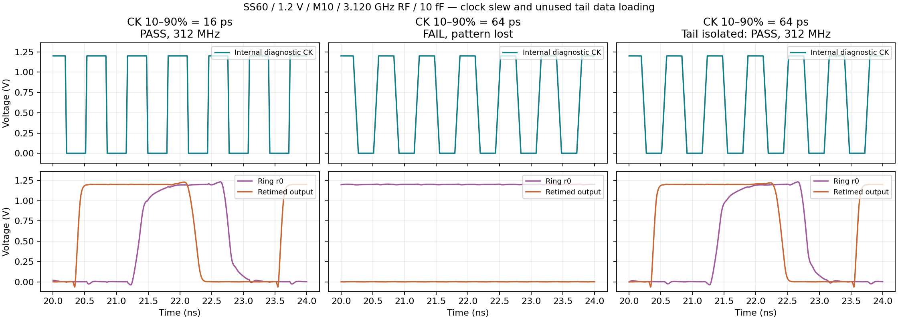
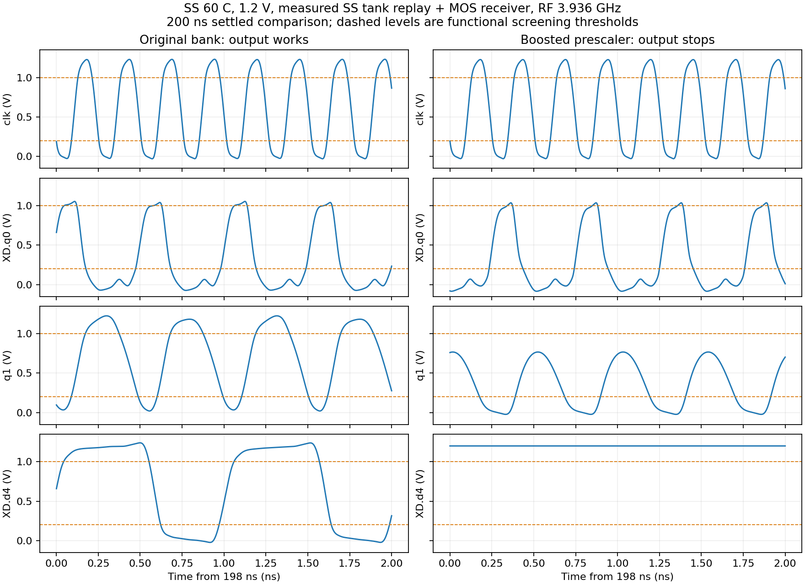

# SS 分频器时序定位与候选修复

本轮新增 37 个短仿真：15 个时钟窗口、6 个初始缓冲候选、6 个尾级/缓冲对照、10 个实际驱动对照。均已回收，Spectre 0 error；功能失败与成功均保留。所有测试采用 SS、60℃、1.2V、10fF、外部20ps RF、maxstep=1ps/reltol=1e-5，60ns瞬态、末40ns筛选。以下是独立分频及重定时器结果，不是完整PLL捕获或随机抖动验收。

## 已确认的因果关系

- ÷6：同一MOS存储/数据路径，理想内部CK的10–90%边沿16ps、占空比50%/65%均通过；64ps/50%通过，但64ps/65%及112ps/50%失败。因此边沿与有效工作窗口共同影响功能。
- ÷10：原候选仅16ps内部边沿通过；64ps和112ps均丢失循环状态。
- ÷14：上述五组理想内部时钟条件全部通过。相同拓扑族的三个档位不能共用一个时序裕量结论。
- ÷10反馈抽头r4还连接未使用的÷14尾级。将尾级输入传输门仅在s5有效时打开，保持所有时钟连接不变，÷10在16/64/112ps、50%内部时钟下均通过。对照证明尾级数据负载是此前裕量不足的原因之一。
- 减小/平衡预分频第一级反相器A/B没有解决问题，后续短脉冲无法恢复为完整电平。保留原输入阈值的C链配合尾级隔离，使实际MOS时钟树下÷10通过，但÷6仍失败。
- 保留原动态节点输入负载，只将预分频TSPC末级输出PMOS、两个输出NMOS宽度加倍，并保留原50kΩ反馈N门延迟，结合时钟树与尾级修复后，三个问题档位首次在同一候选中全部通过。将延迟改为75kΩ反而使÷6失败，已保留该反例。

## 当前定向测试最佳候选

`bank_preboost50_v14.scs`：全MOS逻辑与既有反馈电阻，无理想内部时钟。使用静态÷3、单相÷5/7环；尾级数据隔离；CI 2/4、NAND 8/8、CB1 8/32、CB2 24/48µm；预分频末级4/3.2/3.2µm，反馈电阻50kΩ。它仍是独立候选，尚未替换`pll_capture_v14`。

| 模式 | RF MHz | 输出 MHz | 最大周期相对误差 | 独立链功耗 mW | 功能筛选 |
|---|---:|---:|---:|---:|---|
| ÷6 | 3888 | 648.014471 | 0.069499% | 2.554479 | 通过 |
| ÷10 | 3120 | 312.000000 | 0.000086% | 2.384961 | 通过 |
| ÷14 | 3024 | 216.000019 | 0.000263% | 2.258675 | 通过 |

功耗包含当前独立分频器及重定时/输出链，不含VCO、RF接收器和其余PLL；不能作为整机功耗。此候选的面积/功耗尚未优化，全部PLL≤4mW要求保持不变。短窗无噪声周期误差不是RMS随机抖动。

同一候选的六档×TT27/SS60/FF0共18例100ns回归已全部通过，末40ns检查。条件仍是外部理想20ps RF，详见`results/ss_candidate_regression.json`。

**真实接收器回归推翻了“可以直接代回顶层”的假设。** 接入实际MOS RF接收器、计数时钟MUX及静默计数器输入负载后，SS六档只有÷8/12/14通过，÷4/6/10失败。÷4时clk约3936MHz，但q1约1313MHz、输出约656MHz；前端预分频已发生错误翻转。该TB输入为之前TT VCO波形按目标频率重放，因此尚不包含SS VCO振幅变化、噪声或负载反作用，也不能替代实际LC联合测试。

| 模式 | 实际接收器回归输出 MHz | 功能 |
|---|---:|---|
| ÷4 | 656.015307 | 失败 |
| ÷6 | 185.151414 | 失败 |
| ÷8 | 432.005399 | 通过 |
| ÷10 | 无持续输出 | 失败 |
| ÷12 | 263.999352 | 通过 |
| ÷14 | 216.006594 | 通过 |

因此`bank_preboost50_v14`尚未正式代回PLL，SS修复缺口仍未关闭。后续10/25/35kΩ各测SS÷4/6共六例全部失败；恢复原预分频动态级及仅增强静态输出驱动各测÷4/6/10的六例亦全部失败，见`results/ss_feedback_validation.json`、`ss_restore_validation.json`。

为核对实验边界，原版`cmos_even_bank_acq_v14`在同样TT RF波形驱动SS接收器下也测了÷4/6/10，三例均失败（÷4约986.217MHz但存在异常周期，÷6/10无持续输出）。因此不能将前述接口失败全部归因于新候选，或据此推翻之前实际SS VCO近锁定通过的结论。已完成`ssinterfacedense01`：从先前完整SS近锁定终态，以相同1ps精度保留100ns/末50ns密集波形。原始网表依赖逐项hash与之前通过的SS版本相符；本次只用于RF形状提取，不能冒充新的复位捕获或锁定验收。

上述阶段共76例SS定向/回归已完成；后续实验见下节。完整PVT、失配、噪声及PEX未验收。

## 复现与证据

- `results/ss_window_validation.json`：逐案例输入结果路径、hash、时钟幅度/边沿/占空比、输出周期与功耗；`analyze_ss_window.py bankwindow01 banktaper01 banktail01 bankdrive02`重新分析。
- `build_ss_window.py`、`build_ss_taper.py`、`build_ss_ring_tail.py`、`build_ss_prescaler_drive.py`保留每个因果对照。
- `build_ss_candidate_regression.py`及`results/ss_candidate_regression_protocol.json`定义18例回归，`analyze_ss_regression.py`核对同一366MOS/5R电路依赖；运行中的案例不计为通过。
- 原始数据：项目`research/runs/spectre_cmos_v14_full/{bankwindow01,banktaper01,banktail01,bankdrive02}/`；每例保留冻结输入、最终日志和PSF/NPZ。

- 实际RF接收回归：`build_ss_rf_regression.py`、`analyze_ss_rf.py`及`results/ss_rf_validation.json`；延迟对照：`build_ss_feedback_screen.py`、`analyze_ss_feedback.py`。

## 实际SS形状与充分稳定后的电平诊断（2026-10-03）

`ssinterfacedense01`零错误完成，相同旧整机SS终态100ns/末50ns密集波形已回收。最后64个RF周期平均，20次谐波拟合得到SS电压形状；vp约0.749–1.569V、vn约0.691–1.663V，平均形状拟合RMS误差约12µV。逐周期最大偏差约27/33mV，不是完全静止正弦。重放源按各档频率缩放，为零阻抗、无噪声的外部测试刺激，仍不包含LC负载反作用。见`results/ss_waveform_replay.json`。

六例60ns SS形状对照后，将原版／候选÷4以及两档两级CMOS时钟缓冲对照统一延长到200ns，检查末80ns。后者共八例均零错误完成：

- 原版÷4恢复正确工作：输出984.002091MHz、q1约1968.045656MHz，q1与输出逐周期电平通过。这说明此前短窗口的接口失败不能直接作为持续稳态失效结论。
- 预分频末级加倍候选：q1虽然仍约1968.170604MHz，最高仅0.768V，d4停在高电平、最终输出停在低电平。频率正确不足以证明时钟有效，分析已增加q1逐周期高低电平门槛。
- 在实际RF接收器后加两级小／大静态CMOS缓冲，÷10两例通过，但÷4/÷6四例均失败；单独加时钟驱动没有解决高RF端的动态时序与电平问题。

后续单变量实验只改变XPB0 NMOS宽度，保持PMOS、动态预分频级、RF反馈、时钟树和尾级隔离不变。增大NMOS会同时增加上游负载和改变反相器阈值，不能视为单纯提高驱动。当前仍不将任何候选代入主PLL；结果与下一组原预分频恢复对照见`results/ss_level_validation.json`。

复现入口：`build_ss_waveform_replay.py`、`build_ss_clock_buffer.py`、`analyze_ss_clock_buffer.py`、`build_ss_level_restore.py`、`build_ss_settled_restore.py`及`analyze_ss_level.py`。原始数据分别在`research/runs/spectre_cmos_v14_full/{ssinterfacedense01,banksswave01,bankckbuf01,banklevel01}/`。

### 门控与脉冲传播的后续对照

增加恢复级NMOS的六例均失败。恢复原动态预分频器、保留后级修复的三例中，÷4通过；÷6/÷10的q1频率和逐周期电平通过，但后级时钟仍失败。÷6时原门控节点GN最低约0.779V、CK停在高电平，因此问题已定位到门控和后续脉冲传播，而非只有最前端÷2频率错误。

随后四级／六级渐进驱动的六例中，÷4两例通过，÷6/÷10四例失败。六级链的GN恢复约1.12V峰值，但短脉冲仍在后级消失。保持每级总栅宽、重新分配P/N比例的两例亦失败；其中GN到CT2已传播，但CB高电平延长到约417ps（周期514ps），最终CK仅约0.679V。

最后只保留前三级的P/N调整、末两级恢复原比例，`bankmixskew_m6_ss`重新出现输出，但仅约460.713MHz，目标为648MHz，判为失败。逐周期检查显示CT1最低峰值约0.870V、CK最低峰值约0.872V，尽管全窗最大值达到电源轨，仍有不合格周期。**全窗最大摆幅与平均频率都不能代替逐周期时序验证。**

这轮共有32例新的SS独立短测试（6形状＋8时钟缓冲＋6恢复级尺寸＋3原动态级恢复＋6渐进驱动＋2P/N比例＋1混合比例），全部已回收0error，功能失败保留。当前完整PLL和分频器未被这些候选修改。后续应围绕每周期低电平脉冲的传播裕量收敛候选，仍需六档、实际LC、角落及整机代回验证。候选时钟未选时停泊电平由高变低，模式切换与复位也须回归；用户放宽的是外部输出占空比，此处检查的是内部逻辑工作窗口。

新入口：`build_ss_clock_taper.py`、`build_ss_clock_skew.py`、`build_ss_clock_mixed.py`；`analyze_ss_level.py`默认汇总`banklevel01`、`bankssorig01`、`banktaper02`、`bankskew01`、`bankmix01`。结果为`results/ss_level_validation.json`，所有相应原始输入和波形在本项目research目录。

### 连续时钟与恢复级脉宽对照（2026-10-04）

`bankungated01`移除模式门控，保留实际原动态预分频及所有真实时钟负载，比较四级平衡／交替偏置反相器。SS60、1.2V、10fF、实测SS RF形状重放，M6／10／14六例200ns均完成0error，功能均失败；最后一例M14仅108MHz而非216MHz，其余输出停滞。每例q1的频率与逐周期高低电平通过，因此不能把失败归于q1计数错误。

平衡M6最后20ns：qb0峰值约0.907V，q1高电平321.44–322.91ps（周期514.40ps），10–90%上升／下降中位约113／145ps；CT0峰值仅约0.847V，下一阶段无有效周期。简单移除门控不足以解决脉冲恢复。`build_ss_pulse_restore.py`准备两项单独因果对照：XPB0的P宽0.5→1µm，或保持XPB1总宽6µm而将N/P由2/4→3/3µm。动态÷2不改，不以平均频率取代逐周期电平检查。新候选尚未验证，不能代回。

证据：`results/ss_ungated_clock_validation.json`；新协议：`results/ss_pulse_restore_protocol.json`。有限接续程序 `research/continue_ss_pulse.py` 仅在现有 fresh-noise 两例完成后顺序运行这两例，不增加18线程资源上限。

## PB1阈值候选与固定长窗口复核（2026-10-04）

连续时钟＋PB1阈值调整候选的新600ns测试已完成6/6例，其中÷4／÷6／÷8／÷10／÷12／÷14通过；固定验收窗口为400–600ns，旧120–200ns失败仍保留。

该候选保留原动态预分频级和XPB0，仅将XPB1由N/P=2/4µm改为3/3µm，总栅宽6µm不变；配合连续四级时钟树、静态÷3、单相环和尾级数据隔离。不是仅增加总尺寸。早期M6的120–200ns结果627.098MHz仍判失败；诊断发现140ns后恢复648MHz，因而另行预先规定600ns/末200ns的新验证，不将事后截窗当通过。

| 分频比 | RF MHz | 实测输出 MHz | 固定400–600ns筛选 |
|---|---:|---:|---|
| ÷4 | 3935.996 | 984.007155 | 通过 |
| ÷6 | 3888.004 | 648.008605 | 通过 |
| ÷8 | 3455.999 | 431.999969 | 通过 |
| ÷10 | 3120.004 | 311.999906 | 通过 |
| ÷12 | 3167.996 | 264.000000 | 通过 |
| ÷14 | 3024.000 | 216.000000 | 通过 |

条件：SS60／1.2V／10fF、真实MOS接收器、无噪声零阻抗实测SS形状重放、1ps／reltol1e-5。逐周期q1高低电平、分频比及输出周期均纳入判据。未覆盖TT/FF、低端RF、中间频点、模式切换、噪声或实际LC负载反作用；主PLL未改。真实LC TT/M4独立核心3µs稳定性已通过；这是另一个工作点，尚不能替代上述SS各档的实际LC验证。

证据：[固定窗口结果](results/ss_settled_pulse_validation.json)、[预先记录的协议](results/ss_settled_pulse_protocol.json)、[旧窗口敏感性](results/ss_window_sensitivity.json)。

## 补低RF和角落接口（2026-10-04）

`banktripcorner01`已启动17例：5个SS低RF端及6档TT/FF高RF端。新测量除分频比例外，还直接核对冻结刺激中的绝对RF频率、每个接收器周期和输出绝对频率，避免输入漏沿被相对分频比掩盖。原SS高端6例在加强判据下仍全通过。所有角落暂固定同一实测SS波形形状，属于受控接口比较，不等于各角落实际VCO或完整PVT。

结果见[低RF与角落](results/bank_pulsetrip_corner_validation.json)、[17例预定协议](results/bank_pulsetrip_corner_protocol.json)。只把完成且通过检查的案例计为通过，运行中案例保持待定。

## SS全部规划端点通过

新增5个低RF端全部完成并通过，与原6个高端组合，六个分频模式的11个不同SS规划端点均通过固定400–600ns接口筛选。M14只有一个规划频点，因此不重复计数。保持实际MOS接收器／分频／原RT／10fF和同一SS波形重放。TT/FF高端回归继续；这不证明所有中间频点、实际LC或完整PVT。详见[端点覆盖计数与输入SHA](results/bank_pulsetrip_coverage.json)。
