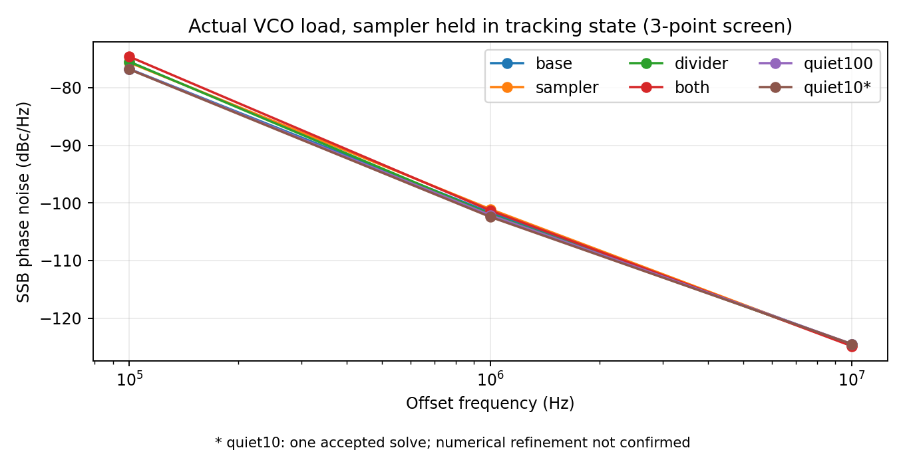
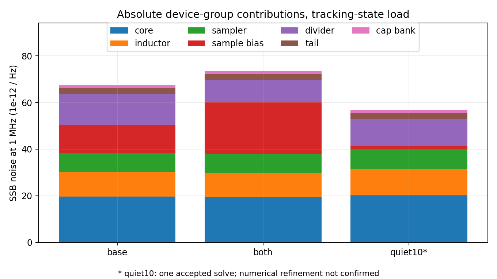
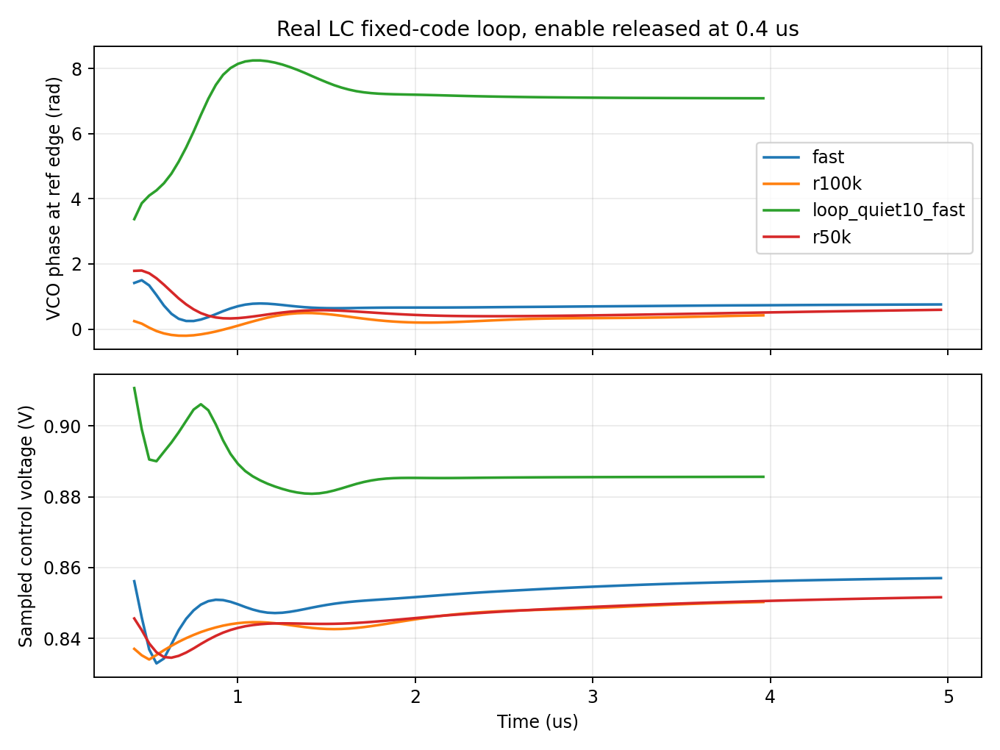

# VCO 接口噪声与真实 LC 闭环研究

2026-09-30。保留上轮 VCO R2，本轮完成接口器件噪声对照、实际波形下的采样器/CP 增益重提、四组固定码真实 LC 闭环瞬态，以及驱动 PSS 尝试。**四组瞬态在各自 4–5 µs 的末窗仍未通过全部稳态筛选；驱动 PSS 暂未取得通过独立波形检查的周期解。低阻候选的单次降噪结果未通过加密复核，暂不推荐替换旧接口。** 接口候选与环路候选分别评价；不将不同候选的最佳数值拼成整体结果。

## 接口噪声对照

所有噪声对照为 TT/27°C、1.2 V、暂定 Q=5、粗调码 6、控制电压 0.6 V。实际 ÷4 分频接入；参考保持低电平，采样器连续跟踪，CP 输出钳位。VCO 是实际 MOS 与 RLC 电路，自主 PSS 以分频输出为基频，VCO 取第 4 谐波。

| 候选 | 载频 GHz | 100 kHz 相噪 dBc/Hz | 1 MHz 相噪 dBc/Hz | 10 MHz 相噪 dBc/Hz | 1 MHz 相对基线 dB |
|---|---:|---:|---:|---:|---:|
| base | 3.915518 | -76.769 | -101.716 | -124.566 | +0.000 |
| sampler | 3.915784 | -75.649 | -101.101 | -124.757 | +0.615 |
| divider | 3.915381 | -75.500 | -101.996 | -124.658 | -0.280 |
| both | 3.915640 | -74.628 | -101.340 | -124.852 | +0.376 |
| quiet100 | 3.915504 | -76.789 | -102.149 | -124.483 | -0.433 |
| quiet10 | 3.912686 | -76.831 | -102.450 | -124.497 | -0.735 |

正的变化表示恶化。采样电阻增至 1 MΩ 的初始降噪设想被实际器件噪声否定；组合 `both` 保留为反例及已建立工作点的闭环研究对象，不作为降噪推荐。仅增加去耦 `quiet100` 的改善也较有限，不能据此宣布噪声问题解决。参数对应关系见 [电路说明](../../blocks/interface_v5/README.md)。

`quiet10` 的约 0.73 dB 改善来自一次成功的 APS、2 ps/63 边带结果。独立的 1 ps/127 边带 X/APS 求解及改用 LC 差分节点作为相位约束的尝试均未取得可接受结果，因此这一改善仍是**待确认观察**。不能将 `both` 的精度通过转移到 `quiet10`。见 [低阻候选精度状态](results/quiet10_noise_precision.json)。



低阻候选的采样偏置网络在 1 MHz 的贡献比例从约 17.8% 降为 2.6%；核心与电感仍占约 55%，采样和分频器合计约 36%。贡献比例必须结合总噪声读，图中用绝对 PSD 进行比较。



逐项 PSD 求和与总量核对；同时检查最终 PSS 的有效摆幅及 VCO 主谐波，避免把收敛到错误周期的结果当作有效噪声。`both` 另做 10 kHz–492 MHz 扫描，并将 2 ps/63 边带收紧为 1 ps/127 边带，APS 与显式容差的 Spectre X 在三个重合频偏上的最大差为 **0.00109 dB**。见 [噪声数据](results/noise_summary.json)、[精度复核](results/noise_precision.json)。宽带结果仍是固定跟踪状态，不能替代 10 kHz–fout/2 的真实 PLL 抖动。

六组周期采样瞬态在两个控制电压端点均维持有效 ÷4。组合 `both` 额外通过 7 个重点频点/角落的逐周期分频与目标频率夹持检查，最小端点余量 **2.194 MHz**；未复跑全部 99 点，也没有将这些角落结果转移给其他候选。见 [瞬态对照](results/screen_validation.json)、[角落检查](results/corner_validation.json)。

低阻 `quiet10` 沿用旧码时，TT K14、FF K14、FF K17 的端点余量分别为 1.986/1.880/0.707 MHz，未达到原有 2 MHz 筛选线。独立复跑相邻码后，TT K14 从 243 改为 242、FF K17 从 101 改为 100，余量恢复至 3.295/2.828 MHz。FF K14 从 240 改为 239 后低端频率升至 2.690333 GHz，无法覆盖 2.688 GHz，故保留旧码及其 1.880 MHz 的未通过项。重点 7 点中 **6/7** 达到余量筛选，不能据降噪收益整体替换旧接口。见 [保留原码结果](results/q10corner_validation.json)、[重选码及失败记录](results/q10_selected_validation.json)。

## 鉴相增益与环路模型

从加载 VCO 的 0.85 V 瞬态提取 16 周期平均波形，保留 20 次谐波，作为 3.936 GHz 的理想回放源驱动真实采样器、参考缓冲、MOS CP 时序及 CP。单端回放误差最大约 39 µV；该 fixture 没有 VCO 源阻抗或反向噪声耦合，不是闭环。

CP 输出钳位 0.84 V，在零平均电流附近三个相位点测得 **Kpd=0.258828 µA/rad**，零点约 **320.8337°**。实际脉冲占比 **4.276%**，相对采样参考边沿的延迟约 **2.099 ns**。相位绝对值仅对应本测试台的回放起点。见 [波形来源](results/gain_source.json)、[增益点](results/gain_points.json)。

0.80/0.82/0.84/0.86 V 的周期加载瞬态得到不一致的局部有限窗斜率，约 87.2/51.1/37.8 MHz/V。周期采样的相位相关拉频会影响此测量，因此 0.82–0.86 V 的 44.41 MHz/V 仅作为环路筛选中的有效割线增益，不能视为已提取的内禀 Kvco。标量模型预测与实际非线性瞬态均保留，最终需要锁定周期工作点的线性化分析。见 [环路模型及限制](results/loop_model.json)。

## 真实 LC 闭环

本测试将实际 VCO R2、采样器、CP、MOS CP 时序、环路滤波器和实际 ÷4 分频连接；粗调码固定为 6，参考 24 MHz，0.4 µs 后释放 MOS 预充。VCO 没有 VA 频率源或理想维持振荡电路，VA 仅观察边沿。偏置 IREF、参考源和使能激励仍理想。

- `r100k`：R=100 kΩ、C1=28.648 pF、C2=1.910 pF，预充 0.83 V。
- `r50k`：R=50 kΩ，其余滤波电容相同，预充 0.84 V。
- `fast`：R=100 kΩ、C1=7.162 pF、C2=0.4775 pF，预充 0.84 V。
- `loop_quiet10_fast`：相同快速滤波器，换为低阻 `quiet10` 接口，预充 0.89 V。其他三组使用 `both` 接口。

末尾 1 µs 同时检查：相位峰峰值 <0.02 rad、绝对漂移斜率 <0.01 rad/µs、每参考周期 VCO 周期数距 164 小于 0.001、分频周期数距 41 小于 0.001、控制电压位于 0.2–1 V。这是本轮功能筛选标准，不是新增产品规格或随机抖动验收。

四组瞬态的日志均显示实际 `maxstep=2 ps`、`reltol=1e-3`、`method=trap`。仅覆盖 maxstep 没有保留网表所请求的更严 reltol；因此下表是初步功能观察，尚无显式收紧容差的同条件瞬态复核，不能把全部慢漂移归因于电路。噪声和驱动 PSS 另有不同数值设置，不混用精度结论。见 [实际求解设置审计](results/solver_settings.json)。

| 环路 | 仿真时长 µs | 末窗平均输出 MHz | 相位峰峰值 rad | 相位漂移 rad/µs | 稳态筛选 |
|---|---:|---:|---:|---:|---|
| fast | 5 | 984.000988 | 0.023816 | 0.024403 | 未通过 |
| r100k | 4 | 984.003431 | 0.085357 | 0.095601 | 未通过 |
| loop_quiet10_fast | 4 | 983.999207 | 0.018297 | -0.018469 | 未通过 |
| r50k | 5 | 984.003310 | 0.079406 | 0.082742 | 未通过 |



平均输出频率接近 984 MHz 不足以证明相位稳定，原 100 kΩ/大电容方案在 4 µs 时仍未通过。全部数据及判据见 [闭环结果](results/loop_validation.json)。这些结果只涉及上述 TT 工作点、静态码和预充释放，未包含 FLL 自动捕获、相位资格监督、重捕获、GHz 重定时时钟接收、输出重定时链和完整控制，也不是整机 PVT/抖动/功耗签核。

另对低阻快速环路执行 24 MHz 驱动 PSS，去掉 VA 观察器，保留实际 LC、采样、CP、滤波和分频器。求解器完成状态为 **False**，独立周期波形筛选为 **False**；详细周期数、控制电压、功耗与偏置节点见 [周期工作点](results/periodic_validation.json)。恢复基线与 [收敛门限对照](results/pss_tolerance_study.json) 保持相同电路和 2 ps 时间步，独立记录 `steadyratio`；即使功能周期解通过，仍需数值精度复核才能用于噪声判断。周期解存在与否和从预充释放能否稳定到达该解是不同证据，不据 PSS 单独宣称捕获或稳定性通过。VCO 尾电流滤波包含 1 MΩ/10 pF（10 µs）网络，这提示应检查额外慢状态；目前未证明其就是漂移的唯一原因。

## 边界、失败记录和复现

新增接口去耦共 27 pF，尚无实际面积和冷启动结果；滤波 RC 和电感几何/EM 仍未实现。暂定电感 Q=5 不变，原 Q=3 慢角低端失振风险保留。未修改 <200 fs、≤4 mW、<0.3 mm² 要求，偏置/基准发生器继续后置。

10 kΩ 候选的一次 APS 2 ps 求解成功，但另外的 X、加密 APS 及相位约束点调整均在迭代中发散或未收敛，出现非物理试探电压。这些作业已精确停止并留存；不从试探电压推断实际电路可靠性，也不接受未收敛噪声值。闭环驱动 PSS：首次作业依据滞后的日志片段提前停止；回收完整日志后发现最后完整迭代残差已降至 54.2，因此没有将中断当作收敛失败。已保留原始取消记录，并对保存状态进行独立恢复尝试。恢复实际发生在 1.41046 µs，重新稳定后开始新一轮 shooting，并非接续原 Newton 迭代。严格门限恢复随后出现上千万残差及非物理试探电压；steadyratio 从 .001 改为 .1 的对照亦出现 9.70311 V 周期端点误差，均停止该初始化路径，未获得可接受周期解。恢复记录见 [状态文件来源与评估修正](results/pss_recovery_provenance.json)，最终判断以 [周期解检查](results/periodic_validation.json) 为准。增益首次 PSS 因测试台保留不相容周期的复位源而失败，改为复位 DC 后重跑。最初的观察器 include 收集错误发生在远端启动之前；修复后新 run-id 重试。所有失败、取消及复跑独立留存。

输入快照、完整日志、PSF、NPZ 与 hash 位于项目 `research/runs/spectre_interface_v5/`；[原始证据清单](results/raw_manifest.json) 与 [源码清单](results/source_manifest.json) 支持审计。PDK 模型没有复制到交付目录。前两组运行完成后从 v4 输出目录原样迁移，保留迁移说明，不重写原始记录中的旧路径。

```text
python share/deliverables/integration/interface_v5/run_spectre.py --run-id replay_fast --mode ax --threads 1 --preset-override maxstep --cases loop_both_fast
python share/deliverables/integration/interface_v5/run_spectre.py --run-id replay_base --mode aps --threads 1 --cases noise_base
python share/deliverables/integration/interface_v5/analyze_screen.py
python share/deliverables/integration/interface_v5/analyze_followup.py
python share/deliverables/integration/interface_v5/analyze_noise.py
python share/deliverables/integration/interface_v5/model_loop.py
```

后续优先用显式完整容差复核低阻环路瞬态，保存完整终态并延长稳定过程，检查尾电流滤波及关断分频支路的高阻节点；这些是待检验的原因，尚未建立因果关系。再从接近稳态的初值重启周期求解，同时解决低阻候选的数值复核和 FF 低端余量。之后在保留正确源阻抗的周期工作点核对鉴相/调谐增益和器件噪声，研究接口隔离与负载减小，再验证参考相位扰动、完整捕获及输出链集成。当前结果不足以闭合系统噪声预算。
