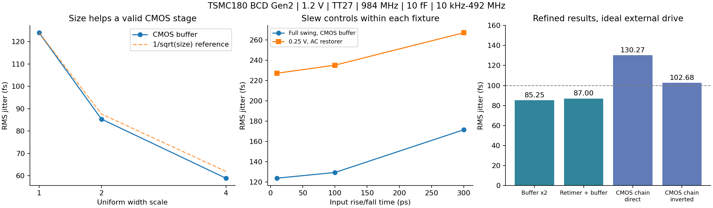

# jitter_v11：内部边沿、工作状态与 CMOS 对照

2026-10-02。本轮针对“数字模块为什么数百 fs、是否真的需要 CML”完成 40 组 Spectre 仿真。结论是：**没有证据证明当前频率必须采用 CML；后续优先研究 CMOS。** 同一 PDK、1.2 V 下，CMOS 重定时与缓冲已达到 87.00 fs，连接实际 CMOS ÷4 后为 130.27 fs。仍需真实 LC 接口及完整 PLL 验证，不能把理想驱动夹具结果当作整机性能。

## 为什么此前用了 CML，为什么现在转向 CMOS

output_v8 的 GHz 接收/电平恢复电路出现很大的附加噪声。output_v9 因而绕过该接收链，直接用 LC 波形的小摆幅差分信号驱动 CML 重定时；这是当时针对具体接口问题的探索，不是对 CMOS 速度或噪声极限的证明。旧 transistor_v2 中的理想时钟 CMOS 单元已经给过更低的噪声，前期未充分完成这个方向的接口比较。

本轮不仅比较缓冲，还实现了 TSPC CMOS ÷4、实际 CMOS 级间缓冲和 C²MOS 重定时相连的输出链。主 PLL 架构和 REQ 指标不变；这些仍是研究候选，未冻结为最终设计。

## 同条件的有效结果

以下均为 TSMC180 BCD Gen2 MOS、TT/27°C、1.2 V、984 MHz 输出、10 fF、10 kHz–492 MHz，取输出 0.6 V 上升沿 sampled PNoise。均已完成 1 ps/63 到 0.5 ps/127 的时间步、谐波及有色边带联合加密。功耗是夹具实际 VDD 电流积分，不含理想输入源供给的驱动能量。

| 电路 | RMS 抖动 | VDD 功耗 | 输入条件/说明 |
|---|---:|---:|---|
| 两级 CMOS 缓冲，宽度 ×2 | 85.247 fs | 0.078103 mW | 理想 984 MHz、1.2 V、10 ps 边沿 |
| 两级 CMOS 缓冲，宽度 ×4 | 58.883 fs | 0.140630 mW | 同上 |
| C²MOS 重定时＋缓冲，scale4、对称从级 PMOS | 87.002 fs | 0.878977 mW | 理想 984 MHz 数据、3.936 GHz 时钟，均 10 ps |
| 同上，时钟边沿改为 50 ps | 85.796 fs | 0.824951 mW | 保持时钟 0.6 V 上下沿时刻不变；数据不变 |
| 实际 CMOS ÷4＋重定时＋缓冲，直接时钟 | 130.272 fs | 1.150115 mW | 只有外部 RF 时钟为理想全摆幅源；数据由晶体管分频器产生 |
| 同一输出链，增加实际时钟反相器 | 102.681 fs | 2.081006 mW | 反相器噪声、功耗及实际负载均保留 |

七组联合加密全部通过，最大积分变化 0.113%、最大谱差 0.0107 dB，低于预定 1%/0.1 dB。未列入表中的旧弱 PMOS 配比 scale8 也得到 79.034 fs，但需 1.667621 mW；对称 scale4 更值得继续研究。各结果和全部粗网格负结果见 [noise_table](results/noise_table.md)、[noise_validation](results/noise_validation.json)。



直接时钟链额外做了仅 XD、仅 XR 开噪声。分别为 96.467/87.495 fs，方差和对应粗网格 130.235 fs；其余分区 PSD 精确为 0，电压、功耗、斜率不变，PSD 闭合误差 1.22e-15。加密结果中 XD/XR 为 96.469/87.547 fs。反相链的 XD/XR/新增时钟反相器贡献为 46.082/89.109/21.896 fs；该链只做了器件 PSD 分解，没有单独重跑三个开关。见 [gating_validation](results/gating_validation.json)。

103 fs 的方案比 130 fs 方案多约 0.931 mW，不据最低抖动单独选型。新链与历史 CML 621.903 fs 使用不同外部源摆幅、共模和输入阻抗，不能将差值全归因于逻辑族，或直接认定整机得到同等改善。

## 数百 fs 的来源：已有证据与推断

**观察：末级输出很陡，内部关键节点却很慢。** 在 noise_v10 最佳实体 CML 链中，分频单端数据摆幅约 0.182 V，中摆幅上升斜率 0.534 V/ns；重定时 qp 约 0.250 V、1.224 V/ns；恢复首级栅输入约 0.226 V、1.035 V/ns；最终输出约 25.85 V/ns。因此仅看输出上升时间会漏掉前级已经产生的时序误差。阈值附近的电压噪声按局部斜率转换为时间噪声，后级整形不能自动消除输入边沿的时刻偏移。理论依据见 [Terrovitis](https://designers-guide.org/analysis/divnoise.pdf)。

**观察：CML 尾管工作裕量不足，时钟切换也不够干净。** 最终分频从级尾管 VDS 为 0.204–0.225 V，模型 VDSAT 为 0.279–0.281 V；重定时从级尾管 VDS 为 0.213–0.252 V，VDSAT 为 0.271–0.274 V。整个观测窗 VDS−VDSAT 均为负。分频末级约 50.6% 时间采样、保持支路同时各有超过 10% 的电流；重定时从级约 28.8%。这些是当前三层 NMOS 堆叠、1.2 V 和小摆幅时钟实现的具体问题。VDSAT 是模型工作点量，不是突然变化的物理边界；这些探针并未独立证明尾管是全部噪声的主因。见 [probe_analysis](results/probe_analysis.json)。

**单因素对照：尺寸有用，但先要拓扑及加载合理。** 固定 10 ps 全摆幅输入时，CMOS 缓冲尺寸 ×1/×2/×4 的粗网格结果为 123.920/85.343/58.926 fs，接近 1/√尺寸趋势。保持尺寸不变，把输入边沿 10→100→300 ps，变为 123.920→129.530→171.617 fs。低摆幅恢复器在自己的固定理想源夹具中为 227.364→235.299→267.251 fs；这两条曲线不能跨电路比较成严格的单因素实验。历史 CML 分频末级加倍后自身噪声反而由约 499→783 fs，说明盲目加宽会通过寄生、负载和采样时序抵消器件降噪收益。

**观察：旧占空比调节留下了过弱 PMOS。** 复用旧 C²MOS 参数时从级 PMOS 基宽为 1.06 µm；遵照已确认的宽松占空比要求，恢复为 2.5 µm，scale4 的重定时＋缓冲粗网格结果从 113.744 降至 87.010 fs，功耗为 0.879036 mW。单纯把时钟从 10 ps 放慢至 50 ps 没有恶化这一个工作点，进一步表明“所有问题都是最终边沿不够陡”并不成立。

**推断及工作方向：** 当前高噪声由内部低摆幅/慢边沿、电平恢复、CML 偏置裕量和采样窗口共同造成，不是 180 nm 无法达到 100 fs。尺寸在正确 CMOS 拓扑中有效；优先处理级间加载、从级驱动和重定时相位，再做局部尺寸优化。单元 <100 fs 已验证，整条 CMOS 输出链当前最低 102.681 fs，完整 PLL 尚未验证。

## 分频探索及负结果

- 静态 TG 主从 ÷4，尺寸 ×1/×2，在完整复位后分别约 328/393.6 MHz，均失败；不能据这两个未优化单元判定 CMOS 极限。
- 直接串接 9T TSPC：首级约 1.968 GHz，但高电平只有约 0.895 V，下级输出不满足逻辑摆幅。增加两级小缓冲隔离后级三个时钟门负载后，÷4 正确，q1 达到约 1.205 V、out 约 −0.025–1.239 V。
- 自反馈 C²MOS ÷4 试案约 722 MHz，失败；当前只继续已通过的缓冲 TSPC。
- 缓冲 TSPC 单独粗网格噪声约 402.298 fs；连接实际重定时后折到输出的贡献降至约 96.47 fs（直接时钟）或 46.08 fs（反相时钟）。两链均通过无理想数据源的物理瞬态及 PSS 检查。
- 初始四个探针/TG 试案错误使用 `start=50n/76n`，跳过初始化和复位；全部保留并明确排除性能结论。随后用 `start=0 outputstart=...` 独立重跑。两个正确 CML 探针和缓冲 TSPC/两条 CMOS 链通过，另外四个合法分频试案失败；共 9 个有效协议瞬态试案，5 个通过。
- 实测 qp 电压回放虽近似恢复输出波形，但恢复器噪声为 285.779 fs，与物理整链中的 XL 261.207 fs 相差 9.41%。理想电压钳位未保留源阻抗/噪声反馈，**不把回放当作实际链的噪声等效物**。

## 边界与下一步

当前全部是 TT/27°C；CMOS 分频只有 ÷4 原型，没有六档编程、确定复位/使能、动态换挡和保持器设计。动态节点有超电源轨瞬态，尚无可靠性、PEX、Monte Carlo 和供电扰动验证。输出级及前后级实际加载在各相连夹具中保留，但外部 RF 是理想全摆幅源；真实 LC 是小摆幅、不同共模且有源阻抗，不能直接连接。

下一步优先以直接时钟的 130.27 fs/1.15 mW CMOS 链研究低噪声 GHz 电平转换和实际 VCO 加载；保留反相链作时序对照，优化时钟缓冲/采样相位功耗。随后补六档及频率/PVT，再在同一完整 PLL 中核对总噪声和 ≤4 mW。不得将旧核心功耗与本夹具直接相加（分频重复、负载不同）。旧 Q3 慢角低端、quiet10 精度、FF K14 余量、FLL 捕获/接管、基准发生器和面积问题仍开放；用户约定的偏置/基准后置不变。

## 复现及证据

`tb/` 和 `../../blocks/jitter_v11/` 中网表是输入权威版本，所引用旧版项目单元随交付保留；不需运行研究目录中的探索性生成脚本。已配置的 Spectre 21.1、远端 PDK 与现有 SSH 环境下，例如：

```text
python share/deliverables/integration/jitter_v11/run_spectre.py --run-id replay01 --cases noise_cmos_chain_direct_fine --mode ax --threads 1 --preset-override all
python share/deliverables/integration/jitter_v11/analyze.py
python share/deliverables/integration/jitter_v11/analyze_noise.py
python share/deliverables/integration/jitter_v11/analyze_probes.py
python share/deliverables/integration/jitter_v11/analyze_gating.py
python share/deliverables/integration/jitter_v11/summarize.py
python share/deliverables/integration/jitter_v11/package_evidence.py
```

分析探针/开关需要本轮对应的已保存 raw，不只上述单案例；重跑须用新 run-id，或按 [raw_manifest](results/raw_manifest.json) 的 case/run 清单完整复现。所有 40 组输入哈希、原始 PSF、日志和波形已回收到 `research/runs/spectre_jitter_v11`，没有只留在服务器的必要状态。40 组最终均 0 simulator errors，但这不表示功能通过。11 组 bridge 元数据带通用 `convergence failure` 标记；检查原始日志、最终错误数和独立周期检查后再判定。5 组 VA 输入有 VACOMP-2435 环境变量弃用警告；不是噪声开关冲突。所有实际精度取日志确认值：reltol=1e-5、vabstol=100 nV、iabstol=100 fA、traponly、relref=sigglobal、maxstep=1/0.5 ps；Spectre X 打印的 errpreset 仍是 moderate，不称标签本身生效。

本轮 [summary](results/summary.json)、[全部功能核验](results/validation.json)、[原始数据及哈希](results/raw_manifest.json)、[项目输入哈希](results/source_manifest.json)、[来源](../../sources/jitter_v11_sources.md) 均可独立检查。PDK 文件不在交付面。
