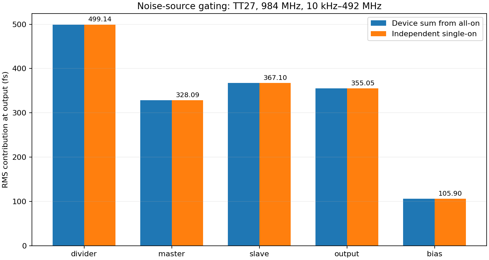
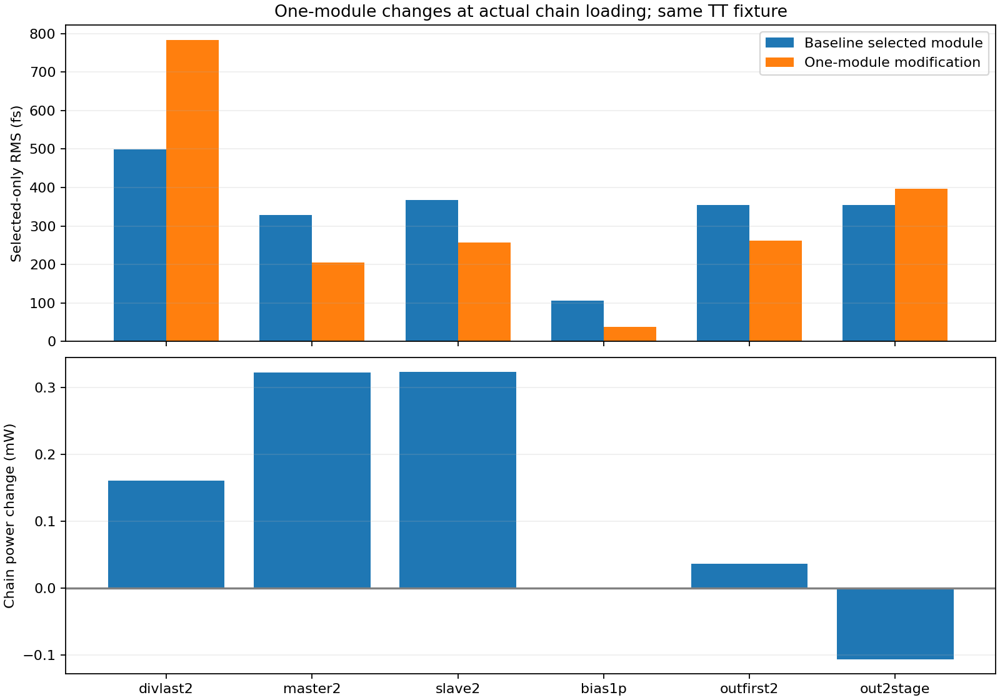
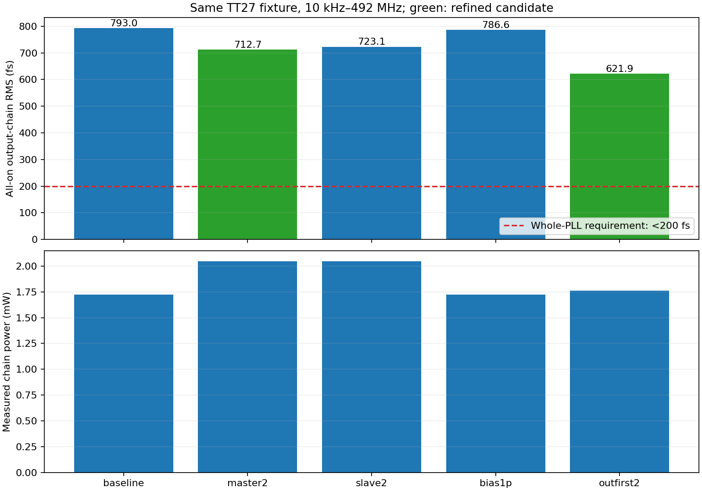

# noise_v10：逐模块 noise-on 确认与定向优化

按用户要求，先在同一实际输出链中逐个仅开启一个模块的噪声，确认贡献，再每次只改一个模块。基线为 output_v9 原极性、scale2 双 CML 重定时加四级 AC 恢复及末级驱动。本轮不将输出夹具称为完整 PLL。

## 条件与模块边界

TT27、1.2 V，理想无噪声 3.936 GHz 仿真 VCO 电压形状，实体六档钳位分频器选 /4，输出 984 MHz/10 fF。PSS 为 984 MHz，1 ps/63 谐波，fullspectrum、63 有色噪声边带；输出 0.6 V 上升沿，显式积分 **10 kHz–492 MHz**，另核对 Jee。需要加密的改版使用 0.5 ps/127/127，不继承旧电路的数值资格。

| 分区 | 实例 | 说明 |
|---|---|---|
| 分频器 | `XD` | 全部六档实体、选择传输门、钳位及内部偏置，/4 使能 |
| 主锁存器 | `XRT.XM` | 数据、保持、时钟、尾管和电阻负载 |
| 从锁存器 | `XRT.XS` | 数据、保持、时钟、尾管和电阻负载 |
| 输出恢复/驱动 | `XRT.XL` | AC 恢复级、反馈电阻及末级驱动 |
| 重定时偏置/无源 | `XRT.MR/RBP/RBN/RH/RL` | 共用偏置镜管、时钟偏置电阻网络；尾管归所属锁存器 |

分区依据噪声源所在实例；某个源经多个模块传到输出的贡献归该源所在分区。所有确定性晶体管、负载、偏置和传递路径保留，未用理想模块替换其余电路。原始波形、物理功耗与输出斜率必须保持一致，才解释单开与全开的比较。

## 开关与独立核验

仅一个分区开启时，使用 `simulatorOptions options noiseon_inst=[目标层次实例] noiseon_type=all`；全关对照使用 `noiseoff_inst=[全部分区实例]`。按预先保存的 [协议](results/gating_protocol.json)，逐项检查：

1. 新全开结果复现 v9 的同设置粗网格结果。
2. 单开结果的未选器件贡献严格为零；全关残余 <0.001 fs。
3. 单开实测谱与全开时对应器件 PSD 之和比较，最大差 <0.01 dB、RMS 差 <0.1%。
4. 五份独立谱之和与全开总谱闭合；比较的是方差/PSD，不直接相加 RMS。
5. 保存的周期电压波形差 <1 µV，功耗与输出斜率相对差 <1e−5；另有频率/谐波/摆幅/周期端点检查。

初始分频器、主锁存器试案同时填写了 noiseon/noiseoff 两个实例列表，安装版报 `SPECTRE-16782`，指出多余设置被忽略。这两组原始输入/结果保留，正式确认使用单一开关的重跑结果。全开和全关试案原本就只使用一个列表。未运行的早期模板修改及哈希保存在协议的修正记录中。

当前结果见 [独立开关验证](results/gating_validation.json)、[噪声数据](results/noise_validation.json) 和 [波形/功能数据](results/validation.json)。`valid_noise` 只表示测量有效；200 fs、时序与功耗验收必须另判。

## 逐模块优化方式

先完成开关确认，再进行单模块物理改动。先过原频率/摆幅筛选，再只开启所改分区噪声，保留其实际输入和输出加载；有意义的候选恢复全噪声，检查其自身改善是否被其他分区变差抵消。报告同台功耗变化，不以“仅开启一部分噪声”的较小数字代表整链性能。

内部初筛目标为所改分区 RMS 至少降低 5%，不是新增用户需求。用户的完整 PLL <200 fs、≤4 mW 要求保持不变。新增电容或增大器件会引入面积/加载成本，不能把理想集中电容视为已完成工艺与布局验证。

实际 VCO 源阻抗/噪声、主环路、参考、FLL/监督和偏置发生器不在本夹具中；输出/温度/频率/PVT 覆盖也仍有限。不能将此夹具功耗与旧 LC 核心直接相加，两者含重叠分频电路且负载不同。

## 复现与证据

在项目根目录与已配置的 Python/virtuoso-bridge 环境中，任选新运行 ID，例如：

```text
python share/deliverables/integration/noise_v10/run_spectre.py --run-id reproduce01 --cases noise_gate_divider_only_coarse --mode ax --threads 1 --preset-override all --timeout 1800
python share/deliverables/integration/noise_v10/analyze.py
python share/deliverables/integration/noise_v10/analyze_noise.py
python share/deliverables/integration/noise_v10/analyze_gating.py
python share/deliverables/integration/noise_v10/analyze_optimization.py
python share/deliverables/integration/noise_v10/analyze_timing.py
python share/deliverables/integration/noise_v10/diagnose_divider.py
python share/deliverables/integration/noise_v10/summarize.py
python share/deliverables/integration/noise_v10/plot_results.py
python share/deliverables/integration/noise_v10/package_evidence.py
```

完整原始输入、PSF、日志和终态在本项目 `research/runs/spectre_noise_v10/<run>/<case>/`。远端仅在指定项目 `simulation/noise_v10` 内计算，输入在运行时冻结并核对远端哈希；所有证据回收到本项目。模型仅引用，未复制到交付目录。仅下载交付仓库时需按 TB 重跑大体积原始数据。

上面的单例命令用于示范一次重跑；重新生成完整汇总需重跑协议中的所有对应试案。`analyze_gating.py` 的历史基线比较还需本项目已有 `spectre_output_v9/noise_double/noise_cml2_s2_coarse` 原始结果；仅有交付仓库时，按 output_v9 的相应 TB 与运行 ID 先恢复该结果。

来源与版本依据见 [noise_v10_sources](../../sources/noise_v10_sources.md)。

## 本轮结果

五部分单开实验的输出贡献依次为：分频器499.141fs（39.62%方差）、主锁存器328.094fs（17.12%）、从锁存器367.099fs（21.43%）、输出链355.045fs（20.05%）、重定时偏置/无源105.903fs（1.78%）。方差合成为792.983fs，与全开一致；全关为0，关闭分区器件PSD全部为0。保存的周期电压、功耗、输出斜率均与全开完全一致。这里的百分比是方差占比，不是RMS占比。



仅输出恢复首级MOS宽度加倍，整链加密结果 621.903 fs、1.760363 mW；相对原细网格 792.149 fs 降低 21.49%。数值加密采用0.5ps/127谐波/127有色噪声边带，积分变化+0.1378%，最大谱差0.01253dB，均通过原预设限值。

| 单模块改动 | 本模块单开 RMS | 全开整链 RMS | 整链功耗变化 | 资格 |
|---|---:|---:|---:|---|
| 分频末级×2 | 783.25 fs | 未测 | +0.160190 mW | 单开噪声变差，未晋级全开 |
| 主锁存器×2 | 205.56 fs | 712.67 fs（加密） | +0.322205 mW | 全开加密通过 |
| 从锁存器×2 | 256.28 fs | 723.09 fs | +0.323367 mW | 粗网格探索 |
| 镜管栅去耦1pF | 38.17 fs | 786.57 fs | -0.000128 mW | 粗网格探索 |
| 输出首级×2 | 261.21 fs | 621.90 fs（加密） | +0.036363 mW | 全开加密通过 |
| 输出恢复四级→两级 | 396.36 fs | 未测 | -0.106763 mW | 单开噪声变差，未晋级全开 |
| 分频末级×0.5 | 未测 | 未测 | 不作性能比较 | 功能失败，约656MHz |
| 分频输出TG×4 | 未测 | 未测 | 不作性能比较 | 功能失败，约656MHz |

表中单开噪声和功耗变化用相同粗网格与原版比较；标注加密的全开值来自该电路自己的细网格。四个全开复核的候选均通过“独立单开谱与全开对应器件谱一致、相同周期波形/斜率”的核查。





分频末级加倍后，前一级主锁存器的输出贡献151.77→466.17fs，两只输出选择TG也由约114/113fs升至235/227fs。数据过零相对RF提前约14ps、过零斜率变大，但最终抖动变差。这是确定性加载和时序改变伴随噪声传递变化的证据，不能单凭此归因于某一种机制。随后减半末级和增大选择TG的两个对照均输出约656MHz，功能不合格，未进行噪声测量。详见[分频诊断](results/divider_diagnosis.json)。

输出首级改版的±10ps回放诊断：零移位匹配通过，输出上升/下降时序增益 0.3552/0.3274；内部0.1目标未通过，不代表全局setup/hold或PVT签核。

输出首级改版是当前值得继续验证的单模块候选，仍明显超过200fs。主锁存器改版有降噪但功耗代价较大；从锁存器和偏置去耦的全开结果尚属粗网格探索。没有把几个单模块收益直接相加，也没有将它们同时改入一个未经仿真的组合。

优先继续检查输出首级尺寸/数据稳定窗口与噪声功耗折中；分频器本体保留基线并调查加载敏感性。再考虑组合改善、六档/PVT和实际LC代回。完整PLL各模块noise-on、真实RF源阻抗/相噪及同一顶层≤4mW仍未完成。
