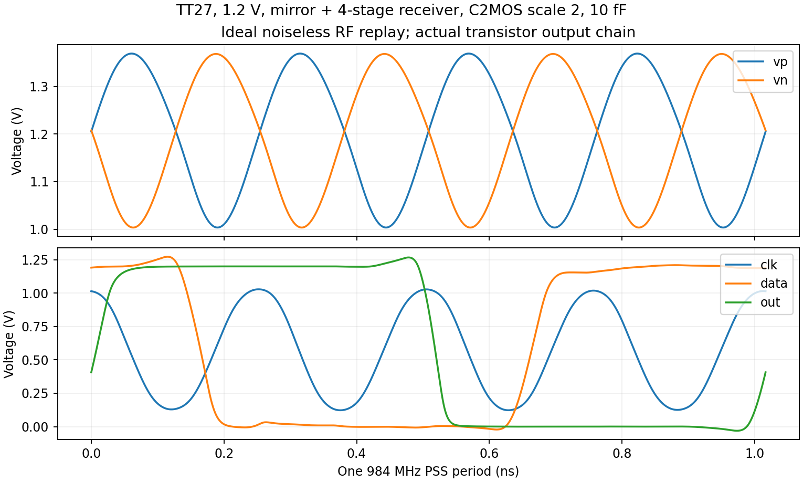
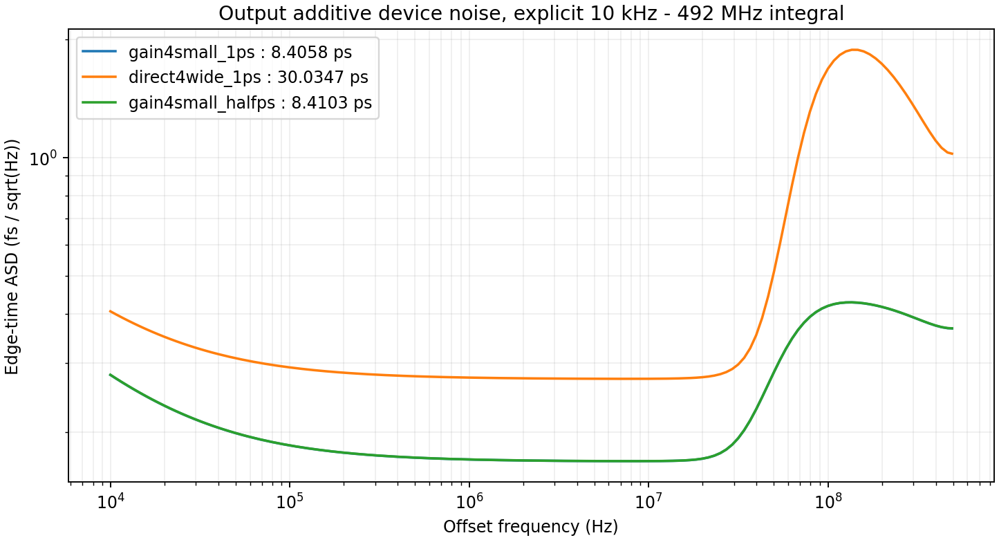

# 实际 GHz 时钟接收与输出重定时链

2026-10-01。把实际晶体管 RF 接收器接到原 C2MOS 重定时器，和真实钳位分频器一起验证。**镜像负载接收器能通过 TT 翻转筛选，但器件噪声明显超标；直接AC四级链的单次噪声估算更差，两者都不能作为合格输出链。** 未冻结或采用新方案。

## 条件与功能范围

TT27、1.2 V、3.936 GHz 理想无噪声电压回放、÷4、984 MHz 输出、10 fF。RF 形状来自已有 `interface_v5/tank_waveform_v5.va`，单端约1.004–1.369 V，沿用其来源记录。理想电压源没有真实VCO阻抗、噪声或负载回注，因此还未代回真实LC主环路。器件使用同一TSMC180BCD模型和stat_noise；电容、电阻为原理图理想元件，IREF发生器仍理想。

全链供电积分同时包含分频器、RF接收器、重定时器和末级缓冲；支路VRX/VRT用于分解。缺VCO、主环路、FLL/监督和实际基准，不把不同TB功耗简单相加作整机验收。输出10 fF仍是临时工作假设。

功能协议在运行前记录：100 ns瞬态，末70–100 ns检查clk/data/out频率、最大周期误差及逻辑摆幅。高电平>1 V、低电平<0.2 V、平均频差<0.1%、最大周期误差<2%，输出沿数>20。[初始协议](results/protocol.json)及各轮协议保留，不用低摆幅或不翻转时的低功耗作为有效工作点。

分析器曾额外尝试在时钟下降沿后0.35个RF周期（约89 ps）读输出，但实际传播延迟可达数百ps，这不是有效的数据正确性判据。该诊断从未写入原协议；现仍保留读数并明确不用于验收。当前通过只代表频率/周期/摆幅，未证明任意数据重定时、setup/hold、亚稳态或全PVT。

## 电路试案与全部功能结果

原三反相器直流链在实际GHz负载下摆幅衰减；再生负载试案存在偏置或锁存问题。镜像负载差分输入级可产生摆幅，但直接串接的反相器偏置不合适。逐级交流耦合、阻性反馈自偏置的四级增益链随后通过TT波形筛选。根据器件噪声归因，再尝试取消电流镜前端、直接交流耦合RF到四级增益链。各版本与阴性结果均保留。

| 试案 | 功能筛选 | GHz时钟范围 V | 同台全链 mW | 接收器 mW | 重定时/缓冲 mW |
|---|---|---|---:|---:|---:|
| regen_f_p_tt | 失败 | -0.001–0.001 | 1.030837 | 0.104062 | 0.061597 |
| regen_g_p_tt | 失败 | -0.001–0.001 | 1.095797 | 0.170805 | 0.059814 |
| regen_h_p_tt | 失败 | -0.008–1.217 | 1.362904 | 0.440303 | 0.053524 |
| direct4_small_vn_tt | 失败 | 0.209–0.932 | 1.865131 | 0.536082 | 0.455477 |
| direct4_small_vp_tt | 失败 | 0.207–0.933 | 1.874851 | 0.538008 | 0.462775 |
| direct4_wide_vn_tt | 通过 | 0.072–1.105 | 2.356606 | 1.010656 | 0.472297 |
| direct4_wide_vp_tt | 通过 | 0.071–1.109 | 2.366831 | 1.013185 | 0.479258 |
| chain_s2_vn_tt | 失败 | 0.497–0.807 | 1.337240 | 0.355058 | 0.108065 |
| chain_s2_vp_tt | 失败 | 0.498–0.801 | 1.335713 | 0.355522 | 0.106280 |
| chain_s4_vn_tt | 失败 | 0.582–0.816 | 1.381819 | 0.360392 | 0.129093 |
| chain_s4_vp_tt | 失败 | 0.586–0.809 | 1.376138 | 0.360687 | 0.123241 |
| mirror_gain2_tt | 失败 | 0.295–0.860 | 2.030679 | 0.742407 | 0.414410 |
| mirror_gain3_tt | 失败 | 0.168–0.964 | 2.332221 | 0.997786 | 0.460750 |
| mirror_gain4_tt | 通过 | 0.052–1.137 | 2.698038 | 1.341373 | 0.482603 |
| mirror_gain4small_tt | 通过 | 0.122–1.029 | 2.325798 | 0.976433 | 0.475299 |
| mirror_a_tt | 失败 | 1.199–1.202 | 1.100218 | 0.172889 | 0.053278 |
| mirror_b_tt | 失败 | -0.003–0.002 | 1.200834 | 0.334011 | -0.000251 |
| regen_d_n_tt | 失败 | 1.198–1.201 | 1.032692 | 0.105361 | 0.053279 |
| regen_d_p_tt | 失败 | -0.001–0.001 | 1.006677 | 0.105339 | 0.036239 |
| regen_e_n_tt | 失败 | 1.198–1.201 | 1.202841 | 0.275510 | 0.053279 |
| regen_e_p_tt | 失败 | -0.001–0.001 | 1.184439 | 0.275486 | 0.043851 |
| regen_a_n_tt | 失败 | 1.198–1.201 | 1.035259 | 0.107928 | 0.053279 |
| regen_a_p_tt | 失败 | 1.198–1.201 | 1.035260 | 0.107929 | 0.053279 |
| regen_b_n_tt | 失败 | 1.198–1.201 | 1.129708 | 0.202377 | 0.053279 |
| regen_b_p_tt | 失败 | 1.198–1.201 | 1.129708 | 0.202377 | 0.053279 |
| regen_c_n_tt | 失败 | 1.198–1.201 | 1.150938 | 0.223607 | 0.053279 |
| regen_c_p_tt | 失败 | 1.198–1.201 | 1.150938 | 0.223607 | 0.053279 |

完整读数及几何时序距离见[功能结果](results/validation.json)。首轮镜像接收器使用NMOS输入对8 µm、PMOS镜像负载4 µm、40 µA理想参考/5倍尾电流镜，输入AC120 fF、50 kΩ偏置及10 pF共模去耦。四级小尺寸增益链每级NMOS2 µm/PMOS5 µm，AC200 fF及50 kΩ反馈，末驱动尺寸2倍。C2MOS scale=2，输出oscale=4、sp=2.5 µm。

## 器件噪声与数值检查

PSS基频984 MHz，检查1个输出/数据周期、4个GHz时钟周期、主谐波及保存电压端点误差<1 mV；随后按0.6 V输出上升沿作fullspectrum sampled pnoise，sampleratio=1，10 kHz–492 MHz。对照1 ps/63谐波/63边带和0.5 ps/127/127，积分变化<1%、最大谱差<0.1 dB才通过数值加密。maxsideband控制fullspectrum中的有色噪声项。

总out为V/√Hz，显式积分out²/边沿斜率²，并与Jee交叉核对。器件STRUCT内的total为PSD，单独读取并检查分项之和；不把平面解析器无法解析的NaN当成零。以器件总PSD积分形成各模块的方差贡献，不能把分项RMS线性相加。

| 噪声试案 | 周期及积分有效 | 抖动 fs | 同台全链 mW |
|---|---|---:|---:|
| noise_gain4small_1ps | True | 8405.781 | 2.319851 |
| noise_direct4wide_1ps | True | 30034.677 | 2.360961 |
| noise_gain4small_halfps | True | 8410.262 | 2.319865 |

镜像小尺寸候选的联合加密结果：`{"status": "completed", "pass_precision": true, "relative_jitter_change": 0.0005331788156368589, "max_abs_spectrum_delta_db": 0.007012621016716049}`。直接AC四级链若只有单点噪声，则只作探索结果，不能继承此数值加密。





noise_gain4small_1ps 的模块等效RMS（均折到最终输出）：XRT 228.11 fs，占方差0.07364%；XRX 8402.50 fs，占方差99.92203%；XD 55.32 fs，占方差0.00433%。

noise_direct4wide_1ps 的模块等效RMS（均折到最终输出）：XRT 240.50 fs，占方差0.00641%；XRX 30023.93 fs，占方差99.92844%；XD 766.61 fs，占方差0.06515%。

noise_gain4small_halfps 的模块等效RMS（均折到最终输出）：XRT 228.26 fs，占方差0.07366%；XRX 8406.98 fs，占方差99.92200%；XD 55.37 fs，占方差0.00433%。

镜像候选主要瓶颈在RF接收器；分频数据噪声的输出贡献较小，并不代表整条重定时链达标。该工作点重定时/缓冲本身仍约228 fs，已经高于200 fs；不能认为只消除接收器噪声就达标，也需要改善实际时钟斜率、相位和重定时尺寸/负载。直接AC大尺寸约30 ps，首级反相器和反馈电阻占主导，未得到降噪收益。它与镜像候选的增益级尺寸、相位均不同，不能作单变量归因。

这些是PSS工作点附近的线性化噪声估算。尤其30 ps已足以使小扰动假设值得怀疑，不把该数值当成真实大信号随机抖动测量；但它没有提供接近200 fs的证据，因此不继续将该候选代回VCO。接收器带宽/增益峰值、扰动稳定性与时钟相位还需先检查。旧理想满摆幅时钟驱动的约百fs重定时结果不能移植到此实际接收器。每个试案的器件排行、带宽、端点与频谱见[噪声结果](results/noise_validation.json)，原判据见[噪声协议](results/noise_protocol.json)。

## 复现与下一步

原始PSF、日志、不可覆盖输入快照和终态在项目 `research/runs/spectre_output_v8/`；[原始证据清单](results/raw_manifest.json)记录本地路径/哈希、实际结束状态和求解耗时。[源码清单](results/source_manifest.json)只包含项目自有网表和脚本，PDK未复制到交付区。

```text
python share/deliverables/integration/output_v8/run_spectre.py --run-id replay_output1 --cases mirror_gain4small_tt --mode ax --threads 1 --preset-override all
python share/deliverables/integration/output_v8/analyze.py
python share/deliverables/integration/output_v8/analyze_noise.py
python share/deliverables/integration/output_v8/summarize.py
python share/deliverables/integration/output_v8/package_evidence.py
```

按噪声归因缩短RF信号通路、检查直接AC限幅链及重定时的时钟相位/有效建立时间；先通过TT功能、器件噪声和同台功耗，再代回实际VCO重新检查负载、调谐和周期工作点。此后补频点与角落、FLL自动接管和完整功耗。当前<200 fs、≤4 mW、<0.3 mm²均未整机签核。完整项目状态以最新报告为准。
