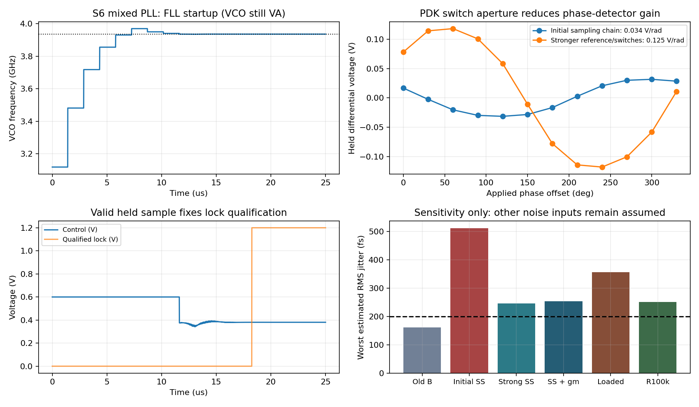
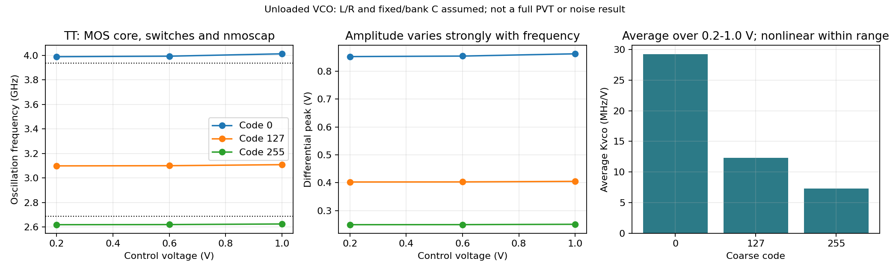
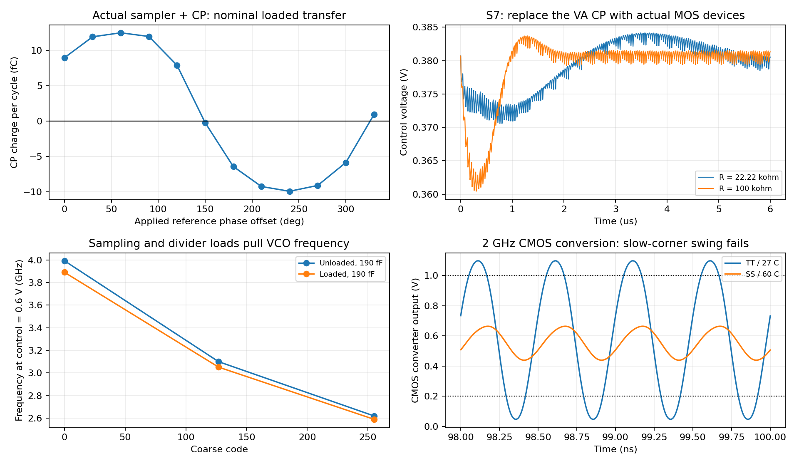

# 晶体管实现与逐级混合仿真 v1

2026-09-18。本轮已经建立 PDK MOS 电路网表、独立 TB、自动测量和逐级替换顶层。**这是一轮电路初稿与接口验证，尚未完成全晶体管 PLL。**

当前已验证的混合主链包含真实参考缓冲、采样保持、环路滤波/预充、中点分压、C²MOS 重定时、输出缓冲。S7 进一步代入真实脉冲跨导级，经调整滤波电阻后完成固定粗调码闭环；VCO、完整可编程分频和 FLL 仍为行为模型。LC VCO、CML ÷2 已有联合负载候选，仍有接口与覆盖工作。

## 已获得的结果

| 项目 | 观察及条件 | 原始运行 |
|---|---|---|
| 参考缓冲 | 四级 CMOS，24 MHz、60 fF、1.2 V；TT/27 °C、SS/60 °C、FF/0 °C 功能通过，约 0.033 mW | `sampler03` |
| 输出缓冲 | 984 MHz、10 fF、上述三个角功能通过，约 0.046 mW | `balanced02` |
| 重定时 | C²MOS 候选，4 GHz 时钟；三角变长数据序列各 48 个跳变无丢失或额外边沿，20 ps 时钟边沿下最慢时钟到输出约 295 ps | `pattern01` |
| 采样保持 | 每侧 40 fF、4/8 µm N/P 传输门；0.4 V 峰值差分、3.936 GHz 输入下，12 点相位扫描基波增益约 0.12465 V/rad | `sampler03` |
| 滤波器 | R=22.222 kΩ、C1=28.648 pF、C2=1.910 pF，MOS 预充开关；独立预充/电流脉冲及混合环路运行通过 | `modules02`、`loop02` |
| LC 核心和粗调 | 真正 PDK MOS 自激、8 bit 开关电容；L/R/固定及阵列 C 为理想器件假设。粗调版本在 TT/SS/FF 三个配对角的 0/127/255 码均起振 | `bank04`、`bank_corners01` |
| 含细调的 VCO 候选 | 加入 PDK `nmoscap`；名义三粗调码×三个控制电压测试完成，约 2.619–4.012 GHz、1.536–1.557 mW；相邻码抽查见结果 JSON | `fine02`、`fine_neighbors01`、`interface01` |
| 跨导级 | MOS 差分对/镜像负载/脉冲门控；实际等效脉冲 gm 随共模变化，约 101–111 µS（共模 0.52–0.60 V），存在约 −22 至 −19 mV 的零电荷输入偏移 | `cp02`、`interface01` |
| 高速分频前端 | AC 耦合、共模偏置后的 CML ÷2 候选，Rload=2 kΩ；4 GHz 三角及 2.688 GHz 低摆幅慢角测试，约 0.34–0.41 mW | `cml03`、`cml04` |

功耗均为明确供电端的积分，条件包含相应 TB 负载；LC/CML/CP 的理想偏置电流源仍待替换。CP 的五个并行测量支路合计约 0.150 mW，不应把这个总数误认为单个 CP。激励源直接驱动的输入电容、未实现的偏置生成及剩余 VA 模块，不能由这些数字推算为零功耗。

占空比保留测量，但按 [DEC-0003](../../../reports/decisions/DEC-0003.md) 不再专门优化，没有擅自指定新的数值验收容差。

## 逐级代回的范围

| 累计阶段 | 代回项目 | 系统测试及结论 |
|---|---|---|
| S1 | 参考缓冲 | 固定正确粗调码，6 µs 主环通过 |
| S2 | 加输出缓冲 | 6 µs 主环通过 |
| S3 | 加真实 R/C 与 MOS 预充 | 基础 Spectre 与 APS 的主环结果均通过 |
| S4 | 加电阻中点偏置 | 6 µs 主环通过 |
| S5 | 加物理采样保持 | 改进参考驱动，并修正 FLL 读取保持样本的时刻后，25 µs FLL 捕获测试通过；18.26 µs 首次有效锁定，输出误差约 −0.0132 ppm |
| S6 | 加晶体管重定时 | 固定码 6 µs 闭环通过；完整 FLL 启动 25 µs 也通过，18.26 µs 确认锁定，20–25 µs 输出误差约 −0.00498 ppm |
| S7 | 加晶体管脉冲跨导级 | 原 R 下 6 µs 未收敛；保留 C1/C2、将 R 改为 100 kΩ 后闭环通过，输出误差约 +0.314 ppm，末段同参考相位控制电压变化约 3.72 µV |

S1–S4 使用早期参考缓冲，S5/S6/S7 使用加强后的参考驱动；每次运行的不可变输入快照保留了真实版本。S6 早先过慢的严格数值设置探索中止留档；经短时数值对照后，`startup05/top_s6_k41_moderate` 的完整 25 µs 捕获已经通过。最后 0.5 µs 控制电压峰峰变化约 0.212 µV、有效保持信号 <1.48 µV，记录到 20–25 µs 输出 4920 个上升沿。该结果仍含行为 VCO/CP/完整分频/FLL。

S5 锁定窗口已实现部分的供电积分约 0.0906 mW；S6 对应约 0.2947 mW。**这不是全部 PLL 功耗。** VCO、CP、FLL、完整分频器仍有 VA/理想来源。

S7 的 `loop_cp02/loop_s7_compensated` 为独立的固定粗调码验证，尚未进行完整 FLL 启动；已实现部分功耗约 0.3247 mW。最后 0.5 µs 原始控制电压峰峰值约 2.10 mV，周期采样变化仅约 3.72 µV，有效保持信号最大绝对值约 0.395 mV。真实 CP 在零净电荷时仍有周期内充放电，故用 TB 仪表在固定参考相位采样判断收敛，同时保留纹波值；没有把纹波称作随机抖动，也没有把它隐藏在“稳定”结论里。100 kΩ 是新的电路工作候选，不是先前 R≈76.97 kΩ、同时缩小电容的计算提案。

最终 S6 的 500 ns 数值对照采用同一器件输入，`moderate/reltol=1e-4` 与 `conservative/reltol=1e-5` 的最大控制电压差约 16.7 µV；积分窗口开启 50 ns 后，功耗差 <0.000040 mW。它只支持本轮确定性功能检查，不提供 200 fs 抖动精度证明。

## 保留的失败和修正

- 原传输门触发器在 SS/60 °C、4 GHz 停止正确传递；9T TSPC 候选也未通过该慢角。保留网表和波形，当前重定时选用 C²MOS。
- 最初采样增益只有约 0.0336 V/rad。增强参考链与采样开关后提升至约 0.1246 V/rad，仍低于原假设 0.4 V/rad。
- FLL 若在参考开关刚开始关断时读取物理采样电容，即使频率已经锁定，也可能始终不置位 `locked`。当前 VA 控制适配器在保持完成后记录样本，供下一参考周期资格判断；CP 仍读取物理电容差分电压。
- 原 R=22.222 kΩ 接入真实 CP 后阻尼不足，6 µs 时约 +3.33 ppm、最后 0.5 µs 控制峰峰变化 2.60 mV，未通过工作收敛检查；`loop_cp01` 原始结果保留。100 kΩ 版本改善了本次名义闭环，但噪声、完整启动与 PVT 尚未回归。
- 首版最大电容码停止振荡；增大负阻核心与降低阵列开关电阻后恢复。随后共同调整固定 C、阵列单位 C 和细调尺寸，恢复频率端点。
- 第一版细调把最高频率压到 3.936 GHz 以下。第二版重新分配固定 C 与变容面积后恢复名义端点；没有据此声称全部 256 码或全 PVT 连续覆盖。
- CML 最初直接接受 1.2 V 共模，慢角失败；加入 AC 耦合/共模偏置并调整负载后完成复核。
- CMOS 转换器已开展四版实际负载试验；第二级交流偏置恢复后 TT/FF 通过，SS/60 °C 的 2 GHz 输出仍只有约 0.439–0.664 V，低频低摆幅测试约 0.165–0.884 V，均未通过当前逻辑摆幅检查。前级分频频率正确不能掩盖此接口失败；扩大尺寸同时增加功耗，TT 整个 ÷2/转换支路约 1.007 mW（两个 20 fF 输出）。
- 将 LC VCO 通过实际共模接口连接采样器/CP 和 CML ÷2 后，190 fF 固定电容版本的高端中点从约 3.993 降到 3.891 GHz，三个粗调码仍起振且 CML 正确 ÷2。无负载调谐曲线不能直接当成系统调谐范围；150 fF 版本另行验证端点。
- 最早 PDK include 缺少 `stat_noise`、一次结果传输截断、一次运行中源文件变化触发的 hash 审计失败均留档。后两者已从原服务器运行回收并核验；现在先冻结输入快照再仿真。

## 性能边界与下一步

增益回填后的 Python 灵敏度结果见 [gain_sensitivity.json](results/gain_sensitivity.json)。保持原 R/C、Kvco=20 MHz/V 和旧噪声假设时，采样器/CP 的局部测试增益给出约 246/254 fs（10 kHz–10 MHz / 10 kHz–fout/2）。**这是不同独立测试条件下的敏感性估算，不是已提取的完整器件链噪声。** 尤其采样器测试未加载真实 CP 输入电容，实际保持共模约 0.532–0.578 V。

仅重新综合滤波器的计算候选为 R≈76.97 kΩ、C1≈8.271 pF、C2≈0.551 pF，在同一假设噪声下约 188/198 fs；尚未代回电路，且余量不足。实际 Kvco、采样孔径、CP 噪声和 VCO 相噪必须共同闭合，不能把该候选当作达标结论。

进一步将采样器直接接入真实 CP 后，12 点联合相位扫描得到保持电压基波增益约 0.08728 V/rad；144°–156° 的零电荷附近细扫给出局部采样斜率约 0.09653 V/rad、平均小信号 Kpd≈0.35236 µA/rad（`joint01/02`，3.936 GHz、差分峰值 0.4 V、CP 输出钳位 0.6 V、TT/27 °C）。共同加载、门控回馈和共模变化不能由独立增益相乘完整表示。使用这组局部增益、继续保留原噪声/Cs/Kvco 假设，估算进一步变为约 351/357 fs；这同样不是器件噪声验证。

将上述灵敏度模型的 R 改为 S7 的 100 kΩ、保持 C 不变后，估算为约 243/251 fs，连续近似交越约 0.561 MHz。功能收敛改善并不意味着 <200 fs 已达标；两种估算均保留假设噪声、固定 Kvco，并使用 CP 输出 0.6 V 的局部提取，不能代替实际工作点噪声。

实际负载的 `loaded_vco02` 将固定电容改为 150 fF 后，0 码/0.2–1.0 V 为 3.988–4.012 GHz，255 码为 2.619–2.625 GHz；整条测试支路约 1.987–2.034 mW（LC、采样/CP、参考/中点与 CML ÷2，包含理想偏置参考电流，没有 CMOS 转换和完整 PLL）。这些是端点抽查；新的加载版本尚未完成全部码间连续性、工艺角和噪声检查。CML 在同一加载试验中跟随实际 VCO 正确 ÷2。

近期工作顺序：

1. 扩展 S7 为完整 FLL 启动与 PVT，提取联合采样器/CP 的实际噪声，并结合频段变化重新验证滤波器；确认 100 kΩ 候选的代价。
2. 完成 VCO 调谐表、全部粗调边界和工艺电感/电容建模；实际细调明显非线性，需要更新 FLL 选码与预置策略。
3. 将 CML 前端扩展为完整 ÷4/6/8/10/12/14，加入电平转换、复位、门控，再实现 FLL 数字控制和真实偏置。
4. 每个新增模块保持独立 TB → 混合顶层 → 完整启动回归的顺序，随后开展 PSS/pnoise、全 33 点与完整 PVT。

## 复现与证据

电路位于 [blocks/transistor_v1](../../blocks/transistor_v1/README.md)。模型引用项目实际配置的 TSMC180 BCD Gen2 核心；PDK 不随交付打包。模型路径、SHA-256、运行计数、粗/细调和码间重叠摘要见 [summary.json](results/summary.json)。

```powershell
python share/deliverables/integration/transistor_v1/verify_sources.py
python share/deliverables/integration/transistor_v1/run_spectre.py --run-id new_module_run --mode aps --cases tb_vco_candidate tb_cml_div2_ss_60
python share/deliverables/integration/transistor_v1/run_spectre.py --run-id new_loop_run --mode aps --cases top_s5_k41_moderate loop_s6_k41_moderate
python share/deliverables/integration/transistor_v1/analyze.py --out research/new_validation.json
```

运行使用已有用户级 virtuoso-bridge/SSH 配置，服务器写入限定在项目 `simulation/transistor_v1` 下的独立目录。`--run-id` 必须未使用。原始输入、完整 PSF、日志、NPZ 和结果回收到本地 `research/runs/spectre_transistor/`；[raw_manifest.json](results/raw_manifest.json) 可定位和校验。仅包含 `share/` 的交付克隆也可用同一脚本重新生成自己的 `research/` 结果。

[validation.json](results/validation.json) 区分功能检查通过、仅表征、设计失败和未完成运行；单项通过不等于 REQ 全部满足。[source_manifest.json](results/source_manifest.json) 记录交付源代码版本，历史运行自身的 `inputs/` 才是对应结果的精确输入。

成功证据要求 Spectre 最终日志为零错误、到达指定停止时刻、保存信号有限、输入 hash 一致且测量检查通过。桥接器的 `errors` 字段有时会把收敛重试通知匹配为 `convergence failure`，不单凭该字段判定成败。最终 S7 日志的告警是旧 AHDL 环境变量不再支持，以及固定码 TB 中未使用的 FLL 目标源/节点被移除；没有将这些告警当成器件验证通过的依据。




